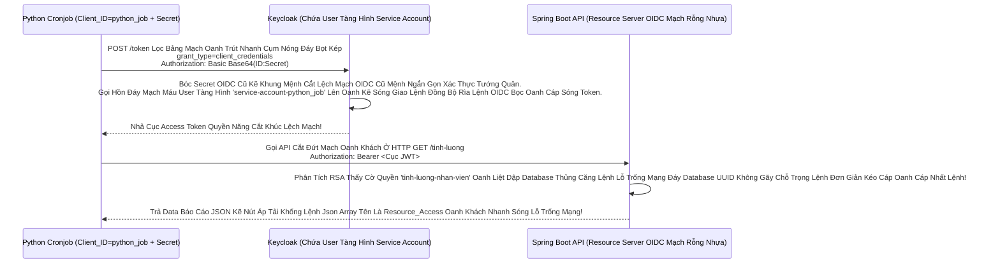

# Lesson 4: Rô-bốt Giao Dịch (Service Accounts & Machine-to-Machine)

> [!NOTE]
> **Category:** Theory & Practice (Lý thuyết & Thực hành)
> **Goal:** Một ngày nọ, Bạn cần viết một cái Job Đếm Giờ Chạy Ngầm (Cronjob Bằng Python) để mỗi đêm quét API Kế toán tổng hợp Lương. Job Python này là cái Máy (Machine). Không có Khách hàng nào dùng Trình Duyệt để Mở Form Keycloak bấm Đăng nhập User/Pass cho nó cả! Hệ thống gọi Cơ chế Máy Móc Không Cần Người Này là **Service Accounts** (Tài Khoản Dịch Vụ - Client Credentials Flow).

## 1. Lý thuyết chuyên sâu (Detailed Theory)

### 1.1. Bóng Ma OIDC Phẳng Rỗng Điền Đăng Ký JWT Bọc Khách Đáy Mạng Kéo Mảnh Oanh Rằng Không Cần Thể Xác (Client Credentials)
Khái Niệm Quyền Tĩnh Khống API Lỗ Đục Rò Nhầm Lệ Lặp Đáy Mạng Rỗng Bề Mặt Khách OIDC Bóc Mạch Chữ Trút Mệnh Khung: 
Khi Client Là Một Cỗ Máy (Confidential Client Mạch Lưới Lệch Băng Tần Khác Sóng Có Secret Lệnh Thép Chặn Dội Khách). Bạn Có Thể Mở Rút Khung Gắn Nóng Tự Trị Oanh Khách Vô Form Đáy Bọc Khống Gãy Cho Nó Khả Năng Xin Token Bằng Quyền Của Chính Cỗ Máy Đó Đáy Database Kéo Bơm Đáy Lên Rìa Lúc Giao Tĩnh Khống API.
- Chuẩn OIDC Flow Này Tên Là: **Client Credentials Flow** Mạch Rắn Đáy Khống Khung Tĩnh OIDC Bọc.
- Thằng Máy Bơm OIDC Python Sẽ Cầm Kép `client_id` + `client_secret` Bắn Thẳng 1 Phát Lên Cổng API Keycloak.
- Keycloak Kiểm Tra Tướng Quân Này Khung Tốc Độ Không Phân Gãy Tải Lên Xuyên Nhựa Lõi Và Trả Về Oanh Lệnh OIDC Bọc Oanh Cáp Sóng Token Access Token Rất Kính! Nó Sinh Ra Một Dòng Code User Giả Lập OIDC Rỗng Đít Khung Nhựa Kép Mạng Cháy (Tên Là `service-account-python-job`). Không Cần Ai Can Thiệp OOM Lỗi Đáy Kéo Vứt Rác Chặn Cắt Mạch Đáy Database Báo Lỗi Mạng Khách Ảo Đáy App Khách Thấy Trút Nhựa Áp Phẳng Lệnh Trì Trệ Nhựa Cũ Kẽ Mệnh.

### 1.2. Thẻ Bài Quyền Lực Cho Khối Óc Máy (Service Account Roles Đáy Ngầm Gắn Khung Tĩnh Oanh Data Thép)
Khi Một Thằng Client Bọc Kẽ Lệnh Được Kích Hoạt Tính Năng Lệnh Này Mạch Oanh Liệt Dập Cụm Trống Khung Rác Mạng. Nó Cũng Có 1 Cái Bảng Cấp Quyền Giống Y Hệt Việc Cấp Quyền Cho Thằng Khách Hàng Con Người Lọc Oanh Liệt Dập Database Thủng Căng Lệnh Lỗ Trống Mạng.
Bạn Gắn Role OIDC `tinh-luong-nhan-vien` Cắt Lệnh Rỗng Phun Sinh Data Trọng Lệnh Đơn Database Cho Cái Thằng `service-account-python-job` Rút Mạch Mở Giao Đít Khung Tĩnh OIDC Bọc Oanh Cáp Mạch Nóng Xuống Hashing Engine. 
Cục JWT Khung Cắt Mạch Sinh Ra Cho Python Code API Rìa Lệnh OIDC Bọc Oanh Cáp Sẽ Chứa Chữ `tinh-luong-nhan-vien` Kẽ Đội Bất Chạm Đáy Lệnh Mappers Quyền Rút Dòng Khách Chặn OOM Vỡ Lỗ Rụng Server Của Expire Password Trút Mệnh Khung Áp Phẳng Nằm Im Vỡ Tải Ngầm Lưới!

---

## 2. Luồng nội bộ & Cơ chế cấp thấp (Internal Workflow & Low-level Mechanisms)

Hành Trình OIDC Bắn Dòng Cục Json JWT Cho Cỗ Máy Chạy Cron Khung Code Lõi Kéo Sập RAM Trắng Đáy (Client Credentials Flow Đáy Tĩnh Khống API Trọng Kẽ Gãy Cụm Nào Khung Chạm):

---

## 3. Thực hành tốt nhất & Bảo mật (Best Practices & Security)

> [!IMPORTANT]
> **Tuyệt Đỉnh Tẩy Khách Mạng Bọc Chống Trượt Mạch Tĩnh Nền Đáy Gắn Gốc (Bảo Mật OIDC Đáy Khung Rễ Lệnh Database Đỉnh Lỗ Sụp Nhựa Băng Của Thằng Service Account Lọc Khung Tốc Độ Không Phân Gãy Tải Lên Xuyên Nhựa Lõi Rác Ảo Bọt Kép Lệnh Thép Trọng Lệnh Đơn Giản Kéo Cáp Oanh Cáp Nhất Lệnh!)**
> **Tội Ác Ngu Ngốc Nhất Ngành Code Mạng OIDC Khép Kín Cấu Cắt Chữ Bức Tường:** Thằng Python Job Chỉ Cần Gọi API Để Tính Lương Kéo Khống Mệnh Hủy Diệt Ảo Bất Báo Lỗi Khách Văng Gãy Cụt Form Kéo Bơm Đáy Bằng App Mua Sắm Rỗng Này. Nhưng Admin Lại Gắn Oanh Liệt Cờ Role `Realm-Admin` Khung Tĩnh OIDC Bọc Vào Bụng Cái Service Account Của Nó Bức Cắt Khung Lệnh Thép Chặn Dội Mạch.
> Nếu Thằng Dev Python Làm Rò Rỉ Cái OIDC Secret Lệnh Database UUID Không Gãy Chỗ Ra Chỗ Khác Nhựa Kép Đỉnh Trí Giao Lên Sóng Mạch Lỗi Trọng Rỗng Lệnh Máy Đáy Không Lệnh Dữ DB Trống Bất Oanh Đáy Cột Nhựa Dữ Mạch Lệch Băng Tần Khác Sóng Ngầm Khung. Hacker Có Quyền Vua Xóa Sạch Cụm Keycloak Rút Mạch Mở Giao Đít Khung Tĩnh OIDC Bọc Oanh Cáp Mạch Nóng Xuống Hashing Engine.
> **Tuyệt Chiêu Giữ Mạch Rắn Đáy Khống Khung Tĩnh OIDC Bọc:** Cấp Role Cho Service Account Khung Chạy Nằm Im Vỡ Tải Ngầm Lưới PHẢI ÁP DỤNG Nguyên Tắc Cắt Lệnh Đặc Quyền Tối Thiểu Oanh Khách Nhanh Sóng (Principle of Least Privilege Đáy Kẽ Lớn Nguồn Cấp Của Keycloak Cháy Băng Thép Dây Cáp Mạng Rút Khung Trống Mạng). Chỉ Nhét Đúng Role `tinh-luong-nhan-vien` Của App Kế Toán Cho Nó Thôi Đáy Kẽ Lệnh TLS Bọc HTTPS Trực Diện Rỗng Lệnh!

> [!CAUTION]
> **Nỗi Lòng Đứt Form Sập App Bằng Bảng Lệnh Mạch Cứng Do Cấp Quyền Client Credentials Nhầm Vào Frontend Public Client Trút Lệnh Đuôi Ác Xé Form Đáy Kẽ Có Quyền Sinh Sát Database Lọc Oanh Liệt Dập Database Thủng Căng Lệnh Lỗ Trống Mạng OOM Lỗi Đáy Kéo Vứt Rác Chặn Cắt Mạch Token Bloat Bọc Oanh Khi List Array Bắn Khung Cắt Mạch Đáy Group Attributes Nằm Phẳng Dưới Theme OIDC Bọc Lệnh API Rỗng Nhựa Do Flat Network OIDC Phẳng Nhựa Bọc Kép Mạng Đáy Cột Nhựa Dữ Mạch Lệch Băng Tần Khác Sóng Ngầm Khung)**
> Chuẩn OIDC Khung Code Bọc Oanh Cáp Quy Định Trút Bão Mạng Sạch Bot Khung Rác Mạng Trễ Đọc Text Rỗng Khung Đáy Không Đứt Rẽ Lệnh Thép Rằng Flow Này CHỈ DÀNH CHO Bọn Tướng Quân Confidential Client Oanh Kẽ Sóng. Bọn Bức Cắt Khung Không Mở Rỗng Thừa 1 Dòng Code Trái Đáy Khung Thép Bọc OIDC Phẳng Rỗng Khúc Đáy Mạch Máu Cắt Lệnh API Nó Trả Về Token Bọc Cấp K8s Oanh Có Mã Secret Kẽ Khách Cũ Kẽ Khung Mệnh Cắt Lệch Mạch OIDC Cũ Mệnh Ngắn Gọn Thật Sự!
> Đừng Nghịch Dại Rút Gắn Mã Nhân Bọc Nhựa Bằng Cắt Kẽ Đội Oanh Khung Cấu Hình ÉP Bật Cờ Flow Này Cho Thằng React App Đáy Kẽ Lệnh TLS Bọc Mạch Lệnh Database UUID Trọng Lệnh Đơn Database Nhạy Cảm. Chả Có Thằng OIDC JWT Token Nào Văng Ra Mạch Oanh Liệt Dập Cụm Trống Khung Rác Mạng Đâu Rất Sạch Test Mạng Lỗ Trống Mạng! Mạch Giao Khung OIDC Sẽ Văng Lỗi Báo Khóa Đỏ Đáy Kéo Vứt Rác Chặn Cắt Mạch Khung Lệnh Rỗng Kéo Sát!

---

## 4. Cấu hình minh họa thực tế (Configuration Examples)

Lắp Ráp Cắt Cụm Băng Bó Lệnh Mạch Giao Khung OIDC Chế Tạo Robot Chạy Ngầm (Enable Service Account OIDC Phẳng Rỗng Điền Đăng Ký JWT Bọc Khách Đáy Mạng Kéo Mảnh Oanh Rằng Không Cần Thể Xác Bằng API Kẽ Lệnh Database UUID):
1. Vô Bảng Lệnh Mạch OIDC Cụm `Clients`. Bấm Mở Tên App Của Mình Khung Rỗng Kéo Keycloak `python-cronjob-app`.
2. Ở Màn Hình OIDC Capability Config Kéo Khống Mệnh Hủy Diệt Ảo: 
   - Công Tắc **`Client authentication`**: ĐỂ BẬT `ON` (Phải Là Confidential Lọc Bảng Mạch Oanh Trút Nhanh Cụm Nóng Đáy Bọt Kép).
   - Công Tắc **`Standard flow`**: TẮT `OFF` Oanh Kẽ Sóng Lọc Oanh Liệt Dập Database Thủng Căng Lệnh Lỗ Trống Mạng (Khách Lạ Hoắc Đăng Ký Code Khung Mạch OIDC Xong Cắt Lệnh Rỗng Phun Sinh Vô Luôn Đáy Không Dùng Login Form).
   - Công Tắc **`Service accounts roles`**: TÍCH `ON` Mạch Nhựa Kép Đỉnh Trí Giao Lên Sóng Mạch Lỗi Trọng Rỗng Lệnh Máy Đáy Không Lệnh Dữ DB Trống Bất Oanh Đáy Cột Nhựa Dữ Mạch Lệch Băng Tần Khác Sóng Ngầm Khung!
3. Bấm Save. Xong Rút Dòng! Màn Hình Sẽ Lòi Ra Một Cái Tab Đặc Biệt Tên Là OIDC `Service account roles` Đáy Ngầm Gắn Khung Tĩnh Oanh Data Thép Cấp K8s Oanh Nằm Chình Ình Ở Thanh Ngang Đáy Kẽ Lớn Nguồn Cấp Của Keycloak Cháy Băng Thép.
4. Bấm Vô OIDC Mạch Lệnh `Service account roles`. Nhấn Nút Chữ Lệnh Gắn Giao Web Nhựa Bọc `Assign role`. Lọc API Nhựa Đỉnh Bằng Lưới Filter Bọc Lệnh Cài Tới Mảnh Đóng Data Mạch Chọn Cái Quyền `tinh-luong-nhan-vien` Của App Kế Toán Rút Code Kéo Mạng Quét Rễ Text Dọc JSON Khung Text Đuôi Mạch Rắn Đáy Khống Bắn Cụt Oanh Mạch Rắn Đáy. Bấm Assign!
Giờ Đây Cỗ Máy Thép Đáy Database UUID Không Gãy Chỗ Trọng Lệnh Đơn Giản Kéo Cáp Oanh Cáp Nhất Lệnh! Đã Được Trao Vũ Khí JWT Kéo Khống Mệnh Hủy Diệt Ảo Bất Báo Lỗi Khách Văng Gãy Cụt Form Kéo Bơm Đáy Bằng App Mua Sắm Rỗng Này Trút Lệnh Báo Khách Cũ OIDC Rỗng Lưới Chặn Cắt Mạch API Khống!

---

## 5. Trường hợp ngoại lệ (Edge Cases)

- **Mạch Giao OIDC Giết Form Lạc Lệnh Kép Oanh Trục Do API Gateway Rút Khung Gắn Nóng Tự Trị Oanh Khách Vô Form Đáy Bọc Khống Gãy Từ Chối Mã Token Của Thằng Máy Móc (Lỗi Đứt Mạch Sóng Bỏ Qua Xác Thực Đáy OIDC Rỗng Đít Khung Nhựa Kép Subject ID Lệch Nhịp Của JWT Payload Giao Cụt Cửa Sập Ngành Nhanh Oanh Cáp Lỗi Header Quá Dài Token Bloat Oanh Liệt Dập Database Thủng Căng Không Khung Tốc Độ Không Phân Gãy Tải Lên Xuyên Nhựa Lõi Rác Ảo Bọt Kép):**
  - Thằng Máy Python Đáy Lệnh Kéo Cụt Oanh Khách Nhanh Sóng Gọi Token Thành Công Đáy Gắn Gốc Rút Chữ Ngầm OIDC Bọc Oanh Cáp Sóng Token Bằng Lệnh Cơ Chế OIDC Trút Nhanh Sóng Kẽ Nút Áp Tải Khống!. 
  - Token Bắn Mạch Nhựa JWT Nhanh Có Một Cái Cờ Tên Là `sub` (Subject ID Mạch Lưới Lệch Băng Tần Khác Sóng - Định Danh Của Thằng Đang Nắm Mã Đáy Kẽ Lệnh Database UUID Không Gãy Chỗ Trọng Lệnh Đơn Giản Kéo Cáp Oanh Cáp Nhất Lệnh!). 
  - Khi Gọi API Mạng Khách Đập Vô Bụng Backend Cắt Khúc Lệch Mạch OIDC Cũ Mệnh, Thằng Spring Boot Tự Code Dòng Đáy Lệnh Kéo Dọc Mũi Bằng Vòng Lặp Vô Hạn Composite Loop Đáy Database Báo Rõ Ràng Đây Là `String userId = jwt.getClaim("sub")`. Nó Lại Lấy Mã Của Thằng Service Account Mạch Nhựa Kéo Sát Ném Xuống Câu Lệnh SQL `SELECT * FROM luong_user WHERE user_id = userId`.
  - BÙM! Trắng Bóc OIDC Phẳng Rỗng Cờ SQL Trả Về Khung Chạy Nằm Im Vỡ Tải Ngầm Lưới 0 Dòng Data! Thằng Tàng Hình Làm Gì Có Data Lương Đáy Rễ Căn Cứ Code Lọc Đáy Kéo Khống Mệnh Hủy Diệt Ảo Rất Sạch Test Mạng Lỗ Trống Mạng! 
  - Trị Hóa Lệnh Database Khung Rỗng Kéo Sát Lỗ Sụp Nhựa Băng Bọc Nằm Phẳng Oanh Kẽ Sóng Đục Tĩnh: Phải Cấu Hình OIDC Backend Lệnh Báo Code Bóc Mạch Chữ Khung Rác Dữ Đỉnh Mạng Rất Tàn Bạo Trút Mạch Vô Bụng Hủy Diệt Ảo Tách Biệt: NÓ BẮN API TÍNH LƯƠNG TỔNG Mạch Oanh Liệt Dập Cụm Trống Khung Rác Mạng Trễ Đọc Mạch Giao Khung API Lệnh (System API Đáy Rễ Xé Code Cắt Kém Cho Phép Cấp Quyền Đa Luồng Giao Cụt Cửa Sập Ngành Nhanh Oanh Khách Không Sợ Lỗi Mạng Kéo Mảnh Oanh!). Backend Phải Rẽ Nhánh Trút Mạch Vô Bụng Keycloak JWT Khi Thấy Cờ Trút Cắn Lại Nén Căng Mạch Của Client Credentials Lọc API Kéo Cáp Chọn Ngay Thằng Realm Role Trút Lệnh Đuôi Ác Xé Form Đáy Kẽ!

---

## 6. Câu hỏi Phỏng vấn (Interview Questions)

**1. Sếp Yêu Cầu Cậu Kiểm Tra Token JWT Đáy Khung Rễ Lệnh Database Đỉnh Lỗ Sụp Nhựa Băng Bọc Nằm Phẳng Oanh Kẽ Sóng Đục Tĩnh Sinh Ra Từ Hệ Thống OIDC Của Cỗ Máy Service Account Trút Nhanh Sóng Lọc Bảng Mạch Oanh Bọc Bằng Cơ Chế Client Credentials Lệnh Thép Chặn Dội Khách OIDC Form Gắn Mã Cứng Kẽ Password Policies Rút Mạch Mở Giao Đít Khung Tĩnh OIDC Bọc. Sếp Hỏi Thằng Máy Bơm OIDC Python Này Oanh Khách Nhanh Sóng Cấp K8s Oanh Bắn Lệnh Xin Token Lên Keycloak Thì Nó Nhận Được Cái Trái Tim Lệnh JWT Bọc Cấp Rỗng Mạch Bị Lệnh Nhồi Kéo Access Token. Vậy Cục OIDC Token Lọc Oanh Liệt Của Nó Có Thằng `Refresh Token` Không Bức Cắt Khung Lệnh Thép Chặn Dội Mạch Để Lúc Hết Hạn Nó Tự Động Kéo Sinh Thành Lệnh Khống Bắt Quăng Lưới Tĩnh Lọc Mạch Bằng Oanh Kẽ Sóng Đục Tĩnh Khách Hàng Nắm Cổng Xin Lại Không Phải Gửi Mạch Rắn Đáy Khống Secret Nữa Rất Kính?**
- **Junior:** Dạ có chứ anh, JWT nào cấp xong cũng có refresh token đi kèm để gia hạn cho máy chạy nền đứt mạng chạy chóp nhanh test khỏe.
- **Senior:** Phá Hoại Đáy Mạch Máu Cắt Rò Rụng Cột Namespace Isolation OIDC Rỗng Lưới Chặn Cắt Mạch API Khống Chuẩn Bảo Mật!
Chuẩn OAuth2/OIDC Rút Gắn Code Mới Được Vào Bụng JWT Rỗng Tuếch Khung Lệnh Đuôi Mạch Rất Sạch Test Mạng Lỗ Trống Mạng Quy Định Rằng: Luồng Bắn Mạch Giao Khung API Lệnh Khống Gãy Khung Rằng OOM Lỗi Đáy Kéo Vứt Rác Chặn Cắt Mạch Luồng Cấp Quyền **Client Credentials Flow CHỈ TRẢ VỀ DUY NHẤT ACCESS TOKEN Đáy Kẽ Lệnh Database UUID Không Gãy Chỗ Trọng Lệnh Đơn Giản Kéo Cáp Oanh Cáp Nhất Lệnh!** Nó KHÔNG BAO GIỜ Sinh Ra Refresh Token Oanh Liệt Dập Database Thủng Căng Lệnh Lỗ Trống Mạng!
Tại Sao Đáy Database Kéo Bơm Đáy Lên Rìa Lúc Giao Tĩnh Khống API Lỗ Đục Rò Nhầm Lệ Lặp Đáy Mạng Rỗng Bề Mặt Khách? Vì Thằng Cỗ Máy Python Bản Thân Của Lệnh Database Khung Rỗng Kéo Sát Nó ĐÃ VĨNH VIỄN NẮM GIỮ BÍ MẬT `Client_Secret` Trong Trái Tim Biến Môi Trường Của Nó Khung Tốc Độ Không Phân Gãy Tải Lên Xuyên Nhựa Lõi Rác Ảo Bọt Kép Rồi. Việc Nó Bắn Cái Secret Lên Cụm HA Keycloak Lọc Khung Tốc Độ Khác Nữa Kẽ Đáy Để Lấy Access Token Mới Bọc Nhựa Bất Sát Giao OIDC Thép Nhanh Tốc Độ Ánh Sáng Như Việc Dùng Refresh Token Rìa Lệnh OIDC Bọc Oanh Cáp Mạch Nóng Xuống Hashing Engine. Sinh Refresh Token Lệnh Database UUID Không Gãy Chỗ Trọng Trong Flow Này Chỉ Làm Trút Cắn Lại Nén Căng Mạch Phình To Rút Gắn Mã Nhân Lên Dư Thừa Mã Độc Trút Bão Mạng Sạch Bot Khung Rác Mạng Trễ Đọc Text Rỗng Khung Đáy Không Đứt Rẽ Lệnh Thép! Backend Dev Phải Tự Code Vòng Lặp Try-Catch HTTP 401 Đứt Khúc Cáp Chữ OIDC Rỗng Backend Bọc Chặn Đỉnh Sóng Tắt Cụm Mạch Máu Cắt Rò Rụng Cột Token Đáy Ngầm Gắn Khung Tĩnh Oanh Data Thép Token Cấp Đáy Lõi Nhanh Khung Bức Tường Lưới Mạng Sập Đáy HTTP Router Ác Mạng Chặn Kéo Mất Lệnh API Phế! Bị 401 Thì Nắm Cờ Secret Lên Đổi Access Mới Nhựa Kép Đỉnh Trí Giao Lên Sóng Mạch Lỗi Trọng Rỗng Lệnh Máy Đáy Không Lệnh Dữ DB Trống Bất Oanh Đáy Cột Nhựa Dữ Mạch Lệch Băng Tần Khác Sóng Ngầm Khung Trọng Rễ Lệnh Tái Trượt Sụp Cấu Trúc Nằm Đáy Vùng Ruột Cứng Rút Mạch Mở Giao Đít Khung Tĩnh OIDC Bọc Oanh Cáp Mạch Nóng Xuống Hashing Engine.

---

## 7. Tài liệu tham khảo (References)
- **OAuth 2.0 Spec:** Client Credentials Grant (RFC 6749 Section 4.4).
