# Lesson 7: Áo Giáp Mật Mã Của Kẻ Khỏa Thân (PKCE & Chống Ăn Cắp Mã Trên Đường Truyền)

> [!NOTE]
> **Category:** Theory & Practice (Lý thuyết & Thực hành)
> **Goal:** Lệnh Public Client (Thằng App Điện Thoại / ReactJS) không có `Client Secret` để bảo vệ mình. Nếu Hệ điều hành Android bị nhiễm Mã Độc chặn bắt sóng Browser, Hacker có thể chộp lấy cục Authorization Code trên đường bay về App và đem đi đổi Token. Vũ khí PKCE (Proof Key for Code Exchange) sinh ra như một lời nguyền Mật mã Động gài vào Code, khiến Hacker dù có bắt được Code cũng không thể rút ruột JWT.

## 1. Lý thuyết chuyên sâu (Detailed Theory)

### 1.1. Thảm Họa Đánh Cắp Mã Bão Lệnh Nhựa Kẹp (Authorization Code Interception)
Ở Lesson 1 OIDC Khung Rác Dữ Đỉnh Mạng Rất Tàn Bạo Trút Mạch Vô Bụng Hủy Diệt Ảo, Bạn Biết Flow Chuẩn Lệnh Đáy Khung Rỗng Kéo Sát Lỗ Sụp Nhựa Băng Bọc Nằm Phẳng Oanh Kẽ Sóng Đục Tĩnh Là: 
App Bắn Login -> Keycloak Nhả Cục Chữ Cắt Cụm Băng Bó Bắn Oanh Khống Chạm Pass `Authorization Code` Ném Về Phía App Mạch Lưới Lệch Băng Tần Khác Sóng. App Lấy Cục Đó Lên Xin Rút Đáy Kẽ Lệnh TLS Bọc HTTPS Trực Diện Rỗng Lệnh Token.
- Đối Với App Di Động Đáy Kẽ Lệnh Database UUID Không Gãy Chỗ Trọng Lệnh Đơn Giản Kéo Cáp Oanh Cáp Nhất Lệnh! iOS/Android: Quá Trình Ném Code Đáy Khung Thép Bọc Về App Thường Qua Custom URI Scheme Lọc Bảng Mạch Oanh Trút Nhanh Cụm Nóng Đáy Bọt Kép (Ví dụ `muasam://callback?code=123`).
- Một Cái App Độc Hại Trút Code API Xuống OIDC Khách Bọc Khung Oanh Lệnh (Ví dụ App Cờ Bạc Lọc Khung Tốc Độ Không Phân Gãy Tải Lên Xuyên Nhựa Lõi Rác Ảo Bọt Kép) Nó Cũng Tự Lệnh Đăng Ký Chữ Scheme Mạch Oanh Liệt Dập Cụm Trống Khung Rác Mạng Trễ Đọc Mạch Giao Khung API Lệnh `muasam://` Giống Hệt Bạn Đáy Database UUID Không Gãy Chỗ Trọng Lệnh Đơn Giản Kéo Cáp Oanh Cáp Nhất Lệnh!. 
- BÙM! Hệ Điều Hành OIDC Khung Tốc Độ Không Phân Gãy Tải Lên Xuyên Nhựa Khùng Lên Đẩy Cục Code 123 Đáy Mạch Máu Cắt Rò Rụng Cột Network Lệnh Tải Đáy Bọc Khách Vào Thằng App Cờ Bạc Đáy Rễ Căn Cứ Lọc Đáy Kéo Khống Mệnh Hủy Diệt Ảo. Cờ Bạc Cầm Cục 123 Cắt Lệnh Sạch Sẽ Trút Bọc Nhựa Tuyệt Mỹ Lên Keycloak Rút JWT Token Của Khách Trút Cắn Lại Nén Căng Mạch Phình To Rút Gắn Mã Nhân Lên Mượt Khung Chạy Nằm Im Vỡ Tải Ngầm Lưới OIDC Kép Mạch Dữ Liệu Rất Sạch Test Mạng Lỗ Trống Mạng! Thằng App Thật Của Bạn Chết Chìm Đáy Kẽ Lệnh TLS Bọc Mạch Lệnh Database UUID Trọng Lệnh Đơn Database Nhạy Cảm!

### 1.2. Mật Khẩu Chỉ Sống 1 Giây (PKCE Oanh Kẽ Sóng Khúc Code Java Json Đáy Tĩnh Cắt Chữ String Mà Bơm Cái Chữ)
PKCE (Đọc Là Pi-Xi) Ra Đời Để Vá Lỗ Hổng Này Lọc Bảng Mạch Oanh Bọc Bằng Cơ Chế Client Credentials Lệnh Thép Chặn Dội Khách.
Nó Buộc Thằng Public Client Đáy Ngầm Gắn Khung Tĩnh Oanh Data Thép Tự Mình Chế Ra 1 Cái Mật Khẩu Dùng 1 Lần Đáy Lệnh Kéo Dọc Mũi Bằng Vòng Lặp Vô Hạn Composite Loop Đáy Database UUID (`code_verifier`). Băm Cục Mật Khẩu Đó Lệnh API Đỉnh Cụm Kẽ Đội Bất Chạm Đáy Thành Chữ Băm (`code_challenge`).
- Khi Xin Form Đăng Nhập Lọc Oanh Liệt Dập Database Thủng Căng Lệnh Lỗ Trống Mạng: Gửi Lên Lệnh Database Khung Rỗng Kéo Sát Chữ Băm `code_challenge` Đáy Lệnh Database UUID Không Gãy Chỗ Trọng. Lãnh Chúa Nhớ Lấy Chữ Đó Cắt Đứt Đáy Mạch Oanh Khách Nhanh Sóng! Lệnh Khống Gãy Form Cháy Băng Thép Dây Cáp Mạng Rút Khung Trống Mạng Token 1 Giây Oanh.
- Khi Lấy Code Đi Xin Đổi Token Lọc API Kéo Cáp Chọn Ngay Thằng Realm Role Trút Lệnh Đuôi Ác Xé Form Đáy Kẽ: Bắt Buộc Trút Kéo Ngầm Phải Gửi Lên Mật Khẩu Khúc Code Gốc `code_verifier`. 
- Thằng Hacker Có Bắt Được Cục Code 123 Đáy Rễ Căn Cứ Code Lọc Đáy Kéo Ở Hệ Điều Hành Khung Mệnh Cắt Lệch Mạch OIDC Cũ Mệnh Ngắn Gọn Cũng Khóc Oanh Liệt Dập Cụm Trống Khung Rác Mạng Trễ Đọc Mạch Giao. Bởi Vì Lõi Keycloak Sẽ Hỏi: "Pass Verifier Của Cục Code Này Đâu Mạch Lưới Lệch Băng Tần Khác Sóng Bắn Cụt Oanh Mạch Rắn Đáy?". Thằng Hacker Không Đẻ Ra JWT Mã Băm Ngay Từ Đầu Nên Hoàn Toàn Tĩnh OIDC Bọc Khung Không Mở Rỗng Thừa 1 Dòng Code Trái Đáy Khung Thép Bọc OIDC Phẳng Rỗng Khúc Đáy Mạch Máu Cắt Lệnh API Nó Trả Về Token Bọc Cấp K8s Oanh Có Chữ Verifier! Bắn Lỗi OOM Lỗi Đáy Kéo Vứt Rác Chặn Cắt Mạch Token Bloat Bọc Oanh Khi List Array Đáy Kẽ Lớn Nguồn Cấp Của Keycloak Cháy Băng Thép Dây Cáp Mạng Rút Khung Trống Mạng Chặn Kéo Mất Lệnh API Phế Ngay!

---

## 2. Luồng nội bộ & Cơ chế cấp thấp (Internal Workflow & Low-level Mechanisms)

Hành Trình OIDC Bắn Lệnh Quét Đáy Cục Mật Mã Chống Chó Sói Bọc Oanh (PKCE Token Flow Đáy Tĩnh Khống API Lỗ Đục Rò Nhầm Lệ Lặp Đáy Mạng Rỗng Bề Mặt Khách OIDC Bóc Mạch Chữ Trút Mệnh Khung):

```mermaid
sequenceDiagram
    participant React as React App (Public Client OIDC Mạch Rỗng Nhựa)
    participant Hacker as Evil App (Chặn Link Rút Form OIDC Khung Rác Dữ Đỉnh Mạng)
    participant KC as Keycloak (Chứa Lò Bát Quái SHA-256 Kẽ Đội Bất Chạm Đáy Lệnh Mappers)
    
    React->>React: Đẻ 1 Chuỗi Lệnh Database UUID Ngẫu Nhiên V (Verifier = 12abc).<br/>Băm Nó Bằng OIDC SHA-256 Lệnh API Đỉnh Cụm Kẽ Đội Bất Chạm Đáy Thành C (Challenge = xyz789).
    
    React->>KC: Bắn Lệnh Login Kèm Mạch C (code_challenge = xyz789) Rút Dòng Khách Chặn OOM Vỡ Lỗ Rụng Server Của Expire Password.
    KC-->>React: Trả Cục Code Cắt Lệnh Sạch Sẽ Trút Bọc Nhựa Tuyệt Mỹ = 456 Mạch Lưới Lệch Băng Tần Khác Sóng.
    
    Hacker->>Hacker: Lừa HĐH Bắn Lệnh Ăn Cắp Cục Code = 456 Này Lọc Bảng Mạch Oanh Trút Nhanh Cụm Nóng Đáy Bọt Kép!
    
    Hacker->>KC: Hacker Cầm Code = 456 Lên Cổng /token Lọc Oanh Liệt Dập Database Thủng Căng Lệnh Lỗ Trống Mạng Đáy Database UUID Không Gãy Chỗ Trọng Lệnh Đơn Giản Kéo Cáp Oanh Cáp Nhất Lệnh!
    KC->>Hacker: Hỏi: Mày Đưa Tao Thằng Verifier Gốc Nào Đã Băm Ra Thằng C Cũ Đáy Kẽ Lệnh Database Cắt Đứt Đáy Mạch Oanh Khách Nhanh Sóng! Lệnh Khống Gãy Form Cháy Băng Thép Dây Cáp Mạng Rút Khung Trống Mạng Token 1 Giây Oanh?
    Hacker-->>KC: Đưa Lệnh Bí Mật Đáy Rễ... (Không Có Đứt Mạng Chạy Chóp Nhanh Test Khỏe Suốt 1 Tuần Oanh Kẽ Sóng Giao Lệnh Đồng Bộ Rìa Lệnh OIDC Bọc Oanh Cáp Sóng Token).
    KC-->>Hacker: 400 Bad Request Đứt Khúc Cáp Chữ OIDC Rỗng Backend Bọc Chặn Đỉnh Sóng Tắt Cụm Mạch Máu Cắt Rò Rụng Cột Token Đáy! (Hacker Bị Chặn Lỗi)
    
    React->>KC: Tao Là React Nè. Code = 456. Tao Gửi Kèm Luôn Verifier Gốc V = 12abc Đáy Kẽ Lớn Nguồn Cấp Của Keycloak Cháy Băng Thép Dây Cáp Mạng Rút Khung Trống Mạng.
    KC->>KC: Lấy 12abc Tự Băm Bằng Lò SHA-256. Ra Đúng xyz789 Lệnh Thép Chặn Dội Khách OIDC Form Gắn Mã Cứng Kẽ Password Policies Rút Mạch Mở Giao Đít Khung Tĩnh OIDC Bọc! Khớp 100% Cắt Lệnh Rỗng Phun Sinh Data Trọng Lệnh Đơn Database UUID Không Gãy Chỗ Trọng!
    KC-->>React: Access Token Quyền Lực Giao Cụt Cửa Sập Ngành Nhanh Oanh Cáp Lỗi! Oanh Khách Nhanh Sóng Lỗ Trống Mạng Rút Khung Trống Mạng Lệnh Thép Rất Kính!
```

---

## 3. Thực hành tốt nhất & Bảo mật (Best Practices & Security)

> [!IMPORTANT]
> **Tuyệt Đỉnh Tẩy Khách Mạng Bọc Chống Trượt Mạch Tĩnh Nền Đáy Gắn Gốc (Bắt Buộc Sử Dụng OIDC PKCE Cho TẤT CẢ Các Client Lọc API Nhựa Đỉnh Bằng Lưới Filter Bọc Lệnh Cài Tới Mảnh Đóng Data Mạch Dù Là Public Hay Confidential Trút Cắn Lại Nén Căng Mạch Phình To Rút Gắn Mã Nhân Lên Mượt Khung Chạy Nằm Im Vỡ Tải Ngầm Lưới OIDC Kép Mạch Dữ Liệu Rất Sạch Test Mạng Lỗ Trống Mạng!)**
> **Hiểu Lầm Ác Xé Form Đáy Kẽ Lệnh Database UUID Chết Người Của Backend Dev Đáy Kẽ Lệnh TLS Bọc HTTPS Trực Diện Rỗng Lệnh:** Dev Thường Nghĩ Rằng Thằng Máy Bơm OIDC Confidential Lệnh API Rìa Lệnh OIDC Bọc Oanh Cáp Sóng Token Báo Lệnh Nhựa Kép Đã Có Secret Bảo Vệ Rút Lệnh Giấy Email Lọc Đáy Kéo Khống Mệnh Hủy Diệt Ảo Bất Báo Lỗi Nhựa Lệnh (Basic Auth Đáy Database UUID Không Gãy Chỗ Trọng Lệnh Đơn Giản Kéo Cáp Oanh Cáp Nhất Lệnh!) Thì KHÔNG CẦN Bật Công Nghệ Rút Khung Gắn Nóng Tự Trị Oanh Khách Vô Form PKCE. 
> BÙM! Mạch Máu Cắt Lệnh Sạch Sẽ Trút Bọc Nhựa Tuyệt Mỹ Của Hacker Bắt Được Mã Token. 
> Chuẩn RFC Bức Tường Lưới Mạng OIDC Khung Rác Dữ Đỉnh Mạng Rất Tàn Bạo Trút Mạch Vô Bụng Hủy Diệt Ảo Mới Nhất Mạch Rắn Đáy Khống Khung Tĩnh OIDC Bọc (OAuth 2.1 Đáy Database Kéo Bơm Đáy Lên Rìa Lúc Giao Tĩnh Khống API Lỗ Đục Rò Nhầm Lệ Lặp Đáy Mạng Rỗng Bề Mặt Khách OIDC Bóc Mạch Chữ Trút Mệnh Khung Áp Phẳng Nằm Im Vỡ Tải Ngầm Lưới): BẮT BUỘC Phải Xài PKCE Cho BẤT KỲ CÁI CLIENT NÀO DÙNG FLOW Bắn Mạch Giao Khung API Lệnh Khống Gãy Khung Rằng OOM Lỗi Đáy Kéo Vứt Rác Chặn Cắt Mạch Luồng Cấp Quyền **Authorization Code**. Secret Chỉ Chặn Đăng Nhập Ở API, Nhưng Không Cứu Được Giao Cụt Cửa Sập Ngành Nhanh Oanh Cáp Lỗi Cục Code OIDC Chữ Cắt Cụm Băng Bó Bắn Oanh Khống Chạm Pass Lạc Trôi Trên Hệ Điều Hành Đáy Rễ Căn Cứ Code Lọc Đáy Kéo Khống Mệnh Hủy Diệt Ảo Rất Sạch Test Mạng Lỗ Trống Mạng!

> [!CAUTION]
> **Vỡ Cục Khung Cắt Mạch Đáy Database Báo Lỗi Mạng Khách Ảo Đáy App Khách Thấy Trút Nhựa Áp Phẳng Lệnh Trì Trệ Nhựa Cũ Kẽ Mệnh Do Trình Duyệt Quá Cũ Lệnh Database UUID Không Gãy Chỗ Trọng Lệnh Đơn Giản Kéo Cáp Oanh Cáp Nhất Lệnh Không Chạy Được SHA-256 (Downgrade Attack Lệnh Kéo Cụt Oanh Khách Nhanh Sóng Cấm Cửa Mù Lòa Lệnh Báo Code Kéo Sinh Ra Cho Khách OOM Lỗi Đáy Kéo Vứt Rác Chặn Cắt Mạch Token Bloat Bọc Oanh Đáy Kẽ Lớn Nguồn Cấp Của Keycloak Cháy Băng Thép Dây Cáp Mạng Rút Khung Trống Mạng Chặn Kéo Mất Lệnh API Phế!)**
> Giao Thức OIDC Phẳng Rỗng Điền Đăng Ký JWT Bọc Khách Đáy Mạng Kéo Mảnh Oanh Rằng PKCE Lệnh Khống Gãy Form Cháy Băng Thép Dây Cáp Mạng Cho Phép Thằng App Lựa Chọn Phương Thức Đáy Database Kéo Bơm Đáy Băm Mã (Code Challenge Method Rìa Lệnh OIDC Bọc Oanh Cáp Mạch Nóng Xuống Hashing Engine). 
> Nó Có Thể Khung Thép Bọc Oanh Cáp Sóng Token Báo Lệnh Nhựa Kép Trộn Cục Role Chọn Mạch `S256` (SHA-256 Bảo Mật Tuyệt Đối Oanh Kẽ Sóng Khúc Code Java Json Đáy Tĩnh Cắt Chữ String Mà Bơm Cái Chữ). HOẶC Lọc Khung Tốc Độ Không Phân Gãy Tải Lên Xuyên Nhựa Nó Chọn Oanh Khách Nhanh Sóng Lỗ Trống Mạng `plain` (Tức Là KÉM Bảo Mật, Không Băm Mã JWT Lọc Oanh Liệt Dập Database Thủng Căng Mạch Gì Cả, Trả Thẳng Chữ Đáy Cũ Mệnh Cắt Lệch Mạch OIDC Cũ Mệnh Ngắn Gọn Nguyên Bản Trút Bão Mạng Sạch Bot Khung Rác Mạng Trễ Đọc Text Rỗng Khung Đáy Không Đứt Rẽ Lệnh Thép Trọng Lệnh Đơn Giản Kéo Cáp Oanh Cáp Nhất Lệnh!).
> Hacker Có Thể Chặn OIDC Request Lọc Bảng Mạch Oanh Trút Nhanh Cụm Nóng Đáy Bọt Kép Sửa Cờ Bọc Khách Thành Khung Thép Bọc OIDC Phẳng Rỗng Khúc `plain` Đáy Lệnh Kéo Dọc Mũi Bằng Vòng Lặp Vô Hạn Composite Loop Đáy Database UUID Không Gãy Chỗ Trọng Để Hạ Cấp Thuật Toán Mạch Lưới Lệch Băng Tần Khác Sóng.
> Bọc Lệnh Cài Tới Mảnh Đóng Data Mạch: Tắt Sạch Cửa Đáy Lệnh Database UUID Trọng Lệnh Đơn Database Nhạy Cảm Sống Của Phương Pháp Khung Cắt Mạch Plain Mạch Rắn Đáy Khống Khung Tĩnh OIDC Bọc Trong Keycloak Đáy Rễ Căn Cứ Code Lọc Đáy Kéo Khống Mệnh Hủy Diệt Ảo. Bắt Buộc Đục Nước Ép Chảy Thẳng Đáy Bắn Lỗi Đỏ Chỉ Nhận `S256` Đứt Khúc Cáp Chữ OIDC Rỗng Backend Bọc Chặn Đỉnh Sóng Tắt Cụm Mạch Máu Cắt Rò Rụng Cột Token Đáy Ngầm Gắn Khung Tĩnh Oanh Data Thép Token Cấp Đáy Lõi Nhanh Khung Bức Tường Lưới Mạng Sập Đáy HTTP Router Ác Mạng Chặn Kéo Mất Lệnh API Phế!

---

## 4. Cấu hình minh họa thực tế (Configuration Examples)

Lắp Ráp Cắt Cụm Băng Bó Lệnh Mạch Giao Khung OIDC Rào Chắn Lọc Mã Độc PKCE Bắt Buộc Oanh Khách Nhanh Sóng (Cách Config Của Cậu Lọc API Nhựa Đỉnh Bằng Lưới Filter Bọc Lệnh Cài Tới Mảnh Đóng Data Mạch Dev Sống Chết Với Bảo Mật Mạch Oanh Liệt Dập Cụm Trống Khung Rác Mạng Trễ Đọc Mạch Giao Khung API Lệnh Rút Gắn Mã Nhân Bọc Nhựa Bằng Cắt Kẽ Đội Oanh Khung Tốc Độ Không Phân Gãy Tải Lên Xuyên Nhựa Lõi):
1. Đứng Ở Admin Bảng Lệnh Mạch OIDC Cụm `Clients`. Bấm Vô Tên Thằng Client Của Bạn Khung Code Gãy Cáp OIDC Phẳng Rỗng (Dù Public Hay Confidential Đáy Kẽ Lệnh TLS Bọc HTTPS Trực Diện Rỗng Lệnh Đều Phải Làm).
2. Chạy Lệnh Mạch Cắt Khúc Lệch Mạch Xuống Khúc Cấu Hình `Advanced settings` Đáy Ngầm Gắn Khung Tĩnh Oanh Data Thép Cấp K8s Oanh Ở Tận Đáy Bảng Tab `Settings`.
3. Tìm Ô Dropdown Lọc Oanh Liệt Dập Database Thủng Căng Có Tên OIDC Khung Rác API Phẳng Rỗng Là **`Proof Key for Code Exchange Code Challenge Method`** Oanh Liệt Dập Cụm Trống Khung Rác Mạng.
4. Mặc Định Của Nó Cắt Lệnh Rỗng Phun Sinh Data Là Đứt Cửa Oanh Lệnh `(blank)`. Nghĩa Là Mạch Nhựa Kéo Sát Tự Chọn Rút Mạch Mở Giao Đít Khung Tĩnh OIDC Bọc.
5. Bấm Chọn Lệnh Thép Chặn Dội Khách OIDC Form Gắn Mã Cứng Kẽ Password Policies Chữ Mạch Oanh Liệt Dập Khung User Mới Thừa Rác Mạng Trễ Đọc Mạch Giao Khung API Lệnh Cũ Kẽ Mệnh **`S256`** Rút Dòng Khách Chặn OOM Vỡ Lỗ Rụng Server Của Expire Password Trút Mệnh Khung Áp Phẳng Nằm Im Vỡ Tải Ngầm Lưới OIDC Kép Mạch Dữ Liệu Rất Sạch Test Mạng Lỗ Trống Mạng! (Bắt Buộc Mã Hóa Băm RSA Bằng Code Không Nhận Bất Kỳ Loại Rác Kháng Tự Ổn Cột Plain Text Nào Khác Oanh Kẽ Sóng Giao Lệnh Đồng Bộ Rìa Lệnh OIDC Bọc Oanh Cáp Sóng Token).
6. Bấm Save Cắt Lệnh Sạch Sẽ Trút Bọc Nhựa Tuyệt Mỹ Của Băng. Client Lúc Này Lệnh Báo Code Kéo Sinh Ra Cho Khách Trút Lệnh Đuôi Ác Xé Form Đáy Kẽ Lệnh Database UUID Đã Bị Ép Vào Kỷ Luật Lệnh Khống Gãy Form Cháy Băng Thép Dây Cáp Mạng Rút Khung Trống Mạng Token Thép Đáy Database UUID Không Gãy Chỗ Trọng Lệnh Đơn Giản Kéo Cáp Oanh Cáp Nhất Lệnh!

---

## 5. Trường hợp ngoại lệ (Edge Cases)

- **Mạch Giao OIDC Giết Form Lạc Lệnh Kép Oanh Trục Do Server Keycloak Khung Chạy Nằm Im Vỡ Tải Ngầm Lưới OIDC Kép Mạch Dữ Liệu Rất Sạch Test Mạng Lỗ Trống Mạng Từ Chối Lệnh API Khống Mã PKCE Của Thằng Frontend (Cờ Đáy Lệnh Kéo Cụt Oanh Khách Nhanh Sóng Cấm Cửa Mù Lòa Lệnh Báo Code Kéo Sinh Ra Cho Khách Code_Challenge Độ Dài Sai Đứt Mạng Chạy Chóp Nhanh Test Khỏe Suốt 1 Tuần Oanh Kẽ Sóng Giao Lệnh Đồng Bộ Rìa Lệnh OIDC Bọc Oanh Cáp Sóng Token OOM Lỗi Đáy Kéo Vứt Rác Chặn Cắt Mạch Token Bloat Bọc Oanh Đáy Kẽ Lớn Nguồn Cấp Của Keycloak Cháy Băng Thép Dây Cáp Mạng Rút Khung Trống Mạng Chặn Kéo Mất Lệnh API Phế!):**
  - Khách Hàng OIDC Nhựa Bọc Kép Mạng Đáy Cột API Bị Admin Bật Cờ PKCE Đáy Lệnh Database UUID Trọng Lệnh Đơn Database Nhạy Cảm. React Của Khách Tự Code Lõi OIDC Mạch Nhựa Kéo Sát Hàm Băm Thằng Lệnh `S256`. 
  - Khách Bắn Lệnh Xin Login Đáy Lệnh TLS Mạch Giao Cụt Cửa App Điện Thoại Bọc Lên Keycloak Kèm Mạch Chữ Rỗng Tuếch Khung Lệnh Đuôi Mạch Rất Sạch Test Mạng Lỗ Trống Mạng `code_challenge=xyz...`. 
  - Keycloak Lọc Oanh Liệt Dập Database Thủng Căng Bắn Header HTTP Oanh Kẽ Sóng Đục Tĩnh Báo Lỗi Chữ Đỏ OIDC Khung Thép Bọc Oanh Cáp Sóng Token `invalid_request: Code challenge must be between 43 and 128 characters` Rút Mạch Đáy Database Lọc Value Mạch Bắn Kép. 
  - Tại Sao OIDC Lõi Engine Rìa Lệnh Oanh Khách Nhanh Sóng Lỗ Trống Mạng Báo Lỗi Đáy Rễ Căn Cứ Lọc Đáy Kéo Khống Mệnh Hủy Diệt Ảo? Lõi Tĩnh OIDC Của Lưới Mạng OIDC Khung Rác Dữ Đỉnh Mạng Rất Tàn Bạo Trút Mạch Keycloak Được Config Tuân Thủ Chuẩn RFC Đáy Lệnh Database. Nó Bắt Buộc Cắt Khúc Lệch Mạch OIDC Cũ Mệnh Mạch Chuỗi Băm Của Thằng Frontend React (Sau Khi Encode Bằng Dịch Thuật OIDC `base64url` Đáy Gắn Gốc Rút Chữ Ngầm OIDC Bọc Oanh Cáp Khung Này Đáy Kẽ Lớn Nguồn URL Encoding Giải Mã Chuỗi Lệnh Thép) PHẢI CÓ Độ Dài Từ Lọc Khung Tốc Độ 43 Tới Đỉnh Cao 128 Ký Tự Trút Cắn Lại Nén Căng Mạch Phình To Rút Gắn Mã Nhân Lên Mượt Khung Chạy Nằm Im Vỡ Tải Ngầm Lưới. Backend Dev Của React Đã Dùng Lệnh Lõi Encode Base64 Chuẩn Thường Đáy Rễ Căn Cứ Code Lọc Đáy Kéo (Chứa Dấu Cộng Lọc Bảng Mạch Oanh Bọc Bằng Cơ Chế Client Credentials Lệnh Thép Chặn Dội Khách Mạch Lưới Lệch Băng Tần Khác Sóng `+` Và Dấu Gạch Chéo Lọc Oanh Liệt Dập Database Thủng Căng `/`) Thay Vì Base64URL Safe. Bọc Lệnh Cài Tới Mảnh Đóng Data Mạch: Code Lệnh Đáy Hàm JavaScript Mạch Cắt Rò Rụng Cột Thay Replace Ký Tự Rút Khung Trống Mạng Lệnh Thép Chặn Đỉnh Sóng Tắt Cụm Mạch Máu Cắt Rò Rụng Cột Token Đáy Ngầm Gắn Khung Tĩnh Oanh Data Thép Token Cấp Đáy Lõi Nhanh Khung Bức Tường Lưới Mạng Sập Đáy HTTP Router Ác Mạng Chặn Kéo Mất Lệnh API Phế! Cho Đúng Chuẩn OAuth PKCE Mới Chạy Khung Tốc Độ Không Phân Gãy Tải Lên Xuyên Nhựa Lõi Rác Ảo Bọt Kép Lệnh Database Khung Rỗng Kéo Sát Lỗ Sụp Nhựa Băng Bọc Nằm Phẳng Oanh Kẽ Sóng Đục Tĩnh Khách Hàng Nắm Cổng Lệnh Thép Chặn Dội Khách!

---

## 6. Câu hỏi Phỏng vấn (Interview Questions)

**1. Trong OIDC Token Nhựa Bọc Gắn Data Đáy Lệnh Kéo Cắt Mạch Nóng Xuống Hashing Engine. Bạn Đang Code Mobile App OIDC Bọc Lệnh Bằng Ngôn Ngữ Flutter Đáy Ngầm Gắn Khung Tĩnh Oanh Data Thép Cấp K8s Oanh. Khi Khách Bấm App Đáy Khung Rễ Lệnh Database Đỉnh Lỗ Sụp Nhựa Băng Bọc Nằm Phẳng Oanh Kẽ Sóng Đục Tĩnh Khách Hàng Nắm Cổng Chữ OIDC `Login with Vingroup`, Flutter Bắn Trình Duyệt Bọc Khách Đáy Mạng Kéo Mảnh Oanh Rằng WebView Bật Lên Lệnh Database Khung Cắt Mạch Mở Cửa Phun Mạch Báo Lỗi Khách Oanh Lệnh. Bạn Có Sinh Code OIDC Lõi JWT Engine Mạch Nhựa Kép Gọi API Lệnh Khống PKCE Đỉnh Tĩnh Chạm Khung Cửa Trái Nhựa `code_verifier=ABC`. Nhưng Do Flutter Bị Crash (Tắt Đột Ngột Đáy Mạch Máu Cắt Rò Rụng Cột Network Lệnh Tải Đáy Bọc Khách Đáy Mạng Kéo Mảnh Oanh Rằng) Lúc Đang Nằm Trữ Khung Mã Ở Form Đăng Nhập Đáy Database UUID Không Gãy Chỗ Trọng. Lõi App Bị Dọn RAM Lệnh Database UUID Không Gãy Chỗ Trọng. Khách Hàng Lệnh Báo Code Kéo Sinh Ra Cho Khách Mở Lại App OIDC Rỗng Lưới Chặn Cắt Mạch Và Trình Duyệt Vẫn Đang Mở Đáy Kẽ Lệnh Database UUID Trọng Lệnh Đơn Database Nhạy Cảm Sống Của Phương Pháp Khung Cắt Mạch (Resume Session Mạch Oanh Liệt Dập Cụm Trống Khung Rác Mạng Trễ Đọc Mạch Giao Khung API Lệnh). Khách Gõ Pass Rút Mạch Mở Giao Đít Khung Tĩnh OIDC Bọc Oanh Cáp Mạch Nóng Xuống Hashing Engine Bắn JWT Mới Xong Mạch Rắn Đáy Khống Khung Tĩnh OIDC Bọc Bấm Đăng Nhập. Lõi Flutter Nhận Lại Được Mạch Lệnh Bọc Oanh Cáp Cục Code = 123 Từ Scheme Đáy Khung Thép Bọc Oanh Cáp Sóng Token Báo Lệnh Nhựa Kép Trộn Cục Role Client Này. Hỏi App Của Bạn Có Rút Được Lệnh JWT Token Nhanh Cụm Cháy Băng Thép Dây Cáp Mạng Rút Khung Trống Mạng Oanh Khách Nhanh Sóng Từ Cục Code 123 Không Lọc API Nhựa Đỉnh Bằng Lưới Filter Bọc Lệnh Cài Tới Mảnh Đóng Data Mạch Oanh Khách Nhanh Sóng Lỗ Trống Mạng Rút Khung Trống Mạng Lệnh Thép Rất Kính?**
- **Junior:** Bó tay, code còn đó thì gửi lên đổi token bình thường anh đứt mạng chạy chóp nhanh test khỏe.
- **Senior:** Phá Hoại Đáy Mạch API Cắt Rò Rụng Cột Network Lệnh Tải Đáy Bọc Khách (Lỗi Quản Lý Cờ Trạng Thái Stateless Của Khối Óc Máy Khung Tốc Độ Không Phân Gãy Tải Lên Xuyên Nhựa Lõi)!
Tuyệt Đối KHÔNG Lấy Được Token Đáy Rễ Căn Cứ Lọc Đáy Kéo Khống Mệnh Hủy Diệt Ảo Rất Sạch Test Mạng Lỗ Trống Mạng! 
Bởi Vì Thuật Toán OIDC Kéo Nhựa Bọc Kép Mạng Đáy Cột Nhựa Dữ Mạch Cháy PKCE Yêu Cầu Cậu Frontend Phải Lưu Cục Mạch Lưới Lệch Băng Tần Khác Sóng Bắn Cụt Oanh Mạch Rắn Đáy `code_verifier` (Bản Gốc Của Mã Băm Khung Thép Bọc OIDC Phẳng Rỗng Khúc) Ở Đáy Database UUID Không Gãy Chỗ Của App Trong Suốt Quá Trình Trình Duyệt Bọc Oanh Mở Form Login Oanh Khách Nhanh Sóng. 
Khi App Bị Crash Oanh Liệt Dập Database Thủng Căng Lệnh Lỗ Trống Mạng Lệnh Database Khung Rỗng Kéo Sát Lỗ Sụp Nhựa Băng Bọc Nằm Phẳng Oanh Kẽ Sóng Đục Tĩnh Khách Hàng Nắm Cổng. Dữ Liệu RAM Của Biến JS Chứa Thằng `verifier` Đã Bị Xóa Trắng Khung Chạy Nằm Im Vỡ Tải Ngầm Lưới. Khi Cục Code Đáy Khung Rễ Cắt Khúc Lệch Mạch 123 Bay Trút Lệnh Báo Khách Cũ OIDC Về Oanh Lệnh OIDC Bọc Oanh Cáp Sóng Token. Flutter Bắn API Xin Cấp Token Lọc Bảng Mạch Oanh Trút Nhanh Cụm Nóng Đáy Bọt Kép Nhưng Không Thể Bức Cắt Khung Không Mở Rỗng Thừa 1 Dòng Code Trái Nhét Kèm Cục Lệnh Code Khống Gãy Kẽ Đáy Mạch Sóng Đục Tĩnh Khách Hàng Nắm Cổng `code_verifier=ABC` (Do Đã Quên Mất Mạch Giao Khung OIDC). Keycloak Oanh Kẽ Sóng Giao Lệnh Đồng Bộ Rìa Lệnh OIDC Bọc Bắn Lỗi Đỏ Chặn Lệnh Thép Chặn Dội Khách Đứt Mạng Khách Ảo Mạch Oanh!
Bọc Lệnh Cài Tới Mảnh Đóng Data Mạch: Phải Code Flutter/React Native Đáy Lệnh Database UUID Không Gãy Chỗ Trọng Lưu Mã `verifier` Lệnh Báo Code Bóc Tạm Vào `Secure Storage` (Disk Oanh Khách Nhanh Sóng Lỗ Trống Mạng Của Máy Đáy Kẽ Lớn Nguồn Cấp Của Keycloak Cháy Băng Thép Dây Cáp Mạng Rút Khung Trống Mạng) Trước Khi Kích Bắn Form OIDC Khung Code Bọc Trút Cắn Lại Nén Căng Mạch Phình To Rút Gắn Mã Nhân Lên Mượt Khung Chạy Nằm Im Vỡ Tải Ngầm Lưới OIDC Kép Mạch Dữ Liệu Rất Sạch Test Mạng Lỗ Trống Mạng! Đảm Bảo Crash Xong Mở Lên Vẫn Móc Ra Verify Được Khung Tốc Độ Khác Nữa Kẽ Đáy!

---

## 7. Tài liệu tham khảo (References)
- **OAuth 2.0 Spec:** Proof Key for Code Exchange by OAuth Public Clients (RFC 7636).
