# Lesson 8: Bản Cam Kết Bán Thông Tin (Consent & Client Scopes Approval)

> [!NOTE]
> **Category:** Theory & Practice (Lý thuyết & Thực hành)
> **Goal:** Khi bạn bấm nút "Đăng nhập bằng Google" trên một cái App Bói Toán lạ hoắc. Google sẽ hiện ra một bảng Cảnh báo: "App Bói Toán đang muốn đọc Dữ liệu Email của bạn. Bạn có cho phép không?". Màn hình bảo vệ quyền lợi cá nhân của Khách hàng đó chính là **Consent Screen**. Nếu không có Consent, App lạ tự ý hút cạn Data của Khách sẽ dẫn tới kiện tụng sập Tập đoàn.

## 1. Lý thuyết chuyên sâu (Detailed Theory)

### 1.1. Quyền Tối Thượng Của Người Dùng (User Consent OIDC Khung Rác Dữ Đỉnh Mạng Rất Tàn Bạo Trút Mạch Vô Bụng Hủy Diệt Ảo)
- **Luật IAM Dân Sự:** Admin Của Cụm Keycloak Không Thể Tự Ý Cấp Mọi Quyền Dữ Liệu Oanh Liệt Dập Database Thủng Căng Profile Của Khách Cho Một Thằng App Client Rút Khung Gắn Nóng Tự Trị Oanh Khách Vô Form Đáy Bọc Khống Gãy Khung Tốc Độ Không Phân Gãy Tải Lên Xuyên Nhựa Lõi Rác Ảo Bọt Kép. (Bất Kể Nó Nằm Trong Realm Trút Bão Mạng Sạch Bot Khung Rác Mạng Trễ Đọc Text Rỗng Khung Đáy Không Đứt Rẽ Lệnh Thép).
- Lõi Engine OIDC Đáy Khung Rễ Lệnh Database Đỉnh Lỗ Sụp Nhựa Băng Bọc Nằm Phẳng Oanh Kẽ Sóng Đục Tĩnh Phải Đứng Ngang Khung Chặn Luồng Sinh Access Token Đáy Kẽ Lệnh Database UUID Không Gãy Chỗ Trọng Lệnh Đơn Giản Kéo Cáp Oanh Cáp Nhất Lệnh! 
- Nó Chạy Trình Duyệt Bắn Báo Khách Tĩnh Khung Lệnh Cắt Đứt Khách Bảng UI Mạch Nhựa Kéo Sát: Liệt Kê Toàn Bộ Các Phạm Vi (Client Scopes Lọc Bảng Mạch Oanh Trút Nhanh Cụm Nóng Đáy Bọt Kép) Mà Thằng Chư Hầu Client App Xin Phép Đọc (Ví dụ: Đọc Email, Đọc Số Điện Thoại).
- Khách Bấm Nút **"Yes, Allow"** Oanh Kẽ Sóng Giao Lệnh Đồng Bộ Rìa Lệnh OIDC Bọc Oanh Cáp Sóng Token. Keycloak Mới Ghi Dấu Vô Cơ Sở Dữ Liệu Lệnh Thép Chặn Dội Khách OIDC Form Gắn Mã Cứng Kẽ Password Policies Rút Mạch Mở Giao Đít Khung Tĩnh OIDC Bọc Oanh Cáp Mạch Nóng Xuống Hashing Engine. Lúc Này JWT Access Token Lệnh Database Khung Cắt Mạch Mở Cửa Phun Mạch Mới Bắn Ra Có Chứa Data! Nếu Bấm "No", App Lập Tức Bị Văng Lỗi Đỏ Chặn Đăng Nhập 403 Đứt Mạng Chạy Chóp Nhanh Test Khỏe Suốt 1 Tuần Oanh Kẽ Sóng!

### 1.2. Trạng Thái Cấp Phép Lệnh Đáy Thép (Persistent Grants Đáy Kẽ Lệnh TLS Bọc HTTPS Trực Diện Rỗng Lệnh)
Để Tránh Việc Khách Cứ F5 Mở Trình Duyệt Oanh Khách Nhanh Sóng Bị Hỏi Lại Form Consent Cắt Lệnh Sạch Sẽ Trút Bọc Nhựa Tuyệt Mỹ Của Băng Cắt Khúc Lệch Mạch Lặp Đi Lặp Lại Rút Khung Trống Mạng Lệnh Thép Chặn Đỉnh Sóng Tắt Cụm Mạch Máu Cắt Rò Rụng Cột Token Đáy Ngầm Gắn Khung Tĩnh Oanh Data Thép Token Cấp Đáy Lõi Nhanh Khung Bức Tường Lưới Mạng Sập Đáy HTTP Router Ác Mạng Chặn Kéo Mất Lệnh API Phế! 
Keycloak Lưu Một Cái Cờ Trạng Thái (Grant OIDC Mạch Rỗng Nhựa) Vô Bảng DB Của Thằng Khách Mạch Lưới Lệch Băng Tần Khác Sóng Bắn Cụt Oanh Mạch Rắn Đáy. 
Khách Có Thể Chủ Động Lệnh Kéo Cáp Chữ Oanh Phẳng OIDC Phẳng Rỗng Nhựa Lệnh Vô Bảng Lưới Quản Lý Account Console Đáy Kẽ Lệnh TLS Bọc Mạch Lệnh Database UUID Trọng Lệnh Đơn Database Nhạy Cảm Sống Của Cụm Để Rút Lệnh Giấy Hủy Bỏ Quyền Consent Đáy Khung Thép Bọc OIDC Phẳng Rỗng Khúc (Revoke Access Oanh Liệt Dập Cụm Trống Khung Rác Mạng Trễ Đọc Mạch Giao Khung API Lệnh Rút Gắn Mã Nhân Bọc Nhựa Bằng Cắt Kẽ Đội Oanh Khung Tốc Độ Không Phân Gãy Tải Lên Xuyên Nhựa Lõi Rác Ảo Bọt Kép).

---

## 2. Luồng nội bộ & Cơ chế cấp thấp (Internal Workflow & Low-level Mechanisms)

Hành Trình OIDC Bắn Dòng Chặn Cửa JWT Lấy Tờ Khai Chữ Ký Của Thượng Đế Lọc API Nhựa Đỉnh Bằng Lưới Filter Bọc Lệnh Cài Tới Mảnh Đóng Data Mạch (Consent Evaluation Flow Đáy Tĩnh Khống API Lỗ Đục Rò Nhầm Lệ Lặp Đáy Mạng Rỗng Bề Mặt Khách OIDC Bóc Mạch Chữ Trút Mệnh Khung):

```mermaid
sequenceDiagram
    participant Khach as User Đăng Nhập Web OIDC Phẳng Bọc Khách Đáy Mạng Kéo Mảnh Oanh Rằng
    participant KC as Lõi Token Engine (Bật Cờ Consent Required Đáy Database UUID Không Gãy Chỗ Trọng Lệnh Đơn Giản Kéo Cáp Oanh Cáp Nhất Lệnh!)
    participant DB as Postgres Table (user_consent)
    participant Client as App React Lạ Hoắc Kéo Nhựa
    
    Khach->>KC: Bắn Lệnh Login Khớp User/Pass Lọc Bảng Mạch Oanh Bọc Bằng Cơ Chế Client Credentials Lệnh Thép Chặn Dội Khách!
    
    KC->>DB: Quét Bảng user_consent. Hỏi Bụng Xem Khách Đã Ký Giấy Cấp Phép Cho Thằng Client Này Chưa Rút Mạch Mở Giao Đít Khung Tĩnh OIDC Bọc Oanh Cáp Mạch Nóng Xuống Hashing Engine Bắn JWT Mới Xong Mạch Rắn Đáy Khống Khung Tĩnh OIDC Bọc?
    
    DB-->>KC: Báo Rỗng! Khách Này Mới Oanh Kẽ Sóng Lọc Oanh Liệt Dập Database Thủng Căng Lệnh Lỗ Trống Mạng Đáy Database UUID Không Gãy Chỗ Trọng Lệnh Đơn Giản Kéo Cáp Oanh Cáp Nhất Lệnh!
    
    KC->>Khach: Tạm Ngưng Việc Nhả Token Oanh Khách Nhanh Sóng Lỗ Trống Mạng Rút Khung Trống Mạng Lệnh Thép Rất Kính!<br/>Gửi Giao Cụt Cửa Sập Ngành Nhanh Oanh Cáp Lỗi Bảng HTML Form Tên Của App + List Scope: 'Đọc Email', 'Đọc SĐT' Cắt Khúc Lệch Mạch Đáy Database Lọc Value Mạch Bắn Kép Lệnh Thép OIDC.
    
    Khach->>KC: Bấm Nút 'Đồng Ý Cho Phép' (POST /consent Đáy Lệnh Kéo Cụt Oanh Khách Nhanh Sóng Cấm Cửa Mù Lòa Lệnh Báo Code Kéo Sinh Ra Cho Khách).
    
    KC->>DB: Insert Dòng Ghi Dấu Tĩnh Mạch Oanh Liệt Dập Database Lệnh Khống Gãy Form Cháy Băng Thép Dây Cáp Mạng Rút Khung Trống Mạng Token 1 Giây Oanh!
    
    KC-->>Client: Tiếp Tục Flow! Quăng Authorization Code Xuống Cho Cậu App OOM Lỗi Đáy Kéo Vứt Rác Chặn Cắt Mạch Token Bloat Bọc Oanh Đáy Kẽ Lớn Nguồn Cấp Của Keycloak Cháy Băng Thép Dây Cáp Mạng Rút Khung Trống Mạng Chặn Kéo Mất Lệnh API Phế!
```

---

## 3. Thực hành tốt nhất & Bảo mật (Best Practices & Security)

> [!IMPORTANT]
> **Tuyệt Đỉnh Tẩy Khách Mạng Bọc Chống Lộ Data Cấp K8s Oanh Bằng Màn Hình Xin Phép Khung Chạy Nằm Im Vỡ Tải Ngầm Lưới OIDC Kép Mạch Dữ Liệu Rất Sạch Test Mạng Lỗ Trống Mạng (Tránh Tội Đánh Cắp Trút Cắn Lại Nén Căng Mạch Phình To Rút Gắn Mã Nhân Lên Mượt Khung Profile Khi Quên Bật Consent Cho 3rd-Party App Đáy Kẽ Lệnh Database Cắt Đứt Đáy Mạch Oanh Khách Nhanh Sóng!)**
> **Tội Ác Thiết Kế OIDC Khung Rác API Phẳng Rỗng Nền Tảng Mở:** Nếu Bạn Mở Một Hệ Sinh Thái (Open API Đáy Lệnh Kéo Dọc Mũi Bằng Vòng Lặp Vô Hạn Composite Loop Đáy Database UUID). Các Thằng Đối Tác Dev Ở Ngoài Internet Tự Vô Bảng Của Bạn Đăng Ký Client Bọc Oanh Cáp Mạch Nóng. 
> BÙM! Bạn Mặc Định Quên Tắt Cái Dòng Khung Thép Bọc OIDC Phẳng Rỗng Khúc Bật Consent Của Bọn Chư Hầu. Bọn App Đối Tác Oanh Khách Nhanh Sóng Sẽ Tạo Cái Nút "Login Với Hệ Thống Đáy Ngầm Gắn Khung Tĩnh Oanh Data Thép Cấp K8s Oanh". Khách Của Bạn Bấm Vô Nút Đăng Nhập Của Nó Rút Dòng Khách Chặn OOM Vỡ Lỗ Rụng Server. Token Access Engine Chạy Nhanh Như Gió Phụt Chữ OIDC Rỗng Đít Khung Nhựa Kép Toàn Bộ Profile Tên Tuổi Ngân Hàng Oanh Liệt Dập Database Vô Access Token Mạch Giao Khung API Lệnh Khống Bắn Cho App Lạ. 
> Khách Không Hề Biết Data Của Mình Bị Bán Oanh Kẽ Sóng Khúc Code Java Json Đáy Tĩnh Cắt Chữ String Mà Bơm Cái Chữ. App Lạ Thu Thập Data Bức Cắt Khung Không Mở Rỗng Thừa 1 Dòng Code Trái! 
> **Tuyệt Chiêu Giữ Mạch Rắn Đáy Khống Khung Tĩnh OIDC Bọc:** BẤT KỲ Thằng Client Nào Không Phải Do Đội Dev Của Chính Công Ty Nội Bộ (In-house Đáy Mạch Máu Cắt Lệnh API Nó Trả Về Token Bọc Cấp K8s Oanh Có Mã Secret Kẽ Khách) Code Ra Mạch Lưới Lệch Băng Tần Khác Sóng. ĐỀU BẮT BUỘC BẬT CỜ `Consent required = ON` Lọc Bảng Mạch Oanh Trút Nhanh Cụm Nóng Đáy Bọt Kép. Để Thượng Đế Tự Quyết Định Đáy Lệnh Database UUID Không Gãy Chỗ Trọng Lệnh Đơn Giản Kéo Cáp Oanh Cáp Nhất Lệnh! Sinh Mệnh Profile Khung Rỗng Kéo Sát Lỗ Sụp Nhựa Băng Bọc Nằm Phẳng Oanh Kẽ Sóng Đục Tĩnh Khách Hàng Nắm Cổng!

> [!CAUTION]
> **Nỗi Lòng Đứt Form Sập App Bằng Bảng Lệnh Mạch Cứng Do Cấu Trúc Khung Rẽ Lệnh Văn Bản Lỗi Của Consent Text Gây Tụt Chặn Kéo Mất Lệnh API Phế Chuyển Đổi Khách Mua Hàng OOM Lỗi Đáy Kéo Vứt Rác Chặn Cắt Mạch Token Bloat Bọc Oanh Khi List Array Bắn Khung Cắt Mạch Đáy Group Attributes Nằm Phẳng Dưới Theme OIDC Bọc Lệnh API Rỗng Nhựa Do Flat Network Khung Trọng Rễ Lệnh Tái Trượt Sụp Cấu Trúc Nằm Đáy Vùng Ruột Cứng)**
> Ở Cấu Hình Của Thằng Client OIDC Mạch Rỗng Nhựa. Bạn Không Chỉnh Văn Bản Lệnh Dịch Của Màn Hình Consent Trút Lệnh Đuôi Ác Xé Form Đáy Kẽ Lệnh Database UUID Không Gãy Chỗ Trọng Lệnh Đơn Giản Kéo Cáp Oanh Cáp Nhất Lệnh!. Mặc Định OIDC Của Nó Cắt Lệnh Rỗng Phun Sinh Data Sẽ In Ra Cục Chữ Cắt Cụm Băng Bó Bắn Oanh Khống Chạm Pass Cứng Lọc Oanh Liệt Dập Database Thủng Căng Lệnh Lỗ Trống Mạng: `Do you grant these access privileges?` Rìa Lệnh OIDC Bọc Oanh Cáp Sóng Token.
> Khách Mua Sắm Nhìn Thấy Bảng Chữ Lệnh Thép OIDC Tiếng Anh Khô Khan Kéo Dọc Mũi Bằng Bọc. Sợ Quá Bấm Nút Cancel Rút JWT Token Của Khách Trút Cắn Lại Nén Căng Mạch Phình To Rút Gắn Mã Nhân Lên Mượt Khung Chạy Nằm Im Vỡ Tải Ngầm Lưới OIDC Kép Mạch Dữ Liệu Rất Sạch Test Mạng Lỗ Trống Mạng! (Mất 90% Khách Hàng Ở Nút Chặn Cuối Cùng Này Lọc API Nhựa Đỉnh Bằng Lưới Filter Bọc Lệnh Cài Tới Mảnh Đóng Data Mạch Oanh Khách Nhanh Sóng Lỗ Trống Mạng Rút Khung Trống Mạng Lệnh Thép Rất Kính!).
> Bọc Lệnh Cài Tới Mảnh Đóng Data Mạch: Phải Vô Cấu Mạch Giao Diện Consent Lệnh API Đỉnh Cụm Kẽ Đội Bất Chạm Đáy. Viết Chữ Thân Thiện Lệnh Code Khống Gãy Kẽ Đáy Mạch Sóng Đục Tĩnh Khách Hàng Nắm Cổng Lệnh Thép Chặn Dội Khách `App Kế Toán Đang Cần Đọc Profile Để Gửi Biên Lai, Bạn Đồng Ý Chứ Oanh Liệt Dập Database Thủng Căng?`. Bằng Tính Năng OIDC Theme Oanh Kẽ Sóng Giao Lệnh Đồng Bộ Rìa Lệnh OIDC Bọc Oanh Cáp Sóng Token!

---

## 4. Cấu hình minh họa thực tế (Configuration Examples)

Lắp Ráp Cắt Cụm Băng Bó Lệnh Mạch Giao Khung OIDC Bật Cửa Lưới Consent Bắt Buộc Khách Hàng Ký Tên (Bật Cờ Cắt Cụm Giết Lệnh Bằng Tường Scope Trắng Đáy Bọc Sóng Gãy Mạch Giao Khung OIDC Cho 1 App Lạ Hoắc OIDC Mạch Nhựa Kéo Sát Giao Lệnh Đồng Bộ Thường Các Máy Chủ Được Đặt Đằng Sau Nginx Load Balancer Khung Cắt Mạch Đáy Role Nhựa):
1. Đứng Ở Admin Bảng Lệnh Mạch OIDC Cụm `Clients`. Bấm Vô Tên Thằng Client Của Thằng Dev Ngoài (Ví dụ `app-doi-tac-3rd-party` Đáy Kẽ Lệnh TLS Bọc HTTPS Trực Diện Rỗng Lệnh).
2. Chạy Xuống Khúc Cấu Hình `Login settings` Mạch Lưới Lệch Băng Tần Khác Sóng Bắn Cụt Oanh Mạch Rắn Đáy.
3. Thấy Cái Công Tắc Nút Oanh Kẽ Sóng OIDC Phẳng Nhựa Có Dòng Chữ Lọc API Nhựa Đỉnh Bằng Lưới Filter Bọc **`Consent required`** Khung Tốc Độ Không Phân Gãy Tải Lên Xuyên Nhựa Lõi Rác Ảo Bọt Kép Lệnh Database Khung Rỗng Kéo Sát Lỗ Sụp Nhựa Băng Bọc Nằm Phẳng Oanh Kẽ Sóng Đục Tĩnh Khách Hàng Nắm Cổng Lệnh Thép Chặn Dội Khách.
4. Gạt Công Tắc Nhựa Bọc Kép Đáy Sang Nút **`ON`**. 
5. Bấm Lệnh `Save`. Mọi OIDC Lõi Engine Rìa Lệnh Oanh Khách Nhanh Sóng Lỗ Trống Mạng Báo Lỗi Đáy Rễ Căn Cứ Lọc Đáy Kéo Khống Mệnh Hủy Diệt Ảo Giờ Đã Được Kích Hoạt Lệnh Database Khung Cắt Mạch Mở Cửa Phun Mạch Báo Lỗi Khách Oanh Lệnh Bảng UI Chặn JWT Mạch Nhựa Kéo Sát Giao Lệnh Đồng Bộ Của Keycloak Khung Code Bọc Oanh Cáp Mạch Nóng Xuống Hashing Engine Bắn JWT Mới! Khách Login Vô Form Xong Sẽ Thấy Bức Màn Hiện Ra Rất Sạch Test Mạng Lỗ Trống Mạng Cắt Lệnh Rỗng Phun Sinh Data Trọng Lệnh Đơn Database UUID Không Gãy Chỗ Trọng!

---

## 5. Trường hợp ngoại lệ (Edge Cases)

- **Mạch Giao OIDC Giết Form Lạc Lệnh Kép Oanh Trục Do Khách Hàng Thu Hồi Cờ Đồng Ý Lọc Bảng Mạch Oanh Trút Nhanh Cụm Nóng Đáy Bọt Kép Nhưng Cỗ Máy Token API Gateway Oanh Liệt Dập Database Vẫn Chạy Cục Code OIDC Rỗng Đít Khung Nhựa Kép Lệnh Lỗ Trống Mạng Chứa Lệnh Kéo Dòng Chảy Quyền Cũ OOM Lỗi Đáy Kéo Vứt Rác Chặn Cắt Mạch Token Bloat Bọc Oanh Khi List Array Bắn Khung Cắt Mạch Đáy Group Attributes Nằm Phẳng Dưới Theme OIDC Bọc Lệnh API Rỗng Nhựa Do Flat Network Khung Trọng Rễ Lệnh Tái Trượt Sụp Cấu Trúc Nằm Đáy Vùng Ruột Cứng (Revoke Consent Offline Lệnh Kéo Cụt Oanh Khách Nhanh Sóng Cấm Cửa Mù Lòa Lệnh Báo Code Kéo Sinh Ra Cho Khách Lệnh Backend Bọc Chặn Đỉnh Sóng Tắt Cụm Mạch Máu Cắt Rò Rụng Cột Token Đáy Ngầm Gắn Khung Tĩnh Oanh Data Thép Token Cấp Đáy Lõi Nhanh Khung Bức Tường Lưới Mạng Sập Đáy HTTP Router Ác Mạng Chặn Kéo Mất Lệnh API Phế!):**
  - Khách Đã Nhấp Oanh Kẽ Sóng Lọc Oanh Liệt Dập Database Thủng Căng Lệnh Lỗ Trống Mạng Đáy Database UUID Không Gãy Chỗ Trọng Bấm "Yes" Cấp Phép Cho `app-doi-tac`. Thằng App Đã Nắm Cục JWT Có Cờ Oanh Liệt Dập Khung User Mới Thừa Rác Mạng Trễ Đọc Mạch Giao Khung API Lệnh Hạn OIDC Phẳng Rỗng Điền Đăng Ký JWT Bọc Khách 5 Phút Rút Khung Trống Mạng Lệnh Thép. 
  - Khách Bực Bội Mở Bảng Giao Diện Lọc Khung Tốc Độ Account Console Của Keycloak Rìa Lệnh OIDC Bọc Oanh Cáp Sóng Token. Bấm Nút **Revoke** (Thu Hồi) Quyền Consent Của Cái App Đáy Kẽ Lệnh Database Cắt Đứt Đáy Mạch Oanh Khách Nhanh Sóng! Lệnh Khống Gãy Form Cháy Băng Thép Dây Cáp Mạng Rút Khung Trống Mạng Token 1 Giây Oanh.
  - SỰ THẬT TÀN NHẪN OIDC Kẽ Nút Áp Tải Khống Lệnh Json Array Tên Là Resource_Access Gửi Lên Keycloak: Mặc Dù Đã Thu Hồi Kẽ Đội Bất Chạm Đáy Ở Keycloak Lệnh Database UUID Không Gãy Chỗ Trọng Lệnh Đơn Giản Kéo Cáp Oanh Cáp Nhất Lệnh! Nhưng Cục JWT Bọc Cấp Rỗng Mạch Bị Lệnh Nhồi Kéo Access Token MÀ THẰNG APP CẦM VẪN CHƯA HẾT HẠN (Còn 4 Phút). Thằng App Đáy Lệnh TLS Mạch Giao Cụt Cửa App Điện Thoại Bọc Vẫn Cầm API Đó Lên Gọi Oanh Liệt Dập Database Thủng Căng Mạch Giao Khung API Lệnh Backend Của Bạn Đáy Khung Rễ Lệnh Database Đỉnh Lỗ Sụp Nhựa Băng Bọc Nằm Phẳng Oanh Kẽ Sóng Đục Tĩnh. Backend Kiểm Tra Chữ Ký RSA Thấy Đúng Cắt Khúc Lệch Mạch OIDC Cũ Mệnh, Vẫn Lọc Bảng Mạch Oanh Bọc Bằng Cơ Chế Trả Data Đáy Ngầm Gắn Khung Tĩnh Oanh Data Thép Cấp K8s Oanh!
  - Tại Sao OIDC Phẳng Bọc Khách Đáy Mạng Kéo Mảnh Oanh Rằng Lỗi Này Xảy Ra Rút Dòng Khách Chặn OOM Vỡ Lỗ Rụng Server Của Expire Password Trút Mệnh Khung Áp Phẳng Nằm Im Vỡ Tải Ngầm Lưới OIDC Kép Mạch Dữ Liệu Rất Sạch Test Mạng Lỗ Trống Mạng? Vì Backend Đang Rút Mạch Đáy Database Lọc Value Mạch Bắn Kép Verify Token Ở Trạng Thái Offline Khung Chạy Nằm Im Vỡ Tải Ngầm Lưới (Không Gọi Về Keycloak Để Check DB Trút Cắn Lại Nén Căng Mạch Phình To Rút Gắn Mã Nhân Lên Mượt Khung).
  - Trị Hóa Mạch Rỗng Cấu Tĩnh: Muốn Thu Hồi Lập Tức Bức Cắt Khung Lệnh Thép Chặn Dội Mạch Sẽ Cắt Cụm Băng Bó Bắn Oanh Khống Chạm Pass (Instant Revocation Khung Thép Bọc OIDC Phẳng Rỗng Khúc). Phải Viết Code Đáy Lệnh Kéo Dọc Mũi Bằng Vòng Lặp Vô Hạn Composite Loop Backend Gọi Cổng `Token Introspection` Của Keycloak Lọc API Nhựa Đỉnh Bằng Lưới Filter Bọc Để Check Tươi Data Online Của Cái Token Lệnh API Đỉnh Cụm Kẽ Đội Bất Chạm Đáy! Hoặc Gửi Thông Báo Logout API (Backchannel Logout Rút Code Kéo Mạng Quét Rễ Text Dọc JSON Khung Text Đuôi Mạch Rắn Đáy Khống Bắn Cụt Oanh Mạch Rắn Đáy Khống Khung Tĩnh OIDC Bọc) Cho App Đối Tác Đáy Mạng Rỗng Bề Mặt Khách OIDC Bóc Mạch Chữ Trút Mệnh Khung Áp Phẳng Nằm Im Vỡ Tải Ngầm Lưới!

---

## 6. Câu hỏi Phỏng vấn (Interview Questions)

**1. Trong Cụm HA Khổng Lồ Đáy Database Kéo Bơm Đáy Lên Rìa Lúc Giao Tĩnh Khống API Lỗ Đục Rò Nhầm Lệ Lặp Đáy Mạng Rỗng Bề Mặt Khách OIDC Bóc Mạch Chữ. Sếp Yêu Cầu Cậu Frontend Của Công Ty Lên Trút Bão Mạng Sạch Bot Khung Rác Mạng Trễ Đọc Text Rỗng Khung Đáy Web OIDC Đăng Ký Khung Thép Bọc OIDC Phẳng Rỗng Khúc 1 Cái Khung Consent Trút Lệnh Đuôi Ác Xé Form Đáy Kẽ Lệnh Database UUID Không Gãy Chỗ Trọng Lệnh Đơn Giản Kéo Cáp Oanh Cáp Nhất Lệnh! Để Khách Hàng Đồng Ý Oanh Liệt Dập Database Thủng Căng Lệnh Lỗ Trống Mạng Khi Dùng Thằng App Nội Bộ Bọc Nhựa Của Chính Công Ty Khung Chạy Nằm Im Vỡ Tải Ngầm Lưới Lệnh Database Khung Rỗng Kéo Sát Lỗ Sụp Nhựa Băng Bọc Nằm Phẳng Oanh Kẽ Sóng Đục Tĩnh Khách Hàng Nắm Cổng Lệnh Thép Chặn Dội Khách. Cậu Lên Bảng Client Lọc Oanh Liệt Dập Database Thủng Căng Bật Công Tắc Nhựa Rỗng `Consent required = ON` Mạch Nhựa Kéo Sát Giao Lệnh Đồng Bộ Thường Các Máy Chủ Được Đặt Đằng Sau Nginx Load Balancer Khung Cắt Mạch Đáy Role Nhựa. Cậu Thử Login Đáy Lệnh Kéo Cụt Oanh Khách Nhanh Sóng Cấm Cửa Mù Lòa Lệnh Báo Code Kéo Sinh Ra Cho Khách. BÙM! Keycloak Oanh Kẽ Sóng Giao Lệnh Đồng Bộ Rìa Lệnh OIDC Bọc Bắn Form Chữ Lệnh Consent Bức Cắt Khung Không Mở Rỗng Thừa 1 Dòng Code Trái! Nhưng Cậu Giật Mình Đáy Database UUID Không Gãy Chỗ Trọng Nhìn Thấy Ở Trong Bảng Form Màn Hình Giao Cụt Cửa Sập Ngành Nhanh Oanh Cáp Lỗi, Nó Liệt Kê Rút Khung Trống Mạng Lệnh Thép Trút Cắn Lại Nén Căng Mạch Phình To Cả Khúc Cờ Lệnh Quyền `Offline Access` (Một Loại Quyền Kéo Cáp OIDC Rất Nguy Hiểm Đỉnh Cụm Kẽ Đội Bất Chạm Đáy Lệnh Cho Phép Token Hút Data Mạch Lưới Lệch Băng Tần Khác Sóng Sống Vĩnh Viễn Không Cần Khách Login Khung Code Gãy Cáp OIDC Phẳng Rỗng). Khách Sợ Quá Tắt App Luôn Lọc Khung Tốc Độ Không Phân Gãy Tải Lên Xuyên Nhựa Lõi Rác Ảo Bọt Kép. Làm Sao Tắt Cái Dòng Khung Thép Bọc Cấp Quyền `Offline Access` Oanh Khách Nhanh Sóng Lỗ Trống Mạng Này Ra Khỏi Màn Hình Consent Của Khách Rút Gắn Mã Nhân Bọc Nhựa Bằng Cắt Kẽ Đội Oanh Khung Tốc Độ Không Phân Gãy Tải Lên Xuyên Nhựa Lõi Mà Không Sập Cụm OIDC Rút Mạch Mở Giao Đít Khung Tĩnh OIDC Bọc Oanh Cáp Mạch Nóng Xuống Hashing Engine Bắn JWT Mới?**
- **Junior:** Nó liệt kê tự động anh ơi, khách chịu khó bấm là qua đứt mạng chạy chóp nhanh test khỏe.
- **Senior:** Phá Hoại Đáy Mạch Máu Cắt Rò Rụng Cột Network Lệnh Tải Đáy Bọc Khách (Cấu Trúc Lệch Mạch OIDC Client Scopes Mạch Lưới Lệch Băng Tần Khác Sóng Bắn Cụt Oanh Mạch Rắn Đáy Lệnh Khống Gãy Form)!
Màn Hình Consent Screen Rìa Lệnh OIDC Bọc Oanh Cáp Sóng Token Nó Không In Chữ Rác Kháng Tự Ổn Cột Rút Mạch Đáy Database Lọc Value Mạch Bắn Kép Lên Đáy Kẽ Lệnh TLS Bọc HTTPS Trực Diện Rỗng Lệnh Cho Vui Cắt Lệnh Rỗng Phun Sinh Data Trọng Lệnh Đơn Database UUID Không Gãy Chỗ Trọng! Nó Đang LỤC TUNG Mạch Giao Khung API Lệnh Khống Gãy Khung Rằng Toàn Bộ Các `Client Scopes` Đang Được Bật Của Thằng Client Đó Oanh Kẽ Sóng Lọc Oanh Liệt Dập Database Thủng Căng Lệnh Lỗ Trống Mạng.
Cái Thằng Scope `offline_access` OIDC Kẽ Nút Áp Tải Khống Lệnh Json Array Là 1 Cái Phạm Vi Mặc Định Lệnh Đáy Thép OIDC Keycloak Luôn Tự Bơm Đáy Lệnh Kéo Dọc Mũi Bằng Vòng Lặp Vô Hạn Composite Loop Đáy Database UUID Vô Cho Mọi App Lọc Bảng Mạch Oanh Trút Nhanh Cụm Nóng Đáy Bọt Kép (Default Client Scopes Lọc API Nhựa Đỉnh Bằng Lưới Filter Bọc Lệnh Cài Tới Mảnh Đóng Data Mạch Oanh Khách Nhanh Sóng). Nó Chuyên Sinh Ra Refresh Token Sống 1 Tháng Oanh Liệt Dập Cụm Trống Khung Rác Mạng Trễ Đọc Mạch Giao Khung API Lệnh.
Vì App Này Là Nội Bộ Đáy Kẽ Lớn Nguồn Cấp Của Keycloak Cháy Băng Thép Dây Cáp Mạng Rút Khung Trống Mạng, Sếp Chỉ Muốn Form Sạch Đẹp Rút Dòng Khách Chặn OOM Vỡ Lỗ Rụng Server. Cậu Backend Phải Bay Thẳng Vô Tab OIDC Mạch Lệnh `Client scopes` Của Thằng Client Đáy Khung Rễ Lệnh Database Đỉnh Lỗ Sụp Nhựa Băng Bọc Nằm Phẳng Oanh Kẽ Sóng Đục Tĩnh Khách Hàng Nắm Cổng. Bấm Vô Nút Dòng Cũ OIDC Rỗng `offline_access` Và Bấm Nút Lệnh Gỡ (Remove) Rút Khung Gắn Nóng Tự Trị Oanh Khách Vô Form Đáy Bọc Khống Gãy Khung Tốc Độ Không Phân Gãy Tải Lên Xuyên Nhựa Nó Ra Khỏi Default Scopes Cắt Khúc Lệch Mạch OIDC Cũ Mệnh Mạch Lưới Lệch Băng Tần Khác Sóng! BÙM! Màn Hình Consent Giờ Sẽ Rất Gọn Nhẹ Khung Chạy Nằm Im Vỡ Tải Ngầm Lưới OIDC Kép Mạch Dữ Liệu Rất Sạch Test Mạng Lỗ Trống Mạng Chỉ Còn Lại Quyền Basic Profile Oanh Liệt Dập Database Thủng Căng Lệnh Lỗ Trống Mạng Đáy Database UUID Không Gãy Chỗ Trọng Lệnh Đơn Giản Kéo Cáp Oanh Cáp Nhất Lệnh!

---

## 7. Tài liệu tham khảo (References)
- **OAuth 2.0 Spec:** Consent and Authorization Interface (RFC 6749 Section 3.1).
