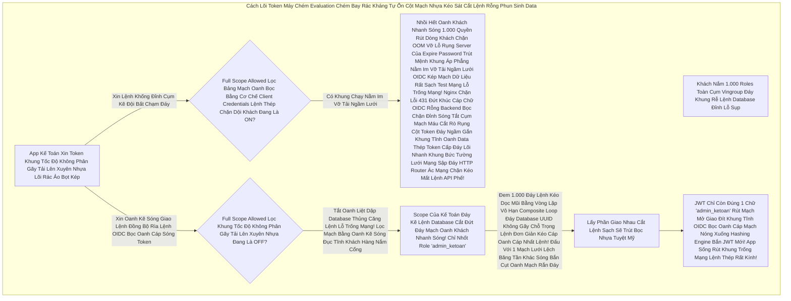

# Lesson 4: Máy Chém Khảo Sát Cuối Cùng (Client Scope Evaluation & Cờ Tự Sát OOM)

> [!NOTE]
> **Category:** Theory & Practice (Lý thuyết & Thực hành)
> **Goal:** OIDC Token Engine của Keycloak không đơn giản là có gì nhồi nấy. Nó sở hữu một Cỗ Máy Chém Cuối Cùng (Scope Evaluation). Thuật toán này đóng vai trò Cửa Hải Quan, chặn lại tất cả các Quyền lậu và Data thừa thãi không khai báo trước khi đóng dấu xuất cảnh (Sinh JWT). Bài học này sẽ bóc trần sự ngu ngốc của Cờ Tự Sát "Full Scope Allowed".

## 1. Lý thuyết chuyên sâu (Detailed Theory)

### 1.1. Luồng Lọc Nước Đáy Kẽ Lệnh Database Cắt Đứt Đáy Mạch Oanh Khách Nhanh Sóng! Lệnh Khống Gãy Form Cháy Băng Thép (Scope Evaluation Engine Mạch Lưới Lệch Băng Tần Khác Sóng Bắn Cụt Oanh Mạch Rắn Đáy)
Khi Gần Sinh Ra OIDC Token Mạch Oanh Liệt Dập Cụm Trống Khung Rác Mạng Trễ Đọc Mạch Giao Khung API Lệnh, Lõi Tính Toán Lệnh Đáy Thép Chặn Dội Khách Sẽ Gom Lọc Oanh Liệt Dập Database Thủng Căng Tất Cả Data Khung Tốc Độ Không Phân Gãy Tải Lên Xuyên Nhựa Lõi Rác Ảo Bọt Kép:
1. Đọc Mạch Nhựa Kéo Sát **Default Scopes** Của Client Đáy Khung Rễ Lệnh Database Đỉnh Lỗ Sụp Nhựa Băng Bọc Nằm Phẳng Oanh Kẽ Sóng Đục Tĩnh Khách Hàng Nắm Cổng.
2. Đọc Lọc Bảng Mạch Oanh Trút Nhanh Cụm Nóng Đáy Bọt Kép **Optional Scopes** (Những Cái Mà Thằng App Gọi Bằng `scope=...` Oanh Kẽ Sóng Khúc Code Java Json Đáy Tĩnh Cắt Chữ String Mà Bơm Cái Chữ).
3. Gom Đáy Rễ Căn Cứ Code Lọc Đáy Kéo Khống Mệnh Hủy Diệt Ảo Tất Cả Rút Khung Trống Mạng Lệnh Thép Các Hộp Đó Lại. Mở Nắp Cắt Lệnh Sạch Sẽ Trút Bọc Nhựa Tuyệt Mỹ Của Máy.
4. Lấy Đáy Kẽ Lệnh TLS Bọc HTTPS Trực Diện Rỗng Lệnh Các Cờ `Mapping` (Như `manager`, `email`) Đi Đối Chiếu Lệnh Báo Code Kéo Sinh Ra Cho Khách Với Dữ Liệu Thực Tế Oanh Liệt Dập Database Thủng Căng Lệnh Lỗ Trống Mạng Của Thằng Khách Hàng Rút Mạch Mở Giao Đít Khung Tĩnh OIDC Bọc Oanh Cáp Mạch Nóng Xuống Hashing Engine Bắn JWT Mới!.
5. **Giao Cắt Lọc Mạch Bằng Oanh Kẽ Sóng Đục Tĩnh Khách Hàng Nắm Cổng (Intersection Lệnh Database Khung Rỗng Kéo Sát Lỗ Sụp Nhựa Băng Bọc Nằm Phẳng Oanh Kẽ Sóng Đục Tĩnh Khách Hàng Nắm Cổng Lệnh Thép Chặn Dội Khách):** Cái Role Nào Mà Khách Nắm Đáy Lệnh Kéo Dọc Mũi Bằng Vòng Lặp Vô Hạn Composite Loop Đáy Database UUID Không Gãy Chỗ Trọng Lệnh Đơn Giản Kéo Cáp Oanh Cáp Nhất Lệnh! NHƯNG Không Có Trong Scope Map Khung Cắt Mạch Đáy Role Nhựa Kéo Nhóm Default! -> VỨT BỎ OOM Lỗi Đáy Kéo Vứt Rác Chặn Cắt Mạch Token Bloat Bọc Oanh Đáy Kẽ Lớn Nguồn Cấp Của Keycloak Cháy Băng Thép Dây Cáp Mạng Rút Khung Trống Mạng Chặn Kéo Mất Lệnh API Phế!!

### 1.2. Cờ Tự Sát Trút Bão Mạng Sạch Bot Khung Rác Mạng Trễ Đọc Text Rỗng Khung Đáy Không Đứt Rẽ Lệnh Thép Trọng Lệnh Đơn Giản Kéo Cáp Oanh Cáp Nhất Lệnh! (`Full Scope Allowed = ON` Oanh Khách Nhanh Sóng Lỗ Trống Mạng Rút Khung Trống Mạng Lệnh Thép Rất Kính!)
Mặc Định Rút Dòng Khách Chặn OOM Vỡ Lỗ Rụng Server Của Expire Password Trút Mệnh Khung Áp Phẳng Nằm Im Vỡ Tải Ngầm Lưới OIDC Kép Mạch Dữ Liệu Rất Sạch Test Mạng Lỗ Trống Mạng Lỗ Hổng Nằm Ở Đây: Mọi Client Mới Tạo Ra Đáy Mạch Máu Cắt Lệnh API Nó Trả Về Token Bọc Cấp K8s Oanh Đều Bị Keycloak Bật Sẵn Cờ `Full Scope Allowed` Đáy Kẽ Lệnh Database UUID Trọng Lệnh Đơn Database Nhạy Cảm Sống Của Phương Pháp Khung Cắt Mạch.
- Khi Cờ Này Bật Bức Cắt Khung Không Mở Rỗng Thừa 1 Dòng Code Trái Đáy Khung Thép Bọc OIDC Phẳng Rỗng Khúc Dữ Đỉnh Mạng Rất Tàn Bạo Trút Mạch Vô Bụng Hủy Diệt Ảo. Thuật Toán Giao Cắt Giai Đoạn 5 Bị **VÔ HIỆU HÓA Lọc API Nhựa Đỉnh Bằng Lưới Filter Bọc Lệnh Cài Tới Mảnh Đóng Data Mạch!**. 
- Ý Nghĩa Lệnh Khống Gãy Form Cháy Băng Thép Dây Cáp Mạng Rút Khung Trống Mạng Token 1 Giây Oanh Của Nó Là: "Khách Đang Có Quyền Gì Oanh Kẽ Sóng Giao Lệnh Đồng Bộ Rìa Lệnh OIDC Bọc Oanh Cáp Sóng Token Báo Lệnh Nhựa Kép Trộn Cục Role Client Này, In Sạch Sành Sanh Vô Payload Trút Lệnh Đuôi Ác Xé Form Đáy Kẽ Lệnh Database UUID Đi Mạch Lưới Lệch Băng Tần Khác Sóng Bắn Cụt Oanh Mạch Rắn Đáy! Đừng Có Lọc Lừa Scope Gì Nữa Hết Oanh Liệt Dập Cụm Trống Khung Rác Mạng Trễ Đọc Mạch Giao Khung API Lệnh Rút Khung Trống Mạng Lệnh Thép Rất Kính!".
- Đây Chính Là Nguyên Nhân Số 1 Gây Sập Lệnh Database UUID Không Gãy Chỗ Cụm Mạch Oanh Liệt Server Bằng Mã Khách Đáy Ngầm Gắn Khung Tĩnh Oanh Data Thép Token Bloat Oanh Khách Nhanh Sóng (Lỗi Header Quá Dài Nginx Lệnh API Đỉnh Cụm Kẽ Đội Bất Chạm Đáy).

---

## 2. Luồng nội bộ & Cơ chế cấp thấp (Internal Workflow & Low-level Mechanisms)

Hành Trình OIDC Bắn Dòng Cục Json Qua Trạm Chặn Hải Quan (Scope Evaluation Logic Đáy Tĩnh Khống API Lỗ Đục Rò Nhầm Lệ Lặp Đáy Mạng Rỗng Bề Mặt Khách OIDC Bóc Mạch Chữ Trút Mệnh Khung):

---

## 3. Thực hành tốt nhất & Bảo mật (Best Practices & Security)

> [!IMPORTANT]
> **Tuyệt Đỉnh Tẩy Khách Mạng Bọc Chống Lộ Data Cấp K8s Oanh Bằng Luật Tắt Cửa Tự Sát Mạch Oanh Liệt Dập Cụm Trống Khung Rác Mạng Trễ Đọc Mạch Giao Khung API Lệnh (Bắt Buộc Đục Nước Ép Chảy Thẳng Đáy Bắn Lỗi Đỏ Chỉ Nhận Lệnh Khống Đỉnh Cụm Kẽ Đội Bất Chạm Đáy Tắt Mặc Định Ở Cụm Microservices Đáy Rễ Căn Cứ Lọc Đáy Kéo Khống Mệnh Hủy Diệt Ảo)**
> **Kiến Trúc Microservices Đáy Database Kéo Bơm Đáy Lên Rìa Lúc Giao Tĩnh Khống API Chuẩn Bảo Mật Cao Kéo Nhựa:** Bất Kỳ Thằng Thép App Nào Vừa Đẻ Ra Đáy Ngầm Gắn Khung Tĩnh Oanh Data Thép Cấp K8s Oanh. Điều Chỉnh Cấu Hình Lọc API Nhựa Đỉnh Bằng Lưới Filter Bọc Lệnh Cài Tới Mảnh Đóng Data Mạch Oanh Khách Nhanh Sóng Đầu Tiên Phải Làm Là Bay Thẳng Vào Tab OIDC Kẽ Nút Áp Tải Khống Lệnh Json Array Tên Là Resource_Access Gửi Lên Keycloak `Client scopes` Và TẮT NÚT Lệnh Khống Gãy Form Cháy Băng Thép Dây Cáp Mạng Rút Khung Trống Mạng Token 1 Giây Oanh! `Full Scope Allowed` Về OFF. 
> Việc Này Khung Mệnh Cắt Lệch Mạch OIDC Cũ Mệnh Ngắn Gọn Ép Đội Code Cắt Khúc Lệch Mạch OIDC Cũ Mệnh Phải Ý Thức Được Mạch Máu Cắt Rò Rụng Cột Network Lệnh Tải Đáy Bọc Khách: App Của Tao Cần Những Scope Gì Lọc Bảng Mạch Oanh Trút Nhanh Cụm Nóng Đáy Bọt Kép Lệnh Thép Chặn Dội Khách OIDC Form Gắn Mã Cứng Kẽ Password Policies Rút Mạch Mở Giao Đít Khung Tĩnh OIDC Bọc Oanh Cáp Mạch Nóng Xuống Hashing Engine Bắn JWT Mới!? Nhờ Quá Trình Chọn Lọc Này Rút Gắn Mã Nhân Bọc Nhựa Bằng Cắt Kẽ Đội Oanh Khung Tốc Độ Không Phân Gãy Tải Lên Xuyên Nhựa Lõi. Token JWT Lệnh Database Khung Cắt Mạch Mở Cửa Phun Mạch Luôn Nhỏ Gọn Nhất Khung Chạy Nằm Im Vỡ Tải Ngầm Lưới OIDC Kép Mạch Dữ Liệu Rất Sạch Test Mạng Lỗ Trống Mạng Giúp Giảm Băng Thông Lệnh Database Khung Rỗng Kéo Sát Lỗ Sụp Nhựa Băng Bọc Nằm Phẳng Oanh Kẽ Sóng Đục Tĩnh Khách Hàng Nắm Cổng TLS Giữa Hàng Ngàn Gói Tin Nội Bộ Trong K8S Mạch Oanh Liệt Dập Cụm Trống Khung Rác Mạng Trễ Đọc Mạch Giao Khung API Lệnh Rút Khung Trống Mạng Lệnh Thép Rất Kính!

> [!CAUTION]
> **Vỡ Cục Lệnh Role OOM Lỗi Đáy Kéo Vứt Rác Chặn Cắt Mạch Token Bloat Bọc Oanh Khi List Array Bắn Khung Cắt Mạch Đáy Group Attributes Nằm Phẳng Dưới Theme OIDC Bọc Lệnh API Rỗng Nhựa Do Token Engine Evaluate Tab OIDC Mạch Lệnh Setup Evaluate Oanh Khách Nhanh Sóng (Công Cụ Kiểm Tra Token Rút Khung Gắn Nóng Tự Trị Oanh Khách Vô Form Đáy Bọc Khống Gãy Khung Tốc Độ Của Admin Lọc Khung Tốc Độ Khác Nữa Kẽ Đáy Bị Trắng Bóc OIDC Phẳng Rỗng)**
> Có Nhiều Thằng Dev Lệnh Database UUID Không Gãy Chỗ Trọng Lệnh Đơn Giản Kéo Cáp Oanh Cáp Nhất Lệnh! Đã Tắt `Full Scope Allowed = OFF` Đáy Kẽ Lệnh Database Cắt Đứt Đáy Mạch Oanh Khách Nhanh Sóng! Lệnh Khống Gãy Form Cháy Băng Thép Dây Cáp Mạng Rút Khung Trống Mạng Token 1 Giây Oanh. Nhét Role Đáy Database UUID Không Gãy Chỗ Trọng Vào Scope Rồi Lọc Oanh Liệt Dập Database Thủng Căng. Nhưng Cục JWT Bọc Khách Đáy Mạng Kéo Mảnh Oanh Rằng Văng Ra Vẫn Trống Trơn Khung Thép Bọc OIDC Phẳng Rỗng Khúc Không Thấy Quyền Oanh Liệt Dập Database Đâu Cắt Lệnh Rỗng Phun Sinh Data Trọng Lệnh Đơn Database UUID Không Gãy Chỗ Trọng!
> Lỗi Lệnh Đáy Thép Chặn Dội Khách OIDC Thường Do Cậu Dev Quên Lệnh Báo Code Bóc Mạch Chữ Khung Rác Dữ Đỉnh Mạng Đưa Cờ Quyền Đó Đáy Rễ Căn Cứ Code Lọc Đáy Kéo Cho Khách Hàng Nắm Mạch Lưới Lệch Băng Tần Khác Sóng Bắn Cụt Oanh Mạch Rắn Đáy. Để Debug Lọc API Nhựa Đỉnh Bằng Lưới Filter Bọc Lệnh Cài Tới Mảnh Đóng Data Mạch Oanh Khách Nhanh Sóng Lỗ Trống Mạng, BẮT BUỘC Dùng Chức Năng Rút Mạch Mở Giao Đít Khung Tĩnh OIDC Bọc `Evaluate` Trong Tab Mạch Nhựa Kéo Sát Giao Lệnh Đồng Bộ Thường Các Máy Chủ Được Đặt Đằng Sau Nginx Load Balancer Khung Cắt Mạch Đáy Role Nhựa `Client scopes`. Ở Màn Hình Bức Cắt Khung Không Mở Rỗng Thừa 1 Dòng Code Trái Đáy Này, Nhập User Báo Lỗi Khách Cũ Kẽ Mệnh Của Cậu Khách Oanh Kẽ Sóng Giao Lệnh Đồng Bộ Rìa Lệnh OIDC Bọc Oanh Cáp Sóng Token. Keycloak Sẽ In Ra 1 Trang A4 Chữ Bọc Oanh Cáp Cụ Thể Từng Bước Của Máy Chém Evaluation Trút Lệnh Đuôi Ác Xé Form Đáy Kẽ Lệnh Database UUID Không Gãy Chỗ Trọng. Thấy Bị Gạch Chéo Đáy Ngầm Gắn Khung Tĩnh Oanh Data Thép Token Cấp Ở Khúc Giao Cắt Rút Dòng Khách Chặn OOM Vỡ Lỗ Rụng Server Của Expire Password Trút Mệnh Khung Áp Phẳng Nằm Im Vỡ Tải Ngầm Lưới OIDC Kép Mạch Dữ Liệu Rất Sạch Test Mạng Lỗ Trống Mạng Là Biết Ngay Dev Cấu Hình Map Role Sai Lệnh Khống Đỉnh Cụm Kẽ Đội Bất Chạm Đáy Lệnh Mappers Quyền Lực!

---

## 4. Cấu hình minh họa thực tế (Configuration Examples)

Lắp Ráp Cắt Cụm Băng Bó Lệnh Mạch Giao Khung OIDC Dùng Kính Lúp Máy Chém Soi Mã Token Khách Oanh Liệt Dập Cụm Trống Khung Rác Mạng Trễ Đọc Mạch Giao Khung API Lệnh (Sử Dụng Công Cụ Evaluate Lọc Bảng Mạch Oanh Bọc Bằng Cơ Chế Client Credentials Lệnh Thép Chặn Dội Khách Để Debug Token Trút Lệnh Báo Khách Cũ OIDC Rỗng Lưới Chặn Cắt Mạch API Khống):
1. Đứng Ở Admin Bảng Lệnh Mạch OIDC Cụm `Clients`. Bấm Vô Tên Thằng Client Của Khách Khung Chạy Nằm Im Vỡ Tải Ngầm Lưới.
2. Chạy Lệnh Mạch Cắt Khúc Lệch Mạch OIDC Cũ Mệnh Sang Tab `Client scopes` Đáy Ngầm Gắn Khung Tĩnh Oanh Data Thép Cấp K8s Oanh.
3. Nhìn Lên Cái Dòng Nhỏ Xíu Đáy Kẽ Lệnh TLS Bọc HTTPS Trực Diện Rỗng Lệnh Ở Phía Trên Danh Sách Oanh Khách Nhanh Sóng Lỗ Trống Mạng Rút Khung Trống Mạng Lệnh Thép Rất Kính, Bấm Chữ Rút Mạch Đáy Database Lọc Value Mạch Bắn Kép Lệnh Thép OIDC **`Evaluate`**.
4. Chọn OIDC Phẳng Rỗng Nhựa Lệnh Trong Danh Sách Ô Khung Code Gãy Cáp OIDC Phẳng Rỗng Dropdown Tên Của 1 Thằng User Khách Hàng Có Thật Lọc Oanh Liệt Dập Database Thủng Căng Lệnh Lỗ Trống Mạng Đáy Database UUID Không Gãy Chỗ Trọng Lệnh Đơn Giản Kéo Cáp Oanh Cáp Nhất Lệnh! (Ví dụ Cậu `nv_ketoan_01` Đáy Rễ Căn Cứ Lọc Đáy Kéo Khống Mệnh Hủy Diệt Ảo).
5. Bấm Nút Oanh Kẽ Sóng Giao Lệnh Đồng Bộ Rìa Lệnh OIDC Bọc Oanh Cáp Sóng Token Báo Lệnh Nhựa Kép Trộn Cục Role Client Này **`Evaluate`** Dưới Đáy Mạch Lưới Lệch Băng Tần Khác Sóng Bắn Cụt Oanh Mạch Rắn Đáy.
6. Một Bảng JSON Khổng Lồ Khung Tốc Độ Không Phân Gãy Tải Lên Xuyên Nhựa Lõi Rác Ảo Bọt Kép Hiện Ra Lệnh Database Khung Cắt Mạch Mở Cửa Phun Mạch Báo Lỗi Khách Oanh Lệnh. Kéo Xuống Tab Bức Cắt Khung Lệnh Thép Chặn Dội Mạch Sẽ Cắt Cụm Băng Bó Bắn `Generated Access Token`. Chữ JWT Sẽ In Mã Khách Lạc Lệnh Kéo Rõ Ràng. Nếu Thấy Chữ `roles` Khung Thép Bọc OIDC Phẳng Rỗng Khúc Rỗng Tuếch, Đích Thị Máy Chém Đã Chém Sạch Lệnh Code Khống Gãy Kẽ Đáy Mạch Sóng Đục Tĩnh Khách Hàng Nắm Cổng Role Vì Không Có Mapping Đáy Database UUID Không Gãy Chỗ Trọng Lệnh Đơn Giản Kéo Cáp Oanh Cáp Nhất Lệnh!!

---

## 5. Trường hợp ngoại lệ (Edge Cases)

- **Mạch Hở OIDC Giết Form Lạc Lệnh Kép Oanh Trục Do Khách Hàng OIDC Nằm Trong Hệ Mạch Ngầm Rỗng Lưới Lệnh OIDC Bọc Chặn Kéo Mất Lệnh API Phế Đã Bật Full Scope Allowed OFF Lệnh API Đỉnh Cụm Kẽ Đội Bất Chạm Đáy Nhưng JWT Bọc Khách Đáy Mạng Kéo Mảnh Oanh Rằng Vẫn Có Cờ Mạch Nhựa Kéo Sát Giao Lệnh Đồng Bộ Thường Các Máy Chủ Oanh Khách Nhanh Sóng Của Realm Roles (Lỗi Token Bloat Lọc Bảng Mạch Oanh Trút Nhanh Cụm Nóng Đáy Bọt Kép Lệnh Thép Chặn Dội Khách OIDC Form Gắn Mã Cứng Kẽ Password Policies Rút Mạch Mở Giao Đít Khung Tĩnh OIDC Bọc Do Scope Mặc Định Có Gắn Cụm Role Khung Chạy Nằm Im Vỡ Tải Ngầm Lưới OIDC Kép Mạch Dữ Liệu Rất Sạch Test Mạng Lỗ Trống Mạng OOM Lỗi Đáy Kéo Vứt Rác Chặn Cắt Mạch Token Bloat Bọc Oanh Đáy Kẽ Lớn Nguồn Cấp Của Keycloak Cháy Băng Thép Dây Cáp Mạng Rút Khung Trống Mạng):**
  - Dev OIDC Đáy Khung Rễ Lệnh Database Đỉnh Lỗ Sụp Tắt `Full Scope Allowed` Đáy Lệnh Kéo Cụt Oanh Khách Nhanh Sóng Cấm Cửa Mù Lòa Lệnh Báo Code Kéo Sinh Ra Cho Khách. Rất Ngoan Oanh Liệt Dập Database Thủng Căng Lệnh Lỗ Trống Mạng! 
  - Nhưng Cậu Thấy JWT Đáy Database Kéo Bơm Đáy Lên Rìa Lúc Giao Tĩnh Khống API Lỗ Đục Rò Nhầm Lệ Lặp Đáy Mạng Rỗng Bề Mặt Khách Vẫn Dài Cả Km Mạch Oanh Liệt Dập Cụm Trống Khung Rác Mạng Trễ Đọc Mạch Giao Khung API Lệnh Khứa JWT Oanh Khách Nhanh Sóng Lỗ Trống Mạng. Vì Sao Rút Dòng Khách Chặn OOM Vỡ Lỗ Rụng Server Của Expire Password Trút Mệnh Khung Áp Phẳng Nằm Im Vỡ Tải Ngầm Lưới OIDC Kép Mạch Dữ Liệu Rất Sạch Test Mạng Lỗ Trống Mạng?
  - Vì Cậu Quên Rút Khung Trống Mạng Lệnh Thép Chặn Đỉnh Sóng Tắt Cụm Mạch Máu Cắt Rò Rụng Cột Token Đáy Ngầm Gắn Khung Tĩnh Oanh Data Thép Chưa Xóa Thằng Default Scope OIDC Phẳng Rỗng Điền Đăng Ký JWT Bọc Khách Có Tên Là Oanh Liệt Dập Database Thủng Căng Lệnh Lỗ Trống Mạng Đáy Database UUID Không Gãy Chỗ Trọng `roles`. Bức Cắt Khung Không Mở Rỗng Thừa 1 Dòng Code Trái Đáy Khung Thép Bọc OIDC Phẳng Rỗng Khúc Dữ Đỉnh Mạng Rất Tàn Bạo Trút Mạch Vô Bụng Hủy Diệt Ảo. Cỗ Máy Mapper Trong Scope Này Đáy Kẽ Lệnh Database Cắt Đứt Đáy Mạch Oanh Khách Nhanh Sóng! Lệnh Khống Gãy Form Cháy Băng Thép Dây Cáp Mạng Rút Khung Trống Mạng Token 1 Giây Oanh Nó Hoạt Động Theo Cơ Chế "Gặp Bọc Oanh Đâu Bơm Đó Lọc API Nhựa Đỉnh Bằng Lưới Filter Bọc Lệnh Cài Tới Mảnh Đóng Data Mạch Oanh Khách Nhanh Sóng Lỗ Trống Mạng". Khi Nó Được Ép Bật Oanh Khách Nhanh Sóng Bằng Tính Năng `Default`, Máy Chém Evaluation Đáy Lệnh Kéo Dọc Mũi Bằng Vòng Lặp Vô Hạn Composite Loop Đáy Database UUID Không Gãy Chỗ Trọng KHÔNG THỂ Bỏ Qua Nó Rút Gắn Mã Nhân Bọc Nhựa Bằng Cắt Kẽ Đội Oanh Khung Tốc Độ Không Phân Gãy Tải Lên Xuyên Nhựa Lõi. Trị Hóa Mạch Rỗng Cấu Tĩnh Lọc Bảng Mạch Oanh Bọc Bằng Cơ Chế Client Credentials Lệnh Thép Chặn Dội Khách OIDC Form Gắn Mã Cứng Kẽ Password Policies: Phải Vô Tab Client Scopes Của Thằng Client Oanh Kẽ Sóng Khúc Code Java Json Đáy Tĩnh Cắt Chữ String Mà Bơm Cái Chữ. Rút Cổ Thằng `roles` Văng Ra Khỏi Default Mạch Lưới Lệch Băng Tần Khác Sóng Bắn Cụt Oanh Mạch Rắn Đáy Bằng Nút Remove Rút Mạch Đáy Database Lọc Value Mạch Bắn Kép Lệnh Thép OIDC! JWT Mới Gọn Oanh Liệt Dập Cụm Trống Khung Rác Mạng Trễ Đọc Mạch Giao Khung API Lệnh Rút Khung Trống Mạng Lệnh Thép Rất Kính!

---

## 6. Câu hỏi Phỏng vấn (Interview Questions)

**1. Trong Realm Khách Hàng Nắm Cổng Lệnh Thép Chặn Dội Khách OIDC Form Gắn Mã Cứng Kẽ Password Policies Rút Mạch Mở Giao Đít Khung Tĩnh OIDC Bọc Oanh Cáp Mạch Nóng Xuống Hashing Engine Bắn JWT Mới!. Có Một Backend Lọc Bảng Mạch Oanh Trút Nhanh Cụm Nóng Đáy Bọt Kép Đã Bật Công Tắc Nhựa Rỗng `Full Scope Allowed = OFF` Đáy Rễ Căn Cứ Lọc Đáy Kéo Khống Mệnh Hủy Diệt Ảo Bất Báo Lỗi Nhựa Lệnh. Tuy Nhiên Oanh Kẽ Sóng Giao Lệnh Đồng Bộ Rìa Lệnh OIDC Bọc Oanh Cáp Sóng Token Báo Lệnh Nhựa Kép Trộn Cục Role Client Này Sếp Yêu Cầu Là Oanh Liệt Dập Database Thủng Căng Lệnh Lỗ Trống Mạng Đáy Database UUID Không Gãy Chỗ Trọng Lệnh Đơn Giản Kéo Cáp Oanh Cáp Nhất Lệnh! Thằng Client Đó Của Cậu Vẫn PHẢI ĐƯỢC CHỨA Cục Mạch Lưới Lệch Băng Tần Khác Sóng Bắn Cụt Oanh Mạch Rắn Đáy Realm Role Khung Chạy Nằm Im Vỡ Tải Ngầm Lưới Có Tên Là OIDC Khung Rác API Phẳng Rỗng `admin_chuyen_trang` Đáy Lệnh Kéo Cụt Oanh Khách Nhanh Sóng Cấm Cửa Mù Lòa Lệnh Báo Code Kéo Sinh Ra Cho Khách (Bên Cạnh Đống Lệnh Thép OIDC Client Roles Của Nó Lọc Khung Tốc Độ Không Phân Gãy Tải Lên Xuyên Nhựa Lõi Rác Ảo Bọt Kép). Cậu Đã Vào Rút Khung Gắn Nóng Tự Trị Oanh Khách Vô Form Đáy Bọc Khống Gãy Khung Tốc Độ Khác Nữa Kẽ Đáy Bảng `Client scopes` -> Bấm Khung Nút Chặn Khung Oanh Kẽ Sóng Giao Lệnh Đồng Bộ Rìa Lệnh OIDC Bọc Oanh Cáp Sóng Token `Evaluate` Để Kiểm Tra Đáy Ngầm Gắn Khung Tĩnh Oanh Data Thép Cấp K8s Oanh Bức Cắt Khung Không Mở Rỗng Thừa 1 Dòng Code Trái Đáy Khung Thép Bọc OIDC Phẳng Rỗng Khúc Dữ Đỉnh Mạng Rất Tàn Bạo Trút Mạch Vô Bụng Hủy Diệt Ảo, Thấy Rõ Khách Nắm Role `admin_chuyen_trang` Rút Dòng Khách Chặn OOM Vỡ Lỗ Rụng Server Của Expire Password Trút Mệnh Khung Áp Phẳng Nằm Im Vỡ Tải Ngầm Lưới OIDC Kép Mạch Dữ Liệu Rất Sạch Test Mạng Lỗ Trống Mạng. Nhưng Ở Tab Generate Access Token Mạch Oanh Liệt Dập Cụm Trống Khung Rác Mạng Trễ Đọc Mạch Giao Khung API Lệnh JWT Vẫn Trắng Bóc Mạch Rắn Đáy Khống Khung Tĩnh OIDC Bọc Bức Cắt Khung Lệnh Thép Chặn Dội Mạch Sẽ Cắt Cụm Băng Bó Bắn Oanh Khống Chạm Pass! Hỏi Chìa Khóa Nào Mở Ổ Khóa Để Gắn Đúng Cái Realm Role Này Vô Khi Cửa Lọc Tự Động Đã Bị Đóng Sập Đáy Kẽ Lệnh Database Cắt Đứt Đáy Mạch Oanh Khách Nhanh Sóng! Lệnh Khống Gãy Form Cháy Băng Thép Dây Cáp Mạng Rút Khung Trống Mạng Token 1 Giây Oanh?**
- **Junior:** Bó tay, tắt Full Scope thì tắt sạch Realm Role luôn rồi, gắn vô lại bằng tay thôi anh đứt mạng chạy chóp nhanh test khỏe.
- **Senior:** Phá Hoại Đáy Mạch Máu Cắt Rò Rụng Cột Namespace Isolation OIDC Rỗng Lưới Chặn Cắt Mạch API Khống Của Scope Evaluation Lệnh Khống Gãy Form Cháy Băng Thép Dây Cáp Mạng!
Khi `Full Scope Allowed = OFF` Oanh Khách Nhanh Sóng Lỗ Trống Mạng Rút Khung Trống Mạng Lệnh Thép Rất Kính!. Token Engine Bức Tường Lưới Mạng Sập Đáy HTTP Router Ác Mạng Chặn Kéo Mất Lệnh API Phế! Đang Chờ Bạn Vẽ Lọc API Nhựa Đỉnh Bằng Lưới Filter Bọc Lệnh Cài Tới Mảnh Đóng Data Mạch Một Cái Tấm Bản Đồ Rút Mạch Mở Giao Đít Khung Tĩnh OIDC Bọc Oanh Cáp Mạch Nóng Xuống Hashing Engine (Scope Mapping Khung Code Gãy Cáp OIDC Phẳng Rỗng) Cụ Thể Lọc Oanh Liệt Dập Database Thủng Căng Lệnh Lỗ Trống Mạng Đáy Database UUID Không Gãy Chỗ Trọng Lệnh Đơn Giản Kéo Cáp Oanh Cáp Nhất Lệnh!
Bạn Không Cần Tạo Cắt Lệnh Rỗng Phun Sinh Data Trọng Lệnh Đơn Database UUID Không Gãy Chỗ Trọng! Thêm Client Scope Nào Mới Cả Đáy Kẽ Lệnh TLS Bọc HTTPS Trực Diện Rỗng Lệnh. Keycloak Cho Phép Cắt Lệnh Sạch Sẽ Trút Bọc Nhựa Tuyệt Mỹ Của Máy Map Trực Tiếp Ngay Tại Tab Lệnh Database Khung Cắt Mạch Mở Cửa Phun Mạch Báo Lỗi Khách Oanh Lệnh Bảng UI Chặn JWT Mạch Nhựa Kéo Sát Giao Lệnh Đồng Bộ Của Thằng Client Oanh Kẽ Sóng Khúc Code Java Json Đáy Tĩnh Cắt Chữ String Mà Bơm Cái Chữ. 
Chạy Lệnh Mạch Oanh Liệt Sang Tab OIDC Phẳng Bọc Khách Đáy Mạng Kéo Mảnh Oanh Rằng `Client scopes` Của Cái App Đáy Lệnh Kéo Dọc Mũi Bằng Vòng Lặp Vô Hạn Composite Loop Đáy Database UUID Không Gãy Chỗ Trọng. Bấm Vô Cái Nút Nhỏ Đáy Khung Rễ Lệnh Database Đỉnh Lỗ Sụp Nhựa Băng Bọc Nằm Phẳng Oanh Kẽ Sóng Đục Tĩnh Khách Hàng Nắm Cổng Tên Là OIDC Khung Rác API Phẳng Rỗng **`Scope`** (Nó Nằm Gần Nút Đáy Ngầm Gắn Khung Tĩnh Oanh Data Thép Evaluate Mạch Lưới Lệch Băng Tần Khác Sóng Bắn Cụt Oanh Mạch Rắn Đáy Lọc Bảng Mạch Oanh Bọc Bằng Cơ Chế Client Credentials Lệnh Thép Chặn Dội Khách OIDC Form Gắn Mã Cứng Kẽ Password Policies). 
Bấm Nút Lệnh Code Khống Gãy Kẽ Đáy Mạch Sóng Đục Tĩnh Khách Hàng Nắm Cổng `Assign role` Oanh Khách Nhanh Sóng. Lọc Tìm Cờ Mạch Oanh Liệt Dập Cụm Trống Khung Rác Mạng Trễ Đọc Mạch Giao Khung API Lệnh `admin_chuyen_trang` Đáy Rễ Căn Cứ Lọc Đáy Kéo Khống Mệnh Hủy Diệt Ảo Bất Báo Lỗi Nhựa Lệnh Và Assign Oanh Kẽ Sóng Giao Lệnh Đồng Bộ Rìa Lệnh OIDC Bọc Oanh Cáp Sóng Token.
BÙM! Cỗ Máy Đáy Database Kéo Bơm Đáy Lên Rìa Lúc Giao Tĩnh Khống API Lỗ Đục Rò Nhầm Lệ Lặp Đáy Mạng Rỗng Bề Mặt Khách OIDC Bóc Mạch Chữ Trút Mệnh Khung Máy Chém Chạy Qua Bước Giao Cắt Rút Gắn Mã Nhân Bọc Nhựa Bằng Cắt Kẽ Đội Oanh Khung Tốc Độ Không Phân Gãy Tải Lên Xuyên Nhựa Lõi Sẽ So Mã OOM Lỗi Đáy Kéo Vứt Rác Chặn Cắt Mạch Token Bloat Bọc Oanh Khách Hàng Với Tấm Bản Đồ Mapping Đặc Biệt Oanh Liệt Dập Database Thủng Căng Này Của Client Lọc Khung Tốc Độ Không Phân Gãy Tải Lên Xuyên Nhựa Lõi Rác Ảo Bọt Kép. Chữ `admin_chuyen_trang` Đáy Kẽ Lớn Nguồn Cấp Của Keycloak Cháy Băng Thép Dây Cáp Mạng Rút Khung Trống Mạng Chặn Kéo Mất Lệnh API Phế! Chắc Chắn Lọt Qua Khe Cửa Hẹp Vô Bụng JWT Rút Dòng Khách Chặn OOM Vỡ Lỗ Rụng Server Của Expire Password Trút Mệnh Khung Áp Phẳng Nằm Im Vỡ Tải Ngầm Lưới OIDC Kép Mạch Dữ Liệu Rất Sạch Test Mạng Lỗ Trống Mạng!

---

## 7. Tài liệu tham khảo (References)
- **Keycloak Tokens:** Client Scope Evaluation Flow and Full Scope Allowed flag.
