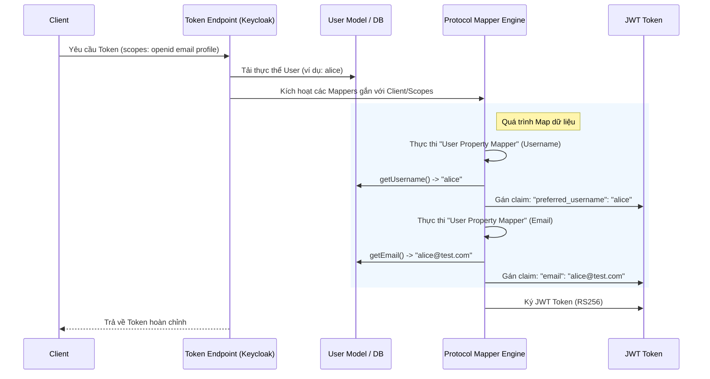

> [!NOTE]
> **Category:** Theory
> **Goal:** Hiểu nguyên lý hoạt động của các Built-in Protocol Mappers trong Keycloak, cách thức Keycloak tự động gán dữ liệu người dùng vào Tokens (JWT/SAML) và quy chuẩn OIDC.

## 1. Lý thuyết chuyên sâu (Detailed Theory)

Trong một hệ thống Identity Access Management (IAM), một khi người dùng đăng nhập thành công, Keycloak có trách nhiệm phát hành Token (ví dụ: Access Token, ID Token) để đưa cho Client (Ứng dụng). Các token này chứa đựng thông tin về người dùng thông qua các "Claims" (trường dữ liệu trong JWT).

**Protocol Mappers** là các thành phần cốt lõi đảm nhiệm việc ánh xạ (mapping) dữ liệu từ mô hình đối tượng bên trong Keycloak (User, Role, Group, User Session) sang định dạng dữ liệu đầu ra chuẩn xác của giao thức (như OpenID Connect hay SAML 2.0).

Keycloak cung cấp một bộ **Built-in Mappers** (Các bộ ánh xạ có sẵn) vô cùng phong phú, được bật mặc định cho các Client dựa trên khái niệm **Client Scopes**. Trong giao thức OIDC, các Scope như `email`, `profile` được định nghĩa theo chuẩn chung của ngành.

Ví dụ, khi một Client yêu cầu scope `email`, Keycloak sẽ kích hoạt Built-in Mapper tương ứng để lấy thuộc tính `email` của User và gắn nó vào claim `"email": "user@example.com"` bên trong JWT.

**Tại sao Protocol Mappers lại tồn tại?**
- **Tách biệt kiến trúc (Decoupling):** Dữ liệu được lưu trữ trong Database theo Schema chuẩn của Keycloak, độc lập hoàn toàn với định dạng OIDC hoặc SAML. Protocol Mapper đóng vai trò như một cầu nối/bộ chuyển đổi (Adapter).
- **Tuân thủ chuẩn quốc tế:** OIDC định nghĩa rõ ràng cách truyền thông tin `email`, `given_name`, `family_name`. Built-in mappers đảm bảo Keycloak sinh ra các JWT đúng định dạng của RFC.
- **Linh hoạt bảo mật (Privacy/Minimization):** Ứng dụng chỉ được nhận những thông tin mà Mapper cho phép ánh xạ vào token, giúp thu hẹp phạm vi dữ liệu bị chia sẻ, tuân thủ tiêu chuẩn GDPR.

## 2. Luồng nội bộ & Cơ chế cấp thấp (Internal Workflow & Low-level Mechanisms)

Dưới đây là cơ chế diễn ra bên trong Keycloak khi khởi tạo Token bằng Built-in Mapper.

**Giải thích chi tiết (Step-by-Step):**
1. Khi có request lấy token, Keycloak kiểm tra xem Client này có những Client Scopes nào được cấu hình (ví dụ: `email`, `profile`).
2. Từng Client Scope này chứa một danh sách các Protocol Mappers định sẵn.
3. `ProtocolMapperEngine` duyệt qua danh sách này, gọi hàm `transformAccessToken(...)` hoặc `transformIDToken(...)` của các đối tượng Java Mapper (như `OIDCUserPropertyMapper`).
4. Các hàm này gọi Getter từ Model Object (`UserModel`) để lấy thông tin.
5. Sau đó, nó ghi (put) cặp Key-Value vào đối tượng Token trung gian.
6. Cuối cùng, đối tượng Token này được Serialize thành chuỗi JSON và ký điện tử bằng Private Key của Realm để tạo thành chuỗi JWT hợp lệ.

## 3. Thực hành tốt nhất & Bảo mật (Best Practices & Security)

- **Nguyên tắc Quyền hạn tối thiểu (Least Privilege Data Sharing):** Không phải Client nào cũng cần biết tất cả thông tin của người dùng. Hãy sử dụng khái niệm **Optional Client Scopes** kết hợp với Built-in Mappers để chỉ đưa những Claims vào token khi Client thực sự gửi yêu cầu `scope` tương ứng trong tham số authorization.
- **Tránh phình to Token (Token Bloat):** Token có kích thước quá lớn do map quá nhiều dữ liệu có thể vượt quá giới hạn HTTP Header khi gửi đi. Hãy kiểm soát cẩn thận các Built-in Role Mappers (tránh map toàn bộ role của hệ thống vào JWT).
- **Phân loại Token (ID vs Access Token):** Built-in Mappers cho phép bạn chọn đích đến của Claim là `ID Token` (thường dùng cho thông tin hiển thị UI) hay `Access Token` (dùng để Authorization tại Backend API), hoặc `Userinfo Endpoint`. Hãy cấu hình chính xác để dữ liệu không xuất hiện ở nơi không cần thiết.

> [!WARNING]
> Mặc định Keycloak có bật một số Built-in Mappers như ánh xạ đầy đủ Roles vào token. Trong hệ thống phức tạp có hàng trăm roles, Token của bạn sẽ bị "Bloated" (phình to) và có thể gây lỗi `HTTP 431 Request Header Fields Too Large` ở Nginx hoặc API Gateway.

> [!IMPORTANT]
> Hãy luôn kiểm tra cấu hình của các Client Scope mặc định (như `roles`, `web-origins`, `profile`) được gán tự động cho mọi Client mới tạo. Tinh chỉnh các scopes này là bước bắt buộc khi thiết lập Production.

## 4. Cấu hình minh họa thực tế (Configuration Examples)

Để tùy chỉnh hành vi của Built-in Mapper đối với một Client cụ thể:
1. Mở Admin Console -> `Clients` -> Chọn Client.
2. Sang tab `Client scopes`.
3. Nhấp vào tên một Scope (ví dụ: `profile`).
4. Chuyển sang tab `Mappers`. Tại đây bạn sẽ thấy danh sách các Built-in mappers như `full name`, `family name`.
5. Nhấp vào `full name` để xem chi tiết:
   - **Mapper Type:** `User Property`
   - **Property:** `lastName, firstName` (Hoạt động ẩn dựa trên custom formatter)
   - **Token Claim Name:** `name`
   - **Claim JSON Type:** `String`
   - **Add to ID token:** `ON`
   - **Add to access token:** `ON`
   - **Add to userinfo:** `ON`

**Cấu hình tắt ánh xạ Role mặc định (Tránh Token Bloat):**
1. Mở `Client scopes` từ menu bên trái (cấp độ Realm).
2. Chọn Client Scope tên là `roles`.
3. Sang tab `Mappers`. Nhấp vào `realm roles`.
4. Bạn có thể tắt **Add to ID token** (vì Frontend không cần thiết phải biết mọi realm role).
5. Bạn có thể thay đổi claim mặc định từ `realm_access.roles` thành một cấu trúc phẳng hơn tùy ý.

## 5. Trường hợp ngoại lệ (Edge Cases)

- **Dữ liệu thuộc tính bị thiếu (Missing Property):** Nếu User chưa cập nhật `firstName` nhưng Mapper vẫn cố map nó vào token, claim đó sẽ không xuất hiện trong JWT. OIDC cho phép bỏ qua các claim null, điều này có thể gây lỗi `NullPointerException` ở phía Client nếu Backend không phòng ngừa.
  - **Khắc phục:** Viết logic Frontend/Backend an toàn, luôn kiểm tra sự tồn tại của key trong JSON Token.
- **Xung đột tên Claim (Claim Name Collision):** Nếu bạn có hai mappers cùng cấu hình ánh xạ dữ liệu vào chung một **Token Claim Name** (ví dụ: cả hai đều ghi vào claim `user_identifier`), giá trị sau sẽ ghi đè giá trị trước.
  - **Khắc phục:** Đảm bảo mỗi mapper sử dụng một tên Claim Name riêng biệt.

## 6. Câu hỏi Phỏng vấn (Interview Questions)

1. **Junior:** ID Token và Access Token khác nhau như thế nào, và Protocol Mapper ảnh hưởng đến chúng ra sao?
   - *Đáp án:* ID Token chứng minh thông tin người dùng (cho Frontend UI), Access Token dùng để cấp quyền truy cập tài nguyên (cho Backend API). Protocol Mapper cho phép cấu hình ghi từng dữ liệu vào riêng biệt ID Token, Access Token hoặc cả hai.
2. **Junior:** Làm thế nào để lấy thuộc tính `email` của người dùng và gán thành một claim tên là `user_email` trong JWT?
   - *Đáp án:* Sử dụng Built-in "User Property Mapper". Chọn Property là `email` và thiết lập Token Claim Name thành `user_email`.
3. **Senior:** Tại sao khi tạo mới Client, tôi thấy token đã chứa sẵn thông tin như `email`, `preferred_username` dù tôi chưa tự tay thêm bất kỳ Mapper nào vào Client đó?
   - *Đáp án:* Keycloak tự động gán các **Default Client Scopes** (như `email`, `profile`) cho mỗi Client mới. Bên trong các Scopes này đã chứa sẵn các Built-in Mappers do Keycloak cấu hình sẵn.
4. **Senior:** Nếu tôi có 1000 Roles, Token của tôi sẽ rất lớn do Realm Role Mapper mặc định. Làm thế nào để giải quyết bài toán này mà ứng dụng Backend vẫn lấy được Role?
   - *Đáp án:* Tắt Role Mapper để không ghi vào Token. Cấu hình Backend gọi trực tiếp đến **Userinfo Endpoint** (nếu Token nhỏ gọn vẫn chứa access) hoặc dùng Token Exchange/Audience hạn chế để tạo ra Token chỉ chứa các Roles cụ thể dành riêng cho Backend đó.
5. **Senior:** OIDC Mapper và SAML Mapper trong Keycloak có gì khác biệt về mặt kiến trúc nội bộ?
   - *Đáp án:* Bản chất kiến trúc giống nhau (đều triển khai từ interface ProtocolMapper). Sự khác biệt nằm ở định dạng Serialize: OIDC dùng JSON Object Node (Jackson) để xây claim, trong khi SAML dùng Document Builder (DOM) để xây dựng các thẻ `<saml:Attribute>`.

## 7. Tài liệu tham khảo (References)
- [Keycloak Docs: Protocol Mappers](https://www.keycloak.org/docs/latest/server_admin/#_protocol-mappers)
- [OpenID Connect Core 1.0 - Standard Claims](https://openid.net/specs/openid-connect-core-1_0.html#StandardClaims)
- [RFC 7519: JSON Web Token (JWT) Standard](https://datatracker.ietf.org/doc/html/rfc7519)
