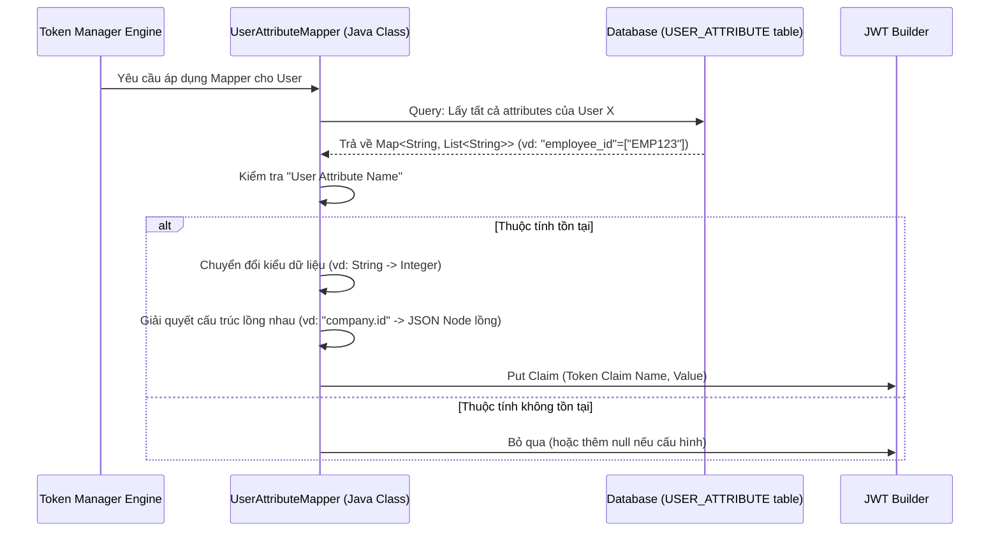

> [!NOTE]
> **Category:** Theory
> **Goal:** Hiểu sâu về cấu trúc của User Attribute Mapper, cách ánh xạ các dữ liệu tùy chỉnh của người dùng (Custom Attributes) vào Tokens và các lưu ý bảo mật.

## 1. Lý thuyết chuyên sâu (Detailed Theory)

Bên cạnh các thuộc tính cơ bản như Tên, Họ, Email, các hệ thống thường có nhu cầu lưu trữ nhiều thông tin chuyên biệt cho từng người dùng (ví dụ: Mã nhân viên, Cấp bậc phòng ban, Số điện thoại nội bộ). Trong Keycloak, những thông tin này được lưu dưới dạng **User Attributes** (Cặp Key-Value tùy chỉnh mở rộng).

**User Attribute Mapper** là một loại Protocol Mapper được cung cấp sẵn nhằm giải quyết bài toán: Chuyển đổi các thuộc tính tùy chỉnh này từ cơ sở dữ liệu Keycloak để nhúng chúng vào JWT Token hoặc SAML Assertion dưới dạng các Claims tùy chỉnh.

**Tại sao cần User Attribute Mapper?**
- **Tránh truy vấn vòng (N+1 queries):** Nếu không nhúng những thông tin này vào Token, Ứng dụng/Microservice (Resource Server) sẽ phải liên tục gửi thêm request gọi ngược về Keycloak (qua API Admin hoặc UserInfo endpoint) để lấy thông tin mã nhân viên mỗi khi có request tới. Bằng cách gộp thuộc tính vào Token, ta đạt được mô hình **Stateless Authorization** hoàn chỉnh.
- **Linh hoạt định dạng cấu trúc:** Mapper cho phép bạn ánh xạ một Key phẳng trong hệ thống Keycloak (ví dụ `address_street`) thành một đối tượng JSON lồng nhau phức tạp trong Token (ví dụ `address.street`).
- **Ép kiểu dữ liệu (Data Typing):** Dữ liệu lưu trong cơ sở dữ liệu của Keycloak (bảng `USER_ATTRIBUTE`) luôn là dạng chuỗi (`String`). Mapper cung cấp tính năng ép kiểu (JSON Type) thành số nguyên (`int`), boolean hoặc mảng JSON để tương thích với hệ thống phía Client.

## 2. Luồng nội bộ & Cơ chế cấp thấp (Internal Workflow & Low-level Mechanisms)

Dưới đây là cơ chế xử lý cấp thấp khi User Attribute Mapper được thực thi trong quá trình cấp phát Token.



**Giải thích chi tiết (Step-by-Step):**
1. Khi có luồng khởi tạo Token, `UserAttributeMapper` được gọi.
2. Nó sẽ yêu cầu đối tượng `UserModel` (đại diện cho User hiện tại) cung cấp tất cả các thuộc tính của mình thông qua phương thức `getAttributes()`.
3. Dữ liệu trong Keycloak lưu trữ dưới dạng đa trị (Multivalued - `Map<String, List<String>>`).
4. Mapper đối chiếu trường **User Attribute Name** được cấu hình.
5. Nếu thuộc tính là đa trị, và cấu hình `Multivalued` được bật, Mapper sẽ chuyển danh sách đó thành mảng JSON (`JSON Array`). Nếu tắt, nó chỉ lấy phần tử đầu tiên.
6. Mapper áp dụng **Claim JSON Type** (String, long, int, boolean) bằng cách dùng thư viện Jackson (JSON parser) ép kiểu dữ liệu từ chuỗi gốc sang nguyên thủy.
7. Mapper xử lý chuỗi dấu chấm (`.`) trong Token Claim Name để tạo ra JSON Object nếu cần.
8. Cuối cùng, Claim được chèn vào JWT Payload.

## 3. Thực hành tốt nhất & Bảo mật (Best Practices & Security)

- **Sử dụng cấu trúc JSON lồng nhau để phân nhóm:** Để Token không trở thành một mảng hỗn độn các keys, hãy dùng dấu chấm trong tên Claim. Ví dụ: `department.name`, `department.id`. Keycloak sẽ tự động gom chúng thành đối tượng JSON `{"department": {"name": "IT", "id": 123}}`.
- **Cẩn trọng với thông tin nhạy cảm (PII/Sensitive Data):** Không bao giờ ánh xạ các thuộc tính bí mật như số thẻ tín dụng, mã số thuế vào Access/ID Token vì Token (đặc biệt là ID Token) có thể bị lộ ở phía Frontend hoặc qua log máy chủ.
- **Tận dụng Multi-valued attributes một cách chính xác:** Nếu thuộc tính của bạn là danh sách (ví dụ: `favorite_colors: ["red", "blue"]`), bạn phải bật tùy chọn **Multivalued** trong cấu hình Mapper. Nếu không, Client chỉ nhận được chuỗi đầu tiên là `"red"`.

> [!WARNING]
> Nếu bạn cố gắng ánh xạ một chuỗi ký tự (chứa chữ) thành một JSON Type là `int` hoặc `long`, Keycloak sẽ gặp Exception trong quá trình Parsing tại Runtime, khiến việc phát hành Token thất bại và gây ra lỗi `500 Internal Server Error`.

> [!IMPORTANT]
> Việc ánh xạ mọi custom attribute vào token sẽ gây ra rủi ro Token Bloat. Tốt nhất, hãy tạo ra các **Client Scopes** cụ thể (vd: `employee_info`), đưa Attribute Mapper vào Scope đó, và cấu hình Scope là **Optional**. Client phải chủ động gửi biến `scope=employee_info` thì mới nhận được những thông tin mở rộng này.

## 4. Cấu hình minh họa thực tế (Configuration Examples)

**Yêu cầu bài toán:** Ánh xạ thuộc tính `employee_id` từ người dùng, ép sang dạng số (integer) và đưa nó vào bên trong thuộc tính lồng nhau `company.emp_id` trong Access Token.

**Các bước cấu hình trên Keycloak Admin Console:**
1. Tạo một User mới, ở tab `Attributes`, nhập Key là `employee_id`, Value là `8905` và lưu lại.
2. Vào `Client scopes` -> Chọn Scope bạn muốn gán (VD: `profile`).
3. Mở tab `Mappers` -> Nhấn `Configure a new mapper` -> Chọn **User Attribute**.
4. Cấu hình chi tiết:
   - **Name:** `Employee ID Mapper`
   - **User Attribute:** `employee_id` (Tên chính xác đã tạo ở tab Attributes)
   - **Token Claim Name:** `company.emp_id`
   - **Claim JSON Type:** `int`
   - **Add to ID token:** `OFF`
   - **Add to access token:** `ON`
   - **Add to userinfo:** `ON`
5. Nhấn **Save**.

**Kết quả Token nhận được khi Client giải mã (Payload):**
```json
{
  "exp": 1690000000,
  "sub": "b2c93...",
  "company": {
    "emp_id": 8905
  }
}
```
Lưu ý `8905` là một số thực thụ (không có dấu ngoặc kép), nhờ vào cấu hình `Claim JSON Type: int`.

## 5. Trường hợp ngoại lệ (Edge Cases)

- **Thuộc tính User có nhiều giá trị, nhưng Mapper cấu hình Multivalued: OFF:** 
  - Keycloak sẽ chỉ lấy giá trị đầu tiên trong danh sách các giá trị của thuộc tính đó. Dữ liệu từ phần tử thứ 2 trở đi bị cắt bỏ, dẫn đến mất mát thông tin.
  - **Khắc phục:** Luôn bật ON cho `Multivalued` nếu chắc chắn dữ liệu đầu vào là dạng mảng.
- **Tên User Attribute chứa khoảng trắng hoặc ký tự đặc biệt:**
  - Database Keycloak cho phép lưu các key như `User Department`. Tuy nhiên, việc map các chuỗi này đôi khi gây bất lợi trong một số hệ thống cũ tiêu thụ JWT.
  - **Khắc phục:** Luôn dùng chuẩn tên biến (camelCase hoặc snake_case) như `user_department` để lưu vào Attribute của User.

## 6. Câu hỏi Phỏng vấn (Interview Questions)

1. **Junior:** Chức năng chính của User Attribute Mapper là gì?
   - *Đáp án:* Dùng để lấy các dữ liệu động, mở rộng (Custom attributes) được lưu tại bảng thuộc tính của User và đưa chúng vào JWT token thành các claim.
2. **Junior:** Làm thế nào để cấu trúc dữ liệu JSON lồng nhau (Nested JSON) bằng User Attribute Mapper?
   - *Đáp án:* Trong trường `Token Claim Name`, sử dụng ký tự dấu chấm (`.`) để biểu diễn các cấp bậc. Ví dụ `a.b.c` sẽ sinh ra đối tượng JSON lồng nhau `{"a": {"b": {"c": "value"}}}`.
3. **Senior:** Bạn hiểu thế nào về tùy chọn "Claim JSON Type"? Tại sao thuộc tính này lại quan trọng?
   - *Đáp án:* Vì mọi thuộc tính trong DB Keycloak mặc định được lưu là chuỗi (String). Nếu hệ thống đích tiêu thụ API yêu cầu một boolean (vd: `is_manager: true`) hoặc một số (vd: `age: 30`), việc ép kiểu (Claim JSON Type) giúp Keycloak chuyển đổi chuỗi thành kiểu nguyên thủy (primitive type) trong chuẩn JSON, tránh lỗi unmarshal tại Backend.
4. **Senior:** Một Client phàn nàn rằng họ thấy thuộc tính `phone_numbers` trong token đang là `["0123"]` thay vì chuỗi `"0123"`. Nguyên nhân là do đâu?
   - *Đáp án:* Do tùy chọn `Multivalued` trong cài đặt Mapper đang được bật (ON). Do đó Keycloak xuất dữ liệu dưới dạng JSON Array thay vì chuỗi đơn lẻ, dù trong list đó chỉ có 1 phần tử.
5. **Senior:** Việc thêm quá nhiều User Attribute Mapper vào Access Token sẽ ảnh hưởng gì đến kiến trúc hệ thống và giải pháp để khắc phục?
   - *Đáp án:* Làm tăng kích thước Token (Token Bloat), tốn băng thông đường truyền và có thể vượt quá giới hạn HTTP Header. Giải pháp là chuyển các claims này sang `UserInfo endpoint` (chỉ bật `Add to userinfo`, tắt phần thêm vào token), và để Client dùng Token gọi đến endpoint này để lấy thông tin khi thực sự cần.

## 7. Tài liệu tham khảo (References)
- [Keycloak Docs: Managing users - Attributes](https://www.keycloak.org/docs/latest/server_admin/#user-attributes)
- [Keycloak Docs: Protocol Mappers Configuration](https://www.keycloak.org/docs/latest/server_admin/#_protocol-mappers)
- [RFC 7519: JSON Web Token Claims structure](https://datatracker.ietf.org/doc/html/rfc7519#section-4)
