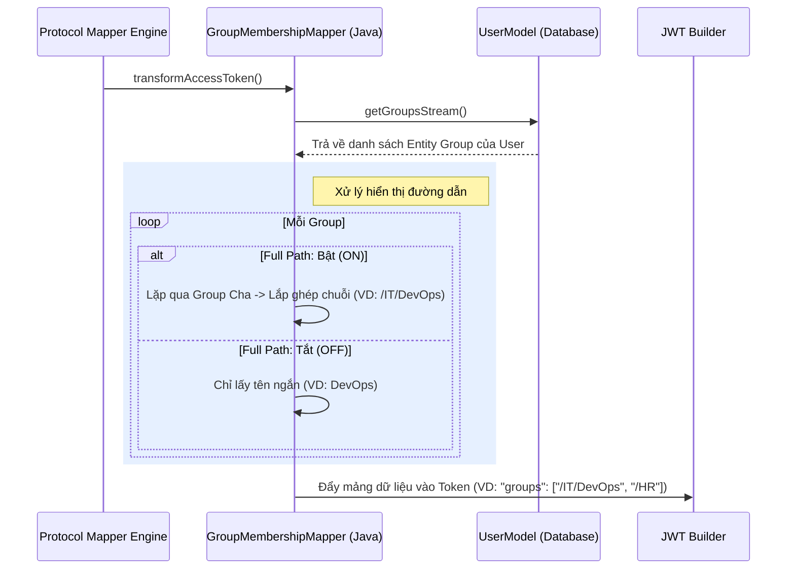

> [!NOTE]
> **Category:** Theory
> **Goal:** Hiểu nguyên lý ánh xạ nhóm người dùng (Group Membership) vào Token, cách xử lý phân cấp nhóm (Group Hierarchy) và những cạm bẫy thiết kế liên quan đến kiểm soát truy cập dựa trên nhóm.

## 1. Lý thuyết chuyên sâu (Detailed Theory)

Trong Keycloak, bên cạnh hệ thống Role (Vai trò), **Group (Nhóm)** là một thực thể quan trọng để tổ chức người dùng theo cấu trúc phân cấp (Hierarchy). Một nhóm có thể chứa các nhóm con (Sub-groups), và một người dùng có thể thuộc nhiều nhóm khác nhau (Ví dụ: `IT`, `IT/DevOps`, `HR`).

**Group Membership Mapper** là công cụ giúp ánh xạ danh sách các nhóm mà người dùng đang tham gia vào bên trong JWT Token. Khi Resource Server (Backend API) nhận được Token này, nó có thể cấp quyền truy cập vào các tài nguyên nhất định dựa trên nhóm (Group-Based Access Control - GBAC).

**Tại sao chúng ta cần Group Mapper?**
- **Tránh kiểm tra thủ công:** Giúp Backend API biết ngay lập tức người dùng thuộc phòng ban/bộ phận nào mà không cần truy vấn vào Database nội bộ hay gọi API lên Keycloak để lấy danh sách Group.
- **Tính Phân cấp (Hierarchy):** Group trong Keycloak có tính chất cha-con. Mapper cho phép cấu hình để hiển thị đầy đủ đường dẫn nhóm (Full Path - ví dụ: `/Engineering/Backend`) thay vì chỉ hiển thị tên nhóm ngắn gọn (`Backend`). Điều này giúp phân biệt các nhóm trùng tên ở các phòng ban khác nhau.

## 2. Luồng nội bộ & Cơ chế cấp thấp (Internal Workflow & Low-level Mechanisms)

Khi OIDC Engine sinh ra Token, quá trình xử lý Group Mapper diễn ra khá phức tạp do phải duyệt cây phân cấp.



**Giải thích chi tiết (Step-by-Step):**
1. Mapper gọi API nội bộ của Keycloak để lấy tất cả các Group mà User đang làm thành viên trực tiếp.
2. Nếu thuộc tính cấu hình `Full group path` được đặt là **ON**: Hệ thống sử dụng đệ quy (recursive) để tìm kiếm nhóm cha (Parent Group), rồi nối tên chúng lại với nhau bằng dấu gạch chéo `/`. Ví dụ: `/Parent/Child`.
3. Nếu người dùng thuộc nhiều nhóm, hệ thống thu thập tất cả các đường dẫn này và tạo ra một Mảng chuỗi (JSON Array of Strings).
4. Chuỗi JSON Array này sau đó được gán vào Claim do người quản trị chỉ định (mặc định thường là `"groups"`).

## 3. Thực hành tốt nhất & Bảo mật (Best Practices & Security)

- **Sử dụng Full Path để tránh xung đột:** Luôn khuyên dùng `Full group path: ON` (Mặc định). Giả sử bạn có nhóm `/Hanoi/Sales` và `/HCM/Sales`. Nếu tắt Full Path, Token của cả 2 user đều hiện là `["Sales"]`, làm cho Backend không thể phân biệt được User thuộc Sales khu vực nào.
- **Hạn chế Token Bloat:** Cũng giống như Role Mapper, nếu công ty có hàng nghìn nhóm và một nhân viên ở trong hàng chục dự án, mảng `groups` sẽ rất dài. 
  - *Giải pháp:* Chỉ kích hoạt Group Mapper trong một Client Scope cụ thể (ví dụ: `department-info`) và yêu cầu Client gửi đúng scope này mới nhận được thông tin.
- **Không dùng Group để cấp quyền trực tiếp nếu có thể:** Mặc dù Backend có thể đọc `groups` để cấp quyền (GBAC), Best Practice của Keycloak là nên map Role cho Group, và sau đó Backend sẽ đọc các Role (RBAC). Hệ thống nhóm thường thay đổi theo cấu trúc nhân sự, trong khi Role thay đổi theo chức năng kỹ thuật. Tách bạch hai khái niệm này giúp hệ thống bền vững hơn.

> [!WARNING]
> Không bao giờ tự ý phân giải quyền hạn bằng cách kiểm tra chuỗi regex trên tên nhóm trong mã nguồn Backend. Cấu trúc tên nhóm có thể bị quản trị viên đổi tên trên Keycloak bất cứ lúc nào, làm gãy logic ủy quyền.

> [!IMPORTANT]
> Thuộc tính `Full group path` khi kết xuất ra Token sẽ luôn bắt đầu bằng dấu `/` (ví dụ `/Admins`). Phía backend khi tiến hành so sánh chuỗi (String matching) phải lưu ý điều này để không bị lỗi Logic.

## 4. Cấu hình minh họa thực tế (Configuration Examples)

Để cấu hình Group Mapper vào Client của bạn:

1. Vào `Client scopes` -> Nhấn vào scope `profile` (hoặc tạo scope mới tên là `groups`).
2. Tab `Mappers` -> `Configure a new mapper` -> Chọn **Group Membership**.
3. Điền các tham số:
   - **Name:** `Groups Mapper`
   - **Token Claim Name:** `groups`
   - **Full group path:** `ON` (để lấy chuỗi kiểu `/Company/IT/Dev`)
   - **Add to ID token:** `ON`
   - **Add to access token:** `ON`
   - **Add to userinfo:** `ON`
4. Nhấn **Save**.

**Mẫu Payload nhận được:**
```json
{
  "sub": "user-uuid-1234",
  "preferred_username": "john.doe",
  "groups": [
    "/Engineering/Developers",
    "/Internal/BetaTesters"
  ]
}
```

## 5. Trường hợp ngoại lệ (Edge Cases)

- **Người dùng không thuộc nhóm nào:** 
  - Theo chuẩn JSON, nếu mảng rỗng, Keycloak có thể không đưa mảng này vào Token để tối ưu, hoặc trả về một mảng rỗng `[]` tùy cấu hình phiên bản. Client App phải luôn kiểm tra null an toàn.
  - **Khắc phục:** `const userGroups = token.groups || [];`
- **Nhóm bị đổi tên (Renamed Group):**
  - Khi một người quản trị Keycloak đổi tên nhóm `/IT` thành `/Technology`, các Token đang phát hành (đang còn hạn) vẫn chứa chuỗi cũ `/IT`. Backend sẽ không còn nhận dạng đúng người dùng nữa cho đến khi Token hết hạn và được refresh.
  - **Khắc phục:** Sử dụng Access Token có tuổi thọ ngắn (Short-lived JWT, ~5 phút) để hệ thống tự động làm mới thông tin quyền.

## 6. Câu hỏi Phỏng vấn (Interview Questions)

1. **Junior:** "Full group path" trong cấu hình Group Mapper là gì? Cho ví dụ.
   - *Đáp án:* Là tùy chọn để hiển thị đường dẫn đầy đủ từ nhóm gốc đến nhóm con trong Token. Nếu ON, giá trị là `/Region/Asia/Vietnam`. Nếu OFF, giá trị chỉ là `Vietnam`.
2. **Junior:** Điều gì xảy ra nếu người dùng thuộc 5 nhóm khác nhau, Token sẽ hiển thị thế nào?
   - *Đáp án:* Mapper sẽ nhóm tất cả lại thành một Mảng JSON chứa 5 chuỗi (JSON Array of Strings) và gán vào Claim do bạn chỉ định.
3. **Senior:** Có nên dùng Group Name để làm tham số phân quyền cốt lõi ở Backend Microservices không? Tại sao?
   - *Đáp án:* Không nên. Tên nhóm mang tính kinh doanh/tổ chức và dễ bị thay đổi. Tốt hơn là nên dùng Role. Gán Role cho Group trong Keycloak, và map Role vào Token. Mã nguồn chỉ quan tâm đến Role (`CAN_EDIT_POST`), không cần quan tâm họ ở nhóm (`/IT` hay `/Content`).
4. **Senior:** Nếu một công ty có cấu trúc phân cấp nhóm quá sâu (ví dụ 10 cấp độ), việc bật "Full group path" có gây ra vấn đề hiệu suất trên Keycloak Database không?
   - *Đáp án:* Việc tải cấu trúc cây (Tree structure) có thể gây ra nhiều truy vấn nhỏ nếu Keycloak không tận dụng cache. Tuy nhiên, Keycloak đã tích hợp sẵn cơ chế Infinispan caching cho Realms/Groups ở mức bộ nhớ. Vấn đề lớn nhất không phải là Database, mà là kích thước Token bị "phình" ra khi đường dẫn quá dài.
5. **Senior:** Group Mapper có hỗ trợ ánh xạ Attribute tùy chỉnh (Custom Attributes) của chính Group đó vào Token không?
   - *Đáp án:* Không. Group Membership Mapper mặc định chỉ xuất ra Tên (hoặc Path) của nhóm. Để lấy Custom Attribute gắn trên Group, bạn phải viết một Custom Protocol Mapper bằng Java (SPI) hoặc cấu hình các Mapper đặc biệt khác.

## 7. Tài liệu tham khảo (References)
- [Keycloak Official Docs: Groups and Roles](https://www.keycloak.org/docs/latest/server_admin/#_groups)
- [Keycloak Group Membership Mapper Source Code (GitHub)](https://github.com/keycloak/keycloak)
