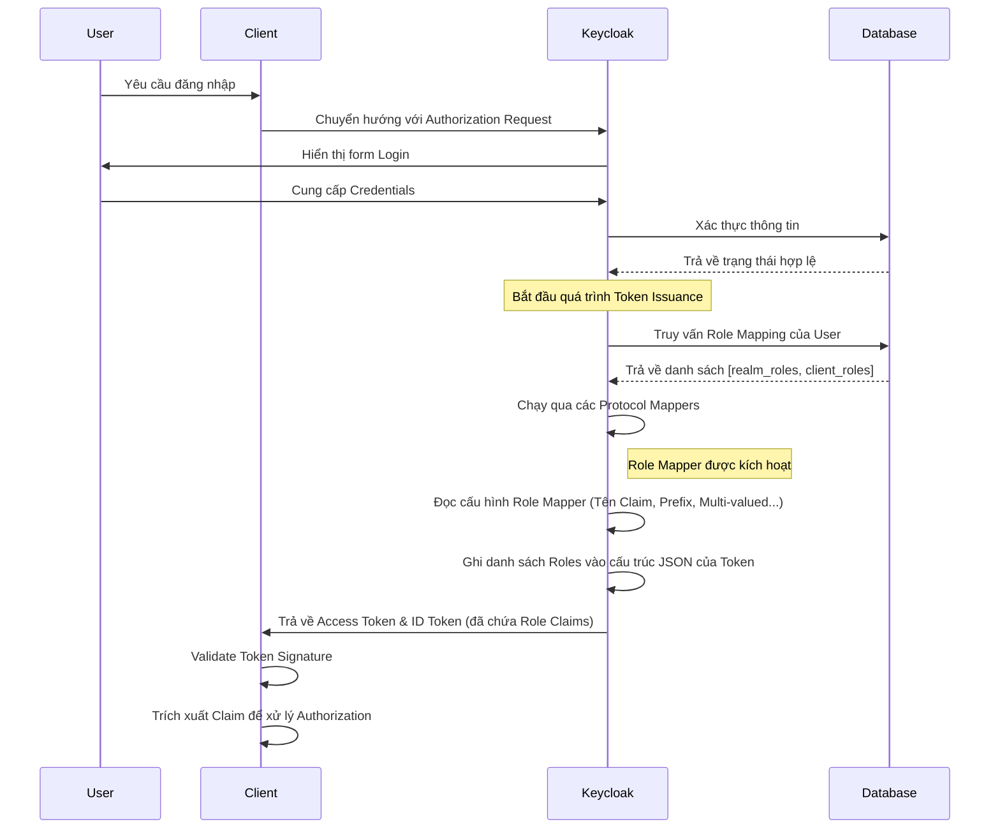

> [!NOTE]
> **Category:** Theory (Lý thuyết)
> **Goal:** Cung cấp kiến thức chuyên sâu về cơ chế hoạt động, cấu hình, và các best practices khi sử dụng Role Mapper để ánh xạ phân quyền của User vào Access Token, ID Token trong hệ thống Keycloak.

## 1. Lý thuyết chuyên sâu (Detailed Theory)

Trong cấu trúc Identity Access Management (IAM) nói chung và Keycloak nói riêng, **Role Mapper** là một trong những thành phần cốt lõi của **Protocol Mappers**. Nhiệm vụ chính của Role Mapper là chuyển đổi và nhúng các Role (Realm Role hoặc Client Role) mà người dùng (User) đang sở hữu vào bên trong các Claims của Token (như **JWT Access Token**, **ID Token** hoặc **SAML Assertion**).

**Tại sao tính năng này tồn tại?**
Trong một hệ thống phân tán (Distributed System) hoặc Microservices, ứng dụng (Client) nhận yêu cầu từ người dùng thông qua Token. Ứng dụng không nên và không cần thiết phải liên tục gọi lại Keycloak (thông qua API) để hỏi xem "Người dùng này có Role X không?". Điều này sẽ tạo ra độ trễ (latency) lớn và tạo nút thắt cổ chai (bottleneck) ở Keycloak. 
Do đó, Role Mapper giải quyết bài toán này bằng cách đóng gói sẵn các Roles cần thiết vào ngay trong Token lúc Token được cấp phát (Token Issuance). Client chỉ cần giải mã (decode) JWT và kiểm tra nội dung Claim là có thể ra quyết định phân quyền (Authorization) ở mức ứng dụng (Local Authorization).

## 2. Luồng nội bộ & Cơ chế cấp thấp (Internal Workflow & Low-level Mechanisms)

Quá trình ánh xạ Role diễn ra trong giai đoạn sinh Token (Token Generation) sau khi User đã xác thực (Authentication) thành công.



**Cơ chế cấp thấp:**
Khi Keycloak sinh Token, nó sẽ duyệt qua danh sách các Mappers được gắn cho Client hoặc Client Scope. Với **User Realm Role Mapper** hoặc **User Client Role Mapper**, mã nguồn Keycloak sẽ duyệt tập hợp Role Model của User (đã resolve cả Composite Roles nếu được cấu hình). Sau đó, nó tạo một Node (ví dụ `realm_access.roles`) trong cây JSON (Jackson) và thêm từng Role name vào một mảng (Array).

## 3. Thực hành tốt nhất & Bảo mật (Best Practices & Security)

> [!WARNING]
> **Token Bloat (Phình to Token):** Nếu một User có hàng trăm Roles, việc map toàn bộ vào Token sẽ làm kích thước HTTP Header tăng vọt, gây ra lỗi `431 Request Header Fields Too Large` ở các Load Balancer hoặc API Gateway.

> [!IMPORTANT]
> **Sử dụng Client Scopes:** Không nên map trực tiếp vào Client trừ khi bắt buộc. Hãy tạo các **Client Scopes** (ví dụ: `roles-custom-scope`), thêm Role Mapper vào đó và gán Scope này cho các Clients cần thiết. Điều này giúp tái sử dụng và quản lý tập trung.

- **Chỉ ánh xạ những Roles cần thiết:** Sử dụng Client Roles thay vì Realm Roles nếu Role đó chỉ có ý nghĩa với một Application cụ thể.
- **Tắt tính năng đưa vào ID Token:** Nếu Client không sử dụng Roles để quyết định giao diện mà backend mới là nơi kiểm tra, hãy chỉ bật `Add to access token` và tắt `Add to ID token` để giảm kích thước ID Token.

## 4. Cấu hình minh họa thực tế (Configuration Examples)

Cấu hình một **User Client Role Mapper** trong giao diện Keycloak Admin Console:
- **Name:** `my-app-roles-mapper`
- **Mapper Type:** `User Client Role`
- **Client ID:** `my-spring-boot-app`
- **Token Claim Name:** `resource_access.${client_id}.roles`
- **Claim JSON Type:** `String`
- **Multivalued:** `ON` (để trả về mảng các chuỗi, ví dụ `["admin", "user"]`)
- **Add to ID token:** `OFF`
- **Add to access token:** `ON`

Ví dụ Payload của JWT sau khi Map:
```json
{
  "exp": 1690000000,
  "iat": 1690000000,
  "sub": "b2f6...",
  "resource_access": {
    "my-spring-boot-app": {
      "roles": [
        "admin",
        "manager"
      ]
    }
  }
}
```

## 5. Trường hợp ngoại lệ (Edge Cases)

- **Composite Roles không hiển thị toàn bộ:** Khi User được gán một Composite Role (Role chứa các Role con khác), đôi khi các Role con không xuất hiện trong Token. **Khắc phục:** Đảm bảo tùy chọn `Realm Role prefix` hoặc quá trình Resolve trong Mapper không lọc mất các role con do không có quyền truy cập vòng lặp.
- **Tên Role trùng lặp:** Nếu gộp chung Client Role và Realm Role vào cùng một Token Claim (ví dụ claim `roles`), tên role có thể bị trùng (như `admin` của realm và `admin` của client). **Khắc phục:** Sử dụng Prefix (ví dụ: `realm_` cho Realm Roles) bằng cách điền vào ô `Role prefix` trong Mapper.

## 6. Câu hỏi Phỏng vấn (Interview Questions)

**Junior Level:**
1. Protocol Mapper là gì và Role Mapper làm nhiệm vụ gì trong Keycloak?
2. Làm thế nào để ngăn chặn một Role bị đưa vào ID Token nhưng vẫn có mặt trong Access Token?
3. Sự khác biệt giữa Realm Role và Client Role khi sử dụng Role Mapper là gì?

**Senior Level:**
4. **Tình huống:** Kích thước của Access Token vượt quá 8KB do người dùng có quá nhiều quyền (hơn 200 Roles), khiến API Gateway từ chối Request. Là một Architect, bạn sẽ giải quyết vấn đề Token Bloat này như thế nào mà không làm mất đi thông tin Authorization?
   *Đáp án gợi ý:* Chuyển từ việc nhúng Roles trực tiếp sang việc Client gọi lại `/userinfo` endpoint; hoặc nhóm quyền lại theo Audience/Client Scopes; hoặc thay vì gửi Role, hãy gửi Business Entitlement ID mỏng hơn; hoặc cấu hình phân trang ở cấp độ Application.
5. Giải thích quá trình Keycloak phân giải Composite Roles khi Role Mapper thực thi. Điều này có làm chậm quá trình Token Issuance nếu cây Composite Role quá sâu không?

## 7. Tài liệu tham khảo (References)
- [Keycloak Official Documentation - OIDC Token and Claims](https://www.keycloak.org/docs/latest/server_admin/#_oidc_token_and_claims)
- [RFC 7519 - JSON Web Token (JWT)](https://datatracker.ietf.org/doc/html/rfc7519)
