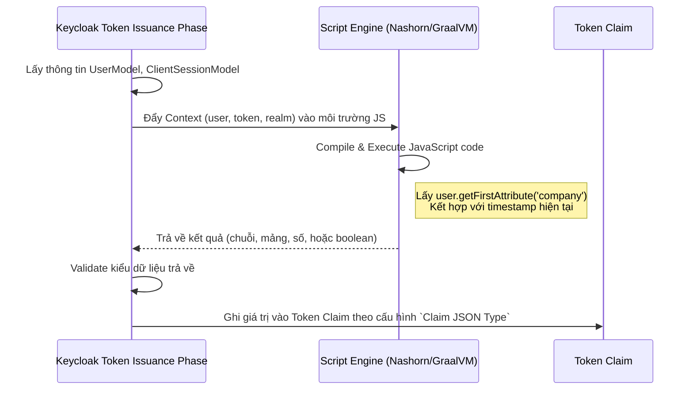

> [!NOTE]
> **Category:** Theory (Lý thuyết)
> **Goal:** Tìm hiểu cơ chế hoạt động, lợi ích, rủi ro bảo mật và cách cấu hình Script Mapper trong Keycloak để tùy biến động Token Claims.

## 1. Lý thuyết chuyên sâu (Detailed Theory)

Trong Keycloak, **Script Mapper** là một công cụ cực kỳ mạnh mẽ nằm trong hệ sinh thái Protocol Mappers. Trong khi các Mapper thông thường (như Role Mapper, User Attribute Mapper) chỉ có thể thực hiện ánh xạ tĩnh (đọc từ database và đưa vào Token), thì Script Mapper cho phép thực thi một đoạn mã **JavaScript** ngay trong thời gian chạy (runtime) khi Keycloak đang tạo Token (Token Issuance).

**Tại sao tính năng này tồn tại?**
Trong các hệ thống doanh nghiệp (Enterprise Systems) phức tạp, việc cấp quyền không chỉ dựa trên danh sách tĩnh các Roles hay Attributes. Giá trị của một Claim có thể cần được tính toán dựa trên logic động:
- Kết hợp nhiều User Attributes lại với nhau.
- Tính toán cấp độ rủi ro dựa trên IP, thiết bị đăng nhập, thời gian trong ngày.
- Định dạng lại dữ liệu cũ sang chuẩn mới để tương thích với các Legacy Clients.

Script Mapper giải quyết vấn đề này bằng cách cung cấp một môi trường thực thi kịch bản. Nó đọc dữ liệu từ `user`, `realm`, `clientSession` hiện tại, xử lý qua JavaScript, và trả về một giá trị để nhúng vào Token (JWT/SAML).

## 2. Luồng nội bộ & Cơ chế cấp thấp (Internal Workflow & Low-level Mechanisms)

Khi sử dụng Script Mapper, Keycloak phải khởi tạo một Scripting Engine để chạy JavaScript bên trong JVM (Java Virtual Machine).



**Cơ chế thực thi:**
- Trong các phiên bản cũ (trước JDK 15), Keycloak sử dụng **Nashorn Engine**.
- Trong các phiên bản Keycloak mới chạy trên JDK mới, Scripting Engine phụ thuộc vào cấu hình của JDK, có thể chuyển sang sử dụng **GraalVM JavaScript**.
- Việc thực thi mã được chạy dưới chế độ **Sandbox** để giới hạn việc gọi các API hệ thống (I/O, Network) thông qua Java Reflection, nhằm ngăn chặn các lỗ hổng bảo mật. Tuy nhiên, việc thực thi mã nguồn ngoài luôn là một quy trình nặng tốn chi phí CPU.

## 3. Thực hành tốt nhất & Bảo mật (Best Practices & Security)

> [!CAUTION]
> **Rủi ro Remote Code Execution (RCE):** Script Mapper là một Vector tấn công nguy hiểm. Nếu một quản trị viên (Admin) bị chiếm quyền, hacker có thể nhúng mã độc Java Reflection vào Script Mapper để chiếm quyền điều khiển Server. Keycloak mặc định đã vô hiệu hóa tính năng tải lên các kịch bản (Script Upload). Các kịch bản phải được triển khai dưới dạng JAR file vào thư mục `providers/`.

> [!WARNING]
> **Hiệu năng (Performance Penalty):** Gọi Script Engine cho *mỗi* quá trình cấp Token của *mỗi* người dùng sẽ gây chậm hệ thống và tiêu tốn CPU. Chỉ sử dụng Script Mapper khi hoàn toàn không thể dùng các Built-in Mappers.

- **Phiên bản mới của Keycloak:** Bắt đầu từ các bản Keycloak hiện đại, giao diện trực tiếp viết JS trên Web UI (Profile `PREVIEW`) đã bị loại bỏ hoặc vô hiệu hóa. Bạn phải đóng gói file `.js` vào một file `.jar` kèm theo `META-INF/keycloak-scripts.json` và copy vào thư mục `providers/`.
- **Tránh Logic phức tạp:** Không thực hiện HTTP Call, kết nối Database, hay xử lý dữ liệu lớn trong Script.

## 4. Cấu hình minh họa thực tế (Configuration Examples)

**Bước 1: Tạo file Javascript (`my-custom-claim.js`)**
Đoạn mã JS này tính toán một biến tùy chỉnh dựa trên User Attribute:
```javascript
/**
 * Biến toàn cục có sẵn:
 * user (UserModel)
 * realm (RealmModel)
 * token (Token/IDToken)
 * userSession (UserSessionModel)
 * keycloakSession (KeycloakSession)
 */

var userTitle = user.getFirstAttribute("job_title");
var department = user.getFirstAttribute("department");

if (userTitle !== null && department !== null) {
    // Trả về chuỗi kết hợp
    exports = department + "::" + userTitle;
} else {
    exports = "UNKNOWN";
}
```

**Bước 2: Triển khai (Deployment)**
Tạo tệp `META-INF/keycloak-scripts.json`:
```json
{
    "mappers": [
        {
            "name": "My Custom Title Mapper",
            "fileName": "my-custom-claim.js",
            "description": "Calculates combined department and title"
        }
    ]
}
```
Nén cả hai thành `my-scripts.jar` và thả vào thư mục `providers/` của Keycloak, sau đó build lại (`kc.sh build`).

**Bước 3: Cấu hình trên giao diện**
- Vào **Client Scopes** -> Chọn Scope mong muốn -> **Mappers** -> **Configure a new mapper**.
- Chọn **Script Mapper**. Tên của bạn sẽ hiện ra ở mục Script. Cấu hình Token Claim Name là `custom_user_profile`.

## 5. Trường hợp ngoại lệ (Edge Cases)

- **Biến bị Null/Undefined:** Hàm `user.getFirstAttribute("...")` có thể trả về null. Nếu script không check null, Keycloak sẽ ném `NullPointerException` trong quá trình sinh Token, khiến User đăng nhập thất bại với lỗi `500 Internal Server Error`. **Khắc phục:** Luôn kiểm tra null an toàn trong JS.
- **Vấn đề tương thích Java Engine:** Sau khi nâng cấp Keycloak và phiên bản Java, script có thể lỗi do cú pháp JS Nashorn cũ không chạy được trên GraalVM. **Khắc phục:** Viết ECMAScript chuẩn, tránh dùng các hàm Extension đặc biệt của Java cũ.

## 6. Câu hỏi Phỏng vấn (Interview Questions)

**Junior Level:**
1. Script Mapper trong Keycloak dùng ngôn ngữ lập trình gì để thực thi kịch bản?
2. So với Role Mapper hay User Attribute Mapper, tại sao Script Mapper có thể gây ảnh hưởng xấu tới hiệu năng hệ thống?
3. Các đối tượng (Objects) nào được truyền mặc định vào môi trường thực thi của Script Mapper?

**Senior Level:**
4. **Tình huống:** Giao diện thêm Script Mapper trực tiếp bằng cách dán code JS trên Keycloak Console không còn hiển thị ở phiên bản mới. Tại sao Keycloak loại bỏ tính năng này và cách thức thay thế an toàn hiện tại là gì?
   *Đáp án gợi ý:* Do nguy cơ bảo mật RCE nếu tài khoản Admin bị xâm nhập. Thay thế bằng cách đóng gói JS vào tệp JAR, triển khai qua thư mục `providers/`. Điều này đòi hỏi quyền truy cập File System thực sự của máy chủ (DevOps/Sysadmin) mới có thể triển khai.
5. Giải thích cách JVM sandbox quá trình thực thi Javascript và những hạn chế kỹ thuật khi cần gọi API bên ngoài (HTTP Call) từ trong Script Mapper.

## 7. Tài liệu tham khảo (References)
- [Keycloak Server Administration Guide - OIDC Protocol Mappers](https://www.keycloak.org/docs/latest/server_admin/#_oidc_token_and_claims)
- [Keycloak JavaScript Providers Documentation](https://www.keycloak.org/docs/latest/server_development/#_script_providers)
