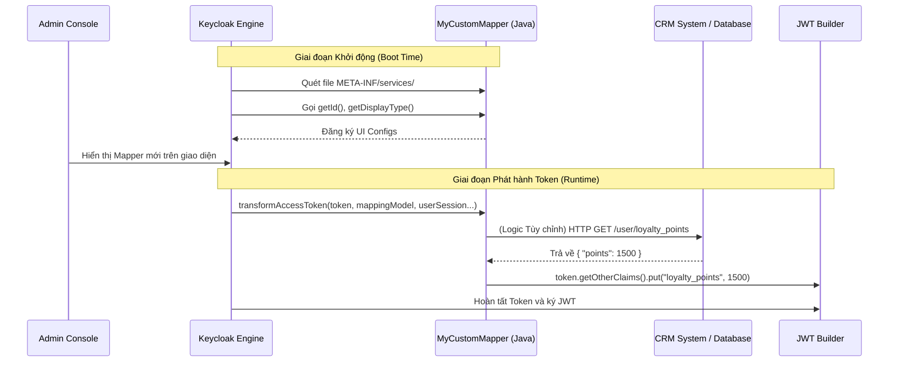

> [!NOTE]
> **Category:** Theory
> **Goal:** Nắm vững cấu trúc kiến trúc (Architecture) của Protocol Mapper SPI, cách phát triển, biên dịch và triển khai một Custom Mapper bằng Java để chèn các logic tính toán phức tạp vào Token.

## 1. Lý thuyết chuyên sâu (Detailed Theory)

Mặc dù Keycloak cung cấp nhiều Built-in Mappers (như ánh xạ User Attribute, Roles, Groups), có những trường hợp nghiệp vụ mà cấu hình có sẵn không thể đáp ứng. 
Ví dụ: 
- Bạn muốn gọi một API ngoại bộ (External REST API) để lấy điểm tích lũy của khách hàng và nhúng vào JWT.
- Bạn cần thực hiện các phép toán phức tạp (như mã hóa một đoạn dữ liệu, nối chuỗi nâng cao từ nhiều bảng) trước khi đưa vào Token.

Để làm được điều này, Keycloak cung cấp một cơ chế cực kỳ mạnh mẽ gọi là **Service Provider Interfaces (SPI)**. Cụ thể đối với Token, chúng ta sử dụng **Protocol Mapper SPI**. 

Bằng cách viết một đoạn mã Java kế thừa lớp `AbstractOIDCProtocolMapper`, đóng gói thành file `.jar` và đặt vào thư mục `/opt/keycloak/providers/`, bạn đã lập trình trực tiếp vào bộ não của Keycloak (Engine). Khi khởi động, Keycloak sẽ quét file JAR này và tự động đăng ký Custom Mapper của bạn vào giao diện Admin Console để người quản trị có thể sử dụng như các Mapper thông thường.

**Tại sao Custom Mapper quan trọng?**
- **Tính mở rộng vô hạn (Extensibility):** Hệ thống không bị trói buộc bởi những gì Keycloak cung cấp. Bất kỳ logic nghiệp vụ Java nào (kể cả kết nối Redis, gọi HTTP, đọc gRPC) đều có thể tích hợp.
- **Tập trung hóa bảo mật (Centralization):** Việc tính toán các claims nhạy cảm được thực hiện ở mức Identity Server (Keycloak), các Client không cần phải chứa logic nghiệp vụ để tính toán ra các quyền này.

## 2. Luồng nội bộ & Cơ chế cấp thấp (Internal Workflow & Low-level Mechanisms)

Quá trình hoạt động của một Custom Mapper trải qua hai vòng đời: Khởi tạo (Boot time) và Thực thi (Runtime).



**Giải thích chi tiết (Step-by-Step):**
1. **Đăng ký SPI (Boot time):** Keycloak sử dụng tiêu chuẩn `ServiceLoader` của Java. Bạn phải tạo một tệp trong dự án tại `META-INF/services/org.keycloak.protocol.ProtocolMapper`. Bên trong file này chứa đường dẫn đầy đủ đến lớp Java của bạn. Keycloak nạp lớp này lúc khởi động.
2. **Cấu hình giao diện (UI Config):** Phương thức `getConfigProperties()` của lớp Java sẽ trả về danh sách các trường cấu hình (Text box, Boolean switch) để vẽ lên Admin Console.
3. **Can thiệp Token (Runtime):** Khi người dùng đăng nhập, hàm `transformAccessToken` hoặc `transformIDToken` sẽ được gọi. Đối tượng `AccessToken` được truyền vào dạng tham chiếu (reference). Bạn thêm claim mới bằng cách chèn dữ liệu vào danh sách `OtherClaims`.

## 3. Thực hành tốt nhất & Bảo mật (Best Practices & Security)

- **Tuyệt đối chú ý Hiệu suất (Performance):** Hàm `transformAccessToken` được gọi **MỖI LẦN** một token được sinh ra (bao gồm cả khi Refresh Token). Nếu bạn gọi một External API chậm hoặc thực hiện query DB tốn kém trong hàm này, nó sẽ kéo sập toàn bộ hệ thống Keycloak, gây thắt cổ chai (Bottleneck) lớn.
  - *Giải pháp:* Sử dụng Cache (như Infinispan của Keycloak) để lưu lại kết quả từ hệ thống bên ngoài trong một thời gian ngắn.
- **Xử lý Ngoại lệ (Exception Handling):** Nếu Code của bạn có lỗi văng ra `NullPointerException` hoặc Lỗi mạng, Token sẽ không được tạo ra, khiến toàn bộ luồng đăng nhập thất bại. Phải bọc logic trong `try-catch` an toàn và ghi Log rõ ràng.
- **Quản lý Vòng đời phụ thuộc (Dependencies):** Custom Mapper file JAR cần được đóng gói dạng "Fat JAR" nếu bạn sử dụng các thư viện bên ngoài (như Apache HttpClient, Gson). Tuy nhiên, cẩn thận xung đột thư viện với các gói có sẵn của nền tảng Quarkus bên dưới Keycloak.

> [!WARNING]
> Mọi lệnh I/O đồng bộ (Synchronous IO) đặt trong Custom Mapper đều chặn (block) Thread xử lý đăng nhập hiện tại của Keycloak. Thiết kế hệ thống mạng kém có thể dẫn đến cạn kiệt Thread Pool.

> [!IMPORTANT]
> Từ Keycloak 17 (Quarkus), các file `.jar` phải được đặt ở thư mục `/opt/keycloak/providers/`. Sau khi copy file, bạn BẮT BUỘC phải chạy lệnh `/opt/keycloak/bin/kc.sh build` để Quarkus biên dịch lại lớp bytecode trước khi start.

## 4. Cấu hình minh họa thực tế (Configuration Examples)

Một bộ khung (skeleton) Java chuẩn cho một Custom OIDC Protocol Mapper:

```java
package com.company.keycloak.mapper;

import org.keycloak.models.ClientSessionContext;
import org.keycloak.models.KeycloakSession;
import org.keycloak.models.ProtocolMapperModel;
import org.keycloak.models.UserSessionModel;
import org.keycloak.protocol.oidc.mappers.AbstractOIDCProtocolMapper;
import org.keycloak.protocol.oidc.mappers.OIDCAccessTokenMapper;
import org.keycloak.protocol.oidc.mappers.OIDCAttributeMapperHelper;
import org.keycloak.provider.ProviderConfigProperty;
import org.keycloak.representations.IDToken;

import java.util.ArrayList;
import java.util.List;

public class MyCustomMapper extends AbstractOIDCProtocolMapper implements OIDCAccessTokenMapper {

    public static final String PROVIDER_ID = "my-custom-mapper";
    private static final List<ProviderConfigProperty> configProperties = new ArrayList<>();

    // Cấu hình các thuộc tính sẽ hiển thị trên giao diện Admin
    static {
        OIDCAttributeMapperHelper.addTokenClaimNameConfig(configProperties);
        OIDCAttributeMapperHelper.addIncludeInTokensConfig(configProperties, MyCustomMapper.class);
    }

    @Override
    public String getDisplayCategory() {
        return TOKEN_MAPPER_CATEGORY;
    }

    @Override
    public String getDisplayType() {
        return "Company Custom Mapper"; // Tên hiển thị trên dropdown
    }

    @Override
    public String getHelpText() {
        return "Adds custom calculated values to the token.";
    }

    @Override
    public List<ProviderConfigProperty> getConfigProperties() {
        return configProperties;
    }

    @Override
    public String getId() {
        return PROVIDER_ID;
    }

    // Logic xử lý chính tại Runtime
    @Override
    protected void setClaim(IDToken token, ProtocolMapperModel mappingModel, 
                            UserSessionModel userSession, KeycloakSession keycloakSession, 
                            ClientSessionContext clientSessionCtx) {
        
        // 1. Tính toán logic (vd: Nối tên công ty)
        String username = userSession.getUser().getUsername();
        String customValue = "COMPANY-" + username.toUpperCase();
        
        // 2. Chèn dữ liệu vào token
        OIDCAttributeMapperHelper.mapClaim(token, mappingModel, customValue);
    }
}
```
*Lưu ý:* Phải tạo file `src/main/resources/META-INF/services/org.keycloak.protocol.ProtocolMapper` chứa nội dung `com.company.keycloak.mapper.MyCustomMapper`.

## 5. Trường hợp ngoại lệ (Edge Cases)

- **Lỗi ClassNotFoundException khi Deploy:** Điều này xảy ra khi Custom Mapper của bạn sử dụng một thư viện ngoài (như Jackson mới nhất) nhưng lại quên đóng gói vào trong file JAR.
  - **Khắc phục:** Sử dụng Maven Shade Plugin để đóng gói tất cả các dependencies vào chung một tệp JAR (Fat JAR).
- **Mapper xuất hiện trên UI nhưng Token không có dữ liệu:** Người dùng thường quên kiểm tra xem `transformAccessToken` có thực sự được gọi không.
  - **Khắc phục:** Bật Log debug (`logger.info("Mapper invoked!")`). Kiểm tra xem thuộc tính cấu hình `Add to access token` trên Admin Console đã được gạt sang ON chưa.

## 6. Câu hỏi Phỏng vấn (Interview Questions)

1. **Junior:** SPI là viết tắt của gì và mục đích của Protocol Mapper SPI trong Keycloak?
   - *Đáp án:* SPI là Service Provider Interface. Mục đích là cho phép lập trình viên viết mã Java tùy chỉnh để thay đổi nội dung Token trước khi nó được mã hóa và gửi đi, giải quyết các bài toán mà cấu hình có sẵn không làm được.
2. **Junior:** Thư mục nào trên server Keycloak dùng để chứa các file Custom SPI (file JAR)?
   - *Đáp án:* Kể từ khi chuyển sang Quarkus, các file SPI được đưa vào thư mục `/opt/keycloak/providers/`.
3. **Senior:** Tại sao việc thực hiện HTTP call tới một API bên ngoài bên trong `transformAccessToken` của Mapper lại nguy hiểm?
   - *Đáp án:* Hàm này được gọi đồng bộ (synchronous) mỗi khi tạo token. Nếu API bên ngoài timeout hoặc chậm (2-3 giây), toàn bộ request đăng nhập của Keycloak sẽ bị treo. Nếu có 100 người đăng nhập cùng lúc, hệ thống sẽ cạn Thread và sập. Cần phải thiết lập Timeout siêu nhỏ (ví dụ 100ms) và dùng caching cơ chế bộ nhớ.
4. **Senior:** Để Keycloak (Quarkus) nhận diện được Provider mới, ngoài việc copy file JAR, ta cần thực hiện hành động nào?
   - *Đáp án:* Bắt buộc phải chạy lệnh build của Keycloak: `kc.sh build` (để Quarkus thực hiện quá trình Augmented/AOT compilation, quét classpath để tích hợp các classes mới vào hạt nhân ứng dụng). Sau đó mới chạy `kc.sh start`.
5. **Senior:** Hãy giải thích quy trình đăng ký một lớp Java trở thành một ProtocolMapper hợp lệ cho Keycloak bằng `ServiceLoader`.
   - *Đáp án:* Lớp Java phải kế thừa/implement `ProtocolMapper`. Sau đó, ta cần tạo một file text có tên đúng bằng cấu trúc package của Interface (`META-INF/services/org.keycloak.protocol.ProtocolMapper`). Nội dung file này là FQCN (Fully Qualified Class Name) của lớp triển khai. Tại lúc khởi động, JVM `ServiceLoader` sẽ quét file này và nạp các class vào bộ nhớ.

## 7. Tài liệu tham khảo (References)
- [Keycloak Server Developer Guide - Service Provider Interfaces (SPI)](https://www.keycloak.org/docs/latest/server_development/#_providers)
- [Java ServiceLoader Documentation](https://docs.oracle.com/javase/8/docs/api/java/util/ServiceLoader.html)
- [Custom Protocol Mapper Example (GitHub)](https://github.com/keycloak/keycloak-quickstarts/tree/latest/action-token-authenticator)
