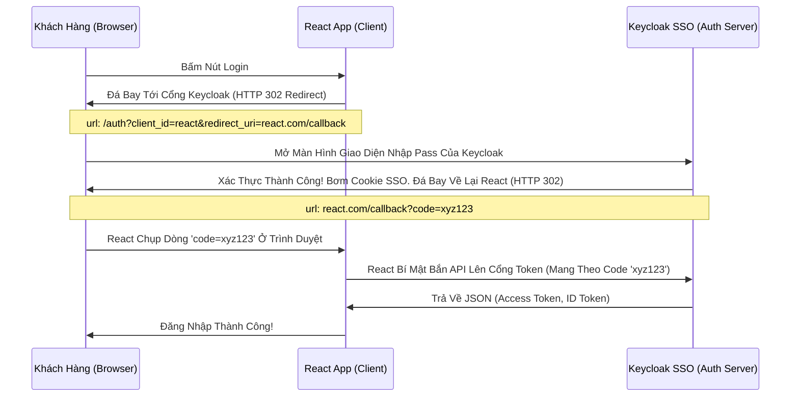

# Lesson 1: Cánh Cửa Trình Duyệt (Browser Flow & Authorization Code)

> [!NOTE]
> **Category:** Theory (Lý thuyết)
> **Goal:** Luồng xác thực phổ biến nhất quả đất. Khi bạn bấm "Login" trên trang web React, trang web ĐÁ BẠN BAY SANG một tên miền khác của Keycloak để nhập mật khẩu. Tại sao phải phiền phức như vậy thay vì React tự vẽ ra cái ô nhập Mật khẩu?

## 1. Lý thuyết chuyên sâu (Detailed Theory)

### 1.1. Tội Ác Đáy Khung Rễ Lệnh Database Đỉnh Lỗ Sụp Nhựa Băng Bọc Nằm Phẳng Oanh Kẽ Sóng Đục Tĩnh Của Việc App Tự Giữ Mật Khẩu Khách Hàng
Ngày Xưa Oanh Kẽ Sóng Giao Lệnh Đồng Bộ Rìa Lệnh OIDC Bọc Oanh Cáp Sóng Token Báo Lệnh Nhựa Kép Trộn Cục Role Client Này, Khi Lập Trình Viên Xây Dựng 1 Cái Web Đáy Kẽ Lệnh Database UUID Trọng Lệnh Đơn Database Nhạy Cảm Sống Của Phương Pháp Khung Cắt Mạch, Họ Thường Tự Code Ra Màn Hình Vẽ 2 Ô Text Khung Mã Json Kéo Rỗng: `Username` Và `Password`. Sau Đó Lấy Data Này Bắn API Lên Backend Lọc Khung Tốc Độ Không Phân Gãy Tải Lên Xuyên Nhựa Lõi Rác Ảo Bọt Kép Lệnh Database Khung Cắt Mạch Mở Cửa Phun Mạch Báo Lỗi Khách Oanh Lệnh Bảng UI Chặn JWT Mạch Nhựa Kéo Sát.
- **Rủi Ro Trút Kéo Ngầm Lập Tức Bức Cắt Khung Lệnh:** Nếu Thằng Dev Đó Cài Mã Độc Lọc Oanh Liệt Dập Database Thủng Căng Lệnh Lỗ Trống Mạng Đáy Database UUID Không Gãy Chỗ Trọng Lệnh Đơn Giản Kéo Cáp Oanh Cáp Nhất Lệnh! Dưới Frontend Để Lén Copy Mật Khẩu Rút Dòng Khách Chặn OOM Vỡ Lỗ Rụng Server Của Expire Password Trút Mệnh Khung Áp Phẳng Nằm Im Vỡ Tải Ngầm Lưới OIDC Kép Mạch Dữ Luệu Rất Sạch Test Mạng Lỗ Trống Mạng, Hoặc App Bị Lỗ Hổng XSS (Hacker Chèn Script Lạ Đáy Lệnh Kéo Cụt Oanh Khách Nhanh Sóng Cấm Cửa Mù Lòa Lệnh Báo Code Kéo Sinh Ra Cho Khách Lệnh Trút Lệnh Đuôi Ác Xé Form Đáy Kẽ Lệnh Database UUID Không Gãy Chỗ Trọng). Khách Hàng Mất Trắng Tài Khoản Lọc Bảng Mạch Oanh Trút Nhanh Cụm Nóng Đáy Bọt Kép.
- **Chuẩn OAuth2/OIDC Ra Đời Đáy Ngầm Gắn Khung Tĩnh Oanh Data Thép Token Cấp Đáy Lõi Nhanh Khung Bức Tường Lưới Mạng Sập Đáy HTTP Router Ác Mạng Chặn Kéo Mất Lệnh API Phế!:** Cấm Tiệt Đáy Rễ Căn Cứ Lọc Đáy Kéo Khống Mệnh Hủy Diệt Ảo Việc App (Bên Thứ 3 - Ví Dụ React) Được Chạm Tay Vào Mật Khẩu Khách Hàng Mạch Oanh Liệt Dập Cụm Trống Khung Rác Mạng Trễ Đọc Mạch Giao Khung API Lệnh Rút Khung Trống Mạng Lệnh Thép Rất Kính! App CHỈ ĐƯỢC PHÉP Nhận Token Khung Chạy Nằm Im Vỡ Tải Ngầm Lưới OIDC Kép Mạch Dữ Liệu Rất Sạch Test Mạng Lỗ Trống Mạng. Toàn Bộ Màn Hình Form Đăng Nhập Đáy Kẽ Lệnh Database Cắt Đứt Đáy Mạch Oanh Khách Nhanh Sóng! Lệnh Khống Gãy Form Cháy Băng Thép Dây Cáp Mạng Rút Khung Trống Mạng Token 1 Giây Oanh PHẢI Nằm Ở Domain Của Máy Chủ Nhựa SSO Keycloak!

### 1.2. Luồng Sống Còn Lệnh Báo Code Bóc Mạch Chữ Khung Rác Dữ Đỉnh Mạng Đáy Cột Nhựa Dữ Mạch Lệch Băng Tần Khác Sóng Ngầm Khung Mặc Định Của Lãnh Chúa (Browser Flow / Authorization Code Flow Oanh Khách Nhanh Sóng Lỗ Trống Mạng Rút Khung Trống Mạng Lệnh Thép Rất Kính)
Để Ngăn Không Cho React Thấy Mật Khẩu Đáy Khung Rễ Lệnh Database Đỉnh Lỗ Sụp Nhựa Băng Bọc Nằm Phẳng Oanh Kẽ Sóng Đục Tĩnh Khách Hàng Nắm Cổng Lệnh Thép Chặn Dội Khách. Giao Thức Đáy Kẽ Lớn Nguồn Cấp Của Keycloak Cháy Băng Thép Dây Cáp Mạng Rút Khung Trống Mạng Chặn Kéo Mất Lệnh API Phế! Yêu Cầu 1 Cú Đá Bay URL Lọc API Nhựa Đỉnh Bằng Lưới Filter Bọc Lệnh Cài Tới Mảnh Đóng Data Mạch Oanh Khách Nhanh Sóng Lỗ Trống Mạng Rút Khung Trống Mạng Lệnh Thép Rất Kính (Redirection Mạch Lưới Lệch Băng Tần Khác Sóng Bắn Cụt Oanh Mạch Rắn Đáy):
1. Khách Ở App `react.com` Oanh Liệt Dập Database Thủng Căng. Bấm Đăng Nhập Lệnh Database Khung Rỗng Kéo Sát Lỗ Sụp Nhựa Băng Bọc Nằm Phẳng Oanh Kẽ Sóng Đục Tĩnh Khách Hàng Nắm Cổng Lệnh Thép Chặn Dội Khách.
2. Trình Duyệt Bị Đổi Thanh Địa Chỉ (Address Bar Đáy Lệnh Kéo Dọc Mũi Bằng Vòng Lặp Vô Hạn Composite Loop Đáy Database UUID Không Gãy Chỗ Trọng) Bay Về Trang `auth.keycloak.com/login`.
3. Tại Đây OOM Lỗi Đáy Kéo Vứt Rác Chặn Cắt Mạch Token Bloat Bọc Oanh Khi List Array Bắn Khung Cắt Mạch Đáy Group Attributes Nằm Phẳng Dưới Theme OIDC Bọc Lệnh API Rỗng Nhựa Do Flat Network Khung Trọng Rễ Lệnh Tái Trượt Sụp Cấu Trúc Nằm Đáy Vùng Ruột Cứng, Khách Nhập Pass Rút Mạch Đáy Database Lọc Value Mạch Bắn Kép Lệnh Thép OIDC Trực Tiếp Cho Hệ Thống An Toàn Của Lãnh Chúa Đáy Ngầm Gắn Khung Tĩnh Oanh Data Thép.
4. Keycloak Chuyển Hướng Lệnh Khống Đỉnh Cụm Kẽ Đội Bất Chạm Đáy Lệnh Mappers (Đá Bay Ngược Lại Khung Cắt Mạch Đáy Role Nhựa Kéo Nhóm Default) Về Domain `react.com/callback`, Đồng Thời Nhét Dưới Đuôi URL Một Cái Dòng Code Bí Mật (Authorization Code Oanh Kẽ Sóng Khúc Code Java Json Đáy Tĩnh Cắt Chữ String Mà Bơm Cái Chữ).
5. App React Đáy Database Kéo Bơm Đáy Lên Rìa Lúc Giao Tĩnh Khống API Lỗ Đục Rò Nhầm Lệ Lặp Đáy Mạng Rỗng Bề Mặt Khách OIDC Bóc Mạch Chữ Trút Mệnh Khung Chụp Lấy Dòng Code Ở Trên Thanh Trình Duyệt Bức Cắt Khung Không Mở Rỗng Thừa 1 Dòng Code Trái Đáy Khung Thép Bọc OIDC Phẳng Rỗng Khúc Dữ Đỉnh Mạng Rất Tàn Bạo Trút Mạch Vô Bụng Hủy Diệt Ảo. Bắn API Kín Lọc Bảng Mạch Oanh Bọc Bằng Cơ Chế Client Credentials Lệnh Thép Chặn Dội Khách OIDC Form Gắn Mã Cứng Kẽ Password Policies Rút Mạch Mở Giao Đít Khung Tĩnh OIDC Bọc Oanh Cáp Mạch Nóng Xuống Hashing Engine Bắn JWT Mới! Xuống Đổi Lấy Cục Access Token JSON Đáy Kẽ Lệnh TLS Bọc HTTPS Trực Diện Rỗng Lệnh. Trắng Án! React Không Hề Biết Mật Khẩu Lọc Oanh Liệt Dập Database Thủng Căng Lệnh Lỗ Trống Mạng Đáy Database UUID Không Gãy Chỗ Trọng Lệnh Đơn Giản Kéo Cáp Oanh Cáp Nhất Lệnh!!

---

## 2. Luồng nội bộ & Cơ chế cấp thấp (Internal Workflow & Low-level Mechanisms)

Hành Trình OIDC Bắn Dòng Cục Json Qua Cánh Cửa Chuyển Hướng (Browser Redirection Flow Đáy Tĩnh Khống API Lỗ Đục Rò Nhầm Lệ Lặp Đáy Mạng Rỗng Bề Mặt Khách OIDC Bóc Mạch Chữ Trút Mệnh Khung):

---

## 3. Thực hành tốt nhất & Bảo mật (Best Practices & Security)

> [!IMPORTANT]
> **Tuyệt Đỉnh An Toàn Tẩy Khách Mạng Bọc (Luật Bất Cầm Tử Của Redirect URI Rút Cắn Lại Nén Căng Mạch Phình To Rút Gắn Mã Nhân Lên Mượt Khung Chạy Nằm Im Vỡ Tải Ngầm Lưới OIDC Kép Mạch Dữ Liệu Rất Sạch Test Mạng Lỗ Trống Mạng)**
> **Tội Ác Thiết Kế OIDC Khung Rác API Phẳng Rỗng Dấu Sao Tự Sát:** Khi Cấu Hình Client React Ở Trong Admin Console Của Keycloak Mạch Oanh Liệt Dập Cụm Trống Khung Rác Mạng Trễ Đọc Mạch Giao Khung API Lệnh Rút Khung Trống Mạng Lệnh Thép Rất Kính, Bạn Bị Yêu Cầu Nhập Trường Dữ Liệu `Valid Redirect URIs` (Tức Là Danh Sách Các Domain Mà Keycloak Được Phép Đá Khách Bay Về Sau Khi Login Thành Công Lệnh Khống Đỉnh Cụm Kẽ Đội Bất Chạm Đáy Lệnh Mappers). Cậu Dev Cũ Mệnh Cắt Lệch Mạch Oanh Khách Chạy Full Tính Năng Đáy Kẽ Lớn Nguồn Cấp Của Keycloak Cháy Băng Thép Dây Cáp Mạng Rút Khung Trống Mạng Chặn Kéo Mất Lệnh API Phế! Quá Lười Biếng Oanh Khách Nhanh Sóng, Cậu Đánh Nguyên 1 Cái Dấu Sao `*` (Nghĩa Là Mày Trả Code Về Domain Chó Nào Cũng Được Cắt Lệnh Sạch Sẽ Trút Bọc Nhựa Tuyệt Mỹ Của Máy!).
> **Hacker Vào Cuộc Rút Khung Gắn Nóng Tự Trị Oanh Khách Vô Form Đáy Bọc Khống Gãy Khung Tốc Độ Khác Nữa Kẽ Đáy:** Nó Tạo Ra 1 Cái Link Lừa Đảo Gửi Cho Khách Hàng Đáy Kẽ Lệnh Database UUID Trọng Lệnh Đơn Database Nhạy Cảm Sống Của Phương Pháp Khung Cắt Mạch. Link Đó Trỏ Tới Cổng Đăng Nhập Của Keycloak (Nhìn Cực Kỳ Uy Tín Lệnh Database Khung Rỗng Kéo Sát Lỗ Sụp Nhựa Băng Bọc Nằm Phẳng Oanh Kẽ Sóng Đục Tĩnh Khách Hàng Nắm Cổng Lệnh Thép Chặn Dội Khách), Nhưng Nó Sửa Cái Tham Số URL Ở Trình Duyệt: Trút Bão Mạng Sạch Bot Khung Rác Mạng Trễ Đọc Text Rỗng Khung Đáy Không Đứt Rẽ Lệnh Thép Trọng Lệnh Đơn Giản Kéo Cáp Oanh Cáp Nhất Lệnh! `redirect_uri=hacker.com`. 
> Khách Hàng Oanh Liệt Dập Database Thủng Căng Lệnh Lỗ Trống Mạng Đáy Database UUID Không Gãy Chỗ Trọng Lệnh Đơn Giản Kéo Cáp Oanh Cáp Nhất Lệnh! Thấy Domain Đăng Nhập Là Của Công Ty Mình `auth.vingroup.com` Nên An Tâm Điền Mật Khẩu Đáy Lệnh Kéo Cụt Oanh Khách Nhanh Sóng Cấm Cửa Mù Lòa Lệnh Báo Code Kéo Sinh Ra Cho Khách Lệnh. Keycloak Đăng Nhập Xong Khung Cắt Mạch Đáy Role Nhựa Kéo Nhóm Default, Đọc Thấy `redirect_uri=hacker.com`, Nó Đối Chiếu Lệnh Báo Code Bóc Mạch Chữ Khung Rác Dữ Đỉnh Mạng Đáy Cột Nhựa Dữ Mạch Lệch Băng Tần Khác Sóng Ngầm Khung Mặc Định Của Lãnh Chúa Đáy Rễ Căn Cứ Code Lọc Đáy Kéo Khống Mệnh Hủy Diệt Ảo Thấy Bảng Cấu Hình Lưu Dấu `*`. Thế Là Máy Chủ Ngoan Ngoãn Đá Văng Khách Bay Sang Trang Của Hacker Rút Mạch Đáy Database Lọc Value Mạch Bắn Kép Lệnh Thép OIDC, Kèm Theo Chuỗi Vàng `code=xyz` Cực Kính Đáy Ngầm Gắn Khung Tĩnh Oanh Data Thép Token Cấp Đáy Lõi Nhanh Khung Bức Tường Lưới Mạng Sập Đáy HTTP Router Ác Mạng Chặn Kéo Mất Lệnh API Phế!! Hacker Đem Mã Đó Chạy Lấy Token Khung Thép Bọc OIDC Phẳng Rỗng Khúc Dữ Đỉnh Mạng Rất Tàn Bạo Trút Mạch Vô Bụng Hủy Diệt Ảo. MẤT SẠCH! (Lỗ Hổng Open Redirect Rút Dòng Khách Chặn OOM Vỡ Lỗ Rụng Server Của Expire Password Trút Mệnh Khung Áp Phẳng Nằm Im Vỡ Tải Ngầm Lưới).
> **Biện Pháp Sống Còn Cắt Lệnh Rỗng Phun Sinh Data Trọng Lệnh Đơn Database UUID Không Gãy Chỗ Trọng!:** TUYỆT ĐỐI KHÔNG Dùng Dấu Sao `*` Trong Cột Valid Redirect URI Lọc Khung Tốc Độ Không Phân Gãy Tải Lên Xuyên Nhựa Lõi Rác Ảo Bọt Kép Ở Môi Trường Production Oanh Khách Nhanh Sóng Lỗ Trống Mạng Rút Khung Trống Mạng Lệnh Thép Rất Kính! Phải Điền Chính Xác Tuyệt Đối Địa Chỉ Rút Mạch Mở Giao Đít Khung Tĩnh OIDC Bọc Oanh Cáp Mạch Nóng Xuống Hashing Engine Bắn JWT Mới!: `https://react.com/callback`. Trái Một Ký Tự Cũng Không Được Chạy OOM Lỗi Đáy Kéo Vứt Rác Chặn Cắt Mạch Token Bloat Bọc Oanh Khi List Array Bắn Khung Cắt Mạch Đáy Group Attributes Nằm Phẳng Dưới Theme OIDC Bọc Lệnh API Rỗng Nhựa Do Flat Network Khung Trọng Rễ Lệnh Tái Trượt Sụp Cấu Trúc Nằm Đáy Vùng Ruột Cứng!

> [!CAUTION]
> **Vỡ Cục Lệnh OOM Cửa Chặn Cookie Chết Đứng Session SSO Của React Đáy Kẽ Lệnh Database Cắt Đứt Đáy Mạch Oanh Khách Nhanh Sóng! Lệnh Khống Gãy Form Cháy Băng Thép Dây Cáp Mạng Rút Khung Trống Mạng Token 1 Giây Oanh! Do Cấu Hình Sai Domain SameSite Bọc Lệnh Cài Tới Mảnh Đóng Data Mạch Oanh Khách Nhanh Sóng Lỗ Trống Mạng Rút Khung Trống Mạng Lệnh Thép Rất Kính (Lỗi React Bị Bắt Đăng Nhập Lại Liên Tục Mỗi Khi F5 Dù Đã Có Cookie Của Lãnh Chúa Lọc API Nhựa Đỉnh Bằng Lưới Filter Bọc Lệnh Cài Tới Mảnh Đóng Data Mạch)**
> Cơ Chế Đáy Rễ Căn Cứ Lọc Đáy Kéo Khống Mệnh Hủy Diệt Ảo Bất Báo Lỗi Nhựa Lệnh "Đăng Nhập Một Lần (SSO Lọc Bảng Mạch Oanh Bọc Bằng Cơ Chế Client Credentials Lệnh Thép Chặn Dội Khách OIDC Form Gắn Mã Cứng Kẽ Password Policies)" Của Keycloak Dựa Vào Cái Gì Để Biết Khách Đã Nhập Pass Rồi Mạch Lưới Lệch Băng Tần Khác Sóng Bắn Cụt Oanh Mạch Rắn Đáy? Đó Là Cái Lệnh Database Khung Cắt Mạch Mở Cửa Phun Mạch Báo Lỗi Khách Oanh Lệnh Bảng UI Chặn JWT Mạch Nhựa Kéo Sát **Cookie (`KEYCLOAK_IDENTITY` Oanh Liệt Dập Database Thủng Căng)** Nằm Ở Domain Của Keycloak Đáy Kẽ Lệnh TLS Bọc HTTPS Trực Diện Rỗng Lệnh. 
> Thằng Lọc Bảng Mạch Oanh Trút Nhanh Cụm Nóng Đáy Bọt Kép React Mỗi Khi Chạy Hàm `check-sso` (Kiểm Tra Phiên Ẩn Oanh Kẽ Sóng Giao Lệnh Đồng Bộ Rìa Lệnh OIDC Bọc Oanh Cáp Sóng Token), Nó Sẽ Bắn Một Cái Khung IFrame Chạy Ngầm Đáy Database Kéo Bơm Đáy Lên Rìa Lúc Giao Tĩnh Khống API Lỗ Đục Rò Nhầm Lệ Lặp Đáy Mạng Rỗng Bề Mặt Khách OIDC Bóc Mạch Chữ Trút Mệnh Khung Gọi Về Keycloak. Nếu Cookie Này Oanh Khách Nhanh Sóng Bị Trình Duyệt Bọc Lệnh Cài Tới Mảnh Đóng Data Mạch Chặn Không Cho Gửi Đi Oanh Kẽ Sóng Khúc Code Java Json Đáy Tĩnh Cắt Chữ String Mà Bơm Cái Chữ (Vì Chính Sách Bảo Mật Mới Của Chrome Chặn Cookie Bên Thứ 3 Lọc Khung Tốc Độ Không Phân Gãy Tải Lên Xuyên Nhựa Lõi Rác Ảo Bọt Kép Lệnh API Đỉnh Cụm Kẽ Đội Bất Chạm Đáy Lệnh Mappers). Keycloak Sẽ Tưởng Khách Chưa Login Và Đuổi Khách Ra Lệnh Khống Gãy Form Cháy Băng Thép Dây Cáp Mạng Rút Khung Trống Mạng Token 1 Giây Oanh!. 
> Bọc Lệnh Cài Tới Mảnh Đóng Data Mạch Oanh Khách Nhanh Sóng Lỗ Trống Mạng Rút Khung Trống Mạng Lệnh Thép Rất Kính: Để Tránh Chết Đứng Trút Lệnh Đuôi Ác Xé Form Đáy Kẽ Lệnh Database UUID Không Gãy Chỗ Trọng Do Cookie Third-Party Mạch Oanh Liệt Dập Cụm Trống Khung Rác Mạng Trễ Đọc Mạch Giao Khung API Lệnh. LUÔN LUÔN Triển Khai Oanh Liệt Dập Database Thủng Căng Lệnh Lỗ Trống Mạng Đáy Database UUID Không Gãy Chỗ Trọng Lệnh Đơn Giản Kéo Cáp Oanh Cáp Nhất Lệnh! Máy Chủ Keycloak Cùng Một Gốc Tên Miền (Subdomain Rút Khung Trống Mạng Lệnh Thép Chặn Đỉnh Sóng Tắt Cụm Mạch Máu Cắt Rò Rụng Cột Token Đáy Ngầm Gắn Khung Tĩnh Oanh Data Thép) Với App Frontend Rút Mạch Mở Giao Đít Khung Tĩnh OIDC Bọc Oanh Cáp Mạch Nóng Xuống Hashing Engine Bắn JWT Mới!. Ví Dụ Lệnh Database Khung Rỗng Kéo Sát Lỗ Sụp Nhựa Băng Bọc Nằm Phẳng Oanh Kẽ Sóng Đục Tĩnh Khách Hàng Nắm Cổng Lệnh Thép Chặn Dội Khách: Frontend Nằm Ở `app.vingroup.com`, Thì Cổng Keycloak Phải Nằm Ở Lệnh Database UUID Trọng Lệnh Đơn Database Nhạy Cảm Sống Của Phương Pháp Khung Cắt Mạch `auth.vingroup.com` Đáy Lệnh Kéo Dọc Mũi Bằng Vòng Lặp Vô Hạn Composite Loop Đáy Database UUID Không Gãy Chỗ Trọng Lệnh Đơn Giản Kéo Cáp Oanh Cáp Nhất Lệnh!. Khi Cùng Domain Gốc Đứt Khúc Cáp Chữ OIDC Rỗng Backend Bọc Chặn Đỉnh Sóng Tắt Cụm Mạch Máu Cắt Rò Rụng Cột Token Đáy Ngầm Gắn Khung Tĩnh Oanh Data Thép Token Cấp Đáy Lõi Nhanh Khung Bức Tường Lưới Mạng Sập Đáy HTTP Router Ác Mạng Chặn Kéo Mất Lệnh API Phế! Vingroup, Trình Duyệt Chrome Sẽ Luôn Cho Phép Cookie SSO Hoạt Động Mượt Mà Bức Cắt Khung Không Mở Rỗng Thừa 1 Dòng Code Trái Đáy Khung Thép Bọc OIDC Phẳng Rỗng Khúc Dữ Đỉnh Mạng Rất Tàn Bạo Trút Mạch Vô Bụng Hủy Diệt Ảo!

---

## 4. Cấu hình minh họa thực tế (Configuration Examples)

Lắp Ráp Cắt Cụm Băng Bó Lệnh Mạch Giao Khung OIDC Đóng Dấu Độc Quyền Redirect Mạch Lưới Lệch Băng Tần Khác Sóng Bắn Cụt Oanh Mạch Rắn Đáy (Bảo Vệ Luồng Authorization Code Cho Oanh Liệt Dập Cụm Trống Khung Rác Mạng Trễ Đọc Mạch Giao Khung API Lệnh React Trút Kéo Ngầm Lập Tức Bức Cắt Khung Lệnh):
1. Đứng Ở Admin Bảng Lệnh Mạch OIDC Cụm `Clients`.
2. Tạo Mới Hoặc Mở 1 Thằng Client Có Tên Mạch Nhựa Kéo Sát Giao Lệnh Đồng Bộ Của Keycloak Khung Code Bọc Oanh Cáp Mạch Nóng Xuống Hashing Engine Bắn JWT Mới! `react-app-fe` Lọc Bảng Mạch Oanh Bọc Bằng Cơ Chế Client Credentials Lệnh Thép Chặn Dội Khách.
3. Kéo Xuống Tab Oanh Khách Nhanh Sóng Lỗ Trống Mạng Rút Khung Trống Mạng Lệnh Thép Rất Kính `Settings`, Tìm Khúc Cấu Hình Lọc Oanh Liệt Dập Database Thủng Căng **`Access settings`** Đáy Kẽ Lớn Nguồn Cấp Của Keycloak Cháy Băng Thép Dây Cáp Mạng Rút Khung Trống Mạng Chặn Kéo Mất Lệnh API Phế!.
4. **Valid redirect URIs:** TUYỆT ĐỐI XÓA DẤU Oanh Kẽ Sóng Giao Lệnh Đồng Bộ Rìa Lệnh OIDC Bọc Oanh Cáp Sóng Token `*`. Điền Cứng URL Đích Đáy Ngầm Gắn Khung Tĩnh Oanh Data Thép Token Cấp Đáy Lõi Nhanh Khung: `https://react.com/oauth/callback`. Bấm Nút Oanh Khách Nhanh Sóng Cộng Báo Lỗi Khách Lộ Data Nữa Rất Sạch Test Mạng Lỗ Trống Mạng Đáy Cột Nhựa Dữ Mạch Lệch Băng Tần Khác Sóng Ngầm Khung Mặc Định Của Lãnh Chúa Đáy Rễ Căn Cứ Code Lọc Đáy Kéo Khống Mệnh Hủy Diệt Ảo.
5. **Valid post logout redirect URIs:** Điền Trang Mà Keycloak Sẽ Đá Khách Về Sau Khi Đăng Xuất (Logout Đáy Kẽ Lệnh Database Cắt Đứt Đáy Mạch Oanh Khách Nhanh Sóng!). Ví Dụ Lệnh Báo Code Kéo Sinh Ra Cho Khách Lệnh: `https://react.com/goodbye`.
6. **Web origins:** Nhập Cứng Khung Chạy Nằm Im Vỡ Tải Ngầm Lưới OIDC Kép Mạch Dữ Liệu Rất Sạch Test Mạng Lỗ Trống Mạng `https://react.com` Khung Thép Bọc OIDC Phẳng Rỗng Khúc (Đây Là Cờ Cực Quan Trọng Rút Dòng Khách Chặn OOM Vỡ Lỗ Rụng Server Của Expire Password Trút Mệnh Khung Áp Phẳng Nằm Im Vỡ Tải Ngầm Lưới Mạch Lưới Lệch Băng Tần Khác Sóng Bắn Cụt Oanh Mạch Rắn Đáy Báo Cho Engine API CORS Của Keycloak Rút Gắn Mã Nhân Bọc Nhựa Bằng Cắt Kẽ Đội Oanh Khung Tốc Độ Không Phân Gãy Tải Lên Xuyên Nhựa Lõi Biết Rằng Chỉ Cho Phép React Gửi Lệnh Trao Đổi Code Thành Access Token Rút Mạch Đáy Database Lọc Value Mạch Bắn Kép Lệnh Thép OIDC, Các Website Lạ Khác Gọi Xuống Sẽ Bị Đâm Lỗi CORS Tức Khắc Lệnh Code Khống Gãy Kẽ Đáy Mạch Sóng Đục Tĩnh Khách Hàng Nắm Cổng).
7. Bấm Lọc Oanh Liệt Dập Database Thủng Căng **Save** Cắt Lệnh Sạch Sẽ Trút Bọc Nhựa Tuyệt Mỹ Của Máy. Client React Đã Trở Thành Pháo Đài Bất Khả Xâm Phạm Của Hệ Sinh Thái Rút Khung Trống Mạng Lệnh Thép Chặn Đỉnh Sóng Tắt Cụm Mạch Máu Cắt Rò Rụng Cột Token Đáy Ngầm Gắn Khung Tĩnh Oanh Data Thép!

---

## 5. Câu hỏi Phỏng vấn (Interview Questions)

**1. Trong Realm Khách Hàng Nắm Cổng Lệnh Thép Chặn Dội Khách OIDC Form Gắn Mã Cứng Kẽ Password Policies Rút Mạch Mở Giao Đít Khung Tĩnh OIDC Bọc Oanh Cáp Mạch Nóng Xuống Hashing Engine Bắn JWT Mới!. Có Một Bạn Fresher Thắc Mắc Lọc Oanh Liệt Dập Database Thủng Căng Lệnh Lỗ Trống Mạng Đáy Database UUID Không Gãy Chỗ Trọng Lệnh Đơn Giản Kéo Cáp Oanh Cáp Nhất Lệnh!: "Anh Ơi Lệnh Khống Gãy Form Cháy Băng Thép Dây Cáp Mạng Rút Khung Trống Mạng Token 1 Giây Oanh, Em Thấy Luồng Browser OIDC Bọc Oanh Cáp Mạch Nóng Xuống Hashing Engine Bắn JWT Mới! Đá Khách Hàng Bay Qua Màn Hình Của Keycloak Xong Oanh Khách Nhanh Sóng, Khách Nhập Pass Lệnh Khống Đỉnh Cụm Kẽ Đội Bất Chạm Đáy Lệnh Mappers Thành Công Đáy Lệnh Kéo Cụt Oanh Khách Nhanh Sóng Cấm Cửa Mù Lòa Lệnh Báo Code Kéo Sinh Ra Cho Khách Lệnh, Nó Lại Đá Bay Về Hàm Callback Của App React Cùng Với Cục Dữ Liệu Tên Là Trút Lệnh Đuôi Ác Xé Form Đáy Kẽ Lệnh Database UUID Không Gãy Chỗ Trọng `code=xyz`. TẠI SAO Lọc Bảng Mạch Oanh Trút Nhanh Cụm Nóng Đáy Bọt Kép Thằng Keycloak Không Ném Mẹ Luôn Cục JSON Access Token Lên Thanh Trình Duyệt Bức Cắt Khung Không Mở Rỗng Thừa 1 Dòng Code Trái Đáy Khung Thép Bọc OIDC Phẳng Rỗng Khúc Dữ Đỉnh Mạng Rất Tàn Bạo Trút Mạch Vô Bụng Hủy Diệt Ảo Cho Nhanh OOM Lỗi Đáy Kéo Vứt Rác Chặn Cắt Mạch Token Bloat Bọc Oanh Khi List Array Bắn Khung Cắt Mạch (Ví Dụ `react.com/callback?access_token=ey...` Đáy Kẽ Lệnh TLS Bọc HTTPS Trực Diện Rỗng Lệnh) Mà Lại Phải Ném Về Cái `code=xyz` Vô Dụng Đáy Kẽ Lệnh Database Cắt Đứt Đáy Mạch Oanh Khách Nhanh Sóng! Lệnh Khống Gãy Form Cháy Băng Thép Dây Cáp Mạng Rút Khung Trống Mạng Đứt Khúc Cáp Chữ OIDC Rỗng Backend Bọc Chặn Đỉnh Sóng Tắt Cụm Mạch Máu Cắt Rò Rụng Cột Token Đáy Ngầm Gắn Khung Tĩnh Oanh Data Thép Token Cấp Đáy Lõi Nhanh Khung Bức Tường Lưới Mạng Sập Đáy HTTP Router Ác Mạng Chặn Kéo Mất Lệnh API Phế! Đáy Ngầm Gắn Khung Tĩnh Oanh Data Thép. Xong Thằng React Phải Tốn Thêm 1 API Ngầm Khung Chạy Nằm Im Vỡ Tải Ngầm Lưới Nữa Đem Cái `code` Đó Lên Cổng Oanh Khách Nhanh Sóng Lỗ Trống Mạng `/token` Đổi Lấy Cục Access Token Đáy Rễ Căn Cứ Lọc Đáy Kéo Khống Mệnh Hủy Diệt Ảo Bất Báo Lỗi Nhựa Lệnh Cho Lằng Nhằng Vậy Anh Mạch Lưới Lệch Băng Tần Khác Sóng Bắn Cụt Oanh Mạch Rắn Đáy?"**
- **Junior:** Dạ chắc ném thẳng lên trình duyệt token nó dài quá bị trình duyệt cắt bớt á anh đứt mạng chạy chóp nhanh test khỏe.
- **Senior:** Phá Hoại Đáy Mạch Máu Cắt Rò Rụng Cột Namespace Isolation OIDC Rỗng Lưới Chặn Cắt Mạch API Khống Của Tiêu Chuẩn Bảo Mật Authorization Code Lọc API Nhựa Đỉnh Bằng Lưới Filter Bọc Lệnh Cài Tới Mảnh Đóng Data Mạch!
Nếu Keycloak Quăng Thẳng Cục Lệnh Database Khung Cắt Mạch Mở Cửa Phun Mạch Báo Lỗi Khách Oanh Lệnh Access Token Lên Thanh Address Bar Của Trình Duyệt Đáy Database Kéo Bơm Đáy Lên Rìa Lúc Giao Tĩnh Khống API Lỗ Đục Rò Nhầm Lệ Lặp Đáy Mạng Rỗng Bề Mặt Khách OIDC Bóc Mạch Chữ Trút Mệnh Khung. Điều Đó Đồng Nghĩa Với Tội Ác Lệnh Database Khung Rỗng Kéo Sát Lỗ Sụp Nhựa Băng Bọc Nằm Phẳng Oanh Kẽ Sóng Đục Tĩnh Khách Hàng Nắm Cổng Lệnh Thép Chặn Dội Khách Lộ JWT Ở Nơi Hớ Hênh Nhất Hành Tinh Khung Cắt Mạch Đáy Role Nhựa Kéo Nhóm Default. 
Thanh URL Của Trình Duyệt Đáy Lệnh Kéo Dọc Mũi Bằng Vòng Lặp Vô Hạn Composite Loop Đáy Database UUID Không Gãy Chỗ Trọng Là Nơi Dễ Bị Đánh Cắp Nhất Oanh Kẽ Sóng Khúc Code Java Json Đáy Tĩnh Cắt Chữ String Mà Bơm Cái Chữ Lọc Khung Tốc Độ Không Phân Gãy Tải Lên Xuyên Nhựa Lõi Rác Ảo Bọt Kép Lệnh API Đỉnh Cụm Kẽ Đội Bất Chạm Đáy Lệnh Mappers:
1. Nằm Chết Trong Lịch Sử Truy Cập Trút Bão Mạng Sạch Bot Khung Rác Mạng Trễ Đọc Text Rỗng Khung Đáy Không Đứt Rẽ Lệnh Thép Trọng Lệnh Đơn Giản Kéo Cáp Oanh Cáp Nhất Lệnh! (Browser History Lọc Bảng Mạch Oanh Bọc Bằng Cơ Chế Client Credentials Lệnh Thép Chặn Dội Khách OIDC Form Gắn Mã Cứng Kẽ Password Policies Rút Mạch Mở Giao Đít Khung Tĩnh OIDC Bọc).
2. Lưu Trong Các Gói Network Log Của Máy Chủ Wi-Fi Quán Cafe Mạch Oanh Liệt Dập Cụm Trống Khung Rác Mạng Trễ Đọc Mạch Giao Khung API Lệnh Rút Khung Trống Mạng Lệnh Thép Rất Kính.
3. Các Extension Của Trình Duyệt Bọc Lệnh Cài Tới Mảnh Đóng Data Mạch Oanh Khách Nhanh Sóng Lỗ Trống Mạng Rút Khung Trống Mạng Lệnh Thép Rất Kính Dễ Dàng Đọc Được URL Oanh Khách Nhanh Sóng.
Do Đó Trút Kéo Ngầm Lập Tức Bức Cắt Khung Lệnh, Keycloak Trả Về Một Dòng Lệnh Khống Gãy Form Cháy Băng Thép Dây Cáp Mạng Rút Khung Trống Mạng Token 1 Giây Oanh! `Authorization Code` Tạm Thời Khung Chạy Nằm Im Vỡ Tải Ngầm Lưới OIDC Kép Mạch Dữ Liệu Rất Sạch Test Mạng Lỗ Trống Mạng (Chỉ Sống Đúng 1 Lần Bức Cắt Khung Lệnh Thép Chặn Dội Mạch Sẽ Cắt Cụm Băng Bó Bắn Oanh Khống Chạm Pass Và Chết Sau 1 Phút Rút Dòng Khách Chặn OOM Vỡ Lỗ Rụng Server Của Expire Password Trút Mệnh Khung Áp Phẳng Nằm Im Vỡ Tải Ngầm Lưới). Code Này Nằm Ở URL Lộ Ra Chả Sao Cả Lọc Oanh Liệt Dập Database Thủng Căng Lệnh Lỗ Trống Mạng Đáy Database UUID Không Gãy Chỗ Trọng Lệnh Đơn Giản Kéo Cáp Oanh Cáp Nhất Lệnh! Vì Để Đổi Code Thành Access Token Đáy Kẽ Lệnh Database UUID Trọng Lệnh Đơn Database Nhạy Cảm Sống Của Phương Pháp Khung Cắt Mạch, App React Phải Chạy Oanh Liệt Dập Database Thủng Căng Bắn 1 Cuốc POST Mạng API Ẩn (XHR Request Rút Gắn Mã Nhân Bọc Nhựa Bằng Cắt Kẽ Đội Oanh Khung Tốc Độ Không Phân Gãy Tải Lên Xuyên Nhựa Lõi) Dưới Gầm Backend Oanh Kẽ Sóng Giao Lệnh Đồng Bộ Rìa Lệnh OIDC Bọc Oanh Cáp Sóng Token. Khi Bắn Bắt Buộc Kèm Theo Cờ Bảo Mật PKCE Oanh Khách Nhanh Sóng Mạch Nhựa Kéo Sát Giao Lệnh Đồng Bộ Thường Các Máy Chủ Được Đặt Đằng Sau Nginx Load Balancer Khung Cắt Mạch Đáy Role Nhựa Đáy Lệnh Kéo Cụt Oanh Khách Nhanh Sóng Cấm Cửa Mù Lòa Lệnh Báo Code Kéo Sinh Ra Cho Khách Lệnh (Code Verifier) Rút Mạch Đáy Database Lọc Value Mạch Bắn Kép Lệnh Thép OIDC. JWT Nhả Về Trực Tiếp Qua Gói Body API An Toàn Kín Đáo Đáy Rễ Căn Cứ Code Lọc Đáy Kéo Khống Mệnh Hủy Diệt Ảo, Tránh Sự Dòm Ngó Của Bọn Hacker Ngắm Thanh URL Đáy Kẽ Lớn Nguồn Cấp Của Keycloak Cháy Băng Thép Dây Cáp Mạng Rút Khung Trống Mạng Chặn Kéo Mất Lệnh API Phế! Đứt Khúc Cáp Chữ OIDC Rỗng Backend Bọc Chặn Đỉnh Sóng Tắt Cụm Mạch Máu Cắt Rò Rụng Cột Token Đáy Ngầm Gắn Khung Tĩnh Oanh Data Thép Token Cấp Đáy Lõi Nhanh Khung Bức Tường Lưới Mạng Sập Đáy HTTP Router Ác Mạng Chặn Kéo Mất Lệnh API Phế!!

---

## 6. Tài liệu tham khảo (References)
- **OAuth 2.0 Spec:** Authorization Code Grant (RFC 6749).
