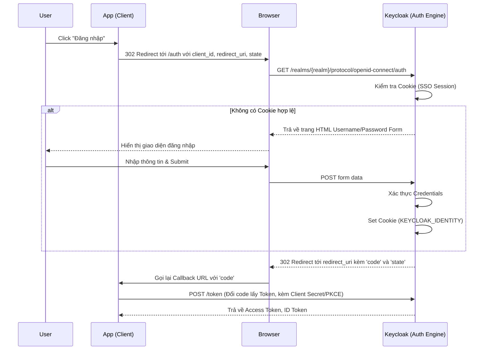

> [!NOTE]
> **Category:** Theory (Lý thuyết)
> **Goal:** Hiểu sâu về kiến trúc, các bước thực thi và cơ chế duy trì phiên của Browser Flow trong Keycloak, luồng xác thực nền tảng cho mọi ứng dụng Web.

### 1. Lý thuyết chuyên sâu (Detailed Theory)
Browser Flow (Luồng Trình duyệt) là luồng xác thực quan trọng nhất và được sử dụng mặc định cho tất cả các ứng dụng có giao diện web (Single Page Apps, Traditional Web Apps). Luồng này được thiết kế dựa trên tiêu chuẩn OAuth 2.0 Authorization Code Flow kết hợp với OpenID Connect (OIDC).
Khác với Direct Grant, Browser Flow ủy quyền toàn bộ quá trình tương tác với người dùng cho Keycloak. Ứng dụng Client sẽ chuyển hướng (Redirect) trình duyệt của người dùng sang Keycloak. Keycloak sẽ hiển thị các biểu mẫu (Forms) để nhập thông tin, xử lý các logic như Cookie, OTP, WebAuthn. Sau khi xác thực thành công, Keycloak trả về một Authorization Code cho Client để Client tự đổi lấy Token. Điều này đảm bảo Client không bao giờ biết được mật khẩu của người dùng, cô lập hoàn toàn rủi ro bảo mật.

### 2. Luồng nội bộ & Cơ chế cấp thấp (Internal Workflow & Low-level Mechanisms)

### 3. Thực hành tốt nhất & Bảo mật (Best Practices & Security)
- **Luôn sử dụng PKCE (Proof Key for Code Exchange):** Ngay cả với ứng dụng Web Backend, PKCE ngăn chặn các cuộc tấn công chặn bắt Code (Authorization Code Interception Attack). Hãy bắt buộc cấu hình này ở cấp độ Client trong Keycloak.
- **Sử dụng HTTPS:** Toàn bộ Browser Flow phụ thuộc vào HTTP Redirect và Cookies. Việc không mã hóa TLS có thể dẫn đến đánh cắp Session Cookie hoặc Authorization Code.
- **Strict Redirect URIs:** Cấu hình `Valid Redirect URIs` cực kỳ nghiêm ngặt, tránh dùng ký tự đại diện (`*`) quá lỏng lẻo. Kẻ tấn công có thể lợi dụng điều này để chuyển hướng Code về domain độc hại (Open Redirect Vulnerability).
> [!WARNING]
> Không bao giờ lưu trữ các thông tin nhảy cảm trong trường `state`. Mặc dù `state` dùng để chống CSRF, nó không được mã hóa. Hãy sử dụng nonce/state được sinh ngẫu nhiên với entropy cao.

### 4. Cấu hình minh họa thực tế (Configuration Examples)
Browser Flow mặc định trong Keycloak thường bao gồm:
1. `Cookie Authenticator` (Alternative): Kiểm tra xem người dùng đã có phiên SSO chưa.
2. `Identity Provider Redirector` (Alternative): Kiểm tra xem có cấu hình Identity Provider (như Google/Facebook) mặc định không.
3. Một Sub-flow dạng `Forms` (Alternative), bao gồm:
   - `Username Password Form` (Required).
   - Một Sub-flow `OTP` dạng `Conditional`.

Để tùy chỉnh giao diện (Theme) của Browser Flow:
- Chỉnh sửa file FTL (FreeMarker) trong thư mục `themes/your-theme/login/login.ftl`.
- Chọn theme này trong mục `Realm Settings` > `Themes` > `Login Theme`.

### 5. Trường hợp ngoại lệ (Edge Cases)
- **Trình duyệt chặn Cookie của bên thứ 3 (Third-party Cookies Blocked):** Trong trường hợp Keycloak chạy trên domain khác hoàn toàn (ví dụ `auth.com`) so với ứng dụng (`app.com`), trình duyệt như Safari (ITP) hoặc Brave có thể chặn Cookie SSO, làm mất tính năng Single Sign-On ngầm (Silent Renew iframe).
- **Lỗi hết hạn trang (Page Expired / Invalid State):** Xảy ra khi người dùng để form đăng nhập quá lâu, hoặc sử dụng nút Back trên trình duyệt gây sai lệch CSRF token bên trong form của Keycloak. **Cách xử lý:** Thiết kế giao diện nhắc nhở người dùng tải lại trang nếu gặp lỗi này.
- **Code bị sử dụng lại:** Nếu một Authorization Code được dùng gửi lên `/token` lần thứ hai, Keycloak sẽ phát hiện (theo chuẩn OAuth 2.0) và tự động thu hồi ngay lập tức tất cả các Token đã được cấp từ Code đó để bảo vệ bảo mật.

### 6. Câu hỏi Phỏng vấn (Interview Questions)
1. **Câu hỏi (Junior):** Tại sao Browser Flow lại an toàn hơn Direct Grant đối với ứng dụng Web?
   - *Đáp án:* Vì ứng dụng Web không bao giờ chạm vào mật khẩu của người dùng. Mật khẩu chỉ được nhập trực tiếp trên domain của Keycloak, Client chỉ nhận được Token.
2. **Câu hỏi (Junior):** Cookie `KEYCLOAK_IDENTITY` dùng để làm gì trong Browser Flow?
   - *Đáp án:* Cookie này dùng để duy trì phiên làm việc SSO (Single Sign-On). Lần sau người dùng truy cập, Cookie Authenticator sẽ nhận diện nó và bỏ qua bước bắt nhập lại mật khẩu.
3. **Câu hỏi (Senior):** Giải thích kỹ thuật PKCE và tại sao nó cần thiết trong Authorization Code Flow của Single Page Apps (SPA)?
   - *Đáp án:* SPA không có Backend để giấu Client Secret, do đó ai cũng có thể đọc được Secret. Nếu Code bị chặn bắt, kẻ gian có thể tự lấy Token. PKCE giải quyết bằng cách sinh ra `code_verifier` và `code_challenge`. Code chỉ đổi được Token nếu có `code_verifier` khớp.
4. **Câu hỏi (Senior):** Tấn công CSRF vào quá trình đăng nhập của luồng này diễn ra như thế nào và cách phòng thủ?
   - *Đáp án:* Kẻ gian lừa nạn nhân bấm vào link có chứa sẵn `code` từ tài khoản của kẻ gian. Nạn nhân đăng nhập nhưng ứng dụng lại liên kết với phiên của kẻ gian. Phòng thủ bằng cách dùng tham số `state` để ứng dụng so khớp phiên ban đầu.
5. **Câu hỏi (Senior):** Khi nào thì bước `Cookie Authenticator` thất bại nhưng người dùng vẫn không phải nhập Password?
   - *Đáp án:* Khi `Identity Provider Redirector` được kích hoạt thay thế. Ví dụ Keycloak tự động chuyển tiếp yêu cầu sang Google, và người dùng đã có phiên đăng nhập trên Google.

### 7. Tài liệu tham khảo (References)
- [OAuth 2.0 Authorization Code Grant (RFC 6749)](https://datatracker.ietf.org/doc/html/rfc6749#section-4.1)
- [Proof Key for Code Exchange by OAuth Public Clients (RFC 7636)](https://datatracker.ietf.org/doc/html/rfc7636)
