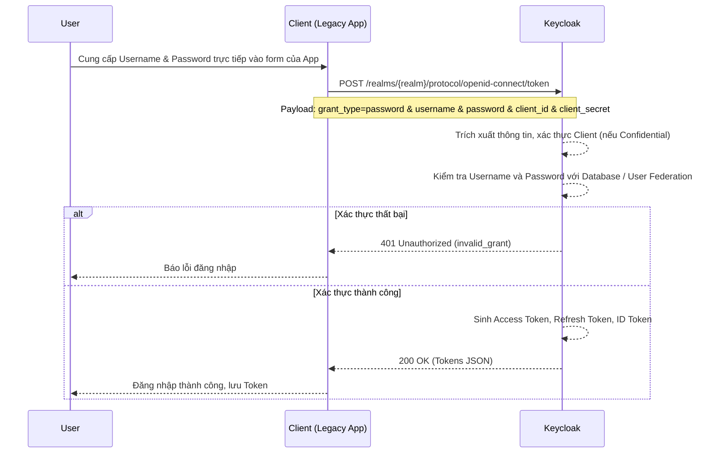

> [!NOTE]
> **Category:** Theory (Lý thuyết)
> **Goal:** Nắm vững bản chất, quy trình hoạt động và các rủi ro bảo mật của luồng Direct Access Grants (Resource Owner Password Credentials) trong Keycloak.

### 1. Lý thuyết chuyên sâu (Detailed Theory)
Direct Access Grants trong Keycloak là cách gọi cho OAuth 2.0 Resource Owner Password Credentials (ROPC) Grant. Trong luồng này, ứng dụng (Client) yêu cầu người dùng (Resource Owner) cung cấp trực tiếp Username và Password cho nó. Sau đó, Client gửi trực tiếp thông tin này đến Authorization Server (Keycloak) để đổi lấy Token.
Luồng này đi ngược lại triết lý cốt lõi của OAuth 2.0 (không để lộ mật khẩu người dùng cho Client). Nó sinh ra để hỗ trợ các ứng dụng kế thừa (Legacy Apps) không thể triển khai chuyển hướng trình duyệt (Browser-based redirection) hoặc các hệ thống thuần API không có giao diện người dùng. Do rủi ro bảo mật lớn, luồng này bị khuyến cáo loại bỏ trong OAuth 2.1 và chỉ nên dùng như giải pháp cuối cùng.

### 2. Luồng nội bộ & Cơ chế cấp thấp (Internal Workflow & Low-level Mechanisms)



### 3. Thực hành tốt nhất & Bảo mật (Best Practices & Security)
- **Hạn chế tối đa sử dụng:** Chỉ kích hoạt "Direct Access Grants Enabled" trong Keycloak Client Settings khi không còn cách nào khác.
- **Client Authentication:** Nếu ứng dụng có thể lưu trữ bí mật an toàn (Backend services), hãy cấu hình Client là "Confidential" và yêu cầu Client Secret cùng với User Credentials. Điều này tăng cường thêm một lớp bảo mật.
- **Không hỗ trợ MFA hoàn chỉnh:** Direct Grant mặc định rất khó tích hợp với Multi-Factor Authentication (MFA) vì nó chỉ nhận thông số qua API (không có giao diện để Keycloak yêu cầu nhập OTP). Bạn phải tùy chỉnh mã nguồn Keycloak hoặc sử dụng các extension đặc biệt để hỗ trợ MFA qua API, điều này phức tạp và dễ lỗi.
> [!WARNING]
> Rủi ro đánh cắp mật khẩu: Client nắm giữ mật khẩu dạng plaintext của người dùng. Nếu Client bị xâm nhập, mật khẩu người dùng sẽ bị rò rỉ. Tuyệt đối không dùng Direct Grant cho ứng dụng di động (Mobile App) hoặc ứng dụng Single-Page Application (SPA). Hãy dùng Authorization Code Flow với PKCE.

### 4. Cấu hình minh họa thực tế (Configuration Examples)
Để cho phép một Client sử dụng Direct Grant trong Keycloak:
1. Vào `Clients` > Chọn Client tương ứng.
2. Tại tab `Settings`, cuộn xuống phần `Capability config`.
3. Bật tùy chọn `Direct Access Grants`.
4. Gọi API lấy Token:
```bash
curl -X POST \
  http://localhost:8080/realms/myrealm/protocol/openid-connect/token \
  -H 'Content-Type: application/x-www-form-urlencoded' \
  -d 'client_id=myclient' \
  -d 'username=user1' \
  -d 'password=secret' \
  -d 'grant_type=password'
```

### 5. Trường hợp ngoại lệ (Edge Cases)
- **Tài khoản bị khóa (Brute Force):** Vì Client gọi API liên tục với thông tin người dùng nhập sai, Keycloak Brute Force Protection có thể khóa tài khoản người dùng hoặc IP của Client (nếu Client đóng vai trò như một Proxy, tất cả Request đều đến từ 1 IP của Client, gây khóa diện rộng). **Giải pháp:** Client cần chuyển tiếp IP thật của người dùng qua Header `X-Forwarded-For`.
- **MFA Required Action:** Nếu tài khoản bị đánh dấu "Update Password" hoặc "Configure OTP", luồng Direct Grant sẽ trả về lỗi `account_is_not_fully_set_up` vì không có luồng Browser để thực hiện các action này.
- **Throttling/Rate Limit:** Keycloak cần được cấu hình Rate Limit chặt chẽ cho Endpoint `/token` để phòng chống tấn công dò mật khẩu.

### 6. Câu hỏi Phỏng vấn (Interview Questions)
1. **Câu hỏi (Junior):** Direct Access Grant (ROPC) trong Keycloak dùng để làm gì và vì sao không được khuyến khích?
   - *Đáp án:* Dùng để lấy Token bằng cách gửi thẳng Username và Password lên Keycloak. Không được khuyến khích vì ứng dụng Client phải cầm trực tiếp mật khẩu của người dùng, phá vỡ nguyên lý ủy quyền an toàn.
2. **Câu hỏi (Junior):** Direct Grant khác với Client Credentials Grant như thế nào?
   - *Đáp án:* Direct Grant cấp Token đại diện cho *Người dùng* (có Username/Password). Client Credentials cấp Token đại diện cho *Chính Client đó* (không có ngữ cảnh người dùng, chỉ dùng Client ID/Secret).
3. **Câu hỏi (Senior):** Làm thế nào để giải quyết vấn đề Rate Limiting và Brute Force Protection khi sử dụng Direct Grant qua một API Gateway?
   - *Đáp án:* API Gateway phải truyền IP thật của Client qua HTTP Header (ví dụ: `X-Forwarded-For`). Cấu hình Keycloak để đọc đúng Header này (Trust Proxy) để cơ chế Brute Force của Keycloak track theo IP thật thay vì IP của Gateway.
4. **Câu hỏi (Senior):** Trong môi trường Mobile App, tại sao OAuth 2.1 loại bỏ ROPC thay vì giữ lại để tiện lợi?
   - *Đáp án:* Mobile App dễ dàng bị dịch ngược mã nguồn. Việc nhập mật khẩu thẳng vào Mobile App dạy người dùng thói quen xấu (nhập pass vào app lạ). Thay vào đó, dùng AppAuth (Authorization Code + PKCE) mở System Browser an toàn hơn.
5. **Câu hỏi (Senior):** Có thể tích hợp OTP (One-Time Password) vào Direct Grant trong Keycloak được không?
   - *Đáp án:* Mặc định rất khó, vì luồng chuẩn chỉ có trường `username` và `password`. Keycloak hỗ trợ một trick không chính thức là gửi gộp OTP vào mật khẩu (ví dụ: `<password><otp>`) nhưng đòi hỏi cấu hình custom authenticator, không phải là chuẩn mực.

### 7. Tài liệu tham khảo (References)
- [OAuth 2.0 Resource Owner Password Credentials Grant (RFC 6749)](https://datatracker.ietf.org/doc/html/rfc6749#section-4.3)
- [Keycloak Authentication Flows](https://www.keycloak.org/docs/latest/server_admin/#_authentication-flows)
