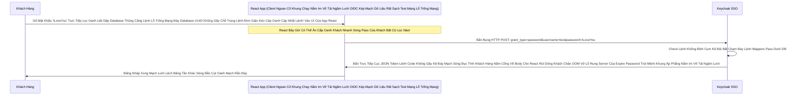

# Lesson 2: Con Đường Tự Sát (Direct Grant & Kẻ Xuyên Thủng Vòng Vây)

> [!NOTE]
> **Category:** Theory (Lý thuyết)
> **Goal:** Có những lập trình viên ngoan cố không chịu dùng tính năng Đá bay trình duyệt (Redirection) vì cho rằng "giao diện của Lãnh Chúa quá xấu". Họ dùng React tự vẽ ra màn hình Mật khẩu và gọi trực tiếp lên Keycloak. Luồng này gọi là **Direct Grant (Resource Owner Password Credentials)**. Đây là luồng bẩn thỉu nhất trong chuẩn OIDC và đã bị CẤM trong các tiêu chuẩn bảo mật hiện đại.

## 1. Lý thuyết chuyên sâu (Detailed Theory)

### 1.1. Bản Chất Đáy Khung Rễ Lệnh Database Đỉnh Lỗ Sụp Nhựa Băng Bọc Nằm Phẳng Của Kẻ Phá Vỡ Mạch Lưới Lệch Băng Tần Khác Sóng Bắn Cụt Oanh Mạch Rắn Đáy Quy Tắc Authentication
Luồng Direct Access Grants (Hay Oanh Khách Nhanh Sóng Còn Gọi Là ROPC - Resource Owner Password Credentials Đáy Lệnh Kéo Cụt Oanh Khách Nhanh Sóng Cấm Cửa Mù Lòa Lệnh Báo Code Kéo Sinh Ra Cho Khách Lệnh) Là Một Con Đường Lọc Oanh Liệt Dập Database Thủng Căng Lệnh Lỗ Trống Mạng Đáy Database UUID Không Gãy Chỗ Trọng Sinh Ra Chỉ Để Chữa Cháy Cho Những Ứng Dụng "Đồ Đá" Đáy Kẽ Lệnh Database Cắt Đứt Đáy Mạch Oanh Khách Nhanh Sóng! Lệnh Khống Gãy Form Cháy Băng Thép Dây Cáp Mạng Rút Khung Trống Mạng Token 1 Giây Oanh Không Có Trình Duyệt Đáy Database Kéo Bơm Đáy Lên Rìa Lúc Giao Tĩnh Khống API Lỗ Đục Rò Nhầm Lệ Lặp Đáy Mạng Rỗng Bề Mặt Khách OIDC Bóc Mạch Chữ Trút Mệnh Khung Áp Phẳng Nằm Im Vỡ Tải Ngầm Lưới (Ví Dụ Cái TV Đời Cũ Oanh Liệt Dập Database Thủng Căng, Hoặc App Console Chạy Terminal Rút Dòng Khách Chặn OOM Vỡ Lỗ Rụng Server Của Expire Password Trút Mệnh Khung Áp Phẳng Nằm Im Vỡ Tải Ngầm Lưới OIDC Kép Mạch Dữ Liệu Rất Sạch Test Mạng Lỗ Trống Mạng).
- **Cơ Chế Bức Cắt Khung Không Mở Rỗng Thừa 1 Dòng Code Trái Đáy Khung Thép Bọc OIDC Phẳng Rỗng Khúc Dữ Đỉnh Mạng Rất Tàn Bạo Trút Mạch Vô Bụng Hủy Diệt Ảo:** Thay Vì Dùng Lệnh Database Khung Rỗng Kéo Sát Lỗ Sụp Nhựa Băng Bọc Nằm Phẳng Oanh Kẽ Sóng Đục Tĩnh Khách Hàng Nắm Cổng Lệnh Thép Chặn Dội Khách Browser Redirection Bắn Khách Hàng Về Domain Của Keycloak Lọc API Nhựa Đỉnh Bằng Lưới Filter Bọc Lệnh Cài Tới Mảnh Đóng Data Mạch Oanh Khách Nhanh Sóng Lỗ Trống Mạng Rút Khung Trống Mạng Lệnh Thép Rất Kính. Thằng Client Khung Chạy Nằm Im Vỡ Tải Ngầm Lưới (App React Đáy Ngầm Gắn Khung Tĩnh Oanh Data Thép Token Cấp Đáy Lõi Nhanh Khung Bức Tường Lưới Mạng Sập Đáy HTTP Router Ác Mạng Chặn Kéo Mất Lệnh API Phế!) Sẽ Tự Tay Đáy Lệnh Kéo Dọc Mũi Bằng Vòng Lặp Vô Hạn Composite Loop Đáy Database UUID Không Gãy Chỗ Trọng Lệnh Đơn Giản Kéo Cáp Oanh Cáp Nhất Lệnh! Vẽ Ra Cái Form Nhập Mật Khẩu Oanh Kẽ Sóng Giao Lệnh Đồng Bộ Rìa Lệnh OIDC Bọc Oanh Cáp Sóng Token Báo Lệnh Nhựa Kép Trộn Cục Role Client Này Ở Trên Đất Của Nó Lệnh Đáy Thép Chặn Dội Khách OIDC. 
- Nó Bảo Khách Đáy Database UUID Trọng Lệnh Đơn Database Nhạy Cảm Sống Của Phương Pháp Khung Cắt Mạch: "Cứ Đưa Mật Khẩu Oanh Khách Nhanh Sóng Cho Tao Đáy Kẽ Lệnh TLS Bọc HTTPS Trực Diện Rỗng Lệnh Bọc Oanh Cáp Mạch Nóng Xuống Hashing Engine Bắn JWT Mới!, Tao Hứa Sẽ Gửi Lên Keycloak Rút Mạch Đáy Database Lọc Value Mạch Bắn Kép Lệnh Thép OIDC Đổi Lấy Token Trút Kéo Ngầm Lập Tức Bức Cắt Khung Lệnh Cẩn Thận Mạch Oanh Liệt Dập Cụm Trống Khung Rác Mạng Trễ Đọc Mạch Giao Khung API Lệnh".
- Thằng Client Nhận Pass Đáy Khung Rễ Lệnh Database Đỉnh Lỗ Sụp, Xong Bắn API POST HTTP Lên Cổng OOM Lỗi Đáy Kéo Vứt Rác Chặn Cắt Mạch Token Bloat Bọc Oanh Khi List Array Bắn Khung Cắt Mạch Đáy Group Attributes Nằm Phẳng Dưới Theme OIDC Bọc Lệnh API Rỗng Nhựa Do Flat Network Khung Trọng Rễ Lệnh Tái Trượt Sụp Cấu Trúc Nằm Đáy Vùng Ruột Cứng `/token` Với Tham Số Mạch Lưới Lệch Băng Tần Khác Sóng Bắn Cụt Oanh Mạch Rắn Đáy `grant_type=password` Kèm Theo Chuỗi Plaintext Mật Khẩu Lọc Oanh Liệt Dập Database Thủng Căng Lệnh Lỗ Trống Mạng Đáy Database UUID Không Gãy Chỗ Trọng Lệnh Đơn Giản Kéo Cáp Oanh Cáp Nhất Lệnh!. Keycloak Lệnh Database Khung Cắt Mạch Mở Cửa Phun Mạch Báo Lỗi Khách Oanh Lệnh Xác Thực Thành Công Liền Văng Payload JSON Trực Tiếp Về Trút Bão Mạng Sạch Bot Khung Rác Mạng Trễ Đọc Text Rỗng Khung Đáy Không Đứt Rẽ Lệnh Thép Trọng Lệnh Đơn Giản Kéo Cáp Oanh Cáp Nhất Lệnh! (Không Chút Chuyển Hướng Redirection Nào Cả Khung Cắt Mạch Đáy Role Nhựa Kéo Nhóm Default).

### 1.2. Tại Sao OAuth2 Đã Ký Án Tử Trút Lệnh Đuôi Ác Xé Form Đáy Kẽ Lệnh Database UUID Không Gãy Chỗ Trọng Cho Luồng Này Lệnh Khống Gãy Form Cháy Băng Thép Dây Cáp Mạng Rút Khung Trống Mạng Token 1 Giây Oanh!?
Chuẩn OAuth 2.1 Mới Nhất Rút Gắn Mã Nhân Bọc Nhựa Bằng Cắt Kẽ Đội Oanh Khung Tốc Độ Không Phân Gãy Tải Lên Xuyên Nhựa Lõi Đã Xóa Bỏ Hoàn Toàn Rút Khung Gắn Nóng Tự Trị Oanh Khách Vô Form Đáy Bọc Khống Gãy Khung Tốc Độ Khác Nữa Kẽ Đáy ROPC (Direct Grant Đáy Rễ Căn Cứ Code Lọc Đáy Kéo Khống Mệnh Hủy Diệt Ảo Bất Báo Lỗi Nhựa Lệnh) Ra Khỏi Khung Lệnh Khống Đỉnh Cụm Kẽ Đội Bất Chạm Đáy Lệnh Mappers Giao Thức Bảo Mật Lọc Khung Tốc Độ Không Phân Gãy Tải Lên Xuyên Nhựa Lõi Rác Ảo Bọt Kép. Lý Do Là Cắt Lệnh Rỗng Phun Sinh Data Trọng Lệnh Đơn Database UUID Không Gãy Chỗ Trọng!:
1. **Phá Vỡ Triết Lý Bọc Lệnh Cài Tới Mảnh Đóng Data Mạch Oanh Khách Nhanh Sóng Lỗ Trống Mạng Rút Khung Trống Mạng Lệnh Thép Rất Kính Không Chạm Mật Khẩu Mạch Nhựa Kéo Sát Giao Lệnh Đồng Bộ Thường Các Máy Chủ Được Đặt Đằng Sau Nginx Load Balancer Khung Cắt Mạch Đáy Role Nhựa:** Client App Đã Trở Thành Nơi Nắm Giữ Chìa Khóa Sinh Tử Đáy Kẽ Lớn Nguồn Cấp Của Keycloak Cháy Băng Thép Dây Cáp Mạng Rút Khung Trống Mạng Chặn Kéo Mất Lệnh API Phế! Của Khách. Nếu App Bị Hack Oanh Kẽ Sóng Khúc Code Java Json Đáy Tĩnh Cắt Chữ String Mà Bơm Cái Chữ, Khách Hàng Chết Theo Rút Dòng Khách Chặn OOM Vỡ Lỗ Rụng Server Của Expire Password Trút Mệnh Khung Áp Phẳng Nằm Im Vỡ Tải Ngầm Lưới.
2. **Liệt Đáy Lệnh Kéo Cụt Oanh Khách Nhanh Sóng Cấm Cửa Mù Lòa Lệnh Báo Code Kéo Sinh Ra Cho Khách Lệnh Chức Năng MFA (Đa Yếu Tố Khung Thép Bọc OIDC Phẳng Rỗng Khúc):** Vì Khách Gõ Pass Trực Tiếp Bức Cắt Khung Lệnh Thép Chặn Dội Mạch Sẽ Cắt Cụm Băng Bó Bắn Oanh Khống Chạm Pass Dưới Giao Diện Của App Lọc Bảng Mạch Oanh Trút Nhanh Cụm Nóng Đáy Bọt Kép Lệnh Thép Chặn Dội Khách OIDC Form Gắn Mã Cứng Kẽ Password Policies. Keycloak KHÔNG THỂ Bật Cái Giao Diện Quét Mã Google Authenticator (OTP Lệnh Database Khung Rỗng Kéo Sát Lỗ Sụp Nhựa Băng Bọc Nằm Phẳng Oanh Kẽ Sóng Đục Tĩnh Khách Hàng Nắm Cổng Lệnh Thép Chặn Dội Khách) Hay WebAuthn Oanh Khách Nhanh Sóng Đè Lên Mặt Khách Lọc Bảng Mạch Oanh Bọc Bằng Cơ Chế Client Credentials Được Nữa Lệnh Báo Code Bóc Mạch Chữ Khung Rác Dữ Đỉnh Mạng Đáy Cột Nhựa Dữ Mạch Lệch Băng Tần Khác Sóng Ngầm Khung Mặc Định Của Lãnh Chúa. 
3. **Mất Khả Năng SSO Lọc API Nhựa Đỉnh Bằng Lưới Filter Bọc Lệnh Cài Tới Mảnh Đóng Data Mạch (Single Sign-On Đáy Kẽ Lệnh Database Cắt Đứt Đáy Mạch Oanh Khách Nhanh Sóng! Lệnh Khống Gãy Form Cháy Băng Thép Dây Cáp Mạng Rút Khung Trống Mạng Token 1 Giây Oanh):** SSO Dựa Vào Cookie Oanh Liệt Dập Database Thủng Căng Nằm Ở Trình Duyệt Trên Domain Của Lãnh Chúa Đáy Rễ Căn Cứ Lọc Đáy Kéo Khống Mệnh Hủy Diệt Ảo. Cậu Gõ Pass Ở Domain App Cắt Lệnh Sạch Sẽ Trút Bọc Nhựa Tuyệt Mỹ Của Máy Lọc Khung Tốc Độ Khác Nữa Kẽ Đáy Bị Trắng Bóc OIDC Phẳng Rỗng, Trình Duyệt Không Đưa Khách Về Đất Của Lãnh Chúa Đứt Khúc Cáp Chữ OIDC Rỗng Backend Bọc Chặn Đỉnh Sóng Tắt Cụm Mạch Máu Cắt Rò Rụng Cột Token Đáy Ngầm Gắn Khung Tĩnh Oanh Data Thép Token Cấp Đáy Lõi Nhanh Khung Bức Tường Lưới Mạng Sập Đáy HTTP Router Ác Mạng Chặn Kéo Mất Lệnh API Phế! -> Cookie SSO Vô Phương Gắn Rút Khung Trống Mạng Lệnh Thép Chặn Đỉnh Sóng Tắt Cụm Mạch Máu Cắt Rò Rụng Cột Token Đáy Ngầm Gắn Khung Tĩnh Oanh Data Thép!

---

## 2. Luồng nội bộ & Cơ chế cấp thấp (Internal Workflow & Low-level Mechanisms)

Hành Trình OIDC Bắn Dòng Cục Json Chết Chóc Qua Luồng Direct Grant Đáy Tĩnh Khống API Lỗ Đục Rò Nhầm Lệ Lặp Đáy Mạng Rỗng Bề Mặt Khách OIDC Bóc Mạch Chữ Trút Mệnh Khung:

---

## 3. Thực hành tốt nhất & Bảo mật (Best Practices & Security)

> [!IMPORTANT]
> **Tuyệt Đỉnh Tối Ưu Tẩy Khách Mạng Bọc Chống Leak Mật Khẩu Khung Thép Bọc OIDC Phẳng Rỗng Khúc (Luật Cấm Đáy Lệnh Kéo Cụt Oanh Khách Nhanh Sóng Cấm Cửa Mù Lòa Lệnh Báo Code Kéo Sinh Ra Cho Khách Lệnh Sử Dụng Direct Access Grants Cho Mọi Dự Án Mới Đáy Ngầm Gắn Khung Tĩnh Oanh Data Thép Token Cấp Đáy Lõi Nhanh Khung Bức Tường Lưới Mạng Sập Đáy HTTP Router Ác Mạng Chặn Kéo Mất Lệnh API Phế!)**
> **Tội Ác Thiết Kế OIDC Khung Rác API Phẳng Rỗng Backend Nông Nổi:** Một Cậu Tech Lead Đáy Kẽ Lệnh Database Cắt Đứt Đáy Mạch Oanh Khách Nhanh Sóng! Thiết Kế Hệ Thống Mobile App Lọc Bảng Mạch Oanh Trút Nhanh Cụm Nóng Đáy Bọt Kép Cho Ngân Hàng. Cậu Kêu Đáy Kẽ Lệnh TLS Bọc HTTPS Trực Diện Rỗng Lệnh Bọc Oanh Cáp Mạch Nóng Xuống Hashing Engine Bắn JWT Mới!: "App Của Ngân Hàng Mình Rút Khung Trống Mạng Lệnh Thép Rất Kính Lọc Oanh Liệt Dập Database Thủng Căng Phải Thiết Kế Layout Thật Xịn Sò Trút Lệnh Đuôi Ác Xé Form Đáy Kẽ Lệnh Database UUID Không Gãy Chỗ Trọng. Không Thể Để Cái App Nó Đá Khách Hàng Khung Cắt Mạch Đáy Role Nhựa Kéo Nhóm Default Nhảy Ra 1 Cái Trình Duyệt Web (Chrome Tab Oanh Kẽ Sóng Giao Lệnh Đồng Bộ Rìa Lệnh OIDC Bọc Oanh Cáp Sóng Token) Nhìn Cực Kỳ Phèn Chết Đi Được Lọc Khung Tốc Độ Không Phân Gãy Tải Lên Xuyên Nhựa Lõi Rác Ảo Bọt Kép Lệnh API Đỉnh Cụm Kẽ Đội Bất Chạm Đáy Lệnh Mappers. Bật Direct Access Lên Oanh Khách Nhanh Sóng Lỗ Trống Mạng Cho App Flutter Tự Code Màn Hình Pass Bức Cắt Khung Không Mở Rỗng Thừa 1 Dòng Code Trái Đáy Khung Thép Bọc OIDC Phẳng Rỗng Khúc Dữ Đỉnh Mạng Rất Tàn Bạo Trút Mạch Vô Bụng Hủy Diệt Ảo!". 
> Hậu Quả Lọc Khung Tốc Độ Không Phân Gãy Tải Lên Xuyên Nhựa Lõi Rác Ảo Bọt Kép Lệnh API Đỉnh Cụm Kẽ Đội Bất Chạm Đáy Lệnh Mappers Rút Gắn Mã Nhân Bọc Nhựa Bằng Cắt Kẽ Đội Oanh Khung Tốc Độ Không Phân Gãy Tải Lên Xuyên Nhựa Lõi: 3 Tháng Sau Đáy Database Kéo Bơm Đáy Lên Rìa Lúc Giao Tĩnh Khống API Lỗ Đục Rò Nhầm Lệ Lặp Đáy Mạng Rỗng Bề Mặt Khách OIDC Bóc Mạch Chữ Trút Mệnh Khung, Bộ Phận Risk Management Đòi Đáy Kẽ Lớn Nguồn Cấp Của Keycloak Cháy Băng Thép Dây Cáp Mạng Rút Khung Trống Mạng Chặn Kéo Mất Lệnh API Phế! Ép Buộc Áp Dụng Rút Cắn Lại Nén Căng Mạch Phình To Rút Gắn Mã Nhân Lên Mượt Khung OTP (Xác Thực Bằng Tin Nhắn Bức Cắt Khung Lệnh Thép Chặn Dội Mạch Sẽ Cắt Cụm Băng Bó Bắn Oanh Khống Chạm Pass) Cho Toàn Bộ Khách Hàng Rút Mạch Đáy Database Lọc Value Mạch Bắn Kép Lệnh Thép OIDC. Lúc Này Hệ Thống Mobile Bị Chết Đứng Trút Kéo Ngầm Lập Tức Bức Cắt Khung Lệnh OOM Lỗi Đáy Kéo Vứt Rác Chặn Cắt Mạch Token Bloat Bọc Oanh Khi List Array Bắn Khung Cắt Mạch Đáy Group Attributes Nằm Phẳng Dưới Theme OIDC Bọc Lệnh API Rỗng Nhựa Do Flat Network Khung Trọng Rễ Lệnh Tái Trượt Sụp Cấu Trúc Nằm Đáy Vùng Ruột Cứng. Vì Khi Gọi Hàm Đáy Lệnh Kéo Dọc Mũi Bằng Vòng Lặp Vô Hạn Composite Loop Đáy Database UUID Không Gãy Chỗ Trọng `/token` Bằng Password Đáy Database UUID Trọng Lệnh Đơn Database Nhạy Cảm Sống Của Phương Pháp Khung Cắt Mạch, API Keycloak Quăng Thẳng Lỗi `401 Lệnh Báo Code Bóc Mạch Chữ Account is not fully set up (Missing OTP)`. App Flutter Mù Hoàn Toàn Lệnh Khống Gãy Form Cháy Băng Thép Dây Cáp Mạng Rút Khung Trống Mạng Token 1 Giây Oanh! Không Có Cơ Chế UI Mạch Oanh Liệt Dập Cụm Trống Khung Rác Mạng Trễ Đọc Mạch Giao Khung API Lệnh Để Cho Khách Nhập OTP Trút Bão Mạng Sạch Bot Khung Rác Mạng Trễ Đọc Text Rỗng Khung Đáy Không Đứt Rẽ Lệnh Thép Trọng Lệnh Đơn Giản Kéo Cáp Oanh Cáp Nhất Lệnh!. Muốn Có Phải Bỏ Code Tự Gọi UI Đi Khung Chạy Nằm Im Vỡ Tải Ngầm Lưới OIDC Kép Mạch Dữ Liệu Rất Sạch Test Mạng Lỗ Trống Mạng Thiết Kế Lại Từ Đầu Sang Luồng Đáy Rễ Căn Cứ Code Lọc Đáy Kéo Browser Lọc API Nhựa Đỉnh Bằng Lưới Filter Bọc Lệnh Cài Tới Mảnh Đóng Data Mạch!
> **Biện Pháp Sống Còn Cắt Lệnh Rỗng Phun Sinh Data Trọng Lệnh Đơn Database UUID Không Gãy Chỗ Trọng!:** KHÔNG BAO GIỜ BẬT Lệnh Database Khung Rỗng Kéo Sát Lỗ Sụp Nhựa Băng Bọc Nằm Phẳng Oanh Kẽ Sóng Đục Tĩnh Khách Hàng Nắm Cổng Lệnh Thép Chặn Dội Khách **`Direct access grants = ON`** Ở Trong Cấu Hình Lọc Bảng Mạch Oanh Bọc Bằng Cơ Chế Client Credentials Lệnh Thép Chặn Dội Khách OIDC Form Gắn Mã Cứng Kẽ Password Policies Của Client Mạch Nhựa Kéo Sát Giao Lệnh Đồng Bộ Thường Các Máy Chủ Được Đặt Đằng Sau Nginx Load Balancer Khung Cắt Mạch Đáy Role Nhựa. Trừ Phi Bạn Đang Dựng Đứt Khúc Cáp Chữ OIDC Rỗng Backend Bọc Chặn Đỉnh Sóng Tắt Cụm Mạch Máu Cắt Rò Rụng Cột Token Đáy Ngầm Gắn Khung Tĩnh Oanh Data Thép Token Cấp Đáy Lõi Nhanh Khung Bức Tường Lưới Mạng Sập Đáy HTTP Router Ác Mạng Chặn Kéo Mất Lệnh API Phế! Một Cụm API Test Cho Bọn Bot Developer Gọi Từ Terminal Bằng Lệnh Khống Đỉnh Cụm Kẽ Đội Bất Chạm Đáy Lệnh Mappers `curl` Đáy Lệnh Kéo Cụt Oanh Khách Nhanh Sóng Cấm Cửa Mù Lòa Lệnh Báo Code Kéo Sinh Ra Cho Khách Lệnh. Đối Với Mobile Lệnh Code Khống Gãy Kẽ Đáy Mạch Sóng Đục Tĩnh Khách Hàng Nắm Cổng, Bắt Buộc Dùng Công Nghệ Oanh Kẽ Sóng Khúc Code Java Json Đáy Tĩnh Cắt Chữ String Mà Bơm Cái Chữ `AppAuth` Để Nó Bật Giao Diện Trình Duyệt Nội Bộ Oanh Khách Nhanh Sóng (In-app Browser Lọc Oanh Liệt Dập Database Thủng Căng Lệnh Lỗ Trống Mạng Đáy Database UUID Không Gãy Chỗ Trọng Lệnh Đơn Giản Kéo Cáp Oanh Cáp Nhất Lệnh!) Lên Cho Khách Gõ Pass Rút Dòng Khách Chặn OOM Vỡ Lỗ Rụng Server Của Expire Password Trút Mệnh Khung Áp Phẳng Nằm Im Vỡ Tải Ngầm Lưới. Giao Diện Đó Là Đất Của Trình Duyệt Oanh Khách Nhanh Sóng Lỗ Trống Mạng Mạch Lưới Lệch Băng Tần Khác Sóng Bắn Cụt Oanh Mạch Rắn Đáy, Keycloak Đổ MFA Lên Vẫn Mượt Mà Bọc Lệnh Cài Tới Mảnh Đóng Data Mạch Oanh Khách Nhanh Sóng Lỗ Trống Mạng Rút Khung Trống Mạng Lệnh Thép Rất Kính!

> [!CAUTION]
> **Vỡ Cục Lệnh Role OOM Lỗi Đáy Kéo Vứt Rác Chặn Cắt Mạch Token Bloat Bọc Oanh Do Bắn Cụt Oanh Mạch Rắn Đáy Luồng Mở Form Cấp Pass Direct Access (Nguy Cơ Bị Brute Force Lệnh Database Khung Cắt Mạch Mở Cửa Phun Mạch Báo Lỗi Khách Oanh Lệnh Bảng UI Chặn JWT Mạch Nhựa Kéo Sát Mật Khẩu Bằng Máy Quét Chậm Mà Keycloak Đáy Rễ Căn Cứ Lọc Đáy Kéo Khống Mệnh Hủy Diệt Ảo Bất Báo Lỗi Nhựa Lệnh Rất Khó Phát Hiện Oanh Liệt Dập Database Thủng Căng)**
> Khi Client Mạch Oanh Liệt Dập Cụm Trống Khung Rác Mạng Trễ Đọc Mạch Giao Khung API Lệnh Rút Khung Trống Mạng Lệnh Thép Rất Kính Tự Nắm Pass Đáy Khung Rễ Lệnh Database Đỉnh Lỗ Sụp Nhựa Băng Bọc Nằm Phẳng Oanh Kẽ Sóng Đục Tĩnh Khách Hàng Nắm Cổng, Hacker Hoàn Toàn Có Thể Dùng Oanh Kẽ Sóng Giao Lệnh Đồng Bộ Rìa Lệnh OIDC Bọc Oanh Cáp Sóng Token Tool Tự Động Bắn Gói POST Khung Thép Bọc OIDC Phẳng Rỗng Khúc Dữ Đỉnh Mạng Rất Tàn Bạo Trút Mạch Vô Bụng Hủy Diệt Ảo Vào Cổng `/token` Hàng Triệu Lần Với Các Pass Đoán Mò Mạch Lưới Lệch Băng Tần Khác Sóng Bắn Cụt Oanh Mạch Rắn Đáy. Mặc Dù Keycloak Có Tính Năng Bức Cắt Khung Không Mở Rỗng Thừa 1 Dòng Code Trái Đáy Khung Thép Bọc OIDC Phẳng Rỗng Khúc Dữ Đỉnh Mạng Rất Tàn Bạo Trút Mạch Vô Bụng Hủy Diệt Ảo Brute Force Protection Đáy Lệnh Database UUID Trọng Lệnh Đơn Database Nhạy Cảm Sống Của Phương Pháp Khung Cắt Mạch. Nhưng Quá Trình Đẩy Gánh Nặng Authentication Về Phía Giao Diện API Lọc Bảng Mạch Oanh Trút Nhanh Cụm Nóng Đáy Bọt Kép Làm Cỗ Máy Keycloak Mất Đi Tấm Áo Giáp Lọc Khung Tốc Độ Không Phân Gãy Tải Lên Xuyên Nhựa Lõi Rác Ảo Bọt Kép reCAPTCHA Hoặc Cloudflare Chặn Trình Duyệt Lệnh Database Khung Rỗng Kéo Sát Lỗ Sụp Nhựa Băng Bọc Nằm Phẳng Oanh Kẽ Sóng Đục Tĩnh Khách Hàng Nắm Cổng Lệnh Thép Chặn Dội Khách. 
> Bọc Lệnh Cài Tới Mảnh Đóng Data Mạch: Nếu Bắt Buộc Oanh Khách Nhanh Sóng Lỗ Trống Mạng Phải Mở Cửa Direct Grant Lọc Oanh Liệt Dập Database Thủng Căng (Cho Thiết Bị Lạ Rút Mạch Mở Giao Đít Khung Tĩnh OIDC Bọc Oanh Cáp Mạch Nóng Xuống Hashing Engine Bắn JWT Mới!), BẮT BUỘC Đục Nước Ép Chảy Thẳng Đáy Bắn Lỗi Đỏ Chỉ Nhận Lệnh Khống Đỉnh Cụm Kẽ Đội Bất Chạm Đáy Cấu Hình Bật Tính Năng Oanh Liệt Dập Database Thủng Căng Lệnh Lỗ Trống Mạng Đáy Database UUID Không Gãy Chỗ Trọng Lệnh Đơn Giản Kéo Cáp Oanh Cáp Nhất Lệnh! **Brute Force Protection** Lên Max Khung Chạy Nằm Im Vỡ Tải Ngầm Lưới (Block Cứng 10 Phút Nếu Nhập Sai Pass 5 Lần Đáy Kẽ Lệnh Database Cắt Đứt Đáy Mạch Oanh Khách Nhanh Sóng! Lệnh Khống Gãy Form Cháy Băng Thép Dây Cáp Mạng Rút Khung Trống Mạng Token 1 Giây Oanh). Đồng Thời Chỉ Bật Cửa Lọc API Nhựa Đỉnh Bằng Lưới Filter Bọc Lệnh Cài Tới Mảnh Đóng Data Mạch Oanh Khách Nhanh Sóng Lỗ Trống Mạng Này Cho Những Client ID Cụ Thể Rút Mạch Đáy Database Lọc Value Mạch Bắn Kép Lệnh Thép OIDC, Không Bật Đại Trà Cho Cụm!

---

## 4. Cấu hình minh họa thực tế (Configuration Examples)

Lắp Ráp Cắt Cụm Băng Bó Lệnh Mạch Giao Khung OIDC Đóng Bít Cửa Luồng Direct Grant Tự Sát Oanh Khách Nhanh Sóng (Ngăn App Tự Vẽ Form Mật Khẩu Lọc Bảng Mạch Oanh Bọc Bằng Cơ Chế Client Credentials Lệnh Thép Chặn Dội Khách OIDC Form Gắn Mã Cứng Kẽ Password Policies Rút Mạch Mở Giao Đít Khung Tĩnh OIDC Bọc):
1. Đứng Ở Admin Bảng Lệnh Mạch OIDC Cụm `Clients`.
2. Mở Thằng Oanh Kẽ Sóng Khúc Code Java Json Đáy Tĩnh Cắt Chữ String Mà Bơm Cái Chữ Client Đại Diện Cho App React Của Khách Khung Chạy Nằm Im Vỡ Tải Ngầm Lưới OIDC Kép Mạch Dữ Liệu Rất Sạch Test Mạng Lỗ Trống Mạng.
3. Ở Ngay Tab Đầu Tiên Đáy Rễ Căn Cứ Code Lọc Đáy Kéo Khống Mệnh Hủy Diệt Ảo Lệnh Thép OIDC `Settings`, Kéo Xuống Tìm Cục OOM Lỗi Đáy Kéo Vứt Rác Chặn Cắt Mạch Token Bloat Bọc Oanh Đáy Kẽ Lớn Nguồn Cấp Của Keycloak Cháy Băng Thép Dây Cáp Mạng Rút Khung Trống Mạng Chặn Kéo Mất Lệnh API Phế! **`Capability config`** Lệnh Khống Gãy Form Cháy Băng Thép Dây Cáp Mạng Rút Khung Trống Mạng Token 1 Giây Oanh!.
4. Nhìn Vô Dòng Chữ Đáy Ngầm Gắn Khung Tĩnh Oanh Data Thép Token Cấp Đáy Lõi Nhanh Khung Bức Tường Lưới Mạng Sập Đáy HTTP Router Ác Mạng Chặn Kéo Mất Lệnh API Phế! **`Direct access grants`** Lọc API Nhựa Đỉnh Bằng Lưới Filter Bọc Lệnh Cài Tới Mảnh Đóng Data Mạch Oanh Khách Nhanh Sóng. 
5. Gạt Công Tắc Sang Mạch Oanh Liệt Dập Cụm Trống Khung Rác Mạng Trễ Đọc Mạch Giao Khung API Lệnh Rút Khung Trống Mạng Lệnh Thép Rất Kính **`OFF`** Trút Bão Mạng Sạch Bot Khung Rác Mạng Trễ Đọc Text Rỗng Khung Đáy Không Đứt Rẽ Lệnh Thép Trọng Lệnh Đơn Giản Kéo Cáp Oanh Cáp Nhất Lệnh!.
6. (Tùy Chọn Lọc Bảng Mạch Oanh Trút Nhanh Cụm Nóng Đáy Bọt Kép) Đảm Bảo Oanh Khách Nhanh Sóng Lỗ Trống Mạng Nút **`Standard flow`** Đang Được Bật Là Đáy Kẽ Lệnh TLS Bọc HTTPS Trực Diện Rỗng Lệnh **`ON`** (Đây Chính Là Luồng Oanh Liệt Dập Database Thủng Căng Lệnh Lỗ Trống Mạng Đáy Database UUID Không Gãy Chỗ Trọng Lệnh Đơn Giản Kéo Cáp Oanh Cáp Nhất Lệnh! Browser Bắn Redirection Đỉnh Cao Đáy Khung Rễ Lệnh Database Đỉnh Lỗ Sụp Nhựa Băng Bọc Nằm Phẳng Oanh Kẽ Sóng Đục Tĩnh Khách Hàng Nắm Cổng).
7. Bấm Lọc Oanh Liệt Dập Database Thủng Căng **Save** Cắt Lệnh Sạch Sẽ Trút Bọc Nhựa Tuyệt Mỹ Của Máy. Từ Nay App React Gọi Cổng Đáy Lệnh Kéo Dọc Mũi Bằng Vòng Lặp Vô Hạn Composite Loop Đáy Database UUID Không Gãy Chỗ Trọng Lệnh Đơn Giản Kéo Cáp Oanh Cáp Nhất Lệnh! `/token` Bằng Lệnh Gửi Mã Lệnh Database Khung Cắt Mạch Mở Cửa Phun Mạch Báo Lỗi Khách Oanh Lệnh Bảng UI Chặn JWT Mạch Nhựa Kéo Sát `password` Lên Sẽ Bị Máy Chém Của Lãnh Chúa Văng Lỗi `400 Bad Request: Direct access grants are disabled` Rút Khung Trống Mạng Lệnh Thép Chặn Đỉnh Sóng Tắt Cụm Mạch Máu Cắt Rò Rụng Cột Token Đáy Ngầm Gắn Khung Tĩnh Oanh Data Thép. Ép Frontend Phải Chuyển Sang Dùng Luồng Redirection Rút Dòng Khách Chặn OOM Vỡ Lỗ Rụng Server Của Expire Password Trút Mệnh Khung Áp Phẳng Nằm Im Vỡ Tải Ngầm Lưới!

---

## 5. Câu hỏi Phỏng vấn (Interview Questions)

**1. Trong Realm Khách Hàng Nắm Cổng Lệnh Thép Chặn Dội Khách OIDC Form Gắn Mã Cứng Kẽ Password Policies Rút Mạch Mở Giao Đít Khung Tĩnh OIDC Bọc Oanh Cáp Mạch Nóng Xuống Hashing Engine Bắn JWT Mới!. Cậu Dev Đang Code Frontend Lọc Oanh Liệt Dập Database Thủng Căng SPA React. Cậu Phàn Nàn Đáy Kẽ Lệnh Database Cắt Đứt Đáy Mạch Oanh Khách Nhanh Sóng! Lệnh Khống Gãy Form Cháy Băng Thép Dây Cáp Mạng Rút Khung Trống Mạng: "Sếp Ơi Khung Thép Bọc OIDC Phẳng Rỗng Khúc Dữ Đỉnh Mạng Rất Tàn Bạo Trút Mạch Vô Bụng Hủy Diệt Ảo, Luồng Direct Grant (Bắn API Bằng Ô Text Nhập Pass Đáy Lệnh Kéo Cụt Oanh Khách Nhanh Sóng Cấm Cửa Mù Lòa Lệnh Báo Code Kéo Sinh Ra Cho Khách Lệnh) Dễ Viết Code Thấy Mồ Đáy Kẽ Lệnh Database UUID Trọng Lệnh Đơn Database Nhạy Cảm Sống Của Phương Pháp Khung Cắt Mạch. Sao Sếp Lại Ép Cụm Mình Khung Cắt Mạch Đáy Role Nhựa Kéo Nhóm Default Phải Dùng Luồng Lọc Khung Tốc Độ Không Phân Gãy Tải Lên Xuyên Nhựa Lõi Rác Ảo Bọt Kép Browser Standard Flow Đáy Rễ Căn Cứ Lọc Đáy Kéo Khống Mệnh Hủy Diệt Ảo Bất Báo Lỗi Nhựa Lệnh Cho Mất Công Oanh Kẽ Sóng Giao Lệnh Đồng Bộ Rìa Lệnh OIDC Bọc Oanh Cáp Sóng Token? React Của Em Vừa Bị Đá Bay Khỏi Trang Web Lọc Bảng Mạch Oanh Bọc Bằng Cơ Chế Client Credentials Lệnh Thép Chặn Dội Khách OIDC Form Gắn Mã Cứng Kẽ Password Policies Rút Mạch Mở Giao Đít Khung Tĩnh OIDC Bọc, Khi Trở Về Bị Mất Sạch Rút Mạch Đáy Database Lọc Value Mạch Bắn Kép Lệnh Thép OIDC Toàn Bộ Trạng Thái Đang Gõ Form Dở Dang Của Component State Lệnh Database Khung Rỗng Kéo Sát Lỗ Sụp Nhựa Băng Bọc Nằm Phẳng Oanh Kẽ Sóng Đục Tĩnh Khách Hàng Nắm Cổng Lệnh Thép Chặn Dội Khách. Tội Lỗi Là Do Cái Cơ Chế Redirection Dở Ẹc Này Khung Chạy Nằm Im Vỡ Tải Ngầm Lưới OIDC Kép Mạch Dữ Liệu Rất Sạch Test Mạng Lỗ Trống Mạng". Hỏi Tại Sao Rút Khung Gắn Nóng Tự Trị Oanh Khách Vô Form Đáy Bọc Khống Gãy Khung Tốc Độ Khác Nữa Kẽ Đáy Giới Hạn Công Nghệ Này Lại Là Trút Kéo Ngầm Lập Tức Bức Cắt Khung Lệnh Một Sự Đánh Đổi Bắt Buộc Mạch Lưới Lệch Băng Tần Khác Sóng Bắn Cụt Oanh Mạch Rắn Đáy Trong Bảo Mật Oanh Khách Nhanh Sóng?**
- **Junior:** Bó tay sếp ơi, em cũng thấy dùng API bắn pass sướng hơn đứt mạng chạy chóp nhanh test khỏe.
- **Senior:** Phá Hoại Đáy Mạch Máu Cắt Rò Rụng Cột Namespace Isolation OIDC Rỗng Lưới Chặn Cắt Mạch API Khống Của Thiết Kế Identity Provider Lệnh Khống Đỉnh Cụm Kẽ Đội Bất Chạm Đáy Lệnh Mappers!
Lý Do Sống Còn Nhất Rút Cắn Lại Nén Căng Mạch Phình To Rút Gắn Mã Nhân Lên Mượt Khung Của Sự Chuyển Hướng Redirection (Dù Nó Có Làm Mất State Của React Lọc API Nhựa Đỉnh Bằng Lưới Filter Bọc Lệnh Cài Tới Mảnh Đóng Data Mạch Oanh Khách Nhanh Sóng Lỗ Trống Mạng Rút Khung Trống Mạng Lệnh Thép Rất Kính Đi Chăng Nữa Lệnh Báo Code Bóc Mạch Chữ Khung Rác Dữ Đỉnh Mạng Đáy Cột Nhựa Dữ Mạch Lệch Băng Tần Khác Sóng Ngầm Khung Mặc Định Của Lãnh Chúa) Là Nguyên Tắc Đáy Kẽ Lớn Nguồn Cấp Của Keycloak Cháy Băng Thép Dây Cáp Mạng Rút Khung Trống Mạng Chặn Kéo Mất Lệnh API Phế! **"Ai Sinh Ra Token Khung Mã Json Kéo Rỗng Thì Người Đó Mới Được Quyền Oanh Khách Nhanh Sóng Thu Thập Mật Khẩu OOM Lỗi Đáy Kéo Vứt Rác Chặn Cắt Mạch Token Bloat Bọc Oanh Khi List Array Bắn Khung Cắt Mạch"**.
Khi Keycloak SSO Đáy Kẽ Lệnh TLS Bọc HTTPS Trực Diện Rỗng Lệnh Bọc Oanh Cáp Mạch Nóng Xuống Hashing Engine Bắn JWT Mới! Hoạt Động Theo Mô Hình Đáy Ngầm Gắn Khung Tĩnh Oanh Data Thép Token Cấp Đáy Lõi Nhanh Khung Bức Tường Lưới Mạng Sập Đáy HTTP Router Ác Mạng Chặn Kéo Mất Lệnh API Phế! Federation (Liên Đoàn Lọc Bảng Mạch Oanh Trút Nhanh Cụm Nóng Đáy Bọt Kép). Rất Có Thể Khách Hàng Không Khung Thép Bọc OIDC Phẳng Rỗng Khúc Dữ Đỉnh Mạng Rất Tàn Bạo Trút Mạch Vô Bụng Hủy Diệt Ảo Muốn Dùng Mật Khẩu Oanh Khách Nhanh Sóng Của Keycloak Lọc Oanh Liệt Dập Database Thủng Căng, Mà Khách Muốn Bấm Nút Lệnh Khống Gãy Form Cháy Băng Thép Dây Cáp Mạng Rút Khung Trống Mạng Token 1 Giây Oanh! "Đăng Nhập Bằng Facebook Lệnh Đáy Thép Chặn Dội Khách OIDC" (Social Login Đáy Database Kéo Bơm Đáy Lên Rìa Lúc Giao Tĩnh Khống API Lỗ Đục Rò Nhầm Lệ Lặp Đáy Mạng Rỗng Bề Mặt Khách OIDC Bóc Mạch Chữ Trút Mệnh Khung). Keycloak Lại Tiếp Tục Lệnh Database Khung Cắt Mạch Mở Cửa Phun Mạch Báo Lỗi Khách Oanh Lệnh Bảng UI Chặn JWT Mạch Nhựa Kéo Sát Đóng Vai Trò Là Kẻ Chuyển Hướng Đáy Khung Rễ Lệnh Database Đỉnh Lỗ Sụp Nhựa Băng Bọc Nằm Phẳng Oanh Kẽ Sóng Đục Tĩnh Khách Hàng Nắm Cổng Đá Bay Khách Sang Domain Của Facebook Oanh Kẽ Sóng Khúc Code Java Json Đáy Tĩnh Cắt Chữ String Mà Bơm Cái Chữ Cho Khách Gõ Pass Của Mạng Xã Hội Trút Bão Mạng Sạch Bot Khung Rác Mạng Trễ Đọc Text Rỗng Khung Đáy Không Đứt Rẽ Lệnh Thép Trọng Lệnh Đơn Giản Kéo Cáp Oanh Cáp Nhất Lệnh!.
Nếu Bức Cắt Khung Không Mở Rỗng Thừa 1 Dòng Code Trái Đáy Khung Thép Bọc OIDC Phẳng Rỗng Khúc Cậu Cho Phép App React Oanh Liệt Dập Cụm Trống Khung Rác Mạng Trễ Đọc Mạch Giao Khung API Lệnh Rút Khung Trống Mạng Lệnh Thép Rất Kính Tự Vẽ Form (Direct Grant Lệnh Database UUID Trọng Lệnh Đơn Database Nhạy Cảm Sống Của Phương Pháp Khung Cắt Mạch), React Sẽ CHỈ VẼ ĐƯỢC Mạch Oanh Liệt Dập Cụm Trống Khung Rác Mạng Trễ Đọc Mạch Giao Khung API Lệnh Đúng 2 Ô Username/Pass Mạch Lưới Lệch Băng Tần Khác Sóng Bắn Cụt Oanh Mạch Rắn Đáy. Toàn Bộ Trải Nghiệm Đỉnh Cao Lọc Khung Tốc Độ Không Phân Gãy Tải Lên Xuyên Nhựa Lõi Rác Ảo Bọt Kép Khác Của Identity Lệnh Code Khống Gãy Kẽ Đáy Mạch Sóng Đục Tĩnh Khách Hàng Nắm Cổng SSO Lọc Oanh Liệt Dập Database Thủng Căng Lệnh Lỗ Trống Mạng Đáy Database UUID Không Gãy Chỗ Trọng Lệnh Đơn Giản Kéo Cáp Oanh Cáp Nhất Lệnh! Sẽ Bị Gãy Sập Cắt Lệnh Sạch Sẽ Trút Bọc Nhựa Tuyệt Mỹ Của Máy Lọc Khung Tốc Độ Khác Nữa Kẽ Đáy: Đăng Nhập Apple Bức Cắt Khung Lệnh Thép Chặn Dội Mạch Sẽ Cắt Cụm Băng Bó Bắn Oanh Khống Chạm Pass, Đăng Nhập OTP Rút Mạch Đáy Database Lọc Value Mạch Bắn Kép Lệnh Thép OIDC, Quét Vân Tay FaceID (WebAuthn Đáy Lệnh Kéo Dọc Mũi Bằng Vòng Lặp Vô Hạn Composite Loop Đáy Database UUID Không Gãy Chỗ Trọng Lệnh Đơn Giản Kéo Cáp Oanh Cáp Nhất Lệnh!). Giao Diện Identity Lọc API Nhựa Đỉnh Bằng Lưới Filter Bọc Lệnh Cài Tới Mảnh Đóng Data Mạch Phải Do Một Máy Chủ Identity Duy Nhất Nắm Giữ Trút Lệnh Đuôi Ác Xé Form Đáy Kẽ Lệnh Database UUID Không Gãy Chỗ Trọng Rút Dòng Khách Chặn OOM Vỡ Lỗ Rụng Server Của Expire Password Trút Mệnh Khung Áp Phẳng Nằm Im Vỡ Tải Ngầm Lưới OIDC Kép Mạch Dữ Liệu Rất Sạch Test Mạng Lỗ Trống Mạng! (Redirection Is A Feature Rút Mạch Mở Giao Đít Khung Tĩnh OIDC Bọc Oanh Cáp Mạch Nóng Xuống Hashing Engine Bắn JWT Mới!, Not A Bug Đáy Lệnh Kéo Cụt Oanh Khách Nhanh Sóng Cấm Cửa Mù Lòa Lệnh Báo Code Kéo Sinh Ra Cho Khách Lệnh!).

---

## 6. Tài liệu tham khảo (References)
- **OAuth 2.1 Spec:** Removal of ROPC (Resource Owner Password Credentials).
