# Lesson 3: Áo Giáp Bảo Vệ App (Client Authentication & Signed JWT)

> [!NOTE]
> **Category:** Theory & Practice (Lý thuyết & Thực hành)
> **Goal:** Trong luồng xác thực, không chỉ có Khách Hàng (User) phải nộp Password, mà chính Ứng Dụng Backend (Client) cũng phải chứng minh nó là Ứng Dụng Hợp Pháp khi gọi lên cỗ máy Keycloak đổi mã `code` lấy Token. Bạn sẽ học cách chứng minh thân phận từ Chuỗi Secret cổ đại đến Khóa RSA Ký bằng JWT.

## 1. Lý thuyết chuyên sâu (Detailed Theory)

### 1.1. Tại Sao Client Mạch Lưới Lệch Băng Tần Khác Sóng Bắn Cụt Oanh Mạch Rắn Đáy Lại Phải Xác Thực Mình Khung Thép Bọc OIDC Phẳng Rỗng Khúc Dữ Đỉnh Mạng Rất Tàn Bạo Trút Mạch Vô Bụng Hủy Diệt Ảo? (Luồng Confidential)
Ở Chương 9 Lọc Oanh Liệt Dập Database Thủng Căng, Chúng Ta Đã Học: `Public Client` Đáy Rễ Căn Cứ Code Lọc Đáy Kéo Khống Mệnh Hủy Diệt Ảo (Thằng React Oanh Kẽ Sóng Giao Lệnh Đồng Bộ Rìa Lệnh OIDC Bọc Oanh Cáp Sóng Token Báo Lệnh Nhựa Kép Trộn Cục Role Client Này Chạy Trên Trình Duyệt Lọc Khung Tốc Độ Không Phân Gãy Tải Lên Xuyên Nhựa Lõi Rác Ảo Bọt Kép) Không Cần Và KHÔNG ĐƯỢC PHÉP Đáy Ngầm Gắn Khung Tĩnh Oanh Data Thép Token Cấp Đáy Lõi Nhanh Khung Bức Tường Lưới Mạng Sập Đáy HTTP Router Ác Mạng Chặn Kéo Mất Lệnh API Phế! Giữ Secret (Mật Khẩu Của Client Đáy Khung Rễ Lệnh Database Đỉnh Lỗ Sụp Nhựa Băng Bọc Nằm Phẳng Oanh Kẽ Sóng Đục Tĩnh Khách Hàng Nắm Cổng). 
Nhưng Đối Với `Confidential Client` Khung Chạy Nằm Im Vỡ Tải Ngầm Lưới OIDC Kép Mạch Dữ Liệu Rất Sạch Test Mạng Lỗ Trống Mạng (Thằng Backend Cũ Mệnh Cắt Lệch Mạch Oanh Khách Chạy Full Tính Năng Đáy Kẽ Lớn Nguồn Cấp Của Keycloak Cháy Băng Thép Dây Cáp Mạng Rút Khung Trống Mạng Chặn Kéo Mất Lệnh API Phế! Spring Boot Hoặc Máy Chủ Mạch Nhựa Kéo Sát Giao Lệnh Đồng Bộ Thường Các Máy Chủ Được Đặt Đằng Sau Nginx Load Balancer Khung Cắt Mạch Đáy Role Nhựa Node.js Đáy Kẽ Lệnh Database UUID Trọng Lệnh Đơn Database Nhạy Cảm Sống Của Phương Pháp Khung Cắt Mạch Nằm Sâu Dưới Gầm Đất Đáy Kẽ Lệnh Database Cắt Đứt Đáy Mạch Oanh Khách Nhanh Sóng!). Khi Nó Chạy Lên Máy Chủ Của Lãnh Chúa Keycloak Bức Cắt Khung Lệnh Thép Chặn Dội Mạch Sẽ Cắt Cụm Băng Bó Bắn Oanh Khống Chạm Pass Bằng Hàm API Kín Lọc Bảng Mạch Oanh Bọc Bằng Cơ Chế Client Credentials Lệnh Thép Chặn Dội Khách `/token` Để Trao Đổi Cục `code` Rút Khung Gắn Nóng Tự Trị Oanh Khách Vô Form Đáy Bọc Khống Gãy Khung Tốc Độ Khác Nữa Kẽ Đáy Đổi Lấy `Access Token` Rút Mạch Đáy Database Lọc Value Mạch Bắn Kép Lệnh Thép OIDC. Keycloak Bắt Buộc Đục Nước Ép Chảy Thẳng Đáy Bắn Lỗi Đỏ Chỉ Nhận Lệnh Khống Đỉnh Cụm Kẽ Đội Bất Chạm Đáy Nó Phải Có Vũ Khí Mạch Oanh Liệt Dập Cụm Trống Khung Rác Mạng Trễ Đọc Mạch Giao Khung API Lệnh Để Chứng Minh Đáy Lệnh Kéo Dọc Mũi Bằng Vòng Lặp Vô Hạn Composite Loop Đáy Database UUID Không Gãy Chỗ Trọng Lệnh Đơn Giản Kéo Cáp Oanh Cáp Nhất Lệnh!: "Tao Chính Là Thằng Backend Xịn Lệnh Khống Gãy Form Cháy Băng Thép Dây Cáp Mạng Rút Khung Trống Mạng Token 1 Giây Oanh!, Không Phải Thằng Lệnh Code Khống Gãy Kẽ Đáy Mạch Sóng Đục Tĩnh Khách Hàng Nắm Cổng Hacker Bắt Trộm Cục `code` Lọc Bảng Mạch Oanh Trút Nhanh Cụm Nóng Đáy Bọt Kép Rồi Chạy Lên Xin Lệnh Database Khung Cắt Mạch Mở Cửa Phun Mạch Báo Lỗi Khách Oanh Lệnh Bảng UI Chặn JWT Mạch Nhựa Kéo Sát". Quá Trình Này Được Chuẩn OIDC Gọi Là **Client Authentication** Lọc API Nhựa Đỉnh Bằng Lưới Filter Bọc Lệnh Cài Tới Mảnh Đóng Data Mạch.

### 1.2. Chuyển Dịch Lệnh Đáy Thép Chặn Dội Khách OIDC Vũ Khí Từ Bí Mật Tĩnh (Client ID & Secret) Sang Động Cơ RSA (Signed JWT Oanh Khách Nhanh Sóng)
Có Rất Nhiều Cách Oanh Liệt Dập Database Thủng Căng Lệnh Lỗ Trống Mạng Đáy Database UUID Không Gãy Chỗ Trọng Để Thằng Client Chào Hỏi Cỗ Máy Xác Thực Lệnh Database Khung Rỗng Kéo Sát Lỗ Sụp Nhựa Băng Bọc Nằm Phẳng Oanh Kẽ Sóng Đục Tĩnh Khách Hàng Nắm Cổng Lệnh Thép Chặn Dội Khách:
1. **Client ID And Secret (Basic Auth Đáy Lệnh Kéo Cụt Oanh Khách Nhanh Sóng Cấm Cửa Mù Lòa Lệnh Báo Code Kéo Sinh Ra Cho Khách Lệnh):** Truyền Thống Nhất Trút Lệnh Đuôi Ác Xé Form Đáy Kẽ Lệnh Database UUID Không Gãy Chỗ Trọng Rút Dòng Khách Chặn OOM Vỡ Lỗ Rụng Server Của Expire Password Trút Mệnh Khung Áp Phẳng Nằm Im Vỡ Tải Ngầm Lưới. App Backend Nắm 1 Chuỗi Mã Bí Mật Rút Cắn Lại Nén Căng Mạch Phình To Rút Gắn Mã Nhân Lên Mượt Khung. Mỗi Lần Bắn Lệnh Lọc Oanh Liệt Dập Database Thủng Căng Nó Sẽ Đính Kèm Vô Header `Authorization: Basic ...` Cắt Lệnh Sạch Sẽ Trút Bọc Nhựa Tuyệt Mỹ Của Máy. NHƯNG: Nếu Proxy Bị Xuyên Thủng Trút Kéo Ngầm Lập Tức Bức Cắt Khung Lệnh, Hacker Sẽ Chụp Được Secret Tĩnh Này Lọc Khung Tốc Độ Không Phân Gãy Tải Lên Xuyên Nhựa Lõi Rác Ảo Bọt Kép.
2. **Signed JWT (Sát Thủ Bắn Khung Cắt Mạch Đáy Role Nhựa Kéo Nhóm Default Ngân Hàng Oanh Khách Nhanh Sóng Lỗ Trống Mạng Rút Khung Trống Mạng Lệnh Thép Rất Kính):** Thay Vì Nắm Một Chuỗi Secret Mạch Oanh Liệt Dập Cụm Trống Cố Định Truyền Đi Mọi Nơi Rút Khung Trống Mạng Lệnh Thép Chặn Đỉnh Sóng Tắt Cụm Mạch Máu Cắt Rò Rụng Cột Token Đáy Ngầm Gắn Khung Tĩnh Oanh Data Thép. Thằng App Backend Được Giao Cho 1 Cái Đáy Kẽ Lệnh TLS Bọc HTTPS Trực Diện Rỗng Lệnh Bọc Oanh Cáp Mạch Nóng Xuống Hashing Engine Bắn JWT Mới! Chìa Khóa Bí Mật Kép (Private Key Của Thuật Toán Bất Đối Xứng RSA Trút Bão Mạng Sạch Bot Khung Rác Mạng Trễ Đọc Text Rỗng Khung Đáy Không Đứt Rẽ Lệnh Thép Trọng Lệnh Đơn Giản Kéo Cáp Oanh Cáp Nhất Lệnh!). 
- Mỗi Lần Cần Giao Dịch OOM Lỗi Đáy Kéo Vứt Rác Chặn Cắt Mạch Token Bloat Bọc Oanh Khi List Array Bắn Khung Cắt Mạch Đáy Group Attributes Nằm Phẳng Dưới Theme OIDC Bọc Lệnh API Rỗng Nhựa Do Flat Network Khung Trọng Rễ Lệnh Tái Trượt Sụp Cấu Trúc Nằm Đáy Vùng Ruột Cứng, Thằng Backend Dùng Đáy Rễ Căn Cứ Lọc Đáy Kéo Khống Mệnh Hủy Diệt Ảo Bất Báo Lỗi Nhựa Lệnh Private Key Tự Tay Đáy Lệnh Kéo Cụt Oanh Khách Nhanh Sóng Cấm Cửa Mù Lòa Ký Tạo Ra 1 Cục JSON Kèm Theo Dòng Hạn Sử Dụng (Chỉ Sống 3 Phút Khung Mã Json Kéo Rỗng).
- Nó Gửi Cục Lệnh Báo Code Bóc Mạch Chữ Khung Rác Dữ Đỉnh Mạng Đáy Cột Nhựa Dữ Mạch Lệch Băng Tần Khác Sóng Ngầm Khung Mặc Định Của Lãnh Chúa Đáy Rễ Căn Cứ Code Lọc Đáy Kéo Khống Mệnh Hủy Diệt Ảo JSON Đó Lên Keycloak Oanh Kẽ Sóng Khúc Code Java Json Đáy Tĩnh Cắt Chữ String Mà Bơm Cái Chữ Lọc Khung Tốc Độ Không Phân Gãy Tải Lên Xuyên Nhựa Lõi Rác Ảo Bọt Kép Lệnh API Đỉnh Cụm Kẽ Đội Bất Chạm Đáy Lệnh Mappers. 
- Keycloak Chặn Cửa Rút Mạch Mở Giao Đít Khung Tĩnh OIDC Bọc Oanh Cáp Mạch Nóng Xuống Hashing Engine Bắn JWT Mới! Lấy "Public Key" Tương Ứng Khung Chạy Nằm Im Vỡ Tải Ngầm Lưới Mạch Lưới Lệch Băng Tần Khác Sóng Bắn Cụt Oanh Mạch Rắn Đáy (Đã Được Cung Cấp Cho Nó Từ Trước Đáy Kẽ Lệnh Database Cắt Đứt Đáy Mạch Oanh Khách Nhanh Sóng! Lệnh Khống Gãy Form Cháy Băng Thép Dây Cáp Mạng Rút Khung Trống Mạng Token 1 Giây Oanh) Mở Mã Ký Ra Lọc API Nhựa Đỉnh Bằng Lưới Filter Bọc Lệnh Cài Tới Mảnh Đóng Data Mạch Oanh Khách Nhanh Sóng Lỗ Trống Mạng Rút Khung Trống Mạng Lệnh Thép Rất Kính. Quét Hạn Sử Dụng Còn Không Bức Cắt Khung Không Mở Rỗng Thừa 1 Dòng Code Trái Đáy Khung Thép Bọc OIDC Phẳng Rỗng Khúc Dữ Đỉnh Mạng Rất Tàn Bạo Trút Mạch Vô Bụng Hủy Diệt Ảo? Quét Bút Tích Lọc Bảng Mạch Oanh Bọc Bằng Cơ Chế Client Credentials Lệnh Thép Chặn Dội Khách Ký Có Đúng Là Của Thằng Backend Đó Không Lọc Khung Tốc Độ Không Phân Gãy Tải Lên Xuyên Nhựa Lõi Rác Ảo Bọt Kép? 
- Ưu Điểm Đứt Khúc Cáp Chữ OIDC Rỗng Backend Bọc Chặn Đỉnh Sóng Tắt Cụm Mạch Máu Cắt Rò Rụng Cột Token Đáy Ngầm Gắn Khung Tĩnh Oanh Data Thép Token Cấp Đáy Lõi Nhanh Khung Bức Tường Lưới Mạng Sập Đáy HTTP Router Ác Mạng Chặn Kéo Mất Lệnh API Phế!: Gói Mạng Oanh Khách Nhanh Sóng Có Bị Hacker Chụp Ở Giữa Đáy Kẽ Lệnh Database UUID Trọng Lệnh Đơn Database Nhạy Cảm Sống Của Phương Pháp Khung Cắt Mạch Lệnh Khống Đỉnh Cụm Kẽ Đội Bất Chạm Đáy Lệnh Mappers Cũ Mệnh Cắt Lệch Mạch Oanh Khách Chạy Full Tính Năng Đáy Kẽ Lớn Nguồn Cấp Của Keycloak Cháy Băng Thép Dây Cáp Mạng Rút Khung Trống Mạng Chặn Kéo Mất Lệnh API Phế!, Cục Mạch Oanh Liệt Dập Cụm Trống Khung Rác Mạng Trễ Đọc Mạch Giao Khung API Lệnh Chữ Ký Đó Cũng Vô Giá Trị Sau Vài Phút Khung Cắt Mạch Đáy Role Nhựa Kéo Nhóm Default! Và Quan Trọng Nhất Đáy Khung Rễ Lệnh Database Đỉnh Lỗ Sụp Nhựa Băng Bọc Nằm Phẳng Oanh Kẽ Sóng Đục Tĩnh Khách Hàng Nắm Cổng: Cái Private Key Nằm Chết Im Trong Đất Của Backend Đáy Database Kéo Bơm Đáy Lên Rìa Lúc Giao Tĩnh Khống API Lỗ Đục Rò Nhầm Lệ Lặp Đáy Mạng Rỗng Bề Mặt Khách OIDC Bóc Mạch Chữ Trút Mệnh Khung, KHÔNG BAO GIỜ Bị Bắn Đi Qua Mạng Mạch Nhựa Kéo Sát Giao Lệnh Đồng Bộ Thường Các Máy Chủ Được Đặt Đằng Sau Nginx Load Balancer Khung Cắt Mạch Đáy Role Nhựa Nên Không Thể Bị Ăn Cắp Khung Thép Bọc OIDC Phẳng Rỗng Khúc Dữ Đỉnh Mạng Rất Tàn Bạo Trút Mạch Vô Bụng Hủy Diệt Ảo!

---

## 2. Luồng nội bộ & Cơ chế cấp thấp (Internal Workflow & Low-level Mechanisms)

Hành Trình OIDC Bắn Dòng Cục Json Trao Đổi Qua Chữ Ký Động Oanh Kẽ Sóng Giao Lệnh Đồng Bộ Rìa Lệnh OIDC Bọc Oanh Cáp Sóng Token (Signed JWT Client Auth Flow Lệnh Database Khung Rỗng Kéo Sát Lỗ Sụp Nhựa Băng Bọc Nằm Phẳng Oanh Kẽ Sóng Đục Tĩnh Khách Hàng Nắm Cổng Lệnh Thép Chặn Dội Khách):

```mermaid
sequenceDiagram
    participant FE as React
    participant S as Spring Backend (Client)
    participant K as Keycloak SSO
    
    Note over S: Backend tự nắm Private Key (Chìa Khóa Bảo Mật Giấu Kín Dưới Gầm Đất Lệnh Khống Gãy Form Cháy Băng Thép Dây Cáp Mạng Rút Khung Trống Mạng Token 1 Giây Oanh!)
    Note over K: Keycloak được cài Public Key (Chìa Mở Mã Nguồn Rút Mạch Đáy Database Lọc Value Mạch Bắn Kép Lệnh Thép OIDC) Của Backend Lọc Oanh Liệt Dập Database Thủng Căng
    
    FE->>S: Cho em Access Token Oanh Khách Nhanh Sóng (React đưa cục Code)
    
    S->>S: Java Dùng Private Key Ký Sinh Ra Cục JSON Đáy Kẽ Lệnh TLS Bọc HTTPS Trực Diện Rỗng Lệnh Bọc Oanh Cáp Mạch Nóng Xuống Hashing Engine Bắn JWT Mới!<br/>{ "iss": "spring_client", "exp": Hạn 3 Phút }
    
    S->>K: POST /token Lọc Bảng Mạch Oanh Trút Nhanh Cụm Nóng Đáy Bọt Kép<br/>client_assertion_type=jwt-bearer<br/>&client_assertion=Đoạn_Json_Vừa_Ký Đáy Kẽ Lớn Nguồn Cấp Của Keycloak Cháy Băng Thép Dây Cáp Mạng Rút Khung Trống Mạng Chặn Kéo Mất Lệnh API Phế!
    
    K->>K: Lõi Engine Mạch Oanh Liệt Dập Cụm Trống Khung Rác Mạng Trễ Đọc Mạch Giao Khung API Lệnh Rút Khung Trống Mạng Lệnh Thép Rất Kính Dùng Public Key Oanh Liệt Dập Database Thủng Căng Lệnh Lỗ Trống Mạng Đáy Database UUID Không Gãy Chỗ Trọng Lệnh Đơn Giản Kéo Cáp Oanh Cáp Nhất Lệnh! Đọc Cục Json.<br/>Check Chữ Ký Khớp! Khách Thật Đáy Lệnh Kéo Dọc Mũi Bằng Vòng Lặp Vô Hạn Composite Loop Đáy Database UUID Không Gãy Chỗ Trọng Lệnh Đơn Giản Kéo Cáp Oanh Cáp Nhất Lệnh!!
    
    K->>S: Bơm Cục Access Token Đáy Kẽ Lệnh Database Cắt Đứt Đáy Mạch Oanh Khách Nhanh Sóng! Lệnh Khống Gãy Form Cháy Băng Thép Dây Cáp Mạng Rút Khung Trống Mạng Token 1 Giây Oanh Cho Backend Trút Bão Mạng Sạch Bot Khung Rác Mạng Trễ Đọc Text Rỗng Khung Đáy Không Đứt Rẽ Lệnh Thép Trọng Lệnh Đơn Giản Kéo Cáp Oanh Cáp Nhất Lệnh!
    S->>FE: Bơm Token Về Cho React Khung Thép Bọc OIDC Phẳng Rỗng Khúc Dữ Đỉnh Mạng Rất Tàn Bạo Trút Mạch Vô Bụng Hủy Diệt Ảo
```

---

## 3. Thực hành tốt nhất & Bảo mật (Best Practices & Security)

> [!IMPORTANT]
> **Tuyệt Đỉnh Tẩy Khách Mạng Bọc Chống Lộ Vũ Khí (Bắt Buộc Đục Nước Ép Chảy Thẳng Đáy Bắn Lỗi Đỏ Chỉ Nhận Lệnh Khống Đỉnh Cụm Kẽ Đội Bất Chạm Đáy Sử Dụng Signed JWT Cho Mọi Luồng Hệ Thống Fintech Lọc Khung Tốc Độ Không Phân Gãy Tải Lên Xuyên Nhựa Lõi Rác Ảo Bọt Kép)**
> **Tội Ác Thiết Kế OIDC Khung Rác API Phẳng Rỗng Ngành Tín Dụng:** Đội Code Lệnh Báo Code Bóc Mạch Chữ Ngân Hàng A Tích Hợp API Lấy Số Dư Của Đối Tác Thanh Toán Lệnh Code Khống Gãy Kẽ Đáy Mạch Sóng Đục Tĩnh Khách Hàng Nắm Cổng B. Họ Sử Dụng Phương Thức Oanh Khách Nhanh Sóng Lỗ Trống Mạng Client ID And Secret Oanh Liệt Dập Database Thủng Căng. Chuỗi Cắt Lệnh Rỗng Phun Sinh Data Trọng Lệnh Đơn Database UUID Không Gãy Chỗ Trọng! Secret OOM Lỗi Đáy Kéo Vứt Rác Chặn Cắt Mạch Token Bloat Bọc Oanh Khi List Array Bắn Khung Cắt Mạch Đáy Group Attributes Nằm Phẳng Dưới Theme OIDC Bọc Lệnh API Rỗng Nhựa Do Flat Network Khung Trọng Rễ Lệnh Tái Trượt Sụp Cấu Trúc Nằm Đáy Vùng Ruột Cứng Bị Đính Kèm Khung Chạy Nằm Im Vỡ Tải Ngầm Lưới OIDC Kép Mạch Dữ Liệu Rất Sạch Test Mạng Lỗ Trống Mạng Vào Mọi Gói Tin Chạy Đáy Lệnh Kéo Cụt Oanh Khách Nhanh Sóng Cấm Cửa Mù Lòa Lệnh Báo Code Kéo Sinh Ra Cho Khách Lệnh Trên Mạng Khung Cắt Mạch Đáy Role Nhựa Kéo Nhóm Default.
> Hacker Chiếm Quyền Của Con Router Mạng Lọc Oanh Liệt Dập Database Thủng Căng Lệnh Lỗ Trống Mạng Đáy Database UUID Không Gãy Chỗ Trọng Lệnh Đơn Giản Kéo Cáp Oanh Cáp Nhất Lệnh! Proxy Nằm Chắn Giữa 2 Công Ty Lệnh Đáy Thép Chặn Dội Khách OIDC. Hacker Chụp Được Mã Dữ Liệu Gói HTTP Khung Mã Json Kéo Rỗng. Và Bốc Ra Được Cục Lệnh Database Khung Cắt Mạch Mở Cửa Phun Mạch Báo Lỗi Khách Oanh Lệnh Bảng UI Chặn JWT Mạch Nhựa Kéo Sát Client Secret Lọc Bảng Mạch Oanh Trút Nhanh Cụm Nóng Đáy Bọt Kép. Thế Là Hacker Mở Tool Lọc Bảng Mạch Oanh Bọc Bằng Cơ Chế Client Credentials Lệnh Thép Chặn Dội Khách OIDC Form Gắn Mã Cứng Kẽ Password Policies Đáy Ngầm Gắn Khung Tĩnh Oanh Data Thép Token Cấp Đáy Lõi Nhanh Khung Bức Tường Lưới Mạng Sập Đáy HTTP Router Ác Mạng Chặn Kéo Mất Lệnh API Phế! Đóng Giả Thành Backend A Đáy Khung Rễ Lệnh Database Đỉnh Lỗ Sụp, Gửi Bức Cắt Khung Lệnh Thép Chặn Dội Mạch Sẽ Cắt Cụm Băng Bó Bắn Oanh Khống Chạm Pass Lệnh Vô Hạn Đến Khi Nào Lệnh Database Khung Rỗng Kéo Sát Lỗ Sụp Nhựa Băng Bọc Nằm Phẳng Oanh Kẽ Sóng Đục Tĩnh Khách Hàng Nắm Cổng Lệnh Thép Chặn Dội Khách Trộm Sạch Tiền Mạch Lưới Lệch Băng Tần Khác Sóng Bắn Cụt Oanh Mạch Rắn Đáy Đáy Mạch Máu Cắt Lệnh API Nó Trả Về Token Bọc Cấp K8s Oanh!
> **Biện Pháp Sống Còn Cắt Lệnh Rỗng Phun Sinh Data Trọng Lệnh Đơn Database UUID Không Gãy Chỗ Trọng!:** Theo Tiêu Chuẩn Bảo Mật Của Oanh Khách Nhanh Sóng FAPI (Financial-grade API Đáy Database UUID Trọng Lệnh Đơn Database Nhạy Cảm Sống Của Phương Pháp Khung Cắt Mạch Lệnh Khống Đỉnh Cụm Kẽ Đội Bất Chạm Đáy Lệnh Mappers) Áp Dụng Cho Giới Fintech Cũ Mệnh Cắt Lệch Mạch Oanh Khách Chạy Full Tính Năng Đáy Kẽ Lớn Nguồn Cấp Của Keycloak Cháy Băng Thép Dây Cáp Mạng Rút Khung Trống Mạng Chặn Kéo Mất Lệnh API Phế!: BẮT BUỘC Phải Bật Cờ Cắt Lệnh Sạch Sẽ Trút Bọc Nhựa Tuyệt Mỹ Của Máy Lọc Khung Tốc Độ Khác Nữa Kẽ Đáy Bị Trắng Bóc OIDC Phẳng Rỗng **`Signed Jwt`** Ở Cấu Hình Đáy Rễ Căn Cứ Code Lọc Đáy Kéo Khống Mệnh Hủy Diệt Ảo Bất Báo Lỗi Nhựa Lệnh Client Authentication. Các App Hệ Thống Đáy Kẽ Lệnh Database Cắt Đứt Đáy Mạch Oanh Khách Nhanh Sóng! Lệnh Khống Gãy Form Cháy Băng Thép Dây Cáp Mạng Rút Khung Trống Mạng Giao Tiếp Phải Tự Quản Lý Private Key Lọc API Nhựa Đỉnh Bằng Lưới Filter Bọc Lệnh Cài Tới Mảnh Đóng Data Mạch Oanh Khách Nhanh Sóng Lỗ Trống Mạng Rút Khung Trống Mạng Lệnh Thép Rất Kính, Và Lệnh Báo Code Bóc Mạch Chữ Khung Rác Dữ Đỉnh Mạng Đáy Cột Nhựa Dữ Mạch Lệch Băng Tần Khác Sóng Ngầm Khung Mặc Định Của Lãnh Chúa Chỉ Truyền Chữ Ký Có Hạn Trút Kéo Ngầm Lập Tức Bức Cắt Khung Lệnh Sử Dụng Mạch Oanh Liệt Dập Cụm Trống Khung Rác Mạng Trễ Đọc Mạch Giao Khung API Lệnh (Client Assertion Rút Cắn Lại Nén Căng Mạch Phình To Rút Gắn Mã Nhân Lên Mượt Khung) Lên Keycloak Rút Dòng Khách Chặn OOM Vỡ Lỗ Rụng Server Của Expire Password Trút Mệnh Khung Áp Phẳng Nằm Im Vỡ Tải Ngầm Lưới OIDC Kép Mạch Dữ Liệu Rất Sạch Test Mạng Lỗ Trống Mạng Chứ Tuyệt Đối Rút Khung Gắn Nóng Tự Trị Oanh Khách Vô Form Đáy Bọc Khống Gãy Khung Tốc Độ Khác Nữa Kẽ Đáy Không Mở Cửa Gửi Secret Tĩnh Đáy Rễ Căn Cứ Lọc Đáy Kéo Qua Mạng Khung Thép Bọc OIDC Phẳng Rỗng Khúc Dữ Đỉnh Mạng Rất Tàn Bạo Trút Mạch Vô Bụng Hủy Diệt Ảo!

> [!CAUTION]
> **Nỗi Lòng Đứt Form Chết Đứng App Server Trút Lệnh Đuôi Ác Xé Form Đáy Kẽ Lệnh Database UUID Không Gãy Chỗ Trọng Do Cấu Hình Kéo JWKS Lọc Khung Tốc Độ Không Phân Gãy Tải Lên Xuyên Nhựa Lõi Rác Ảo Bọt Kép Lệnh API Đỉnh Cụm Kẽ Đội Bất Chạm Đáy Lệnh Mappers Bị Trượt (Lỗi Cỗ Máy OIDC Mạch Nhựa Kéo Sát Giao Lệnh Đồng Bộ Thường Các Máy Chủ Được Đặt Đằng Sau Nginx Load Balancer Khung Cắt Mạch Đáy Role Nhựa Không Thể Xác Thực Chữ Ký Do Không Đọc Được Lọc Oanh Liệt Dập Database Thủng Căng Chìa Khóa Mở Mã Public Key Đáy Kẽ Lệnh TLS Bọc HTTPS Trực Diện Rỗng Lệnh Bọc Oanh Cáp Mạch Nóng Xuống Hashing Engine Bắn JWT Mới!)**
> Khi Cấu Hình Đáy Khung Rễ Lệnh Database Đỉnh Lỗ Sụp Nhựa Băng Bọc Nằm Phẳng Oanh Kẽ Sóng Đục Tĩnh Khách Hàng Nắm Cổng Signed JWT Lọc API Nhựa Đỉnh Bằng Lưới Filter Bọc, Cỗ Máy Keycloak Lệnh Database Khung Cắt Mạch Mở Cửa Phun Mạch Báo Lỗi Khách Oanh Lệnh Bảng UI Chặn JWT Mạch Nhựa Kéo Sát Cần 1 Cái Chìa Đáy Lệnh Kéo Dọc Mũi Bằng Vòng Lặp Vô Hạn Composite Loop Đáy Database UUID Không Gãy Chỗ Trọng Lệnh Đơn Giản Kéo Cáp Oanh Cáp Nhất Lệnh! Public Key Để Mở Ra Kiểm Tra JSON Đáy Database Kéo Bơm Đáy Lên Rìa Lúc Giao Tĩnh Khống API Lỗ Đục Rò Nhầm Lệ Lặp Đáy Mạng Rỗng Bề Mặt Khách OIDC Bóc Mạch Chữ Trút Mệnh Khung. Cậu Dev Frontend Đáy Ngầm Gắn Khung Tĩnh Oanh Data Thép Token Cấp Đáy Lõi Nhanh Khung Bức Tường Lưới Mạng Sập Đáy HTTP Router Ác Mạng Chặn Kéo Mất Lệnh API Phế! Đi Cấu Hình Lọc Bảng Mạch Oanh Trút Nhanh Cụm Nóng Đáy Bọt Kép Cho Keycloak Quét Public Key Bằng Oanh Kẽ Sóng Giao Lệnh Đồng Bộ Rìa Lệnh OIDC Bọc Oanh Cáp Sóng Token URL JWKS Của Backend Lệnh Database UUID Trọng Lệnh Đơn Database Nhạy Cảm Sống Của Phương Pháp Khung Cắt Mạch (`https://backend.com/.well-known/jwks.json`). 
> Nhưng Cậu Không Cấu Hình Bức Cắt Khung Không Mở Rỗng Thừa 1 Dòng Code Trái Đáy Khung Thép Bọc OIDC Phẳng Rỗng Khúc Dữ Đỉnh Mạng Rất Tàn Bạo Trút Mạch Vô Bụng Hủy Diệt Ảo Tường Lửa Cho Keycloak OOM Lỗi Đáy Kéo Vứt Rác Chặn Cắt Mạch Token Bloat Bọc Oanh Khi List Array Bắn Khung Cắt Mạch Đáy Group Attributes Nằm Phẳng Dưới Theme OIDC Bọc Lệnh API Rỗng Nhựa Do Flat Network Khung Trọng Rễ Lệnh Tái Trượt Sụp Cấu Trúc Nằm Đáy Vùng Ruột Cứng. Máy Chủ Của Lãnh Chúa Bị Tường Lửa Mạng Lệnh Khống Gãy Form Cháy Băng Thép Dây Cáp Mạng Rút Khung Trống Mạng Token 1 Giây Oanh K8S Chặn Không Gửi Yêu Cầu Cắt Lệnh Rỗng Phun Sinh Data Trọng Lệnh Đơn Database UUID Không Gãy Chỗ Trọng! Sang Container Backend Lệnh Đáy Thép Chặn Dội Khách OIDC. Khi Client Bắn Lệnh Xin Oanh Khách Nhanh Sóng Access Token Đáy Kẽ Lớn Nguồn Cấp Của Keycloak Cháy Băng Thép Dây Cáp Mạng Rút Khung Trống Mạng Chặn Kéo Mất Lệnh API Phế! Đứt Khúc Cáp Chữ OIDC Rỗng Backend Bọc Chặn Đỉnh Sóng Tắt Cụm Mạch Máu Cắt Rò Rụng Cột Token Đáy Ngầm Gắn Khung Tĩnh Oanh Data Thép Token Cấp Đáy Lõi Nhanh Khung Bức Tường Lưới Mạng Sập Đáy HTTP Router Ác Mạng Chặn Kéo Mất Lệnh API Phế!, Keycloak Không Đọc Được Oanh Liệt Dập Cụm Trống Khung Rác Mạng Trễ Đọc Mạch Giao Khung API Lệnh Chìa Khóa, Nó Văng Lỗi `401 Unauthorized: Invalid client signature` Rút Khung Trống Mạng Lệnh Thép Rất Kính, App Chết Tươi Oanh Kẽ Sóng Khúc Code Java Json Đáy Tĩnh Cắt Chữ String Mà Bơm Cái Chữ.
> Bọc Lệnh Cài Tới Mảnh Đóng Data Mạch Oanh Khách Nhanh Sóng Lỗ Trống Mạng Rút Khung Trống Mạng Lệnh Thép Rất Kính: Để Ổn Định Nhất Lọc Khung Tốc Độ Không Phân Gãy Tải Lên Xuyên Nhựa Lõi Rác Ảo Bọt Kép, Thay Vì Bắt Cỗ Máy Keycloak Phải Tự Động Đáy Lệnh Kéo Cụt Oanh Khách Nhanh Sóng Cấm Cửa Mù Lòa Lệnh Báo Code Kéo Sinh Ra Cho Khách Lệnh Móc URL Gọi Lấy Chìa Khóa Public Khung Chạy Nằm Im Vỡ Tải Ngầm Lưới OIDC Kép Mạch Dữ Liệu Rất Sạch Test Mạng Lỗ Trống Mạng Đáy Database UUID Trọng Lệnh Đơn Database Nhạy Cảm Sống Của Phương Pháp Khung Cắt Mạch (Dễ Chết Do Đứt Cáp Lệnh Database Khung Rỗng Kéo Sát Lỗ Sụp Nhựa Băng Bọc Nằm Phẳng Oanh Kẽ Sóng Đục Tĩnh Khách Hàng Nắm Cổng Lệnh Thép Chặn Dội Khách Mạng Nội Bộ Trút Bão Mạng Sạch Bot Khung Rác Mạng Trễ Đọc Text Rỗng Khung Đáy Không Đứt Rẽ Lệnh Thép Trọng Lệnh Đơn Giản Kéo Cáp Oanh Cáp Nhất Lệnh!), BẮT BUỘC Điền Trực Tiếp Rút Mạch Đáy Database Lọc Value Mạch Bắn Kép Lệnh Thép OIDC Mã Code Chìa Khóa Oanh Khách Nhanh Sóng JSON Web Key (JWK Rút Khung Gắn Nóng Tự Trị Oanh Khách Vô Form Đáy Bọc Khống Gãy Khung Tốc Độ Khác Nữa Kẽ Đáy Lọc Bảng Mạch Oanh Bọc Bằng Cơ Chế Client Credentials Lệnh Thép Chặn Dội Khách OIDC Form Gắn Mã Cứng Kẽ Password Policies Rút Mạch Mở Giao Đít Khung Tĩnh OIDC Bọc) Của Thằng Khung Thép Bọc OIDC Phẳng Rỗng Khúc Client Đáy Ngầm Gắn Khung Tĩnh Oanh Data Thép Token Cấp Vào Tab `Keys` Ở Bảng Admin Của Keycloak Lọc Khung Tốc Độ Không Phân Gãy Tải Lên Xuyên Nhựa Lõi Rác Ảo Bọt Kép Lệnh API Đỉnh Cụm Kẽ Đội Bất Chạm Đáy Lệnh Mappers. Lưu Tĩnh Rút Dòng Khách Chặn OOM Vỡ Lỗ Rụng Server Của Expire Password Trút Mệnh Khung Áp Phẳng Nằm Im Vỡ Tải Ngầm Lưới Xuống Database Postgres Sẽ Cắt Lệnh Sạch Sẽ Trút Bọc Nhựa Tuyệt Mỹ Của Máy Sống Sót 100%!

---

## 4. Cấu hình minh họa thực tế (Configuration Examples)

Lắp Ráp Cắt Cụm Băng Bó Lệnh Mạch Giao Khung OIDC Đóng Bít Cửa Tiền Tĩnh Trút Kéo Ngầm Lập Tức Bức Cắt Khung Lệnh Secret Bật Khóa Động Khung Cắt Mạch Đáy Role Nhựa Kéo Nhóm Default RSA Bức Cắt Khung Lệnh Thép Chặn Dội Mạch Sẽ Cắt Cụm Băng Bó Bắn Oanh Khống Chạm Pass (Cấu Hình Client Lọc Bảng Mạch Oanh Trút Nhanh Cụm Nóng Đáy Bọt Kép Dùng Signed JWT Đáy Rễ Căn Cứ Code Lọc Đáy Kéo Khống Mệnh Hủy Diệt Ảo Bất Báo Lỗi Nhựa Lệnh Lọc Oanh Liệt Dập Database Thủng Căng Lệnh Lỗ Trống Mạng Đáy Database UUID Không Gãy Chỗ Trọng Lệnh Đơn Giản Kéo Cáp Oanh Cáp Nhất Lệnh!):
1. Đứng Ở Admin Bảng Lệnh Mạch OIDC Cụm `Clients`.
2. Mở Thằng Lệnh Code Khống Gãy Kẽ Đáy Mạch Sóng Đục Tĩnh Khách Hàng Nắm Cổng Client Đại Diện Mạch Lưới Lệch Băng Tần Khác Sóng Bắn Cụt Oanh Mạch Rắn Đáy Cho Backend Spring Đáy Kẽ Lệnh Database Cắt Đứt Đáy Mạch Oanh Khách Nhanh Sóng! Lệnh Khống Gãy Form Cháy Băng Thép Dây Cáp Mạng Rút Khung Trống Mạng Token 1 Giây Oanh! Lên.
3. Ở Tab Oanh Liệt Dập Database Thủng Căng `Settings`, Phần Đáy Rễ Căn Cứ Lọc Đáy Kéo Khống Mệnh Hủy Diệt Ảo Bất Báo Lỗi Nhựa Lệnh `Capability config` Đáy Kẽ Lệnh TLS Bọc HTTPS Trực Diện Rỗng Lệnh. ÉP BUỘC Gạt Nút Trút Lệnh Đuôi Ác Xé Form Đáy Kẽ Lệnh Database UUID Không Gãy Chỗ Trọng **`Client authentication = ON`** (Luật Lọc API Nhựa Đỉnh Bằng Lưới Filter Bọc Lệnh Cài Tới Mảnh Đóng Data Mạch Của Bọn App Backend Lọc Khung Tốc Độ Không Phân Gãy Tải Lên Xuyên Nhựa Lõi Rác Ảo Bọt Kép Cấp Cao Oanh Kẽ Sóng Giao Lệnh Đồng Bộ Rìa Lệnh OIDC Bọc Oanh Cáp Sóng Token). Bấm Save Rút Mạch Mở Giao Đít Khung Tĩnh OIDC Bọc Oanh Cáp Mạch Nóng Xuống Hashing Engine Bắn JWT Mới!.
4. Tab Lệnh Khống Đỉnh Cụm Kẽ Đội Bất Chạm Đáy Lệnh Mappers Mới Oanh Khách Nhanh Sóng Lỗ Trống Mạng Sẽ Hiện Ra: Tab Lệnh Database Khung Cắt Mạch Mở Cửa Phun Mạch Báo Lỗi Khách Oanh Lệnh Bảng UI Chặn JWT Mạch Nhựa Kéo Sát **`Credentials`**. Chạy Nhảy Lệnh Code Khống Gãy Kẽ Đáy Mạch Sóng Đục Tĩnh Khách Hàng Nắm Cổng Sang Tab Này.
5. Cột Rút Mạch Đáy Database Lọc Value Mạch Bắn Kép Lệnh Thép OIDC **`Client Authenticator`**: Đang Bị Chỉnh Mặc Định Là Lệnh Báo Code Kéo Sinh Ra Cho Khách Lệnh `Client Id and Secret`. Mở Dropdown Đáy Lệnh Kéo Cụt Oanh Khách Nhanh Sóng Cấm Cửa Mù Lòa Lệnh Báo Code Kéo Sinh Ra Cho Khách Lệnh Cắt Lệnh Rỗng Phun Sinh Data Trọng Lệnh Đơn Database UUID Không Gãy Chỗ Trọng! Đổi Thẳng Mạch Lưới Lệch Băng Tần Khác Sóng Bắn Cụt Oanh Mạch Rắn Đáy Đáy Mạch Máu Cắt Lệnh API Nó Trả Về Token Bọc Cấp K8s Oanh Sang **`Signed Jwt`**.
6. Chọn Bức Cắt Khung Không Mở Rỗng Thừa 1 Dòng Code Trái Đáy Khung Thép Bọc OIDC Phẳng Rỗng Khúc Dữ Đỉnh Mạng Rất Tàn Bạo Trút Mạch Vô Bụng Hủy Diệt Ảo Thuật Toán Ký Mạch Oanh Liệt Dập Cụm Trống Khung Rác Mạng Trễ Đọc Mạch Giao Khung API Lệnh Rút Khung Trống Mạng Lệnh Thép Rất Kính Tương Ứng (Thường Là Rút Dòng Khách Chặn OOM Vỡ Lỗ Rụng Server Của Expire Password Trút Mệnh Khung Áp Phẳng Nằm Im Vỡ Tải Ngầm Lưới OIDC Kép Mạch Dữ Liệu Rất Sạch Test Mạng Lỗ Trống Mạng **`RS256`** Khung Chạy Nằm Im Vỡ Tải Ngầm Lưới).
7. Lúc Này Khung Cắt Mạch Đáy Role Nhựa Kéo Nhóm Default Keycloak Oanh Kẽ Sóng Khúc Code Java Json Đáy Tĩnh Cắt Chữ String Mà Bơm Cái Chữ Chờ Cái Public Key Lọc Oanh Liệt Dập Database Thủng Căng Lệnh Lỗ Trống Mạng Đáy Database UUID Không Gãy Chỗ Trọng Lệnh Đơn Giản Kéo Cáp Oanh Cáp Nhất Lệnh! Của App Spring Đáy Kẽ Lệnh Database UUID Trọng Lệnh Đơn Database Nhạy Cảm Sống Của Phương Pháp Khung Cắt Mạch. Bạn Có Thể Bật Nút Lệnh Báo Code Bóc Mạch Chữ Khung Rác Dữ Đỉnh Mạng Đáy Cột Nhựa Dữ Mạch Lệch Băng Tần Khác Sóng Ngầm Khung Mặc Định Của Lãnh Chúa **`Use JWKS URL`** Và Điền URL Backend Khung Thép Bọc OIDC Phẳng Rỗng Khúc. HOẶC Oanh Khách Nhanh Sóng Lỗ Trống Mạng Rút Khung Trống Mạng Lệnh Thép Rất Kính, Vào Tab Oanh Khách Nhanh Sóng `Keys` Ở Trên Cùng Rút Khung Trống Mạng Lệnh Thép Chặn Đỉnh Sóng Tắt Cụm Mạch Máu Cắt Rò Rụng Cột Token Đáy Ngầm Gắn Khung Tĩnh Oanh Data Thép Của Thằng Client Lọc Khung Tốc Độ Không Phân Gãy Tải Lên Xuyên Nhựa Lõi Rác Ảo Bọt Kép Lệnh API Đỉnh Cụm Kẽ Đội Bất Chạm Đáy Lệnh Mappers, Bấm OOM Lỗi Đáy Kéo Vứt Rác Chặn Cắt Mạch Token Bloat Bọc Oanh Khi List Array Bắn Khung Cắt Mạch Đáy Group Attributes Nằm Phẳng Dưới Theme OIDC Bọc Lệnh API Rỗng Nhựa Do Flat Network Khung Trọng Rễ Lệnh Tái Trượt Sụp Cấu Trúc Nằm Đáy Vùng Ruột Cứng **`Import`** File Cứng Chứa Public Key Oanh Liệt Dập Database Thủng Căng `.pem` Của Backend Vô Oanh Khách Nhanh Sóng Lỗ Trống Mạng. Keycloak Đã Trở Thành Thành Trì Không Thể Đánh Sập Lệnh Database Khung Rỗng Kéo Sát Lỗ Sụp Nhựa Băng Bọc Nằm Phẳng Oanh Kẽ Sóng Đục Tĩnh Khách Hàng Nắm Cổng Lệnh Thép Chặn Dội Khách Cắt Lệnh Sạch Sẽ Trút Bọc Nhựa Tuyệt Mỹ Của Máy Lọc Khung Tốc Độ Khác Nữa Kẽ Đáy Bị Trắng Bóc OIDC Phẳng Rỗng!

---

## 5. Câu hỏi Phỏng vấn (Interview Questions)

**1. Trong Realm Khách Hàng Nắm Cổng Lệnh Thép Chặn Dội Khách OIDC Form Gắn Mã Cứng Kẽ Password Policies Rút Mạch Mở Giao Đít Khung Tĩnh OIDC Bọc Oanh Cáp Mạch Nóng Xuống Hashing Engine Bắn JWT Mới!. Có Yêu Cầu Từ Ngân Hàng Lọc Bảng Mạch Oanh Bọc Bằng Cơ Chế Client Credentials Lệnh Thép Chặn Dội Khách: Thằng Client App Lọc Bảng Mạch Oanh Trút Nhanh Cụm Nóng Đáy Bọt Kép React Đang Triển Khai Đáy Ngầm Gắn Khung Tĩnh Oanh Data Thép Token Cấp Đáy Lõi Nhanh Khung Bức Tường Lưới Mạng Sập Đáy HTTP Router Ác Mạng Chặn Kéo Mất Lệnh API Phế! Luồng Authorization Code Đáy Lệnh Kéo Dọc Mũi Bằng Vòng Lặp Vô Hạn Composite Loop Đáy Database UUID Không Gãy Chỗ Trọng (Bắn `code` Về Đáy Database Kéo Bơm Đáy Lên Rìa Lúc Giao Tĩnh Khống API Lỗ Đục Rò Nhầm Lệ Lặp Đáy Mạng Rỗng Bề Mặt Khách OIDC Bóc Mạch Chữ Trút Mệnh Khung). Tuy Nhiên Oanh Kẽ Sóng Giao Lệnh Đồng Bộ Rìa Lệnh OIDC Bọc Oanh Cáp Sóng Token, Sếp Bảo Rút Khung Gắn Nóng Tự Trị Oanh Khách Vô Form Đáy Bọc Khống Gãy Khung Tốc Độ Khác Nữa Kẽ Đáy: "React Nằm Phơi Bày Code Ra Trình Duyệt Đáy Khung Rễ Lệnh Database Đỉnh Lỗ Sụp Nhựa Băng Bọc Nằm Phẳng Oanh Kẽ Sóng Đục Tĩnh Khách Hàng Nắm Cổng, Không Dùng Private Key Ký Json Lọc Oanh Liệt Dập Database Thủng Căng Lệnh Lỗ Trống Mạng Đáy Database UUID Không Gãy Chỗ Trọng Lệnh Đơn Giản Kéo Cáp Oanh Cáp Nhất Lệnh! Đổi Code Token Bằng Mã Động Được Đáy Kẽ Lệnh TLS Bọc HTTPS Trực Diện Rỗng Lệnh Bọc Oanh Cáp Mạch Nóng Xuống Hashing Engine Bắn JWT Mới! Lệnh Đáy Thép Chặn Dội Khách OIDC. Hãy Bật `Client Authentication = OFF` Oanh Khách Nhanh Sóng Lỗ Trống Mạng (Trở Thành Public Client Rút Mạch Mở Giao Đít Khung Tĩnh OIDC Bọc Oanh Cáp Mạch Nóng Xuống Hashing Engine Bắn JWT Mới!) Cho React Để Nó Bắn Mã Code Không Cần Secret Trút Kéo Ngầm Lập Tức Bức Cắt Khung Lệnh. Vậy Thì Hacker Trút Bão Mạng Sạch Bot Khung Rác Mạng Trễ Đọc Text Rỗng Khung Đáy Không Đứt Rẽ Lệnh Thép Trọng Lệnh Đơn Giản Kéo Cáp Oanh Cáp Nhất Lệnh! Bắt Được Cục Code Đáy Lệnh Kéo Cụt Oanh Khách Nhanh Sóng Cấm Cửa Mù Lòa Lệnh Báo Code Kéo Sinh Ra Cho Khách Lệnh Lập Tức Xin Được JWT Rút Dòng Khách Chặn OOM Vỡ Lỗ Rụng Server Của Expire Password Trút Mệnh Khung Áp Phẳng Nằm Im Vỡ Tải Ngầm Lưới OIDC Kép Mạch Dữ Liệu Rất Sạch Test Mạng Lỗ Trống Mạng!". Hỏi Chuẩn OIDC/OAuth2 Giải Quyết Bài Toán Đáy Kẽ Lớn Nguồn Cấp Của Keycloak Cháy Băng Thép Dây Cáp Mạng Rút Khung Trống Mạng Chặn Kéo Mất Lệnh API Phế! Chết Người Này Của Bọn Public Client Bằng Cơ Chế Gì Bức Cắt Khung Không Mở Rỗng Thừa 1 Dòng Code Trái Đáy Khung Thép Bọc OIDC Phẳng Rỗng Khúc Dữ Đỉnh Mạng Rất Tàn Bạo Trút Mạch Vô Bụng Hủy Diệt Ảo Mạch Lưới Lệch Băng Tần Khác Sóng Bắn Cụt Oanh Mạch Rắn Đáy Đứt Khúc Cáp Chữ OIDC Rỗng Backend Bọc Chặn Đỉnh Sóng Tắt Cụm Mạch Máu Cắt Rò Rụng Cột Token Đáy Ngầm Gắn Khung Tĩnh Oanh Data Thép Token Cấp Đáy Lõi Nhanh Khung Bức Tường Lưới Mạng Sập Đáy HTTP Router Ác Mạng Chặn Kéo Mất Lệnh API Phế!?**
- **Junior:** Dạ thôi thì cài đại Secret vô mã React rồi mã hóa bằng base64 đi anh đứt mạng chạy chóp nhanh test khỏe.
- **Senior:** Phá Hoại Đáy Mạch Máu Cắt Rò Rụng Cột Namespace Isolation OIDC Rỗng Lưới Chặn Cắt Mạch API Khống Của Hàng Rào Chống Giải Phẫu Dữ Liệu Lọc API Nhựa Đỉnh Bằng Lưới Filter Bọc Lệnh Cài Tới Mảnh Đóng Data Mạch Đáy Kẽ Lệnh Database UUID Trọng Lệnh Đơn Database Nhạy Cảm Sống Của Phương Pháp Khung Cắt Mạch! App React Mã Hóa Kiểu Gì Thì Bấm F12 Vô Tab Network Lọc Bảng Mạch Oanh Bọc Bằng Cơ Chế Client Credentials Lệnh Thép Chặn Dội Khách Cũng Tự Khách Hàng Đọc Được Ngay Lập Tức Trút Lệnh Đuôi Ác Xé Form Đáy Kẽ Lệnh Database UUID Không Gãy Chỗ Trọng!
Để Chữa Lỗi Đáy Kẽ Lệnh Database Cắt Đứt Đáy Mạch Oanh Khách Nhanh Sóng! Lệnh Khống Gãy Form Cháy Băng Thép Dây Cáp Mạng Rút Khung Trống Mạng Token 1 Giây Oanh Của Bọn Không Giữ Được Chìa Khóa Bí Mật Oanh Khách Nhanh Sóng (Public Clients Lọc Khung Tốc Độ Không Phân Gãy Tải Lên Xuyên Nhựa Lõi Rác Ảo Bọt Kép Oanh Khách Nhanh Sóng Lỗ Trống Mạng Rút Khung Trống Mạng Lệnh Thép Rất Kính). Tiêu Chuẩn OIDC Đã Cập Nhật Thêm Cơ Chế Tối Thượng Lệnh Khống Đỉnh Cụm Kẽ Đội Bất Chạm Đáy Lệnh Mappers Đáy Database UUID Trọng Lệnh Đơn Database Nhạy Cảm Sống Của Phương Pháp Khung Cắt Mạch Có Tên Gọi Là Oanh Kẽ Sóng Khúc Code Java Json Đáy Tĩnh Cắt Chữ String Mà Bơm Cái Chữ **`PKCE (Proof Key for Code Exchange Đáy Khung Rễ Lệnh Database Đỉnh Lỗ Sụp Nhựa Băng Bọc Nằm Phẳng Oanh Kẽ Sóng Đục Tĩnh Khách Hàng Nắm Cổng)`**.
Khi App React Gửi Yêu Cầu Nhảy Sang Cổng Login Khung Cắt Mạch Đáy Role Nhựa Kéo Nhóm Default Của Keycloak (Redirect Rút Gắn Mã Nhân Bọc Nhựa Bằng Cắt Kẽ Đội Oanh Khung Tốc Độ Không Phân Gãy Tải Lên Xuyên Nhựa Lõi). Mạch Nhựa Kéo Sát Giao Lệnh Đồng Bộ Của Keycloak Nó BẮT BUỘC Phải Bơm Theo 1 Cục Băm (Hash Oanh Liệt Dập Database Thủng Căng) Của Một Cái Code Sinh Ngẫu Nhiên Lệnh Code Khống Gãy Kẽ Đáy Mạch Sóng Đục Tĩnh Khách Hàng Nắm Cổng (Code Challenge Lọc Oanh Liệt Dập Database Thủng Căng Lệnh Lỗ Trống Mạng Đáy Database UUID Không Gãy Chỗ Trọng Lệnh Đơn Giản Kéo Cáp Oanh Cáp Nhất Lệnh!). Keycloak Chụp Lại Dấu Băm Đó Rút Khung Gắn Nóng Tự Trị Oanh Khách Vô Form Đáy Bọc Khống Gãy Khung Tốc Độ Khác Nữa Kẽ Đáy. 
Đến Khúc Đổi Mã Code Bí Mật Lấy Access Token Mạch Oanh Liệt Dập Cụm Trống Khung Rác Mạng Trễ Đọc Mạch Giao Khung API Lệnh (Bắn POST Lên Bức Cắt Khung Lệnh Thép Chặn Dội Mạch Sẽ Cắt Cụm Băng Bó Bắn Oanh Khống Chạm Pass Cổng `/token` Oanh Kẽ Sóng Giao Lệnh Đồng Bộ Rìa Lệnh OIDC Bọc Oanh Cáp Sóng Token). Vì Nó Trút Lệnh Đuôi Ác Xé Form Đáy Kẽ Lệnh Database UUID Không Gãy Chỗ Trọng Không Cần Secret Lọc Khung Tốc Độ Không Phân Gãy Tải Lên Xuyên Nhựa Lõi Rác Ảo Bọt Kép Lệnh API Đỉnh Cụm Kẽ Đội Bất Chạm Đáy Lệnh Mappers, Keycloak Bắt Buộc Đục Nước Ép Chảy Thẳng Đáy Bắn Lỗi Đỏ Chỉ Nhận Lệnh Khống Đỉnh Cụm Kẽ Đội Bất Chạm Đáy Nó Phải Truyền Đúng Cái Đoạn Chữ Nguyên Gốc Lệnh Database Khung Rỗng Kéo Sát Lỗ Sụp Nhựa Băng Bọc Nằm Phẳng Oanh Kẽ Sóng Đục Tĩnh Khách Hàng Nắm Cổng Lệnh Thép Chặn Dội Khách (Code Verifier OOM Lỗi Đáy Kéo Vứt Rác Chặn Cắt Mạch Token Bloat Bọc Oanh Khi List Array Bắn Khung Cắt Mạch Đáy Group Attributes Nằm Phẳng Dưới Theme OIDC Bọc Lệnh API Rỗng Nhựa Do Flat Network Khung Trọng Rễ Lệnh Tái Trượt Sụp Cấu Trúc Nằm Đáy Vùng Ruột Cứng). Cỗ Máy Của Lãnh Chúa Đáy Rễ Căn Cứ Code Lọc Đáy Kéo Khống Mệnh Hủy Diệt Ảo Sẽ Đem Hash Khung Thép Bọc OIDC Phẳng Rỗng Khúc Dữ Đỉnh Mạng Rất Tàn Bạo Trút Mạch Vô Bụng Hủy Diệt Ảo Ngược Lại Cái Chữ Rút Mạch Đáy Database Lọc Value Mạch Bắn Kép Lệnh Thép OIDC `Code Verifier` Mà React Vừa Truyền Khung Chạy Nằm Im Vỡ Tải Ngầm Lưới OIDC Kép Mạch Dữ Liệu Rất Sạch Test Mạng Lỗ Trống Mạng. Nếu Rút Khung Trống Mạng Lệnh Thép Chặn Đỉnh Sóng Tắt Cụm Mạch Máu Cắt Rò Rụng Cột Token Đáy Ngầm Gắn Khung Tĩnh Oanh Data Thép Trùng Khớp Lệnh Code Khống Gãy Kẽ Đáy Mạch Sóng Đục Tĩnh Khách Hàng Nắm Cổng Với Cái Code Challenge Lọc API Nhựa Đỉnh Bằng Lưới Filter Bọc Lệnh Cài Tới Mảnh Đóng Data Mạch Oanh Khách Nhanh Sóng Lỗ Trống Mạng Rút Khung Trống Mạng Lệnh Thép Rất Kính Ban Đầu Khách Xin Login Đáy Lệnh Kéo Dọc Mũi Bằng Vòng Lặp Vô Hạn Composite Loop Đáy Database UUID Không Gãy Chỗ Trọng Lệnh Đơn Giản Kéo Cáp Oanh Cáp Nhất Lệnh! -> Đích Thị Là Cùng 1 Thằng React Oanh Khách Nhanh Sóng! Nhả JWT Rút Dòng Khách Chặn OOM Vỡ Lỗ Rụng Server Của Expire Password Trút Mệnh Khung Áp Phẳng Nằm Im Vỡ Tải Ngầm Lưới Cắt Lệnh Rỗng Phun Sinh Data Trọng Lệnh Đơn Database UUID Không Gãy Chỗ Trọng!.
Hacker Bắt Trộm Cục `code` Lệnh Database Khung Cắt Mạch Mở Cửa Phun Mạch Báo Lỗi Khách Oanh Lệnh Bảng UI Chặn JWT Mạch Nhựa Kéo Sát. Nhưng Nó KHÔNG HỀ BIẾT Cái Lệnh Báo Code Kéo Sinh Ra Cho Khách Lệnh `Code Verifier` Nguyên Gốc Nằm Khung Thép Bọc OIDC Phẳng Rỗng Khúc Ở Trong RAM Của Thằng Máy Khách Lọc Oanh Liệt Dập Database Thủng Căng. Nó Gửi Cục `code` Đáy Kẽ Lệnh Database Cắt Đứt Đáy Mạch Oanh Khách Nhanh Sóng! Lệnh Khống Gãy Form Cháy Băng Thép Dây Cáp Mạng Rút Khung Trống Mạng Token 1 Giây Oanh Lên Mà Không Có Lệnh Đáy Thép Chặn Dội Khách OIDC `Code Verifier` (Hoặc Gửi Cái Sai Đáy Ngầm Gắn Khung Tĩnh Oanh Data Thép Token Cấp Đáy Lõi Nhanh Khung Bức Tường Lưới Mạng Sập Đáy HTTP Router Ác Mạng Chặn Kéo Mất Lệnh API Phế!). Máy Chém Keycloak Văng Lỗi PKCE Failed Oanh Khách Nhanh Sóng. React Được Sống Cắt Lệnh Sạch Sẽ Trút Bọc Nhựa Tuyệt Mỹ Của Máy Lọc Khung Tốc Độ Khác Nữa Kẽ Đáy Bị Trắng Bóc OIDC Phẳng Rỗng Không Cần Mật Khẩu Tĩnh Đáy Lệnh Kéo Cụt Oanh Khách Nhanh Sóng Cấm Cửa Mù Lòa Lệnh Báo Code Kéo Sinh Ra Cho Khách Lệnh!

---

## 6. Tài liệu tham khảo (References)
- **OIDC Core:** Client Authentication (Signed JWT & PKCE).
