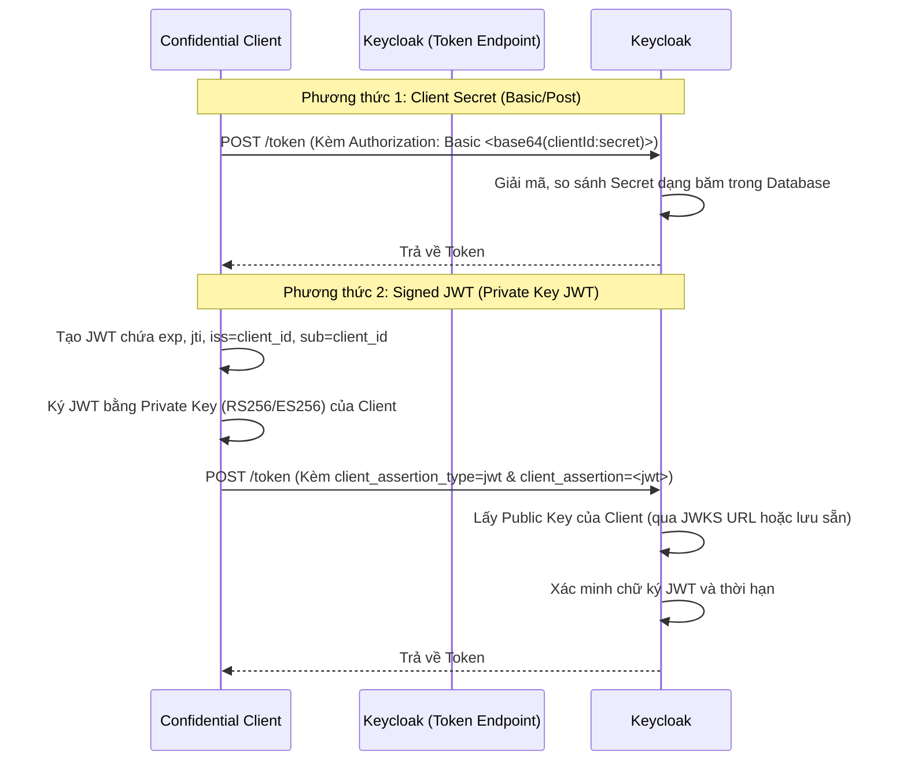

> [!NOTE]
> **Category:** Theory (Lý thuyết)
> **Goal:** Hiểu sâu các phương thức Xác thực Ứng dụng (Client Authentication) trong Keycloak, phân biệt các mức độ tin cậy và cách áp dụng chứng thư số/mật mã học cho bảo mật Enterprise.

### 1. Lý thuyết chuyên sâu (Detailed Theory)
Trong hệ sinh thái OAuth 2.0 / OIDC, không chỉ Người dùng (User) mới cần xác thực, mà bản thân các Ứng dụng gọi đến hệ thống (Client) cũng phải chứng minh danh tính của chúng. Quá trình này được gọi là **Client Authentication**.
Keycloak phân loại Client thành hai nhóm chính:
- **Public Client:** Các ứng dụng không thể bảo vệ bí mật một cách an toàn (Ví dụ: Single Page Apps chạy trên trình duyệt người dùng, hoặc Mobile Apps). Các ứng dụng này không tham gia Client Authentication (vì nếu có Client Secret, ai mở mã nguồn cũng thấy được).
- **Confidential Client:** Các ứng dụng phía máy chủ (Backend Services) có khả năng giấu kín thông tin bảo mật. Đối với loại này, Keycloak yêu cầu phải thực hiện Client Authentication mỗi khi gọi API lấy Token (`/token` endpoint). 
Keycloak hỗ trợ nhiều phương thức xác thực cho Confidential Client từ cơ bản đến nâng cao: Client ID & Secret, Signed JWT (Private Key JWT), và X.509 Certificate (mTLS).

### 2. Luồng nội bộ & Cơ chế cấp thấp (Internal Workflow & Low-level Mechanisms)



### 3. Thực hành tốt nhất & Bảo mật (Best Practices & Security)
- **Hạn chế dùng Client Secret:** Dù phổ biến nhưng việc truyền tĩnh một chuỗi bí mật (Secret) qua mạng luôn tiềm ẩn rủi ro nếu TLS bị phá vỡ. Khuyến nghị chuyển sang **Signed JWT** hoặc **mTLS**.
- **Sử dụng Signed JWT với JWKS:** Thay vì tải Public Key trực tiếp lên Keycloak, hãy cấu hình Client cung cấp một đường dẫn JWKS (JSON Web Key Set). Khi Client xoay vòng khóa (Key Rotation), Keycloak sẽ tự động tải Public Key mới mà không gây gián đoạn hệ thống.
- **Mutual TLS (mTLS):** Đối với các ứng dụng cấp độ ngân hàng (Open Banking / FAPI), phương pháp an toàn nhất là X.509 Certificate Authentication (mTLS). Trong đó, kết nối vật lý lớp mạng đã xác thực danh tính Client bằng chứng thư điện tử trước cả khi Request đến tầng HTTP của Keycloak.
> [!IMPORTANT]
> Khi sử dụng phương thức Client Secret, hãy cấu hình Keycloak mã hóa Secret trong cơ sở dữ liệu thay vì lưu plaintext. Và không bao giờ gửi Secret trực tiếp lên frontend.

### 4. Cấu hình minh họa thực tế (Configuration Examples)
Cấu hình Client xác thực bằng **Signed Jwt**:
1. Trong Keycloak, mở Client tương ứng, bật `Client authentication`.
2. Tại tab `Credentials`, mục `Client Authenticator`, chọn `Signed Jwt`.
3. Trong mục `Signature Algorithm`, chọn `RS256`.
4. Có hai cách cung cấp khóa cho Keycloak:
   - Cách 1 (Thủ công): Ở tab `Keys`, sinh khóa bằng Keycloak và tải file `.keystore` về ứng dụng.
   - Cách 2 (Khuyên dùng): Điền `JWKS URL` của ứng dụng bạn để Keycloak tự fetch Public Key.
5. Ứng dụng Backend phải dùng thư viện JWT để tạo và ký token, sau đó gửi lên Keycloak:
```bash
curl -X POST http://localhost:8080/realms/myrealm/protocol/openid-connect/token \
  -d 'grant_type=client_credentials' \
  -d 'client_id=my_client' \
  -d 'client_assertion_type=urn:ietf:params:oauth:client-assertion-type:jwt-bearer' \
  -d 'client_assertion=eyJhbGciOiJSU...<signed_jwt>'
```

### 5. Trường hợp ngoại lệ (Edge Cases)
- **Clock Skew khi dùng Signed JWT:** Nếu thời gian hệ thống của Client chạy nhanh hoặc chậm hơn server Keycloak vài phút, Keycloak có thể từ chối JWT (lỗi `Token not active yet` hoặc `Token expired`). **Giải pháp:** Cần đồng bộ thời gian hai server qua NTP (Network Time Protocol) và có thể cấu hình độ trễ cho phép (Clock Skew) ở mức hệ thống nếu cần.
- **Lỗi hết hạn Key (Key Expiry):** Trong mô hình x509 mTLS hoặc JWT, chứng chỉ/khóa đều có thời hạn. Nếu DevOps quên xoay vòng khóa, toàn bộ quá trình giao tiếp M2M sẽ chết đứng. Phải có hệ thống Monitoring cảnh báo trước 30 ngày.
- **Client Assertion Tái sử dụng (Replay Attack):** Kẻ tấn công có thể nghe lén và gửi lại chính cái JWT mà Client vừa gửi. Keycloak có tính năng kiểm tra tham số `jti` (JWT ID) để ngăn chặn việc tái sử dụng Assertion. Mỗi lần ký, ứng dụng phải sinh một `jti` ngẫu nhiên.

### 6. Câu hỏi Phỏng vấn (Interview Questions)
1. **Câu hỏi (Junior):** Phân biệt Public Client và Confidential Client?
   - *Đáp án:* Public Client (như SPA, Mobile) không thể giữ bí mật nên không yêu cầu xác thực Client. Confidential Client (như Backend Server) có thể bảo mật tốt, do đó Keycloak yêu cầu phải có Client Secret hoặc cấu hình xác thực riêng.
2. **Câu hỏi (Junior):** Tại sao Client Secret qua phương thức "Client ID and Secret (Basic Auth)" an toàn hơn "Post"?
   - *Đáp án:* Header Basic Auth khó bị log ra ở các hệ thống trung gian hơn là dữ liệu truyền trong HTTP Body (Post). Dù vậy cả hai đều dễ bị lộ nếu không dùng HTTPS.
3. **Câu hỏi (Senior):** Giải thích cơ chế hoạt động của "Signed JWT" trong Client Authentication.
   - *Đáp án:* Ứng dụng Client dùng Private Key tự ký một JWT assertion (chứa thông tin bản thân nó) và gửi lên Keycloak. Keycloak dùng Public Key của Client để verify chữ ký. Không có chuỗi secret tĩnh nào được truyền trên mạng.
4. **Câu hỏi (Senior):** Trong tiêu chuẩn FAPI (Financial-grade API), tại sao mTLS lại được bắt buộc đối với Client Authentication?
   - *Đáp án:* mTLS xác thực ở tầng giao thức kết nối (Transport Layer). Nó đảm bảo rằng kết nối mã hóa điểm-tới-điểm này thực sự được thiết lập bởi một Client sở hữu Private Key của chứng thư X.509 hợp lệ, giúp chống giả mạo IP và chống trộm Token tuyệt đối (Certificate Bound Tokens).
5. **Câu hỏi (Senior):** Giải quyết tình trạng downtime do hết hạn Public Key như thế nào khi dùng Signed JWT?
   - *Đáp án:* Thiết lập một JWKS endpoint trên ứng dụng Client. Khi Client chuẩn bị đổi khóa, nó expose cả khóa cũ và khóa mới. Keycloak sẽ tự động tải các khóa này về, đảm bảo quá trình chuyển đổi liền mạch không có thời gian chết.

### 7. Tài liệu tham khảo (References)
- [OAuth 2.0 Client Authentication (RFC 6749)](https://datatracker.ietf.org/doc/html/rfc6749#section-2.3)
- [JSON Web Token (JWT) Profile for OAuth 2.0 Client Authentication (RFC 7523)](https://datatracker.ietf.org/doc/html/rfc7523)
