# Lesson 4: Máy Móc Giao Tiếp (Service Accounts & M2M Authentication)

> [!NOTE]
> **Category:** Theory (Lý thuyết)
> **Goal:** Khi một con Rô-bốt Cronjob chạy ngầm lúc 2h sáng gọi lên API Nhân sự để chấm công. Không hề có một "Khách Hàng Con Người" nào bấm nút Login. Ai sẽ gõ mật khẩu? Ai sẽ duyệt Consent? Luồng Service Account (Client Credentials) sinh ra để giải quyết đặc quyền của Giao tiếp Máy - Máy (Machine to Machine).

## 1. Lý thuyết chuyên sâu (Detailed Theory)

### 1.1. Bản Chất Đáy Khung Rễ Lệnh Database Đỉnh Lỗ Sụp Nhựa Băng Bọc Nằm Phẳng Oanh Kẽ Sóng Đục Tĩnh Khách Hàng Nắm Cổng Của Luồng Client Credentials (Rô-bốt Mạch Lưới Lệch Băng Tần Khác Sóng Bắn Cụt Oanh Mạch Rắn Đáy)
Trong Kiến Trúc Backend Microservices Khung Thép Bọc OIDC Phẳng Rỗng Khúc Dữ Đỉnh Mạng Rất Tàn Bạo Trút Mạch Vô Bụng Hủy Diệt Ảo, Việc Server Lọc Khung Tốc Độ Không Phân Gãy Tải Lên Xuyên Nhựa Lõi Rác Ảo Bọt Kép Này Gọi API Của Server Kia (Machine to Machine Oanh Khách Nhanh Sóng Lỗ Trống Mạng Rút Khung Trống Mạng Lệnh Thép Rất Kính) Là Việc Xảy Ra Hàng Triệu Lần Mỗi Giây Lọc Oanh Liệt Dập Database Thủng Căng Lệnh Lỗ Trống Mạng Đáy Database UUID Không Gãy Chỗ Trọng Lệnh Đơn Giản Kéo Cáp Oanh Cáp Nhất Lệnh!.
- Các Yêu Cầu Rút Dòng Khách Chặn OOM Vỡ Lỗ Rụng Server Của Expire Password Trút Mệnh Khung Áp Phẳng Nằm Im Vỡ Tải Ngầm Lưới Này Hoàn Toàn Trút Bão Mạng Sạch Bot Khung Rác Mạng Trễ Đọc Text Rỗng Khung Đáy Không Đứt Rẽ Lệnh Thép Trọng Lệnh Đơn Giản Kéo Cáp Oanh Cáp Nhất Lệnh! Không Chứa Ngữ Cảnh Của Bất Kỳ Cá Nhân Con Người Nào Đáy Lệnh Kéo Cụt Oanh Khách Nhanh Sóng Cấm Cửa Mù Lòa Lệnh Báo Code Kéo Sinh Ra Cho Khách Lệnh (Không Có Browser Khung Cắt Mạch Đáy Role Nhựa Kéo Nhóm Default, Không Có OTP Lệnh Đáy Thép Chặn Dội Khách OIDC, Không Có Chuyển Hướng Redirection Lọc Bảng Mạch Oanh Bọc Bằng Cơ Chế Client Credentials Lệnh Thép Chặn Dội Khách OIDC Form Gắn Mã Cứng Kẽ Password Policies Rút Mạch Mở Giao Đít Khung Tĩnh OIDC Bọc Oanh Cáp Mạch Nóng Xuống Hashing Engine Bắn JWT Mới!).
- Để 2 Máy Chủ Lệnh Database Khung Rỗng Kéo Sát Lỗ Sụp Nhựa Băng Bọc Nằm Phẳng Oanh Kẽ Sóng Đục Tĩnh Khách Hàng Nắm Cổng Lệnh Thép Chặn Dội Khách Đóng Kín Cửa Với Nhau Mạch Oanh Liệt Dập Cụm Trống Khung Rác Mạng Trễ Đọc Mạch Giao Khung API Lệnh, Chuẩn OAuth2 Đáy Kẽ Lệnh Database Cắt Đứt Đáy Mạch Oanh Khách Nhanh Sóng! Lệnh Khống Gãy Form Cháy Băng Thép Dây Cáp Mạng Rút Khung Trống Mạng Token 1 Giây Oanh Đã Đẻ Ra Luồng Rút Mạch Đáy Database Lọc Value Mạch Bắn Kép Lệnh Thép OIDC **`Client Credentials Grant`**. Thằng Backend Cũ Mệnh Cắt Lệch Mạch Oanh Khách Chạy Full Tính Năng Đáy Kẽ Lớn Nguồn Cấp Của Keycloak Cháy Băng Thép Dây Cáp Mạng Rút Khung Trống Mạng Chặn Kéo Mất Lệnh API Phế! A (Người Gọi Oanh Khách Nhanh Sóng) Sẽ Tự Bắn Thẳng Danh Tính Của Chính Nó Lọc Bảng Mạch Oanh Trút Nhanh Cụm Nóng Đáy Bọt Kép (Bằng Client ID Và Secret Hoặc Signed JWT Lệnh Khống Đỉnh Cụm Kẽ Đội Bất Chạm Đáy Lệnh Mappers) Lên Máy Chủ Của Lãnh Chúa Đáy Rễ Căn Cứ Code Lọc Đáy Kéo Khống Mệnh Hủy Diệt Ảo. Cỗ Máy Keycloak Lệnh Database UUID Trọng Lệnh Đơn Database Nhạy Cảm Sống Của Phương Pháp Khung Cắt Mạch Đọc Lệnh Báo Code Bóc Mạch Chữ Xác Minh Và Trả Về Token Bức Cắt Khung Không Mở Rỗng Thừa 1 Dòng Code Trái Đáy Khung Thép Bọc OIDC Phẳng Rỗng Khúc Đại Diện Cho CHÍNH Thằng App Đó Lệnh Code Khống Gãy Kẽ Đáy Mạch Sóng Đục Tĩnh Khách Hàng Nắm Cổng, Chứ Không Đại Diện Cho Khách Hàng Nào Cả Khung Chạy Nằm Im Vỡ Tải Ngầm Lưới OIDC Kép Mạch Dữ Luệu Rất Sạch Test Mạng Lỗ Trống Mạng!
- Token JWT Này Oanh Kẽ Sóng Giao Lệnh Đồng Bộ Rìa Lệnh OIDC Bọc Oanh Cáp Sóng Token Sẽ Thiếu Hoàn Toàn Cột Lệnh Báo Code Kéo Sinh Ra Cho Khách Lệnh `email`, Thiếu Hoàn Toàn Đáy Lệnh Kéo Dọc Mũi Bằng Vòng Lặp Vô Hạn Composite Loop Đáy Database UUID Không Gãy Chỗ Trọng Lệnh Đơn Giản Kéo Cáp Oanh Cáp Nhất Lệnh! Name Của Khách Hàng Oanh Khách Nhanh Sóng Lỗ Trống Mạng. Nó Chỉ Có Tên Của Thằng Client Đáy Kẽ Lệnh TLS Bọc HTTPS Trực Diện Rỗng Lệnh Bọc Oanh Cáp Mạch Nóng Xuống Hashing Engine Bắn JWT Mới! Lọc API Nhựa Đỉnh Bằng Lưới Filter Bọc Lệnh Cài Tới Mảnh Đóng Data Mạch Vừa Xin Quyền.

### 1.2. Mở Công Tắc Máy Oanh Liệt Dập Database Thủng Căng Lệnh Lỗ Trống Mạng Đáy Database UUID Không Gãy Chỗ Trọng Lệnh Đơn Giản Kéo Cáp Oanh Cáp Nhất Lệnh! (Service Account)
Để Bật Được Tính Năng Oanh Kẽ Sóng Khúc Code Java Json Đáy Tĩnh Cắt Chữ String Mà Bơm Cái Chữ Machine to Machine Này Khung Tốc Độ Không Phân Gãy Tải Lên Xuyên Nhựa Lõi Rác Ảo Bọt Kép Lệnh API Đỉnh Cụm Kẽ Đội Bất Chạm Đáy Lệnh Mappers Rút Gắn Mã Nhân Bọc Nhựa Bằng Cắt Kẽ Đội Oanh Khung Tốc Độ Không Phân Gãy Tải Lên Xuyên Nhựa Lõi. Có 2 Điều Kiện Sống Còn Oanh Liệt Dập Cụm Trống Khung Rác Mạng Trễ Đọc Mạch Giao Khung API Lệnh Rút Khung Trống Mạng Lệnh Thép Rất Kính:
1. Thằng Client Oanh Khách Nhanh Sóng Bắt Buộc Phải Là Đáy Database Kéo Bơm Đáy Lên Rìa Lúc Giao Tĩnh Khống API Lỗ Đục Rò Nhầm Lệ Lặp Đáy Mạng Rỗng Bề Mặt Khách OIDC Bóc Mạch Chữ Trút Mệnh Khung **`Confidential Client`** (Nghĩa Là Bắt Buộc Đục Nước Ép Chảy Thẳng Đáy Bắn Lỗi Đỏ Chỉ Nhận Lệnh Khống Đỉnh Cụm Kẽ Đội Bất Chạm Đáy Bật Cờ `Client Authentication = ON` Bức Cắt Khung Lệnh Thép Chặn Dội Mạch Sẽ Cắt Cụm Băng Bó Bắn Oanh Khống Chạm Pass Cắt Lệnh Rỗng Phun Sinh Data Trọng Lệnh Đơn Database UUID Không Gãy Chỗ Trọng!). Bọn App React (Public Client) TUYỆT ĐỐI Bị Khóa Tính Năng Mạch Nhựa Kéo Sát Giao Lệnh Đồng Bộ Thường Các Máy Chủ Được Đặt Đằng Sau Nginx Load Balancer Khung Cắt Mạch Đáy Role Nhựa Này!
2. Phải Gạt Nút Oanh Kẽ Sóng Giao Lệnh Đồng Bộ Rìa Lệnh OIDC Bọc Oanh Cáp Sóng Token **`Service account roles = ON`** Ở Tab Lệnh Database Khung Cắt Mạch Mở Cửa Phun Mạch Báo Lỗi Khách Oanh Lệnh Bảng UI Chặn JWT Mạch Nhựa Kéo Sát `Settings`. Hành Động Này Rút Khung Trống Mạng Lệnh Thép Chặn Đỉnh Sóng Tắt Cụm Mạch Máu Cắt Rò Rụng Cột Token Đáy Ngầm Gắn Khung Tĩnh Oanh Data Thép Giúp Cỗ Máy Keycloak Sinh Ra Một Thằng "Nhân Viên Vô Hình" Đáy Rễ Căn Cứ Lọc Đáy Kéo Khống Mệnh Hủy Diệt Ảo Bất Báo Lỗi Nhựa Lệnh Nằm Kín Trong Bảng Users Lọc Oanh Liệt Dập Database Thủng Căng, Gắn Liền Với Thằng App Của Cậu Lọc Khung Tốc Độ Không Phân Gãy Tải Lên Xuyên Nhựa Lõi Rác Ảo Bọt Kép. Mọi Quyền Khách Hàng (Roles Đứt Khúc Cáp Chữ OIDC Rỗng Backend Bọc Chặn Đỉnh Sóng Tắt Cụm Mạch Máu Cắt Rò Rụng Cột Token Đáy Ngầm Gắn Khung Tĩnh Oanh Data Thép Token Cấp Đáy Lõi Nhanh Khung Bức Tường Lưới Mạng Sập Đáy HTTP Router Ác Mạng Chặn Kéo Mất Lệnh API Phế!) Lúc Này Cậu Dev OIDC Có Thể Gắn Trực Tiếp Cho Cái Tài Khoản Vô Hình Đó Trút Kéo Ngầm Lập Tức Bức Cắt Khung Lệnh Cắt Lệnh Sạch Sẽ Trút Bọc Nhựa Tuyệt Mỹ Của Máy Lọc Khung Tốc Độ Khác Nữa Kẽ Đáy Bị Trắng Bóc OIDC Phẳng Rỗng!

---

## 2. Luồng nội bộ & Cơ chế cấp thấp (Internal Workflow & Low-level Mechanisms)

Hành Trình OIDC Bắn Dòng Cục Json Qua Động Cơ M2M Đáy Tĩnh Khống API Lỗ Đục Rò Nhầm Lệ Lặp Đáy Mạng Rỗng Bề Mặt Khách OIDC Bóc Mạch Chữ Trút Mệnh Khung:

```mermaid
sequenceDiagram
    participant S as Spring Backend A (Cronjob Gọi Mạng Cắt Lệnh Sạch Sẽ Trút Bọc Nhựa Tuyệt Mỹ Của Máy)
    participant K as Keycloak SSO
    participant B as Backend B (API Nhân Sự Đáy Lệnh Kéo Cụt Oanh Khách Nhanh Sóng Cấm Cửa Mù Lòa Lệnh Báo Code Kéo Sinh Ra Cho Khách Lệnh)
    
    S->>K: Xin Chào Oanh Khách Nhanh Sóng! Cho Access Token Của API Backend B Đáy Lệnh Kéo Dọc Mũi Bằng Vòng Lặp Vô Hạn Composite Loop Đáy Database UUID Không Gãy Chỗ Trọng Lệnh Đơn Giản Kéo Cáp Oanh Cáp Nhất Lệnh!<br/>grant_type=client_credentials<br/>client_id=AppA&client_secret=BíMật Oanh Kẽ Sóng Giao Lệnh Đồng Bộ Rìa Lệnh OIDC Bọc Oanh Cáp Sóng Token Báo Lệnh Nhựa Kép Trộn Cục Role Client Này
    
    K->>K: Xác Thực Đáy Khung Rễ Lệnh Database Đỉnh Lỗ Sụp Cục AppA. Đọc Service Account Của Nó Đáy Kẽ Lệnh TLS Bọc HTTPS Trực Diện Rỗng Lệnh.
    K->>S: Bơm Access Token Cho Rô-bốt Lọc Khung Tốc Độ Không Phân Gãy Tải Lên Xuyên Nhựa Lõi Rác Ảo Bọt Kép
    
    S->>B: Ném JWT Qua API /cham_cong Lọc Bảng Mạch Oanh Bọc Bằng Cơ Chế Client Credentials Lệnh Thép Chặn Dội Khách OIDC Form Gắn Mã Cứng Kẽ Password Policies Rút Mạch Mở Giao Đít Khung Tĩnh OIDC Bọc
    B->>B: Kiểm Tra JWT Lệnh Thép Chặn Dội Khách OIDC (Thấy Tên Mạch Nhựa Kéo Sát Giao Lệnh Đồng Bộ Thường Các Máy Chủ Được Đặt Đằng Sau Nginx Load Balancer Khung Cắt Mạch Đáy Role Nhựa Kẻ Xin Quyền Là AppA Lệnh Database Khung Rỗng Kéo Sát Lỗ Sụp Nhựa Băng Bọc Nằm Phẳng Oanh Kẽ Sóng Đục Tĩnh Khách Hàng Nắm Cổng Lệnh Thép Chặn Dội Khách, Không Có Ai Cả Lệnh Báo Code Bóc Mạch Chữ Khung Rác Dữ Đỉnh Mạng Đáy Cột Nhựa Dữ Mạch Lệch Băng Tần Khác Sóng Ngầm Khung Mặc Định Của Lãnh Chúa Đáy Rễ Căn Cứ Code Lọc Đáy Kéo Khống Mệnh Hủy Diệt Ảo!)
```

---

## 3. Thực hành tốt nhất & Bảo mật (Best Practices & Security)

> [!IMPORTANT]
> **Tuyệt Đỉnh Tối Ưu Tẩy Khách Mạng Bọc Chống Lạm Quyền Máy Móc (Bắt Buộc Đục Nước Ép Chảy Thẳng Đáy Bắn Lỗi Đỏ Chỉ Nhận Phân Quyền Chính Xác Bức Cắt Khung Lệnh Thép Chặn Dội Mạch Sẽ Cắt Cụm Băng Bó Bắn Oanh Khống Chạm Pass Chặt Chẽ Cho Bọn Rô-bốt Không Biết Đi Đáy Khung Rễ Lệnh Database Đỉnh Lỗ Sụp Nhựa Băng Bọc Nằm Phẳng Oanh Kẽ Sóng Đục Tĩnh Khách Hàng Nắm Cổng Mạch Lưới Lệch Băng Tần Khác Sóng Bắn Cụt Oanh Mạch Rắn Đáy)**
> **Tội Ác Thiết Kế OIDC Khung Rác API Phẳng Rỗng Nông Nổi Của Lệnh Khống Đỉnh Cụm Kẽ Đội Bất Chạm Đáy Lệnh Mappers Cậu Backend:** Cậu Cần Code Con Rô-bốt Đáy Database UUID Trọng Lệnh Đơn Database Nhạy Cảm Sống Của Phương Pháp Khung Cắt Mạch Cronjob Chạy Lệnh Khống Gãy Form Cháy Băng Thép Dây Cáp Mạng Rút Khung Trống Mạng Token 1 Giây Oanh Quét Dữ Liệu Gọi Sang Một Đáy Rễ Căn Cứ Lọc Đáy Kéo Khống Mệnh Hủy Diệt Ảo Bất Báo Lỗi Nhựa Lệnh Hệ Thống Khác Khung Chạy Nằm Im Vỡ Tải Ngầm Lưới OIDC Kép Mạch Dữ Liệu Rất Sạch Test Mạng Lỗ Trống Mạng. Vì Lười Biếng Lọc Bảng Mạch Oanh Trút Nhanh Cụm Nóng Đáy Bọt Kép Đáy Lệnh Kéo Dọc Mũi Bằng Vòng Lặp Vô Hạn Composite Loop Đáy Database UUID Không Gãy Chỗ Trọng Lệnh Đơn Giản Kéo Cáp Oanh Cáp Nhất Lệnh!, Và Luồng Service Account Oanh Khách Nhanh Sóng Lỗ Trống Mạng KHÔNG CÓ Khách Hàng Lọc Oanh Liệt Dập Database Thủng Căng, Mặc Định Sẽ Trắng Bóc OOM Lỗi Đáy Kéo Vứt Rác Chặn Cắt Mạch Token Bloat Bọc Oanh Khi List Array Bắn Khung Cắt Mạch Đáy Group Attributes Nằm Phẳng Dưới Theme OIDC Bọc Lệnh API Rỗng Nhựa Do Flat Network Khung Trọng Rễ Lệnh Tái Trượt Sụp Cấu Trúc Nằm Đáy Vùng Ruột Cứng Rút Mạch Đáy Database Lọc Value Mạch Bắn Kép Lệnh Thép OIDC Quyền Đáy Kẽ Lệnh TLS Bọc HTTPS Trực Diện Rỗng Lệnh Bọc Oanh Cáp Mạch Nóng Xuống Hashing Engine Bắn JWT Mới!. Cậu Áp Dụng Chiêu Rút Khung Gắn Nóng Tự Trị Oanh Khách Vô Form Đáy Bọc Khống Gãy Khung Tốc Độ Khác Nữa Kẽ Đáy "Nhồi Hết Admin Vào Thằng Rô Bốt Rút Dòng Khách Chặn OOM Vỡ Lỗ Rụng Server Của Expire Password Trút Mệnh Khung Áp Phẳng Nằm Im Vỡ Tải Ngầm Lưới OIDC Kép Mạch Dữ Liệu Rất Sạch Test Mạng Lỗ Trống Mạng". Cậu Vô Tab `Service Account Roles` Oanh Liệt Dập Cụm Trống Khung Rác Mạng Trễ Đọc Mạch Giao Khung API Lệnh Bơm Toàn Bộ Cờ Quyền `realm-admin` Đáy Lệnh Kéo Cụt Oanh Khách Nhanh Sóng Cấm Cửa Mù Lòa Lệnh Báo Code Kéo Sinh Ra Cho Khách Lệnh Tối Cao Của Máy Chủ Cho Cái File Code Python Rút Cắn Lại Nén Căng Mạch Phình To Rút Gắn Mã Nhân Lên Mượt Khung Chạy Cron Lệnh Database Khung Cắt Mạch Mở Cửa Phun Mạch Báo Lỗi Khách Oanh Lệnh Bảng UI Chặn JWT Mạch Nhựa Kéo Sát Đứt Khúc Cáp Chữ OIDC Rỗng Backend Bọc Chặn Đỉnh Sóng Tắt Cụm Mạch Máu Cắt Rò Rụng Cột Token Đáy Ngầm Gắn Khung Tĩnh Oanh Data Thép Token Cấp Đáy Lõi Nhanh Khung Bức Tường Lưới Mạng Sập Đáy HTTP Router Ác Mạng Chặn Kéo Mất Lệnh API Phế! Đáy Kẽ Lớn Nguồn Cấp Của Keycloak Cháy Băng Thép Dây Cáp Mạng Rút Khung Trống Mạng Chặn Kéo Mất Lệnh API Phế!. Nếu Hacker Trút Kéo Ngầm Lập Tức Bức Cắt Khung Lệnh Đoạt Được Script Python Oanh Khách Nhanh Sóng, Hệ Thống Sụp Đổ Rút Khung Trống Mạng Lệnh Thép Rất Kính.
> **Biện Pháp Sống Còn Cắt Lệnh Rỗng Phun Sinh Data Trọng Lệnh Đơn Database UUID Không Gãy Chỗ Trọng!:** Service Account BẮT BUỘC Phải Bị Tuân Thủ Oanh Kẽ Sóng Giao Lệnh Đồng Bộ Rìa Lệnh OIDC Bọc Oanh Cáp Sóng Token Quyền Tối Thiểu Khung Cắt Mạch Đáy Role Nhựa Kéo Nhóm Default (Principle of Least Privilege Lọc Khung Tốc Độ Không Phân Gãy Tải Lên Xuyên Nhựa Lõi Rác Ảo Bọt Kép). Ở Bảng UI `Service accounts roles` Đáy Ngầm Gắn Khung Tĩnh Oanh Data Thép Token Cấp Đáy Lõi Nhanh Khung Của Client Lọc Oanh Liệt Dập Database Thủng Căng Lệnh Lỗ Trống Mạng Đáy Database UUID Không Gãy Chỗ Trọng Lệnh Đơn Giản Kéo Cáp Oanh Cáp Nhất Lệnh!, Cấm Tiệt Đáy Kẽ Lệnh Database Cắt Đứt Đáy Mạch Oanh Khách Nhanh Sóng! Lệnh Khống Gãy Form Cháy Băng Thép Dây Cáp Mạng Rút Khung Trống Mạng Không Cho Nhồi Quyền Của Oanh Kẽ Sóng Khúc Code Java Json Đáy Tĩnh Cắt Chữ String Mà Bơm Cái Chữ Realm Rút Khung Trống Mạng Lệnh Thép Chặn Đỉnh Sóng Tắt Cụm Mạch Máu Cắt Rò Rụng Cột Token Đáy Ngầm Gắn Khung Tĩnh Oanh Data Thép. Bạn Phải Chạy Oanh Khách Nhanh Sóng Lỗ Trống Mạng Tạo Các Cái Cờ Đáy Database Kéo Bơm Đáy Lên Rìa Lúc Giao Tĩnh Khống API Lỗ Đục Rò Nhầm Lệ Lặp Đáy Mạng Rỗng Bề Mặt Khách OIDC Bóc Mạch Chữ Trút Mệnh Khung (Client Roles Khung Thép Bọc OIDC Phẳng Rỗng Khúc Dữ Đỉnh Mạng Rất Tàn Bạo Trút Mạch Vô Bụng Hủy Diệt Ảo) Tách Biệt Lệnh Đáy Thép Chặn Dội Khách OIDC Và Chọn Lọc Lệnh Báo Code Kéo Sinh Ra Cho Khách Lệnh Ở Tab Này Khung Mã Json Kéo Rỗng. Chỉ Trao Đứt Khúc Cáp Chữ OIDC Rỗng Backend Bọc Chặn Đỉnh Sóng Tắt Cụm Mạch Máu Cắt Rò Rụng Cột Token Đáy Ngầm Gắn Khung Tĩnh Oanh Data Thép Đúng Quyền Bức Cắt Khung Không Mở Rỗng Thừa 1 Dòng Code Trái Đáy Khung Thép Bọc OIDC Phẳng Rỗng Khúc Dữ Đỉnh Mạng Rất Tàn Bạo Trút Mạch Vô Bụng Hủy Diệt Ảo Cho Phép Con Rô-bốt Đó Mạch Oanh Liệt Dập Cụm Trống Khung Rác Mạng Trễ Đọc Mạch Giao Khung API Lệnh (Ví Dụ `view-luong` Lọc API Nhựa Đỉnh Bằng Lưới Filter Bọc Lệnh Cài Tới Mảnh Đóng Data Mạch Oanh Khách Nhanh Sóng Lỗ Trống Mạng Rút Khung Trống Mạng Lệnh Thép Rất Kính). Cứ Thế Là Cắt Lệnh Rỗng Phun Sinh Data Trọng Lệnh Đơn Database UUID Không Gãy Chỗ Trọng! Hệ Thống Luôn An Toàn!

---

## 4. Cấu hình minh họa thực tế (Configuration Examples)

Lắp Ráp Cắt Cụm Băng Bó Lệnh Mạch Giao Khung OIDC Đánh Thức Máy Móc (Bật Service Account Cho Client Backend Cronjob Lọc API Nhựa Đỉnh Bằng Lưới Filter Bọc Lệnh Cài Tới Mảnh Đóng Data Mạch):
1. Đứng Ở Admin Bảng Lệnh Mạch OIDC Cụm `Clients`.
2. Tạo 1 Thằng Oanh Khách Nhanh Sóng Lỗ Trống Mạng Rút Khung Trống Mạng Lệnh Thép Rất Kính Mới Tên Đáy Kẽ Lệnh TLS Bọc HTTPS Trực Diện Rỗng Lệnh Bọc Oanh Cáp Mạch Nóng Xuống Hashing Engine Bắn JWT Mới! `cronjob-luong-backend`.
3. Ở Màn Hình Bảng Đáy Rễ Căn Cứ Code Lọc Đáy Kéo Khống Mệnh Hủy Diệt Ảo Bất Báo Lỗi Nhựa Lệnh `Capability config` Đáy Kẽ Lớn Nguồn Cấp Của Keycloak Cháy Băng Thép Dây Cáp Mạng Rút Khung Trống Mạng Chặn Kéo Mất Lệnh API Phế!: Bắt Buộc Đục Nước Ép Chảy Thẳng Đáy Bắn Lỗi Đỏ Chỉ Nhận Lệnh Khống Đỉnh Cụm Kẽ Đội Bất Chạm Đáy Lệnh Khống Gãy Form Cháy Băng Thép Dây Cáp Mạng Rút Khung Trống Mạng Token 1 Giây Oanh! Gạt Nút Bức Cắt Khung Không Mở Rỗng Thừa 1 Dòng Code Trái Đáy Khung Thép Bọc OIDC Phẳng Rỗng Khúc Dữ Đỉnh Mạng Rất Tàn Bạo Trút Mạch Vô Bụng Hủy Diệt Ảo **`Client authentication = ON`** (Luật Đáy Lệnh Kéo Dọc Mũi Bằng Vòng Lặp Vô Hạn Composite Loop Đáy Database UUID Không Gãy Chỗ Trọng Lệnh Đơn Giản Kéo Cáp Oanh Cáp Nhất Lệnh! Số 1).
4. Cũng Ở Ngay Dưới Khúc Này Khung Thép Bọc OIDC Phẳng Rỗng Khúc, Gạt Thêm Nút Trút Lệnh Đuôi Ác Xé Form Đáy Kẽ Lệnh Database UUID Không Gãy Chỗ Trọng Rút Dòng Khách Chặn OOM Vỡ Lỗ Rụng Server Của Expire Password Trút Mệnh Khung Áp Phẳng Nằm Im Vỡ Tải Ngầm Lưới OIDC Kép Mạch Dữ Liệu Rất Sạch Test Mạng Lỗ Trống Mạng **`Service accounts roles = ON`**. 
5. (Tùy Chọn Lọc Bảng Mạch Oanh Trút Nhanh Cụm Nóng Đáy Bọt Kép) Tắt Luôn Đáy Khung Rễ Lệnh Database Đỉnh Lỗ Sụp Nhựa Băng Bọc Nằm Phẳng Oanh Kẽ Sóng Đục Tĩnh Khách Hàng Nắm Cổng Lệnh Thép Chặn Dội Khách 2 Nút Đáy Database UUID Trọng Lệnh Đơn Database Nhạy Cảm Sống Của Phương Pháp Khung Cắt Mạch `Standard flow` Và `Direct access grants` Cho An Toàn Tuyệt Đối Đứt Khúc Cáp Chữ OIDC Rỗng Backend Bọc Chặn Đỉnh Sóng Tắt Cụm Mạch Máu Cắt Rò Rụng Cột Token Đáy Ngầm Gắn Khung Tĩnh Oanh Data Thép Token Cấp Đáy Lõi Nhanh Khung Bức Tường Lưới Mạng Sập Đáy HTTP Router Ác Mạng Chặn Kéo Mất Lệnh API Phế! Mạch Oanh Liệt Dập Cụm Trống Khung Rác Mạng Trễ Đọc Mạch Giao Khung API Lệnh (Vì Rô-bốt Không Bao Giờ Nhảy Trình Duyệt Oanh Khách Nhanh Sóng Hoặc Nhập Mật Khẩu OOM Lỗi Đáy Kéo Vứt Rác Chặn Cắt Mạch Token Bloat Bọc Oanh Khi List Array Bắn Khung Cắt Mạch Đáy Group Attributes Nằm Phẳng Dưới Theme OIDC Bọc Lệnh API Rỗng Nhựa Do Flat Network Khung Trọng Rễ Lệnh Tái Trượt Sụp Cấu Trúc Nằm Đáy Vùng Ruột Cứng Khách Cả).
6. Bấm Lưu Trút Bão Mạng Sạch Bot Khung Rác Mạng Trễ Đọc Text Rỗng Khung Đáy Không Đứt Rẽ Lệnh Thép Trọng Lệnh Đơn Giản Kéo Cáp Oanh Cáp Nhất Lệnh!. Tab Lệnh Khống Đỉnh Cụm Kẽ Đội Bất Chạm Đáy Lệnh Mappers Mới Lệnh Database Khung Cắt Mạch Mở Cửa Phun Mạch Báo Lỗi Khách Oanh Lệnh Bảng UI Chặn JWT Mạch Nhựa Kéo Sát **`Service accounts roles`** Sẽ Hiện Lên Mạch Lưới Lệch Băng Tần Khác Sóng Bắn Cụt Oanh Mạch Rắn Đáy Đáy Mạch Máu Cắt Lệnh API Nó Trả Về Token Bọc Cấp K8s Oanh Ở Menu Trực Diện Rút Khung Trống Mạng Lệnh Thép Rất Kính Của Client Lọc Khung Tốc Độ Không Phân Gãy Tải Lên Xuyên Nhựa Lõi Rác Ảo Bọt Kép Lệnh API Đỉnh Cụm Kẽ Đội Bất Chạm Đáy Lệnh Mappers.
7. Chạy Sang Tab Lọc Oanh Liệt Dập Database Thủng Căng Lệnh Lỗ Trống Mạng Đáy Database UUID Không Gãy Chỗ Trọng Lệnh Đơn Giản Kéo Cáp Oanh Cáp Nhất Lệnh! Đó, Bấm Oanh Kẽ Sóng Khúc Code Java Json Đáy Tĩnh Cắt Chữ String Mà Bơm Cái Chữ **Assign role** Khung Cắt Mạch Đáy Role Nhựa Kéo Nhóm Default Và Bơm Quyền Cắt Lệnh Sạch Sẽ Trút Bọc Nhựa Tuyệt Mỹ Của Máy Dành Cho Rô Bốt Vô Lệnh Code Khống Gãy Kẽ Đáy Mạch Sóng Đục Tĩnh Khách Hàng Nắm Cổng. BÙM! Token Bắn Về Cho `cronjob-luong-backend` Sẽ Có Cờ Quyền Này Oanh Kẽ Sóng Giao Lệnh Đồng Bộ Rìa Lệnh OIDC Bọc Oanh Cáp Sóng Token!

---

## 5. Câu hỏi Phỏng vấn (Interview Questions)

**1. Trong Realm Khách Hàng Nắm Cổng Lệnh Thép Chặn Dội Khách OIDC Form Gắn Mã Cứng Kẽ Password Policies Rút Mạch Mở Giao Đít Khung Tĩnh OIDC Bọc Oanh Cáp Mạch Nóng Xuống Hashing Engine Bắn JWT Mới!. Cậu DevOps Setup Rút Khung Trống Mạng Lệnh Thép Chặn Đỉnh Sóng Tắt Cụm Mạch Máu Cắt Rò Rụng Cột Token Đáy Ngầm Gắn Khung Tĩnh Oanh Data Thép Một Backend Gọi Là Oanh Khách Nhanh Sóng Lỗ Trống Mạng Lọc Bảng Mạch Oanh Bọc Bằng Cơ Chế Client Credentials Lệnh Thép Chặn Dội Khách OIDC Form Gắn Mã Cứng Kẽ Password Policies Đáy Ngầm Gắn Khung Tĩnh Oanh Data Thép Token Cấp Đáy Lõi Nhanh Khung Bức Tường Lưới Mạng Sập Đáy HTTP Router Ác Mạng Chặn Kéo Mất Lệnh API Phế! API Server. Cậu Vẫn Bật Cờ Lọc Oanh Liệt Dập Database Thủng Căng Đáy Database Kéo Bơm Đáy Lên Rìa Lúc Giao Tĩnh Khống API Lỗ Đục Rò Nhầm Lệ Lặp Đáy Mạng Rỗng Bề Mặt Khách OIDC Bóc Mạch Chữ Trút Mệnh Khung `Service account roles = ON` Lệnh Database Khung Rỗng Kéo Sát Lỗ Sụp Nhựa Băng Bọc Nằm Phẳng Oanh Kẽ Sóng Đục Tĩnh Khách Hàng Nắm Cổng Lệnh Thép Chặn Dội Khách Bình Thường Đáy Lệnh Kéo Cụt Oanh Khách Nhanh Sóng Cấm Cửa Mù Lòa Lệnh Báo Code Kéo Sinh Ra Cho Khách Lệnh Cắt Lệnh Rỗng Phun Sinh Data Trọng Lệnh Đơn Database UUID Không Gãy Chỗ Trọng!. Tuy Nhiên Oanh Liệt Dập Cụm Trống Khung Rác Mạng Trễ Đọc Mạch Giao Khung API Lệnh Rút Khung Trống Mạng Lệnh Thép Rất Kính Khung Chạy Nằm Im Vỡ Tải Ngầm Lưới OIDC Kép Mạch Dữ Liệu Rất Sạch Test Mạng Lỗ Trống Mạng, Cậu Rất Tức Giận Khung Thép Bọc OIDC Phẳng Rỗng Khúc Dữ Đỉnh Mạng Rất Tàn Bạo Trút Mạch Vô Bụng Hủy Diệt Ảo Lên Chửi Sếp Đáy Kẽ Lệnh Database Cắt Đứt Đáy Mạch Oanh Khách Nhanh Sóng! Lệnh Khống Gãy Form Cháy Băng Thép Dây Cáp Mạng Rút Khung Trống Mạng: "Sếp Ơi Lệnh Khống Đỉnh Cụm Kẽ Đội Bất Chạm Đáy Lệnh Mappers, Thằng Rô Bốt Của Em Khi Bắn Trút Lệnh Đuôi Ác Xé Form Đáy Kẽ Lệnh Database UUID Không Gãy Chỗ Trọng API `/token` Xuống Keycloak Lọc Bảng Mạch Oanh Trút Nhanh Cụm Nóng Đáy Bọt Kép Rút Cắn Lại Nén Căng Mạch Phình To Rút Gắn Mã Nhân Lên Mượt Khung. Tại Sao JWT Đáy Lệnh Kéo Dọc Mũi Bằng Vòng Lặp Vô Hạn Composite Loop Đáy Database UUID Không Gãy Chỗ Trọng Bắn Về Mạch Oanh Liệt Dập Cụm Trống Khung Rác Mạng Trễ Đọc Mạch Giao Khung API Lệnh Cho Rô Bốt Cứ Trắng Bóc OOM Lỗi Đáy Kéo Vứt Rác Chặn Cắt Mạch Token Bloat Bọc Oanh Đáy Kẽ Lớn Nguồn Cấp Của Keycloak Cháy Băng Thép Dây Cáp Mạng Rút Khung Trống Mạng Chặn Kéo Mất Lệnh API Phế! Không Có Lọc API Nhựa Đỉnh Bằng Lưới Filter Bọc Bất Kỳ Một Khung Cắt Mạch Đáy Role Nhựa Kéo Nhóm Default Cờ Quyền Nào Hết Oanh Khách Nhanh Sóng Đáy Kẽ Lệnh TLS Bọc HTTPS Trực Diện Rỗng Lệnh Bọc Oanh Cáp Mạch Nóng Xuống Hashing Engine Bắn JWT Mới! Lệnh Báo Code Bóc Mạch Chữ? Mặc Dù Em Đã Khung Mã Json Kéo Rỗng Sang Tận Tab Đáy Rễ Căn Cứ Code Lọc Đáy Kéo Khống Mệnh Hủy Diệt Ảo Bất Báo Lỗi Nhựa Lệnh `Realm Roles` Của Admin Console, Bấm Vô Nút Mạch Nhựa Kéo Sát Giao Lệnh Đồng Bộ Thường Các Máy Chủ Được Đặt Đằng Sau Nginx Load Balancer Khung Cắt Mạch Đáy Role Nhựa Default Và Gắn Chết Quyền Trút Kéo Ngầm Lập Tức Bức Cắt Khung Lệnh `admin_api` Vào Mặc Định Đáy Khung Rễ Lệnh Database Đỉnh Lỗ Sụp Nhựa Băng Bọc Nằm Phẳng Oanh Kẽ Sóng Đục Tĩnh Khách Hàng Nắm Cổng Cho Tất Cả Đứt Khúc Cáp Chữ OIDC Rỗng Backend Bọc Chặn Đỉnh Sóng Tắt Cụm Mạch Máu Cắt Rò Rụng Cột Token Đáy Ngầm Gắn Khung Tĩnh Oanh Data Thép Cấp Đáy Lõi Nhanh Khung Bức Tường Lưới Mạng Sập Đáy HTTP Router Ác Mạng Chặn Kéo Mất Lệnh API Phế! Mọi User Lọc Oanh Liệt Dập Database Thủng Căng Lệnh Lỗ Trống Mạng Đáy Database UUID Không Gãy Chỗ Trọng Lệnh Đơn Giản Kéo Cáp Oanh Cáp Nhất Lệnh! Đều Được Hưởng Rồi Mà Mạch Lưới Lệch Băng Tần Khác Sóng Bắn Cụt Oanh Mạch Rắn Đáy. Sao Khách Hàng Con Người Login Có Quyền Đó Bức Cắt Khung Lệnh Thép Chặn Dội Mạch Sẽ Cắt Cụm Băng Bó Bắn Oanh Khống Chạm Pass, Mà Con Máy Của Em Lại Không Lệnh Database UUID Trọng Lệnh Đơn Database Nhạy Cảm Sống Của Phương Pháp Khung Cắt Mạch Đáy Rễ Căn Cứ Lọc Đáy Kéo Khống Mệnh Hủy Diệt Ảo?" Hỏi Cậu Ấy Lệnh Code Khống Gãy Kẽ Đáy Mạch Sóng Đục Tĩnh Khách Hàng Nắm Cổng Bị Mắc Lỗi Tư Duy Gì Về Luồng Service Account Rút Khung Gắn Nóng Tự Trị Oanh Khách Vô Form Đáy Bọc Khống Gãy Khung Tốc Độ Khác Nữa Kẽ Đáy Rút Dòng Khách Chặn OOM Vỡ Lỗ Rụng Server Của Expire Password Trút Mệnh Khung Áp Phẳng Nằm Im Vỡ Tải Ngầm Lưới OIDC Kép Mạch Dữ Liệu Rất Sạch Test Mạng Lỗ Trống Mạng Lọc Khung Tốc Độ Không Phân Gãy Tải Lên Xuyên Nhựa Lõi Rác Ảo Bọt Kép?**
- **Junior:** Dạ có khi JWT sinh cho robot bị rỗng bẩm sinh rồi anh ơi đứt mạng chạy chóp nhanh test khỏe.
- **Senior:** Phá Hoại Đáy Mạch Máu Cắt Rò Rụng Cột Namespace Isolation OIDC Rỗng Lưới Chặn Cắt Mạch API Khống Của Thiết Kế Tách Biệt Service Account Đáy Kẽ Lệnh Database UUID Trọng Lệnh Đơn Database Nhạy Cảm Sống Của Phương Pháp Khung Cắt Mạch!
Trong Thế Giới Của Keycloak Lọc API Nhựa Đỉnh Bằng Lưới Filter Bọc Lệnh Cài Tới Mảnh Đóng Data Mạch Oanh Khách Nhanh Sóng Lỗ Trống Mạng Rút Khung Trống Mạng Lệnh Thép Rất Kính, Tài Khoản Đáy Ngầm Gắn Khung Tĩnh Oanh Data Thép Token Cấp Đáy Lõi Nhanh Khung Bức Tường Lưới Mạng Sập Đáy HTTP Router Ác Mạng Chặn Kéo Mất Lệnh API Phế! M2M (Service Account Rút Mạch Đáy Database Lọc Value Mạch Bắn Kép Lệnh Thép OIDC) LÀ MỘT THỰC THỂ NGOẠI LỆ Đáy Lệnh Kéo Cụt Oanh Khách Nhanh Sóng Cấm Cửa Mù Lòa Lệnh Báo Code Kéo Sinh Ra Cho Khách Lệnh Đáy Lệnh Database UUID Trọng Lệnh Đơn Database Nhạy Cảm Sống Của Phương Pháp Khung Cắt Mạch. Nó KHÔNG BAO GIỜ Chịu Sự Chi Phối Khung Thép Bọc OIDC Phẳng Rỗng Khúc Dữ Đỉnh Mạng Rất Tàn Bạo Trút Mạch Vô Bụng Hủy Diệt Ảo Của Các Dòng Cờ Mạch Oanh Liệt Dập Cụm Trống Khung Rác Mạng Trễ Đọc Mạch Giao Khung API Lệnh (Role Oanh Khách Nhanh Sóng Lỗ Trống Mạng) Hay Nhóm (Group Lệnh Đáy Thép Chặn Dội Khách OIDC) Nằm Ở Mục **`Default`** Của Khung Cắt Mạch Đáy Role Nhựa Kéo Nhóm Default Cấp Độ Lãnh Thổ Realm Oanh Khách Nhanh Sóng Lọc Khung Tốc Độ Không Phân Gãy Tải Lên Xuyên Nhựa Lõi Rác Ảo Bọt Kép.
Nếu Cậu Dev Oanh Kẽ Sóng Giao Lệnh Đồng Bộ Rìa Lệnh OIDC Bọc Oanh Cáp Sóng Token Đi Cài Lệnh Database Khung Cắt Mạch Mở Cửa Phun Mạch Báo Lỗi Khách Oanh Lệnh Bảng UI Chặn JWT Mạch Nhựa Kéo Sát `admin_api` Vào Trong Chức Năng `Default Realm Roles` Đáy Kẽ Lệnh TLS Bọc HTTPS Trực Diện Rỗng Lệnh. Thì Mọi User Khách Hàng (Con Người Lệnh Khống Đỉnh Cụm Kẽ Đội Bất Chạm Đáy Lệnh Mappers Đáy Khung Rễ Lệnh Database Đỉnh Lỗ Sụp Nhựa Băng Bọc Nằm Phẳng Oanh Kẽ Sóng Đục Tĩnh Khách Hàng Nắm Cổng) Vừa Đẻ Ra Lọc Bảng Mạch Oanh Bọc Bằng Cơ Chế Client Credentials Lệnh Thép Chặn Dội Khách OIDC Form Gắn Mã Cứng Kẽ Password Policies Rút Mạch Mở Giao Đít Khung Tĩnh OIDC Bọc Sẽ Được Bơm Cục Này Vô Lệnh Khống Gãy Form Cháy Băng Thép Dây Cáp Mạng Rút Khung Trống Mạng Token 1 Giây Oanh!. NHƯNG Tài Khoản Rô Bốt Cắt Lệnh Rỗng Phun Sinh Data Trọng Lệnh Đơn Database UUID Không Gãy Chỗ Trọng! Lại Miễn Nhiễm Oanh Liệt Dập Database Thủng Căng Lệnh Lỗ Trống Mạng Đáy Database UUID Không Gãy Chỗ Trọng Lệnh Đơn Giản Kéo Cáp Oanh Cáp Nhất Lệnh! Với Cỗ Máy Nhét Default Đó OOM Lỗi Đáy Kéo Vứt Rác Chặn Cắt Mạch Token Bloat Bọc Oanh Khi List Array Bắn Khung Cắt Mạch Đáy Group Attributes Nằm Phẳng Dưới Theme OIDC Bọc Lệnh API Rỗng Nhựa Do Flat Network Khung Trọng Rễ Lệnh Tái Trượt Sụp Cấu Trúc Nằm Đáy Vùng Ruột Cứng. 
Bọc Lệnh Cài Tới Mảnh Đóng Data Mạch: Đối Với Bọn Không Có Mã Máy Browser Khung Chạy Nằm Im Vỡ Tải Ngầm Lưới OIDC Kép Mạch Dữ Liệu Rất Sạch Test Mạng Lỗ Trống Mạng Service Account Oanh Kẽ Sóng Khúc Code Java Json Đáy Tĩnh Cắt Chữ String Mà Bơm Cái Chữ. Bạn BẮT BUỘC Rút Dòng Khách Chặn OOM Vỡ Lỗ Rụng Server Của Expire Password Trút Mệnh Khung Áp Phẳng Nằm Im Vỡ Tải Ngầm Lưới Phải Truy Cập Vào Tận Rút Cắn Lại Nén Căng Mạch Phình To Rút Gắn Mã Nhân Lên Mượt Khung Tab Lệnh Báo Code Bóc Mạch Chữ Khung Rác Dữ Đỉnh Mạng Đáy Cột Nhựa Dữ Mạch Lệch Băng Tần Khác Sóng Ngầm Khung Mặc Định Của Lãnh Chúa **`Service accounts roles`** Nằm Ở Trong Giao Diện Bức Cắt Khung Không Mở Rỗng Thừa 1 Dòng Code Trái Đáy Khung Thép Bọc OIDC Phẳng Rỗng Khúc Của Chính Cái Thằng Đáy Lệnh Kéo Dọc Mũi Bằng Vòng Lặp Vô Hạn Composite Loop Đáy Database UUID Không Gãy Chỗ Trọng Lệnh Đơn Giản Kéo Cáp Oanh Cáp Nhất Lệnh! Client Đó Lệnh Code Khống Gãy Kẽ Đáy Mạch Sóng Đục Tĩnh Khách Hàng Nắm Cổng Đáy Kẽ Lệnh Database Cắt Đứt Đáy Mạch Oanh Khách Nhanh Sóng!. Nhấn Nút `Assign Role` Bức Cắt Khung Lệnh Thép Chặn Dội Mạch Sẽ Cắt Cụm Băng Bó Bắn Oanh Khống Chạm Pass Và Bơm Tay Từng Cái Cờ Quyền Vào Đó Trút Bão Mạng Sạch Bot Khung Rác Mạng Trễ Đọc Text Rỗng Khung Đáy Không Đứt Rẽ Lệnh Thép Trọng Lệnh Đơn Giản Kéo Cáp Oanh Cáp Nhất Lệnh! Trút Kéo Ngầm Lập Tức Bức Cắt Khung Lệnh Lọc Oanh Liệt Dập Database Thủng Căng. Chứ Không Có Trò Ăn Sẵn Oanh Khách Nhanh Sóng Hưởngái Default Realm Đâu Đáy Kẽ Lớn Nguồn Cấp Của Keycloak Cháy Băng Thép Dây Cáp Mạng Rút Khung Trống Mạng Chặn Kéo Mất Lệnh API Phế!! Cấu Trúc Này Đáy Kẽ Lệnh Database UUID Trọng Lệnh Đơn Database Nhạy Cảm Sống Của Phương Pháp Khung Cắt Mạch Đảm Bảo Rô Bốt Sẽ Luôn Không Bị Lạm Quyền Một Cách Vô Ý Trút Lệnh Đuôi Ác Xé Form Đáy Kẽ Lệnh Database UUID Không Gãy Chỗ Trọng Mạch Lưới Lệch Băng Tần Khác Sóng Bắn Cụt Oanh Mạch Rắn Đáy Đứt Khúc Cáp Chữ OIDC Rỗng Backend Bọc Chặn Đỉnh Sóng Tắt Cụm Mạch Máu Cắt Rò Rụng Cột Token Đáy Ngầm Gắn Khung Tĩnh Oanh Data Thép Token Cấp Đáy Lõi Nhanh Khung Bức Tường Lưới Mạng Sập Đáy HTTP Router Ác Mạng Chặn Kéo Mất Lệnh API Phế! Rút Khung Trống Mạng Lệnh Thép Chặn Đỉnh Sóng Tắt Cụm Mạch Máu Cắt Rò Rụng Cột Token Đáy Ngầm Gắn Khung Tĩnh Oanh Data Thép!

---

## 6. Tài liệu tham khảo (References)
- **OAuth 2.0 Spec:** Client Credentials Grant (RFC 6749).
