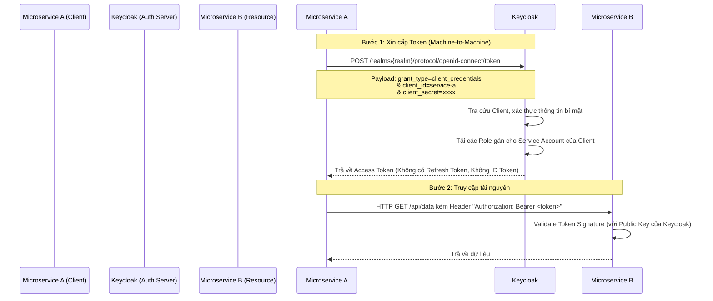

> [!NOTE]
> **Category:** Theory (Lý thuyết)
> **Goal:** Nắm vững khái niệm Service Account, nguyên lý hoạt động của Client Credentials Grant và cách thiết lập xác thực máy-với-máy (Machine-to-Machine) an toàn.

### 1. Lý thuyết chuyên sâu (Detailed Theory)
Service Authentication (hay Client Credentials Grant trong OAuth 2.0) là phương pháp dùng để xác thực hệ thống khi không có sự tham gia của con người (người dùng cuối). Khác với các luồng khác cấp Token đại diện cho Người dùng, luồng này cấp Token đại diện cho chính Ứng dụng (Client/Service).
Trong Keycloak, tính năng này được gọi là "Service Accounts". Khi được kích hoạt, Keycloak sẽ ngầm tạo ra một tài khoản đặc biệt đại diện cho Client đó. Hệ thống backend (như một Cronjob, hoặc một Microservice gọi sang một Microservice khác) sử dụng Client ID và Client Secret (hoặc chứng thư số mTLS, JWT có chữ ký) để chứng minh danh tính với Keycloak và lấy Access Token. Đây là xương sống cho giao tiếp Machine-to-Machine (M2M) trong kiến trúc phân tán.

### 2. Luồng nội bộ & Cơ chế cấp thấp (Internal Workflow & Low-level Mechanisms)



### 3. Thực hành tốt nhất & Bảo mật (Best Practices & Security)
- **Quản lý Vòng đời Secret:** Client Secret phải được xoay vòng (Rotate) định kỳ. Tuyệt đối không hardcode secret trong mã nguồn. Hãy dùng các công cụ như HashiCorp Vault hoặc Kubernetes Secrets để inject secret vào thời gian chạy.
- **Không Refresh Token:** Luồng Client Credentials không trả về Refresh Token vì nó phi logic (Máy chủ có thể lưu bí mật và tự gọi lại Endpoint /token bất cứ lúc nào Access Token hết hạn). Do đó, hãy cấu hình Access Token của loại luồng này có tuổi thọ (Lifespan) đủ ngắn để giảm rủi ro rò rỉ.
- **Quyền hạn tối thiểu (Principle of Least Privilege):** Chỉ cấp các Role thực sự cần thiết cho Service Account. Đừng bao giờ cấp full quyền Admin cho một Microservice trừ khi nó là một thành phần cốt lõi của Identity.
> [!IMPORTANT]
> Đối với môi trường Zero-Trust cực kỳ nghiêm ngặt, việc dùng Client ID & Client Secret dạng chuỗi tĩnh là chưa đủ. Hãy thay thế bằng **Signed JWT** (Private Key JWT) hoặc **Mutual TLS (mTLS)** để xác thực Client, đảm bảo không bị lộ Secret khi truyền tải nội bộ.

### 4. Cấu hình minh họa thực tế (Configuration Examples)
Để cấu hình một Service Account trong Keycloak:
1. Tạo một Client có tên `backend-service`.
2. Bật tùy chọn `Client Authentication` (để Client này trở thành loại Confidential).
3. Tại phần Capability config, bật `Service accounts roles`.
4. Lưu cấu hình. Chuyển sang Tab `Service account roles`, gán các Role mà service này cần để thực thi công việc của nó (ví dụ: `view-users`).
5. Vào Tab `Credentials` lấy Client Secret.
6. Lệnh cURL gọi API:
```bash
curl -X POST \
  http://localhost:8080/realms/myrealm/protocol/openid-connect/token \
  -H 'Content-Type: application/x-www-form-urlencoded' \
  -d 'client_id=backend-service' \
  -d 'client_secret=YOUR_SECRET' \
  -d 'grant_type=client_credentials'
```

### 5. Trường hợp ngoại lệ (Edge Cases)
- **Tràn ngập Request do vòng lặp sai:** Một Microservice bị lỗi vòng lặp (Retry Loop) có thể gọi API `/token` của Keycloak hàng nghìn lần mỗi giây khi gọi Microservice khác bị fail. Điều này sẽ làm sập Keycloak. **Giải pháp:** Cần triển khai Token Caching tại Microservice (cache Token cho đến khi sát giờ hết hạn) thay vì gọi lấy Token mới cho mỗi request.
- **Quyền bị thay đổi khi Token chưa hết hạn:** Do Client Token thường có Lifespan dài hơn, nếu bạn tước quyền của Service Account trong Keycloak, Token đã cấp vẫn sẽ hợp lệ cho đến khi hết hạn. Phải có cơ chế Token Revocation nếu cần chặn đứng tức thì.
- **Không có Subject (sub) cụ thể:** Token sinh ra từ luồng này có trường `sub` mang giá trị là ID của Client. Nếu hệ thống Backend (Resource Server) yêu cầu phải có thuộc tính của *người dùng cụ thể*, thiết kế này sẽ thất bại. Trong trường hợp đó, cần dùng luồng Token Exchange để mạo danh (Impersonation).

### 6. Câu hỏi Phỏng vấn (Interview Questions)
1. **Câu hỏi (Junior):** Client Credentials Grant được dùng trong trường hợp nào? Nó có yêu cầu người dùng xác nhận không?
   - *Đáp án:* Dùng cho liên lạc máy-với-máy (Backend API gọi Backend API). Không có giao diện người dùng, không cần con người xác nhận, nó xác thực chính ứng dụng.
2. **Câu hỏi (Junior):** Tại sao luồng Service Authentication không trả về Refresh Token?
   - *Đáp án:* Vì ứng dụng đã giữ Client ID và Secret một cách an toàn. Khi Access Token hết hạn, ứng dụng chỉ cần dùng cặp mã bí mật này gọi lại để lấy Token mới, không cần cơ chế Refresh Token như trình duyệt.
3. **Câu hỏi (Senior):** Giải thích sự khác biệt giữa `User Role` và `Service Account Role` trong Keycloak?
   - *Đáp án:* User Role cấp quyền cho một tài khoản con người. Service Account Role gắn với tài khoản ảo của ứng dụng (Client). Khi Client dùng luồng M2M, Token sinh ra sẽ chứa các Service Account Role này.
4. **Câu hỏi (Senior):** Thay vì dùng Client Secret, có phương pháp nào an toàn hơn để xác thực Client trong luồng này không?
   - *Đáp án:* Có, sử dụng mTLS (Client sử dụng Certificate để chứng minh danh tính tại tầng Transport) hoặc Private Key JWT (Client ký thông tin bằng Private Key tạo thành JWT và gửi lên thay cho mật khẩu tĩnh).
5. **Câu hỏi (Senior):** Microservice A cần gọi Microservice B thay mặt cho người dùng User1 (chứ không phải dưới quyền của A). Có dùng Client Credentials Grant được không? Tại sao?
   - *Đáp án:* Không. Client Credentials sinh ra Token của máy A, không mang thông tin User1. Microservice B sẽ từ chối nếu cần quyền User1. Trong trường hợp này, phải pass Token hiện tại của User1, hoặc sử dụng Token Exchange.

### 7. Tài liệu tham khảo (References)
- [OAuth 2.0 Client Credentials Grant (RFC 6749)](https://datatracker.ietf.org/doc/html/rfc6749#section-4.4)
- [Keycloak Server Administration Guide: Service Accounts](https://www.keycloak.org/docs/latest/server_admin/#_service_accounts)
