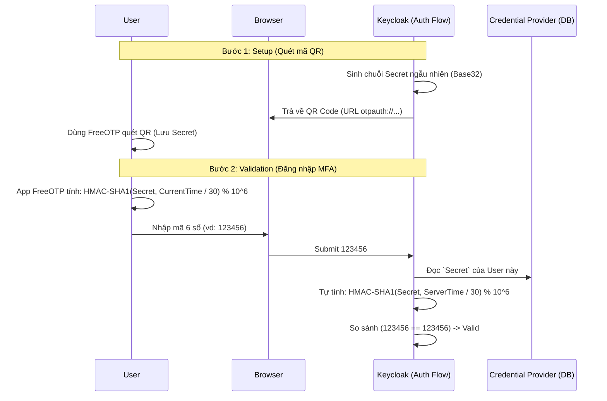

# Bài học 5: Mã OTP (One-Time Password) và Xác thực Đa yếu tố

> [!NOTE]
> **Category:** Theory (Lý thuyết)
> **Goal:** Nắm vững các khái niệm nền tảng về thuật toán sinh mã dùng một lần (OTP) bao gồm HOTP và TOTP. Hiểu cơ chế nội bộ mà Keycloak sử dụng để thẩm định mã OTP trong luồng Xác thực đa yếu tố (MFA).

## 1. Lý thuyết chuyên sâu (Detailed Theory)
OTP (One-Time Password - Mật khẩu dùng một lần) là một thành phần cốt lõi của kiến trúc MFA (Multi-Factor Authentication). Keycloak tuân theo hai chuẩn mở quan trọng nhất cho việc sinh OTP:
1. **HOTP (HMAC-based One-Time Password - RFC 4226):** Mật khẩu dựa trên một **Bộ đếm (Counter)**. Mỗi lần người dùng nhấn nút tạo mã trên thiết bị/ứng dụng, bộ đếm tăng lên 1, hệ thống Keycloak cũng tăng theo.
2. **TOTP (Time-based One-Time Password - RFC 6238):** Là bản mở rộng của HOTP, thay vì dùng bộ đếm, nó sử dụng **Thời gian (Timestamp)** chia cho một khoảng mặc định (thường là 30 giây). Mã sẽ tự động thay đổi sau mỗi 30s. Keycloak hỗ trợ chuẩn TOTP mặc định để liên kết với Google Authenticator hoặc FreeOTP.

Nguyên lý bảo mật của OTP nằm ở cơ chế **Shared Secret** (Bí mật chia sẻ). Khi người dùng quét mã QR, ứng dụng Authenticator và Keycloak cùng chia sẻ chung một chuỗi khóa bí mật. Cả hai hệ thống độc lập tính toán hàm băm và ra cùng một kết quả mà không cần truyền dữ liệu này qua mạng.

## 2. Luồng nội bộ & Cơ chế cấp thấp (Internal Workflow & Low-level Mechanisms)
Quá trình thẩm định OTP xảy ra trong Execution Flow của Keycloak.

**Giải thích cơ chế Validation:**
- Trái tim của quá trình là hàm `HMAC-SHA1` hoặc `HMAC-SHA256`/`SHA512`.
- Đối với TOTP, biến đầu vào thứ hai của hàm băm là cửa sổ thời gian (Time Window). Do thời gian giữa Client và Server có thể lệch nhau (Clock drift), thuật toán của Keycloak cho phép "Look ahead Window" (So sánh với kết quả của 1-2 khoảng thời gian trước/sau đó).

## 3. Thực hành tốt nhất & Bảo mật (Best Practices & Security)
> [!IMPORTANT]
> **Đồng bộ hóa Thời gian (NTP Sync):** Thuật toán TOTP hoàn toàn phụ thuộc vào hệ thống thời gian. Phải đảm bảo máy chủ chạy Keycloak được đồng bộ thời gian thông qua NTP daemon (Network Time Protocol) cực kỳ chính xác. Nếu đồng hồ máy chủ Keycloak chạy chậm/nhanh 2 phút so với giờ thế giới, người dùng sẽ không thể đăng nhập.

> [!WARNING]
> **Tránh Tấn công Replay (Replay Attack):** Keycloak có một tính năng gọi là "OTP Look Ahead Window". Không nên đặt thông số này quá cao (Ví dụ: 10). Nếu đặt là 10, nghĩa là Keycloak chấp nhận cả mã sinh ra ở 5 phút (30s x 10) trước hoặc sau. Điều này tạo kẽ hở cho Hacker đánh cắp và dùng lại mã. Giữ giá trị này ở mức 1 hoặc 2.

## 4. Cấu hình minh họa thực tế (Configuration Examples)
Quản trị viên có thể tùy chỉnh các tham số sinh OTP tại giao diện quản trị:
- Truy cập Realm -> **Authentication** -> Tab **OTP Policy**.
- **OTP Type:** Chọn `Time Based` (TOTP).
- **OTP Hash Algorithm:** `SHA1` (Mặc định được Google Auth hỗ trợ rộng rãi nhất), hoặc chuyển sang `SHA512` cho các ứng dụng nội bộ bảo mật cực cao.
- **Number of Digits:** `6` (chuẩn) hoặc `8`.
- **Look Ahead Window:** `1` (Nghĩa là mã của chu kỳ 30 giây trước đó vẫn hợp lệ, để bù đắp sự chậm trễ khi bấm nút submit).
- **Supported Applications:** Các link trích xuất cho người dùng (FreeOTP, Google Authenticator).

## 5. Trường hợp ngoại lệ (Edge Cases)
- **Mất thiết bị chứa OTP:** Khi nhân viên mất điện thoại, họ sẽ bị Lockout hoàn toàn khỏi hệ thống (nếu không có phương thức dự phòng Recovery Codes). Hệ thống Helpdesk phải có quyền dùng Admin Console để đăng nhập, tìm tài khoản User, truy cập tab `Credentials`, và bấm **Delete** bản ghi OTP cũ. Khi user đăng nhập lại, Keycloak sẽ ép họ quét lại mã QR mới.
- **Hệ thống mạng bị chập chờn:** TOTP là thuật toán tính toán tại chỗ (Offline). Người dùng *không cần Internet* trên điện thoại để sinh mã TOTP. Đây là điểm vượt trội của TOTP so với việc gửi OTP qua SMS.

## 6. Câu hỏi Phỏng vấn (Interview Questions)
1. **[Junior]** Nêu sự khác biệt cơ bản giữa mã HOTP và TOTP.
2. **[Junior]** TOTP trên điện thoại có yêu cầu kết nối mạng Internet để sinh mã được không? (Trả lời: Không cần thiết, đây là thuật toán toán học cục bộ).
3. **[Senior]** Khái niệm "Look Ahead Window" trong Keycloak OTP Policy nghĩa là gì? Nếu để giá trị là 0 sẽ gây ra bất lợi gì?
4. **[Senior]** Một người dùng phản ánh họ luôn nhập đúng mã trên Google Authenticator nhưng Keycloak luôn báo sai (Invalid). Nguyên nhân phổ biến nhất là gì? (Gợi ý: Clock Drift trên máy chủ hoặc điện thoại).
5. **[Senior]** Từ góc độ toán học, vì sao Keycloak (Server) có thể biết được đoạn mã 6 số mà thiết bị cá nhân của User vừa sinh ra để so sánh? Phân tích cơ chế Shared Secret.

## 7. Tài liệu tham khảo (References)
- [Keycloak OTP Authentication Docs](https://www.keycloak.org/docs/latest/server_admin/#_otp_policies)
- [RFC 6238 - TOTP: Time-Based One-Time Password Algorithm](https://datatracker.ietf.org/doc/html/rfc6238)
- [RFC 4226 - HOTP: An HMAC-Based One-Time Password Algorithm](https://datatracker.ietf.org/doc/html/rfc4226)
