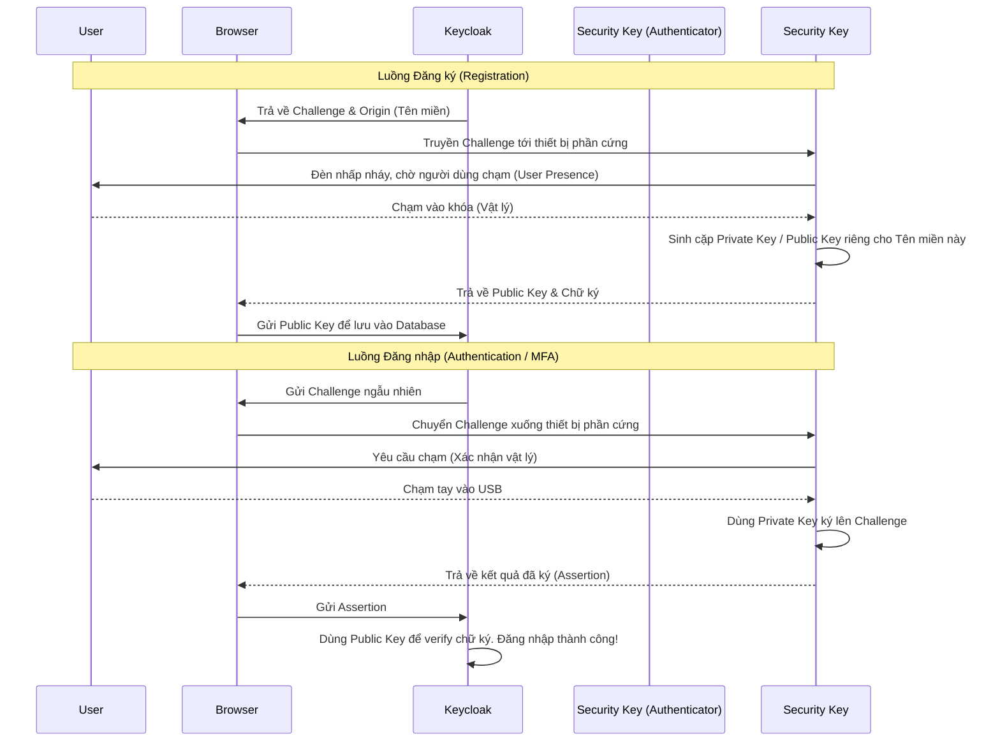

> [!NOTE]
> **Category:** Theory (Lý thuyết)
> **Goal:** Nắm vững tiêu chuẩn Web Authentication (WebAuthn), hiểu cách Keycloak tích hợp FIDO2 để cung cấp cơ chế xác thực đa yếu tố (MFA) chống Phishing bằng phần cứng chuyên dụng.

### 1. Lý thuyết chuyên sâu (Detailed Theory)
Web Authentication (WebAuthn) là một đặc tả kỹ thuật được phát triển bởi W3C và FIDO Alliance, cho phép xác thực người dùng trên các ứng dụng web thông qua mật mã học khóa công khai (Public Key Cryptography) thay vì mật khẩu truyền thống.
Trong Keycloak, WebAuthn thường được sử dụng như một phương thức Xác thực Đa Yếu Tố (MFA/2FA), bổ sung sau lớp mật khẩu. Người dùng có thể sử dụng các Security Keys (như YubiKey, Google Titan) kết nối qua USB, NFC, Bluetooth hoặc thiết bị tích hợp (TouchID, Windows Hello) để xác minh.
Điểm khác biệt cốt lõi của WebAuthn so với OTP (Google Authenticator) là **Tính chống Phishing (Phishing-resistant)**. WebAuthn gắn chặt kết quả xác thực với tên miền (origin) cụ thể. Nếu người dùng bị lừa vào trang web giả mạo (ví dụ: `kcycloak.com`), khóa phần cứng sẽ từ chối ký vì tên miền không khớp, đánh bại hoàn toàn các cuộc tấn công Man-in-the-Middle (MitM).

### 2. Luồng nội bộ & Cơ chế cấp thấp (Internal Workflow & Low-level Mechanisms)

### 3. Thực hành tốt nhất & Bảo mật (Best Practices & Security)
- **Relying Party ID (RP ID):** Đảm bảo RP ID trong cấu hình WebAuthn Policy của Keycloak trỏ đúng về Tên miền gốc (Domain) mà ứng dụng của bạn đang chạy. Khai báo sai sẽ khiến trình duyệt từ chối thực thi hàm WebAuthn.
- **Yêu cầu sự hiện diện của người dùng (User Presence):** Đây là thuộc tính cốt lõi của WebAuthn. Hãy đảm bảo cờ này được bật để khóa phần cứng luôn yêu cầu người dùng phải thực hiện một thao tác vật lý (như chạm vào YubiKey) để chặn các cuộc tấn công phần mềm tự động (Malware).
- **Phân tách Policy:** Keycloak có 2 loại cấu hình là `WebAuthn Policy` (dùng làm MFA 2 bước) và `WebAuthn Passwordless Policy` (dùng thay thế mật khẩu, còn gọi là Passkeys). Không nhầm lẫn giữa hai loại này.
> [!WARNING]
> Mất khóa phần cứng đồng nghĩa với việc người dùng bị khóa tài khoản (Lockout). Luôn thiết kế một luồng dự phòng (Backup Codes hoặc Admin Recovery) trong Authentication Flow để giải quyết trường hợp rơi mất thiết bị FIDO.

### 4. Cấu hình minh họa thực tế (Configuration Examples)
Cấu hình WebAuthn làm phương thức 2FA:
1. Vào `Authentication` > `Policies` > `WebAuthn Policy`.
2. **Relying Party Entity Name:** Tên tổ chức (VD: `My Secure Company`).
3. **Relying Party ID:** Tên miền của Keycloak (VD: `auth.mycompany.com`).
4. **Signature Algorithms:** Chọn `ES256` và `RS256`.
5. **Attestation Conveyance Preference:** Đặt là `none` (cho phép mọi loại khóa) hoặc `direct` (chỉ cho phép các loại khóa phần cứng enterprise được cấp phép).
6. Trong `Authentication` > `Flows` > `Browser`: Bật luồng phụ MFA và cấu hình `WebAuthn Authenticator` thành `Required` (hoặc `Alternative` bên cạnh OTP).

### 5. Trường hợp ngoại lệ (Edge Cases)
- **Tên miền cục bộ (Localhost) và HTTPS:** API WebAuthn (navigator.credentials) bị các trình duyệt chặn hoàn toàn nếu trang web không chạy qua `https://` (Ngoại trừ `localhost`). Nếu bạn cấu hình Keycloak chạy HTTP trên một IP trần (VD: `http://192.168.1.5`), WebAuthn sẽ báo lỗi ngay lập tức trên trình duyệt.
- **Clock Drift không ảnh hưởng:** Khác với TOTP (Google Authenticator) phụ thuộc hoàn toàn vào việc đồng bộ thời gian thực tế, WebAuthn dùng Challenge-Response với mật mã học nên miễn nhiễm với các lỗi lệch múi giờ trên thiết bị người dùng.
- **Không hỗ trợ trên trình duyệt nhúng (Webview):** Nếu bạn dùng ứng dụng di động có Webview in-app để mở trang Keycloak, nhiều OS chặn WebAuthn API trong Webview. Bạn bắt buộc phải dùng System Browser (Custom Tabs trên Android / Safari View Controller trên iOS).

### 6. Câu hỏi Phỏng vấn (Interview Questions)
1. **Câu hỏi (Junior):** WebAuthn an toàn hơn OTP (Google Authenticator / SMS) ở điểm cốt lõi nào?
   - *Đáp án:* WebAuthn chống lại tấn công Phishing (Lừa đảo tên miền giả mạo). Mã OTP vẫn có thể bị người dùng nhập nhầm vào trang giả mạo, nhưng WebAuthn kiểm tra tự động tên miền (Origin), thiết bị sẽ từ chối hoạt động nếu tên miền sai lệch.
2. **Câu hỏi (Junior):** Có bắt buộc phải mua USB YubiKey mới dùng được WebAuthn không?
   - *Đáp án:* Không. WebAuthn cũng hỗ trợ "Platform Authenticators" như TouchID trên Mac, Windows Hello, hoặc cảm biến vân tay trên Android, sử dụng chip bảo mật (TPM/Secure Enclave) trên máy tính/điện thoại hiện tại.
3. **Câu hỏi (Senior):** Giải thích khái niệm Relying Party (RP) trong giao thức WebAuthn.
   - *Đáp án:* Relying Party chính là hệ thống máy chủ (ở đây là Keycloak) đang yêu cầu người dùng xác thực. RP định nghĩa bằng một RP ID (thường là Domain name). Khóa mã hóa sinh ra sẽ bị khóa chặt với RP ID này.
4. **Câu hỏi (Senior):** Challenge ngẫu nhiên gửi từ Keycloak xuống thiết bị FIDO nhằm mục đích gì?
   - *Đáp án:* Nó giúp chống lại Replay Attack. Kẻ tấn công không thể ghi lại thao tác ký của lần đăng nhập trước rồi gửi lại, vì mỗi lần đăng nhập Keycloak phát ra một chuỗi bytes (Challenge) ngẫu nhiên, yêu cầu thiết bị phải dùng Private Key ký mới trên chuỗi đó.
5. **Câu hỏi (Senior):** Attestation trong WebAuthn là gì và khi nào công ty cần bật nó?
   - *Đáp án:* Attestation là quá trình thiết bị FIDO chứng minh cho Server biết nó thuộc hãng sản xuất nào, model gì. Công ty dùng nó khi muốn cấm nhân viên dùng các loại khóa giá rẻ, trôi nổi, bắt buộc chỉ được đăng ký loại khóa bảo mật cao do công ty cấp phát.

### 7. Tài liệu tham khảo (References)
- [W3C Web Authentication: An API for accessing Public Key Credentials](https://w3c.github.io/webauthn/)
- [Keycloak WebAuthn 2FA Documentation](https://www.keycloak.org/docs/latest/server_admin/#_webauthn)
