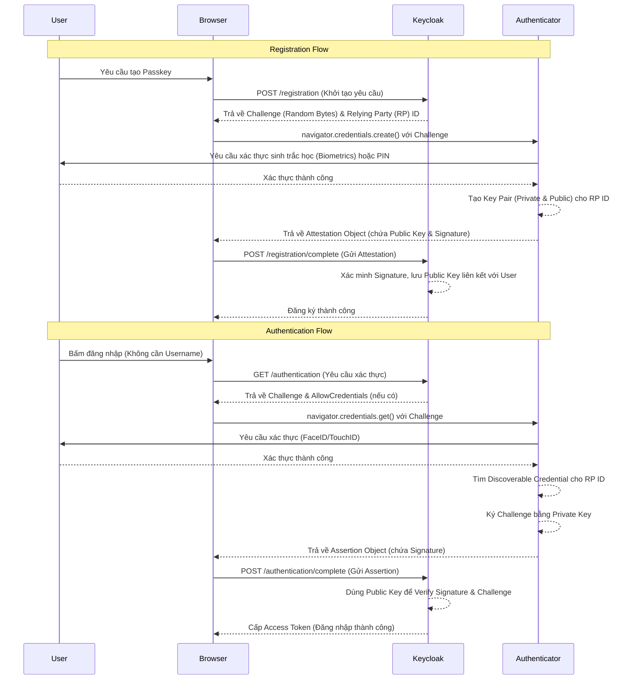

> [!NOTE]
> **Category:** Theory (Lý thuyết)
> **Goal:** Hiểu rõ cơ chế hoạt động của Passkeys (WebAuthn Discoverable Credentials) trong Keycloak, cách thức nó thay thế mật khẩu truyền thống và đảm bảo an toàn xác thực qua mật mã bất đối xứng (Asymmetric Cryptography).

### 1. Lý thuyết chuyên sâu (Detailed Theory)
Passkeys là một cơ chế xác thực không sử dụng mật khẩu (Passwordless Authentication) dựa trên tiêu chuẩn WebAuthn của FIDO Alliance và W3C. Thay vì lưu trữ mật khẩu trên Server, Passkeys sử dụng mật mã khóa công khai (Public Key Cryptography).
Khi người dùng đăng ký Passkeys, thiết bị của họ (Authenticator) sẽ tạo ra một cặp khóa: Private Key (được lưu trữ an toàn và không bao giờ rời khỏi thiết bị, thường trong Secure Enclave) và Public Key (được gửi lên Keycloak Server). Trong Keycloak, Passkeys thực chất là WebAuthn Discoverable Credentials (Resident Keys), nghĩa là Authenticator lưu trữ đủ thông tin để định danh người dùng mà không cần yêu cầu nhập Username trước. 
Điều này giải quyết triệt để các vấn đề như Phishing, Credential Stuffing, và Password Leak.

### 2. Luồng nội bộ & Cơ chế cấp thấp (Internal Workflow & Low-level Mechanisms)

### 3. Thực hành tốt nhất & Bảo mật (Best Practices & Security)
- **Require Resident Key:** Bật cấu hình `Resident Key Requirement` thành `Required` trong Keycloak WebAuthn Policy để đảm bảo Passkeys hoạt động độc lập không cần Username.
- **User Verification:** Luôn thiết lập `User Verification Requirement` thành `Required`. Điều này buộc người dùng phải xác thực sinh trắc học hoặc mã PIN trên thiết bị để đảm bảo tính an toàn (Something you are / Something you know) cùng với thiết bị (Something you have).
- **Attestation Statement:** Nếu hệ thống yêu cầu bảo mật cao, cấu hình `Attestation Conveyance Preference` để kiểm tra chứng thư của Authenticator (chống lại các thiết bị ảo lập giả mạo).
> [!WARNING]
> Mặc dù Passkeys an toàn trước Phishing, nếu thiết bị của người dùng bị tấn công ở mức Root/Jailbreak, Private Key có thể bị trích xuất. Do đó, với các hệ thống tài chính, cần kết hợp Context-based Authentication.

### 4. Cấu hình minh họa thực tế (Configuration Examples)
Để cấu hình Passkeys trong Keycloak:
1. Vào `Authentication` > `Policies` > `WebAuthn Passwordless Policy`.
2. Đặt **Relying Party Entity Name**: Tên ứng dụng của bạn.
3. Đặt **Relying Party ID**: Domain của Keycloak hoặc ứng dụng (VD: `auth.example.com`).
4. **Signature Algorithms**: Cấu hình thuật toán (ES256, RS256).
5. **Resident Key Requirement**: Đặt là `Required`.
6. **User Verification Requirement**: Đặt là `Required`.
7. **Authenticator Attachment**: Có thể để `cross-platform` (Roaming) hoặc `platform` (Thiết bị hiện tại).

### 5. Trường hợp ngoại lệ (Edge Cases)
- **Thiết bị bị mất hoặc hỏng:** Private Key gắn liền với thiết bị hoặc iCloud Keychain / Google Password Manager. Nếu mất hoàn toàn hệ sinh thái này, người dùng sẽ mất quyền truy cập. **Giải pháp:** Luôn yêu cầu người dùng thiết lập phương thức dự phòng (Recovery Codes, Email OTP) trong Authentication Flow.
- **Clock Skew và Challenge Expiration:** Challenge do Keycloak sinh ra có thời gian sống (TTL). Nếu quá trình người dùng thao tác sinh trắc học quá lâu, Challenge hết hạn và Request sẽ bị Reject.
- **Cross-Device Authentication (CBA):** Quét mã QR từ điện thoại lên màn hình máy tính (FIDO Cross-Device Authentication) có thể thất bại nếu kết nối Bluetooth Low Energy (BLE) không ổn định giữa hai thiết bị.

### 6. Câu hỏi Phỏng vấn (Interview Questions)
1. **Câu hỏi (Junior):** Passkeys khác gì so với mật khẩu truyền thống và tại sao nó chống được Phishing?
   - *Đáp án:* Mật khẩu gửi thông tin xác thực đến Server để so khớp, dễ bị đánh cắp. Passkeys dùng Public Key Cryptography; Server chỉ giữ Public Key, Private Key không bao giờ rời khỏi thiết bị. Kẻ tấn công không thể Phishing vì không thể lấy Private Key.
2. **Câu hỏi (Junior):** "Discoverable Credentials" (Resident Keys) trong WebAuthn là gì?
   - *Đáp án:* Là thông tin định danh (Credential) chứa cả User Handle được lưu trên Authenticator, cho phép quá trình xác thực không cần người dùng nhập Username.
3. **Câu hỏi (Senior):** Làm thế nào Keycloak biết được Public Key gửi lên thuộc về ai khi không có Username trong quá trình Authenticate?
   - *Đáp án:* Khi trình duyệt gọi `navigator.credentials.get()`, Authenticator trả về `userHandle` kèm chữ ký. Keycloak dùng `userHandle` này để map với người dùng trong Database, lấy ra Public Key tương ứng và xác thực chữ ký.
4. **Câu hỏi (Senior):** Giải thích khái niệm "Attestation" và "Assertion" trong quy trình WebAuthn/Passkeys?
   - *Đáp án:* Attestation xảy ra lúc đăng ký (Registration), thiết bị chứng minh nguồn gốc và cung cấp Public Key cho Server. Assertion xảy ra lúc đăng nhập (Authentication), thiết bị ký Challenge bằng Private Key để chứng minh quyền sở hữu thiết bị.
5. **Câu hỏi (Senior):** Điều gì xảy ra khi Relying Party ID (RP ID) trong cấu hình Keycloak không khớp với Domain của trình duyệt?
   - *Đáp án:* Theo cơ chế an ninh của WebAuthn, trình duyệt sẽ từ chối gọi API WebAuthn và quăng lỗi `SecurityError` để chống lại Phishing (ngăn một trang web lạ yêu cầu ký cho một RP ID khác).

### 7. Tài liệu tham khảo (References)
- [Keycloak WebAuthn Passwordless Setup](https://www.keycloak.org/docs/latest/server_admin/#_webauthn)
- [FIDO Alliance Passkeys](https://fidoalliance.org/passkeys/)
- [W3C Web Authentication API](https://w3c.github.io/webauthn/)
