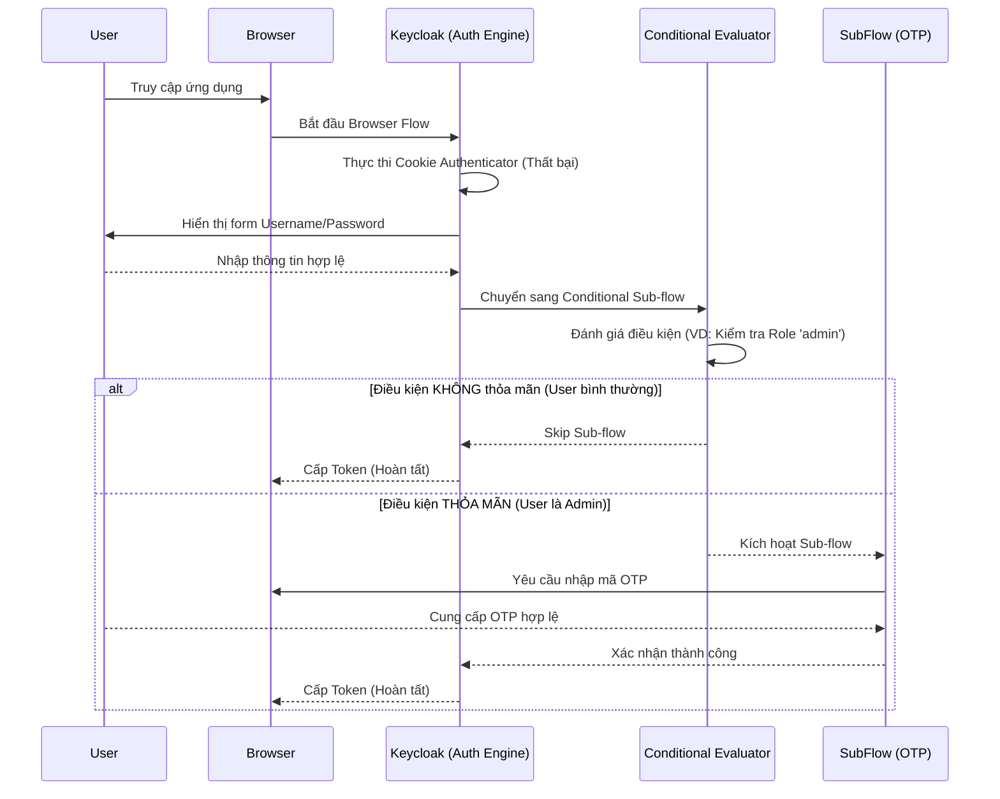

> [!NOTE]
> **Category:** Theory (Lý thuyết)
> **Goal:** Hiểu rõ cơ chế Xác thực có điều kiện (Conditional Authentication) trong Keycloak để xây dựng các luồng đăng nhập linh hoạt, an toàn dựa trên ngữ cảnh người dùng và rủi ro.

### 1. Lý thuyết chuyên sâu (Detailed Theory)
Conditional Authentication (Xác thực có điều kiện) là một tính năng nâng cao trong Keycloak cho phép hệ thống động điều chỉnh luồng xác thực (Authentication Flow) dựa trên ngữ cảnh tại thời điểm chạy. Thay vì ép buộc tất cả người dùng phải đi qua một lộ trình cố định (ví dụ: luôn luôn nhập Password rồi đến OTP), Keycloak có thể đánh giá các điều kiện như: Người dùng có thuộc nhóm (Group) nhất định không? Có mang Role quản trị không? IP có nằm trong mạng nội bộ không? Thiết bị có đáng tin cậy không?
Tính năng này giải quyết bài toán cân bằng giữa **Trải nghiệm người dùng (UX)** và **Bảo mật (Security)**. Đối với nhân viên truy cập từ mạng nội bộ, chỉ cần Password. Nhưng nếu truy cập từ một IP lạ ở nước ngoài, hệ thống sẽ kích hoạt luồng phụ yêu cầu WebAuthn hoặc OTP.

### 2. Luồng nội bộ & Cơ chế cấp thấp (Internal Workflow & Low-level Mechanisms)

### 3. Thực hành tốt nhất & Bảo mật (Best Practices & Security)
- **Cấu trúc Sub-flow:** Các bộ thực thi điều kiện (Condition Authenticators) chỉ hoạt động bên trong một **Conditional Sub-flow**. Đừng đặt chúng ngang hàng với các Authenticator chính, chúng sẽ không hoạt động đúng.
- **Fail-Safe Design:** Luôn cẩn thận với điều kiện phủ định. Đảm bảo rằng nếu Evaluator gặp lỗi không mong muốn, nó sẽ fallback về luồng an toàn nhất (ví dụ: mặc định yêu cầu MFA nếu không xác định được IP thay vì cho qua).
- **Tránh vòng lặp hoặc khóa vĩnh viễn:** Cấu hình sai điều kiện có thể khiến một nhóm người dùng bị kẹt, không bao giờ đăng nhập được vì luôn bị kích hoạt một luồng mà họ không thể thỏa mãn.
> [!IMPORTANT]
> Hiệu suất hệ thống có thể bị ảnh hưởng nếu bạn cấu hình các Custom Condition gọi API ra bên ngoài để đánh giá rủi ro (Risk-based Authentication). Hãy đảm bảo các lệnh gọi bên ngoài có Timeout ngắn và Cache hợp lý.

### 4. Cấu hình minh họa thực tế (Configuration Examples)
Để tạo một luồng chỉ yêu cầu OTP đối với người dùng có Role "manager":
1. Kế thừa `Browser Flow` mặc định, tạo một luồng mới tên là `Conditional-Browser-Flow`.
2. Dưới bước nhập Password, tạo một Sub-flow mới tên là `MFA-Sub-Flow`.
3. Đổi loại của `MFA-Sub-Flow` từ `Alternative` thành `Conditional`.
4. Bên trong `MFA-Sub-Flow`, thêm `Condition - user role`. Cấu hình điều kiện này với giá trị Role là `manager`.
5. Cũng bên trong `MFA-Sub-Flow`, ngay dưới điều kiện, thêm `OTP Form` và đặt nó thành `Required`.
6. Ràng buộc (Bind) luồng mới này làm luồng Browser mặc định cho Realm.

### 5. Trường hợp ngoại lệ (Edge Cases)
- **Tương tác giữa nhiều điều kiện:** Nếu một Sub-flow có nhiều Evaluator điều kiện, hành vi mặc định là mô hình logic AND (tất cả điều kiện phải thỏa mãn) hoặc OR (tùy thuộc vào cấu hình của Keycloak trong các phiên bản mới). Nếu cấu hình xung đột, Sub-flow có thể bị bỏ qua một cách im lặng.
- **Header IP giả mạo:** Sử dụng `Condition - network` phụ thuộc vào IP của Client. Kẻ tấn công có thể giả mạo `X-Forwarded-For` header nếu API Gateway không ghi đè chặt chẽ, lách qua lớp bảo mật Conditional Authentication.
- **Trạng thái session chưa được thiết lập:** Một số điều kiện yêu cầu thông tin người dùng (VD: Role) chỉ hoạt động **sau khi** người dùng đã được nhận diện (qua Username/Password hoặc Cookie). Nếu đặt điều kiện này ở đầu luồng, nó sẽ luôn thất bại vì `user == null`.

### 6. Câu hỏi Phỏng vấn (Interview Questions)
1. **Câu hỏi (Junior):** Conditional Authentication giải quyết bài toán gì so với luồng xác thực truyền thống?
   - *Đáp án:* Giải quyết bài toán cân bằng giữa bảo mật và trải nghiệm, cho phép bật MFA chỉ khi thực sự cần thiết (VD: đăng nhập từ IP lạ, user có quyền cao), không ép mọi user phải làm nhiều bước phiền toái.
2. **Câu hỏi (Junior):** Để một Authenticator điều kiện hoạt động, nó phải được đặt ở đâu trong Authentication Flow?
   - *Đáp án:* Nó phải được đặt bên trong một Sub-flow có loại là `Conditional`.
3. **Câu hỏi (Senior):** Làm thế nào để triển khai Risk-based Authentication với Conditional Flows nếu Keycloak không có sẵn điều kiện đánh giá rủi ro?
   - *Đáp án:* Có thể viết một Custom Authenticator (Java SPI) triển khai interface `ConditionalAuthenticator`. Custom SPI này sẽ lấy IP, User-Agent gọi đến một hệ thống Fraud Detection (như một AI API), sau đó trả về `match` hoặc `no match` để quyết định luồng.
4. **Câu hỏi (Senior):** Giải thích rủi ro bảo mật nếu sử dụng `Condition - IP` nhưng cấu hình Trust Proxy sai trên Keycloak?
   - *Đáp án:* Nếu cấu hình sai, Keycloak sẽ lấy IP cục bộ của Proxy (ví dụ 10.0.0.5) hoặc lấy IP giả từ Header do kẻ tấn công gửi. Điều này dẫn đến việc bỏ qua MFA trái phép nếu điều kiện cho qua dải mạng 10.0.0.x.
5. **Câu hỏi (Senior):** Phân biệt `Required`, `Alternative`, `Disabled`, và `Conditional` trong Execution Requirement của Keycloak Flow?
   - *Đáp án:* Required (Bắt buộc phải qua bước này), Alternative (Chỉ cần 1 trong các bước Alternative thành công), Disabled (Tắt hoàn toàn), Conditional (Biến cả Sub-flow thành luồng có điều kiện, được đánh giá bởi các bộ Condition).

### 7. Tài liệu tham khảo (References)
- [Keycloak Conditional Authentication flows](https://www.keycloak.org/docs/latest/server_admin/#_conditional_auth)
- [NIST SP 800-63B Authentication and Lifecycle Management](https://pages.nist.gov/800-63-3/sp800-63b.html)
