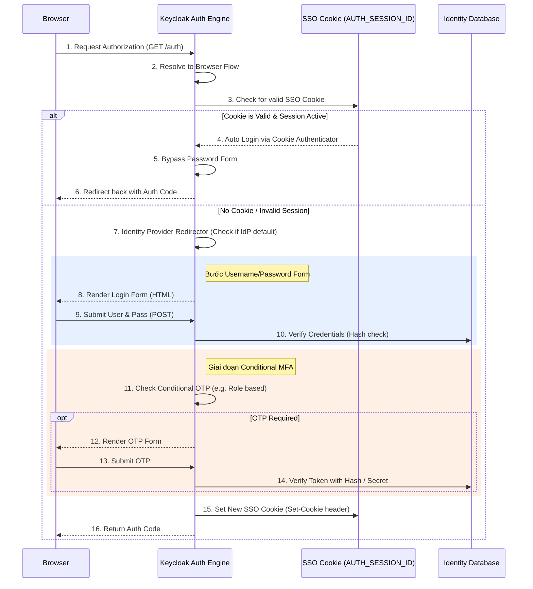

> [!NOTE]
> **Category:** Theory (Lý thuyết)
> **Goal:** Nắm vững kiến trúc, các thành phần cốt lõi và cơ chế hoạt động của Browser Flow, luồng xác thực tiêu chuẩn quan trọng nhất trong Keycloak dành cho các ứng dụng nền web.

## 1. Lý thuyết chuyên sâu (Detailed Theory)

Trong hệ sinh thái OpenID Connect (OIDC) và OAuth 2.0, khi một ứng dụng Web Application (có giao diện người dùng - Browser) yêu cầu đăng nhập, nó thường sử dụng **Authorization Code Flow**. Để hỗ trợ luồng OIDC này, Keycloak cung cấp một Authentication Flow nội bộ có tên gọi là **Browser Flow**.

**Browser Flow** là luồng tương tác đa bước, được thiết kế để phục vụ tương tác trực tiếp với con người (Human-to-Machine) thông qua trình duyệt web. Nó có khả năng hiển thị các trang HTML, quản lý phiên cookie, đánh giá chính sách mật khẩu, thực hiện chuyển hướng ngoại (Identity Brokering), và thu thập mã xác thực (OTP/MFA).

Điểm khác biệt cốt lõi của Browser Flow so với Direct Grant Flow (chỉ truyền API Payload) là sự hiện diện của **SSO Cookie (Single Sign-On Cookie)**. Nhiệm vụ tối thượng của Browser Flow không chỉ là kiểm tra danh tính, mà là tạo ra (hoặc xác thực) một phiên làm việc an toàn (Session) gắn liền với trình duyệt của người dùng. Một khi SSO Cookie đã được thiết lập thành công, các truy cập lần sau từ cùng một trình duyệt sẽ tự động được Keycloak ghi nhận mà không cần bắt người dùng nhập lại mật khẩu.

## 2. Luồng nội bộ & Cơ chế cấp thấp (Internal Workflow & Low-level Mechanisms)

Quá trình chạy của Browser Flow diễn ra cực kỳ linh hoạt và phụ thuộc vào trạng thái hiện tại của trình duyệt. 

**Cơ chế Cookie Authenticator:**
Execution đầu tiên luôn chạy trong Browser Flow mặc định là `Cookie Authenticator`. Cơ chế này hoạt động cực kỳ ưu tiên. Nó kiểm tra HTTP Header `Cookie: KEYCLOAK_IDENTITY=...`. Nếu cookie này tồn tại, hợp lệ, không bị thu hồi (revoked) và session còn thời hạn, `Cookie Authenticator` sẽ trả về `context.success()` ngay lập tức, vô hiệu hóa (bypass) toàn bộ các Form phía dưới luồng. Đây là bản chất của cơ chế SSO trong Keycloak.

## 3. Thực hành tốt nhất & Bảo mật (Best Practices & Security)

> [!IMPORTANT]
> **Vấn đề Brute-force & XSS**: Vì Browser Flow sử dụng giao diện web, nó là mục tiêu hàng đầu của tấn công Brute-force và XSS. Hãy luôn bật tính năng `Brute Force Detection` trong Keycloak Realm Settings để tự động khoá (Lockout) tài khoản nếu nhập sai nhiều lần. Đảm bảo cài đặt Header `Content-Security-Policy` (CSP) an toàn trong cấu hình Security Defenses.

> [!WARNING]
> **Xung đột Identity Provider**: Execution `Identity Provider Redirector` dùng để tự động chuyển hướng người dùng sang IdP bên ngoài dựa trên cấu hình "Default Identity Provider". Nếu bạn cấu hình sai bước này, nó có thể tạo ra một vòng lặp redirect vô hạn (Infinite Loop) làm sập hệ thống hoặc ngăn chặn hoàn toàn user sử dụng form đăng nhập nội bộ cục bộ.

- **Customize UI an toàn**: Nếu tổ chức yêu cầu thay đổi giao diện (Custom Theme), KHÔNG chỉnh sửa trực tiếp các file trong folder base theme của Keycloak, hãy kế thừa (extend) nó.
- **SameSite Cookie**: Đảm bảo cài đặt thuộc tính `SameSite` cho Keycloak Cookies. Ở môi trường production sử dụng HTTPS, `SameSite=None` và `Secure=true` là cấu hình bắt buộc nếu ứng dụng của bạn hoạt động ở dạng Cross-Domain Iframe.

## 4. Cấu hình minh họa thực tế (Configuration Examples)

Sửa đổi luồng Browser mặc định để yêu cầu người dùng phải xác thực WebAuthn thay vì mật khẩu thông thường (Passwordless Flow).

1. Copy luồng Browser mặc định thành một luồng mới: `Passwordless-Browser-Flow`.
2. Giữ nguyên cấu trúc `Cookie` (REQUIRED).
3. Trong Form Sub-flow:
   - Đặt `Username Password Form` thành `DISABLED`.
   - Thêm một Execution mới: `WebAuthn Authenticator Passwordless`.
   - Đặt Execution này thành `REQUIRED`.
4. Trong phần cài đặt **Authentication** -> mục **Bindings**, thiết lập `Browser flow` ánh xạ tới `Passwordless-Browser-Flow`.

*(Người dùng giờ đây sau khi nhập username sẽ chỉ được yêu cầu cắm USB Token hoặc dùng TouchID/FaceID thay vì nhập mật khẩu)*.

## 5. Trường hợp ngoại lệ (Edge Cases)

- **CORS/IFrame block**: Khi Client (ví dụ ứng dụng SPA Angular/React) cố gắng kiểm tra session ẩn (Silent Check-SSO) thông qua iframe trỏ vào Browser Flow, các trình duyệt hiện đại (như Safari có tính năng ITP) có thể chặn hoàn toàn Third-party Cookies, làm cho bước kiểm tra `Cookie Authenticator` bị lỗi, khiến ứng dụng SPA tưởng rằng người dùng chưa đăng nhập. 
- **Back Button Anomaly**: Trình duyệt có bộ nhớ cache (BFCache). Khi người dùng hoàn thành Browser Flow, sau đó bấm nút Back (Trở lại) trên trình duyệt, họ quay lại form nhập liệu với các session bị Stale (Hết hạn hoặc mất đồng bộ state), gây ra lỗi "Page Expired" hoặc "Invalid flow credentials". Keycloak xử lý việc này thông qua tham số `execution` ở URL, nhưng trải nghiệm sẽ hiển thị một trang lỗi yêu cầu click "Restart login".

## 6. Câu hỏi Phỏng vấn (Interview Questions)

1. **Junior**: Mục đích của execution `Cookie` nằm ngay đầu tiên trong Browser Flow là gì?
   - *Đáp án*: Để xử lý chức năng Single Sign-On (SSO). Nó kiểm tra xem trình duyệt đã có phiên đăng nhập hợp lệ chưa (qua Cookie). Nếu có, luồng sẽ thành công ngay lập tức mà không hiện form yêu cầu mật khẩu lại.
2. **Junior**: Flow này khác gì với Direct Grant Flow?
   - *Đáp án*: Browser Flow hiển thị giao diện HTML, tương tác trực tiếp với người dùng và xử lý Cookie. Direct Grant Flow thiết kế cho thiết bị/ứng dụng CLI gọi qua API bằng cách gửi thẳng Username/Password trong body HTTP Request (không có giao diện, không có Cookie).
3. **Senior**: Nếu một ứng dụng client (OIDC) truyền tham số `prompt=login` trong Authorization Request, Browser Flow xử lý như thế nào?
   - *Đáp án*: Tham số `prompt=login` ép buộc Keycloak bỏ qua (bypass) execution `Cookie` (hoặc đánh giá là false), bất kể cookie SSO có hợp lệ hay không. Điều này buộc Browser Flow phải render lại màn hình đăng nhập và yêu cầu người dùng tái xác thực.
4. **Senior**: Trong một mô hình Zero Trust, ta muốn Browser Flow không chỉ đánh giá mật khẩu mà còn kiểm tra Device Posture (vd: máy có cài Antivirus không) trước khi cấp session. Cấu hình luồng này như thế nào?
   - *Đáp án*: Cần viết một Custom Authenticator SPI kết nối với hệ thống MDM (Mobile Device Management) nội bộ. Đưa SPI này vào Browser Flow thành một execution `REQUIRED` ngay sau khi bước `Username Password Form` thành công.
5. **Senior**: Tại sao việc thay đổi giao diện (Theme) lại có thể ảnh hưởng đến tính toàn vẹn của Browser Flow?
   - *Đáp án*: Các trang Freemarker (`.ftl`) trong theme chứa các hidden field (như `execution`, `client_id`, `tab_id`) cần thiết để liên kết luồng form HTTP tĩnh với trạng thái AuthenticationSession trên server. Nếu Custom Theme vô tình xóa đi các hidden field này, Browser Flow sẽ mất context (Context Loss) và báo lỗi khi gửi form.

## 7. Tài liệu tham khảo (References)

- Keycloak Server Administration Guide: Browser Authentication Flow
- OAuth 2.0 Authorization Framework: Bearer Token Usage (RFC 6750)
- OIDC Core Specification: Authentication using Authorization Code Flow
- OWASP: Session Management Cheat Sheet
