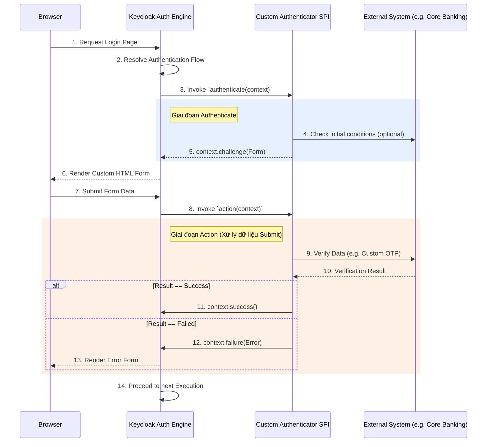

> [!NOTE]
> **Category:** Theory (Lý thuyết)
> **Goal:** Nắm vững cấu trúc kiến trúc SPI của Keycloak để phát triển các luồng xác thực tùy chỉnh (Custom Authentication Flows) nhằm đáp ứng các yêu cầu nghiệp vụ phức tạp mà luồng mặc định không hỗ trợ.

## 1. Lý thuyết chuyên sâu (Detailed Theory)

Mặc dù Keycloak đi kèm với một bộ các Authentication Flows và Executions vô cùng mạnh mẽ (như xác thực qua mật khẩu, OTP, WebAuthn), nhưng trong các bài toán Enterprise đặc thù, những tính năng này vẫn có thể chưa đủ. Ví dụ:
- Xác thực người dùng thông qua việc gọi API đến một hệ thống nhân sự (HR System) nội bộ hoặc Core Banking.
- Kích hoạt gửi mã OTP qua một dịch vụ SMS Gateway cục bộ không hỗ trợ chuẩn OIDC.
- Kiểm tra tính hợp lệ của thiết bị dựa trên địa chỉ MAC hoặc kiểm tra chứng thư số (Smart Card) theo chuẩn riêng.

Để giải quyết các bài toán này, Keycloak cung cấp **Authentication SPI (Service Provider Interface)**. Đây là một cơ chế mở rộng (Extensibility Mechanism) cực kỳ linh hoạt, cho phép các lập trình viên (Developer) viết mã nguồn Java, đóng gói thành file `.jar` và nạp vào Keycloak. Khi đó, Custom SPI này sẽ xuất hiện trên giao diện Admin Console dưới dạng một Execution mới và có thể được tích hợp vào bất kỳ Authentication Flow nào.

Một Custom Authenticator trong Keycloak thường yêu cầu triển khai hai interface chính:
- `Authenticator`: Xử lý logic nghiệp vụ trong quá trình xác thực (Authenticate, Action, Require Action).
- `AuthenticatorFactory`: Chịu trách nhiệm tạo ra các instance của `Authenticator`, định nghĩa các thuộc tính cấu hình (Configuration Properties) hiển thị trên giao diện Admin.

## 2. Luồng nội bộ & Cơ chế cấp thấp (Internal Workflow & Low-level Mechanisms)

Khi một luồng xác thực tùy chỉnh chạy, Keycloak Engine sẽ tương tác với Custom Authenticator thông qua các phương thức vòng đời (Lifecycle Methods).



**Cơ chế cấp thấp:**
- `AuthenticationFlowContext`: Đối tượng ngữ cảnh được truyền vào mọi phương thức của Custom Authenticator. Nó chứa toàn bộ thông tin về Request hiện tại (Headers, IP), UserSession, Client đang gọi, và Form parameters.
- Trạng thái phản hồi (Context Status): 
  - `context.success()`: Đánh dấu bước xác thực này thành công. Luồng tiếp tục sang bước kế tiếp.
  - `context.failure(AuthenticationFlowError)`: Xác thực thất bại, kết thúc luồng và trả lỗi.
  - `context.challenge(Response)`: Dừng luồng hiện tại và trả về một HTTP Response (thường là một trang HTML Freemarker để yêu cầu nhập liệu).

## 3. Thực hành tốt nhất & Bảo mật (Best Practices & Security)

> [!WARNING]
> **Rủi ro Hiệu năng (Performance Penalty)**: Custom SPI chạy đồng bộ trên thread pool của Keycloak. Nếu Custom Authenticator của bạn gọi một API bên ngoài và bị treo (timeout), nó sẽ làm nghẽn toàn bộ hệ thống Keycloak. LUÔN LUÔN cấu hình Timeout (Read/Connect) rất ngắn cho các HTTP Client trong Custom SPI.

> [!IMPORTANT]
> **Thread-Safety**: Custom Authenticator Factory được khởi tạo một lần duy nhất (Singleton). Không lưu trữ bất kỳ dữ liệu cụ thể của user nào ở cấp độ class biến (instance variables). Mọi trạng thái xác thực phải được lưu trong `AuthenticationSessionModel` thông qua context.

- **Đóng gói và Deploy**: Sử dụng Maven/Gradle để đóng gói module và khai báo chính xác tệp `META-INF/services/org.keycloak.authentication.AuthenticatorFactory`. Sau đó, chép tệp `.jar` vào thư mục `providers/` của Keycloak và chạy lệnh `kc.sh build` (với Quarkus distribution).
- **Tránh Hardcode**: Sử dụng cơ chế cấu hình (Configurable Authenticator) do `AuthenticatorFactory` cung cấp để người quản trị có thể thay đổi URL API, Access Key từ giao diện UI của Keycloak mà không cần phải compile lại mã nguồn.

## 4. Cấu hình minh họa thực tế (Configuration Examples)

Dưới đây là một bộ khung mã nguồn Java cơ bản (Skeleton) để xây dựng một Custom Authenticator kiểm tra dải IP.

```java
// 1. MyCustomAuthenticator.java
package com.example.keycloak;

import org.keycloak.authentication.AuthenticationFlowContext;
import org.keycloak.authentication.Authenticator;
import org.keycloak.models.KeycloakSession;
import org.keycloak.models.RealmModel;
import org.keycloak.models.UserModel;

public class MyCustomAuthenticator implements Authenticator {

    @Override
    public void authenticate(AuthenticationFlowContext context) {
        String remoteIp = context.getConnection().getRemoteAddr();
        // Giả sử có logic kiểm tra IP
        if (remoteIp.startsWith("192.168.")) {
            context.success(); // Thành công
        } else {
            // Hiển thị lỗi hoặc trang custom
            context.failure(org.keycloak.authentication.AuthenticationFlowError.ACCESS_DENIED);
        }
    }

    @Override
    public void action(AuthenticationFlowContext context) {
        // Xử lý khi user submit form, không dùng trong ví dụ IP-based
    }

    @Override
    public boolean requiresUser() { return false; }

    @Override
    public boolean configuredFor(KeycloakSession session, RealmModel realm, UserModel user) { return true; }

    @Override
    public void setRequiredActions(KeycloakSession session, RealmModel realm, UserModel user) {}

    @Override
    public void close() {}
}
```

```java
// 2. MyCustomAuthenticatorFactory.java
package com.example.keycloak;

import org.keycloak.authentication.Authenticator;
import org.keycloak.authentication.AuthenticatorFactory;

public class MyCustomAuthenticatorFactory implements AuthenticatorFactory {
    public static final String PROVIDER_ID = "my-custom-ip-authenticator";
    
    @Override
    public String getId() { return PROVIDER_ID; }

    @Override
    public String getDisplayType() { return "Custom IP Check"; }

    @Override
    public String getHelpText() { return "Validates if the user is coming from an internal network."; }

    @Override
    public Authenticator create(org.keycloak.models.KeycloakSession session) {
        return new MyCustomAuthenticator();
    }
    // ... các phương thức rỗng khác
}
```

Khai báo META-INF:
Tạo file `src/main/resources/META-INF/services/org.keycloak.authentication.AuthenticatorFactory` chứa:
`com.example.keycloak.MyCustomAuthenticatorFactory`

## 5. Trường hợp ngoại lệ (Edge Cases)

- **Classloader Issues**: Nếu SPI của bạn sử dụng các thư viện bên thứ 3 (ví dụ Jackson, Apache HttpClient) phiên bản khác với phiên bản đóng gói sẵn trong bản phân phối Keycloak Quarkus, bạn có thể gặp lỗi `NoSuchMethodError` hoặc `ClassNotFoundException`. Hãy cố gắng dùng các thư viện có sẵn (provided) của hệ sinh thái Quarkus/Keycloak.
- **Trạng thái Context bị mất (Context Loss)**: Trong những luồng nhiều bước kéo dài quá lâu, phiên AuthenticationSession có thể bị dọn dẹp do Timeout. Khi user submit form muộn, SPI có thể ném ra NullPointerException nếu cố truy xuất `context.getAuthenticationSession().getAuthNote()`.
- **Nâng cấp phiên bản Keycloak**: Các API của Keycloak thường xuyên có sự thay đổi rẽ nhánh (Breaking changes) giữa các phiên bản lớn (Major versions). Một SPI biên dịch chạy tốt trên Keycloak 18 có thể lỗi hoàn toàn trên Keycloak 22. Cần có quy trình CI/CD tích hợp kiểm tra tự động.

## 6. Câu hỏi Phỏng vấn (Interview Questions)

1. **Junior**: Để tạo một Custom Authenticator trong Keycloak, cần triển khai (implement) những interface cốt lõi nào của Java?
   - *Đáp án*: Cần triển khai 2 interface là `Authenticator` và `AuthenticatorFactory`. Ngoài ra cần đăng ký class factory vào file `META-INF/services/`.
2. **Junior**: Trong Custom SPI, làm thế nào để hiển thị một trang HTML thông báo lỗi tuỳ chỉnh cho người dùng?
   - *Đáp án*: Sử dụng phương thức `context.form().createForm("custom-error.ftl")` để render một FreeMarker template, sau đó gọi `context.challenge(response)`.
3. **Senior**: Sự khác biệt giữa `context.success()` và `context.challenge()` trong phương thức `authenticate()` là gì? Khi nào dùng cái nào?
   - *Đáp án*: `success()` ra hiệu cho Keycloak engine biết rằng bước này đã vượt qua mà không cần tương tác người dùng, engine sẽ lập tức chạy execution tiếp theo. `challenge()` ra hiệu dừng luồng hiện tại và gửi HTTP Response ngược về trình duyệt (thường là UI để thu thập thêm dữ liệu), engine sẽ chờ user submit lại vào endpoint để gọi phương thức `action()`.
4. **Senior**: Làm sao để chia sẻ dữ liệu (ví dụ 1 mã giao dịch ngẫu nhiên) giữa hàm `authenticate` và hàm `action` của một class Authenticator?
   - *Đáp án*: Do tính không lưu trạng thái trên instance (Stateless object), ta phải lưu dữ liệu đó vào `AuthenticationSession` thông qua `context.getAuthenticationSession().setAuthNote("KEY", value)` và đọc lại bằng `getAuthNote("KEY")`.
5. **Senior**: Nếu hệ thống OTP bên thứ 3 bị sập và Timeout, làm sao để SPI không làm sập cả cụm Keycloak?
   - *Đáp án*: Triển khai Circuit Breaker (ví dụ Resilience4j) bên trong Custom SPI hoặc set Connection/Read Timeout rất nghiêm ngặt (dưới 2 giây). Khi bắt được timeout exception, trả về `context.failure(AuthenticationFlowError.INTERNAL_ERROR)` thay vì block thread vô thời hạn.

## 7. Tài liệu tham khảo (References)

- Keycloak Official Server Developer Guide: Authentication SPI
- JAX-RS (Java API for RESTful Web Services) Specification
- FreeMarker Template Engine Documentation
