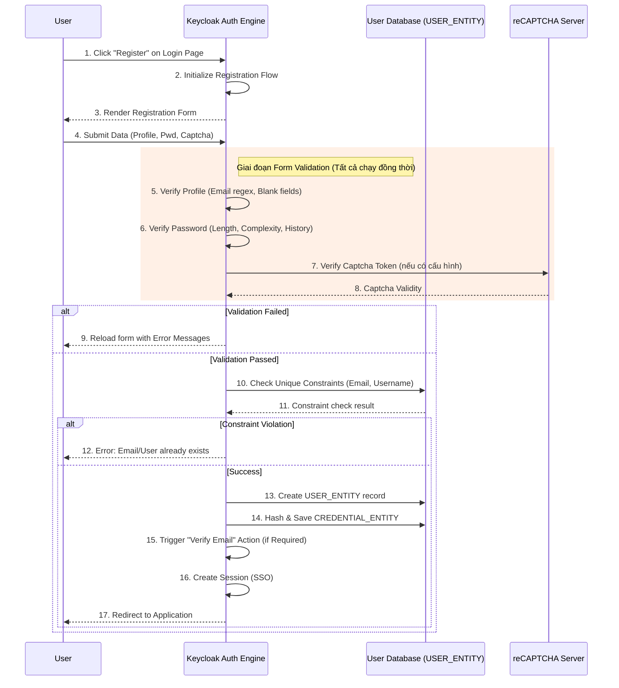

> [!NOTE]
> **Category:** Theory (Lý thuyết)
> **Goal:** Nghiên cứu luồng Registration, cách thức Keycloak quản lý quy trình tự đăng ký người dùng (Self-Service Registration), cơ chế kiểm tra dữ liệu đầu vào và các biện pháp chống tấn công hàng loạt.

## 1. Lý thuyết chuyên sâu (Detailed Theory)

Bên cạnh việc lấy thông tin người dùng từ IdP bên ngoài (Identity Brokering) hoặc đồng bộ từ LDAP/Active Directory, Keycloak còn hỗ trợ quá trình **Self-Service Registration** - cho phép khách truy cập (Guest) tự động tạo tài khoản thông qua trình duyệt web.

**Registration Flow** là một tập hợp các quy tắc và executions được thiết kế dành riêng để phục vụ màn hình Đăng ký (`/auth/realms/REALM/login-actions/registration`). Luồng này có nhiệm vụ cực kỳ quan trọng:
1. **Thu thập thông tin cá nhân**: Tên đăng nhập (Username), Email, Họ, Tên, Mật khẩu.
2. **Kiểm tra tính hợp lệ (Validation)**: Đảm bảo dữ liệu đúng định dạng (vd: Email regex), kiểm tra trùng lặp (Duplicate Username/Email check).
3. **Đánh giá chính sách mật khẩu (Password Policy)**: Xác minh độ phức tạp, độ dài của mật khẩu do người dùng tự đặt.
4. **Phòng chống bot (Anti-Bot/Spam)**: Kiểm tra mã Captcha (Google reCAPTCHA).

Registration flow chạy độc lập với Browser Flow. Tuy nhiên, nếu user hoàn thành luồng đăng ký thành công, Keycloak sẽ tự động đăng nhập (Auto-login) cho user đó và thiết lập SSO Cookie, chuyển trạng thái luồng tương tự như họ vừa hoàn thành Browser Flow.

## 2. Luồng nội bộ & Cơ chế cấp thấp (Internal Workflow & Low-level Mechanisms)

Quá trình thu thập và ghi nhận người dùng mới là một giao dịch tuần tự và phải tuân thủ nghiêm ngặt các ràng buộc của hệ quản trị cơ sở dữ liệu (Database Constraints).



**Cơ chế Validation Framework:**
Khác với các luồng khác, Registration Flow phụ thuộc nhiều vào các lớp Validator nằm trong bộ Form Validation của Keycloak. Mỗi Execution (như `Profile Validation`, `Password Validation`) bản chất là một bộ lọc kiểm tra form attributes. Nếu bất kỳ một Validator nào trả về lỗi (Ví dụ `org.keycloak.models.utils.FormMessage`), toàn bộ tiến trình ghi vào DB bị ngừng lại và form được render lại chứa thông báo lỗi cục bộ ở từng trường tương ứng.

## 3. Thực hành tốt nhất & Bảo mật (Best Practices & Security)

> [!CAUTION]
> **Tấn công lạm dụng API (Registration Endpoint Abuse)**: Luồng đăng ký mở ra một API công khai. Nếu không được bảo vệ đúng cách, Botnet có thể gửi hàng nghìn yêu cầu POST để tạo ra tài khoản rác, làm đầy (exhaust) tài nguyên Database và kích hoạt hệ thống gửi Email spam hàng loạt (nếu cấu hình Verify Email).

> [!IMPORTANT]
> **BẮT BUỘC sử dụng reCAPTCHA**: Luôn tích hợp Google reCAPTCHA v2 hoặc v3 (hoặc các dịch vụ Captcha tương đương) vào luồng đăng ký trên môi trường Production để chặn tấn công tự động. 

- **Chính sách Mật khẩu (Password Policies)**: Không bao giờ tin tưởng người dùng sẽ đặt mật khẩu an toàn. Ràng buộc chính sách (Password Policy) trên Realm Settings (Ví dụ: Yêu cầu ít nhất 1 chữ hoa, 1 số, ký tự đặc biệt, không chứa username, độ dài > 12). Execution `Password Validation` sẽ làm nhiệm vụ ép buộc chính sách này trong lúc đăng ký.
- **Xác minh Email (Email Verification)**: Kích hoạt cờ `Verify email` ở mức Realm. Mặc dù Registration Flow tạo tài khoản ngay lập tức, tính năng này sẽ chặn phiên bản User Session mới tạo bằng một luồng con Require Action bắt buộc user phải nhấp vào link gửi qua hòm thư thật.

## 4. Cấu hình minh họa thực tế (Configuration Examples)

Thêm tính năng bảo vệ bằng Google reCAPTCHA vào luồng đăng ký hiện tại:

**Bước 1: Cấu hình reCAPTCHA ở Site**
Đăng ký trên nền tảng Google reCAPTCHA, lấy `Site Key` và `Secret Key`.

**Bước 2: Sửa đổi Registration Flow**
1. Truy cập Admin Console -> **Authentication** -> **Flows** -> Click luồng `Registration` (đây là một Form Sub-flow).
2. Thêm execution `reCAPTCHA` vào luồng này.
3. Đặt Requirement thành `REQUIRED`.
4. Mở cài đặt (biểu tượng bánh răng) của execution `reCAPTCHA`.
5. Điền `Site Key` và `Secret Key` đã lưu vào ô cấu hình.

Mã CLI (kcadm.sh) để tự động hóa việc cấu hình Captcha:
```bash
/opt/keycloak/bin/kcadm.sh update realms/myrealm \
  -s "attributes.recaptchaSiteKey=YOUR_SITE_KEY" \
  -s "attributes.recaptchaSecret=YOUR_SECRET_KEY"
```

## 5. Trường hợp ngoại lệ (Edge Cases)

- **Lỗi Email Case Sensitivity**: Một số Database có thể phân biệt chữ hoa, chữ thường đối với trường Email. Người dùng `test@gmail.com` và `Test@gmail.com` có thể vô tình tạo thành hai tài khoản khác nhau nếu quản trị viên không bật chế độ chuẩn hóa chuỗi (Lowercase/Normalize Email) trong cấu hình của Realm. Điều này gây khó khăn khi SSO tích hợp với các hệ thống coi nhẹ (case-insensitive) cấu trúc mail.
- **Bot Bypass Form UI**: Kẻ tấn công không dùng trình duyệt mà viết script gửi thẳng gói HTTP POST Payload đến endpoint `/login-actions/registration`. Vì luồng Registration là luồng public, nó sẽ chấp nhận nếu Payload hợp lệ. Nếu bỏ quên thiết lập Captcha REQUIRED, hệ thống sẽ bị tấn công dễ dàng.
- **Lỗi giao dịch một phần (Partial Transaction Failure)**: Do hệ thống phân tán, nếu Keycloak tạo account thành công nhưng quá trình gửi Mail Verify bị Timeout do máy chủ SMTP (Mail server) cấu hình sai, User sẽ bị kẹt lại màn hình lỗi 500 nhưng trong cơ sở dữ liệu đã có account (Account is created but unusable). 

## 6. Câu hỏi Phỏng vấn (Interview Questions)

1. **Junior**: Luồng Registration hoạt động như thế nào so với việc quản trị viên tự tạo user trong màn hình Admin Console?
   - *Đáp án*: Luồng Registration cho phép người dùng tự do (self-service) khởi tạo tài khoản thông qua trình duyệt (Frontend) dựa trên các quy tắc xác thực (như reCAPTCHA, Password policy). Quản trị viên dùng giao diện Admin (Backend) gọi trực tiếp REST API tạo tài khoản bỏ qua mọi validation form bảo vệ.
2. **Junior**: Tại sao luồng Registration lại phải gộp tất cả validator vào một Form Sub-Flow duy nhất?
   - *Đáp án*: Để Keycloak có thể thu thập thông tin và chạy tất cả các khâu kiểm tra (Profile, Password, Captcha) đồng thời, và nếu có bất kỳ lỗi nào, nó sẽ hiển thị tổng hợp tất cả các lỗi trên một màn hình HTML duy nhất thay vì bắt người dùng đi qua từng trang HTML lẻ tẻ.
3. **Senior**: Tính năng "Verify Email" hoạt động ở giai đoạn nào so với luồng Registration? Nó là một bước trong luồng, hay ở ngoài?
   - *Đáp án*: Nó nằm ngoài. Luồng Registration hoàn tất việc tạo tài khoản và ghi vào cơ sở dữ liệu. Ngay sau khi thành công, Keycloak chuẩn bị cấp quyền đăng nhập thì bộ máy bắt gặp cấu hình Required Action `VERIFY_EMAIL`. Nó sẽ tạm ngưng luồng cấp token, gửi email đi, và khoá user tại trang báo "Vui lòng kiểm tra hộp thư".
4. **Senior**: Nếu tôi muốn thu thập thêm "Ngày tháng năm sinh" trong màn hình Đăng ký, tôi cần mở rộng hệ thống như thế nào?
   - *Đáp án*: Cấu hình tính năng **User Profile** trong Realm Settings, tạo một thuộc tính (Attribute) `birthdate`, thiết lập Permission cho phép User và Admin được chỉnh sửa. Form đăng ký sẽ tự động sinh trường nhập liệu (dynamic rendering) mà không cần viết Custom Authenticator (Keycloak 15+ hoặc User Profile Preview trên các bản cũ).
5. **Senior**: Làm sao để ngăn chặn người dùng đăng ký bằng các dịch vụ Email ném đi (Disposable Email như 10minutemail)?
   - *Đáp án*: Có thể viết một Custom Validation Execution bằng Java SPI, trong execution này, đọc thông tin trường `email` từ Form POST, bóc tách tên miền (Domain) và so sánh nó với một danh sách Blacklist lấy qua API ngoài. Nếu khớp, ném ra lỗi `FormMessage` để chặn việc đăng ký ngay tức khắc.

## 7. Tài liệu tham khảo (References)

- Keycloak Server Administration Guide: User Registration
- OWASP: Authentication Cheat Sheet (Anti-automation)
- Google reCAPTCHA Documentation
- OAuth 2.0 Security Considerations (Automated Registration)
