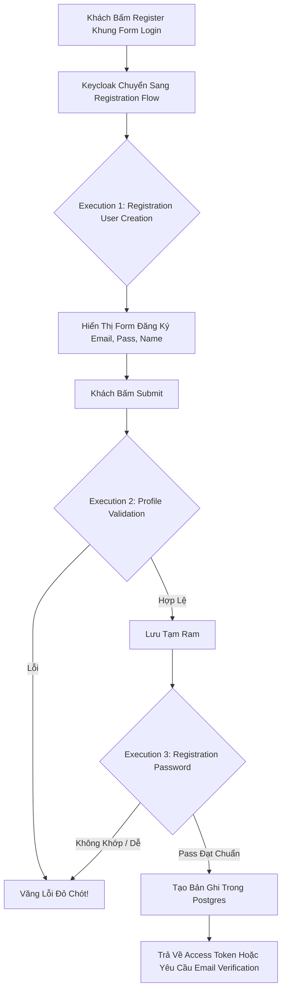

# Lesson 2: Lễ Tân Đón Khách (Registration Flow)

> [!NOTE]
> **Category:** Theory (Lý thuyết)
> **Goal:** Khi người dùng chưa có tài khoản, họ bấm nút "Register" trên màn hình Login. Vậy điều gì sẽ xảy ra tiếp theo? Keycloak sẽ chuyển hướng họ vào kịch bản **Registration Flow**. Nơi bạn cấu hình thu thập thông tin, ép buộc xác minh Email hoặc đánh giá CAPTCHA để chống Bot.

## 1. Lý thuyết chuyên sâu (Detailed Theory)

### 1.1. Registration Flow Là Gì?
Khác Với Browser Flow, Registration Flow Là Luồng **Self-Service** - Cho Phép Người Lạ Tự Đăng Ký Hồ Sơ (Profile) Cho Mình.
- Mặc Định, Tính Năng Đăng Ký Bị **Khóa Cứng** Ở Cấp Độ Realm. Nếu Dùng B2B (Admin Tự Tạo Tài Khoản), Luồng Này Không Cần Dùng.
- Khi Bạn Vào `Realm Settings` -> Bật `User Registration`, Keycloak Mới Hiển Thị Nút `Register` Trên Form Login. Lúc Này Luồng Đăng Ký Mới Hoạt Động.

### 1.2. Mổ Xẻ Nội Tạng Của Registration Flow Mặc Định
Luồng Đăng Ký Mặc Định Gồm Các Cục Thực Thi (Execution) Sau:
1. **Registration User Creation (Required):** Đây Là Cục Bắt Buộc Quan Trọng Nhất. Nhiệm Vụ Là Vẽ Ra Giao Diện Điền Thông Tin: Username, Email, First Name, Last Name. Dữ Liệu Sẽ Được Bơm Vào Database.
2. **Profile Validation (Required):** Đóng Vai Trò Gác Cổng. Nếu Khách Điền Thiếu Thông Tin Hoặc Sai Định Dạng Email, Hệ Thống Sẽ Trả Lại Lỗi "Invalid Email".
3. **Registration Password (Required):** Yêu Cầu Nhập Và Xác Nhận Lại Password Mới. Mật Khẩu Sẽ Bị Hashing Qua PBKDF2 Trước Khi Lưu.
4. **Registration reCAPTCHA (Disabled):** Tính Năng Chống Bot Của Google reCAPTCHA Để Chống Spam. Mặc Định Là Disabled, Cần Bật Required Và Thêm API Key Để Sử Dụng.

---

## 2. Luồng nội bộ & Cơ chế cấp thấp (Internal Workflow & Low-level Mechanisms)

Hành Trình Qua Registration Flow:

---

## 3. Thực hành tốt nhất & Bảo mật (Best Practices & Security)

> [!IMPORTANT]
> **Tuyệt Đỉnh An Toàn (Luôn Bật Verify Email Khi Mở Đăng Ký)**
> **Tội Ác Thiết Kế:** Cho Phép Đăng Ký Tự Do Mà Không Đòi Xác Thực. Hacker Có Thể Dùng Bot Điền Email Rác Và Mở Hàng Triệu Tài Khoản Ảo Để Khai Thác Hệ Thống.
> **Biện Pháp Sống Còn:** Nếu Mở `User Registration`, BẮT BUỘC Vào `Realm Settings` -> `Login` -> Bật **`Verify email`**. Khi Bật Chế Độ Này, Người Dùng Phải Bấm Vào Link Gửi Tới Email Thật Mới Kích Hoạt Được Tài Khoản.

---

## 4. Cấu hình minh họa thực tế (Configuration Examples)

Bật Tường Lửa ReCAPTCHA Cho Luồng Đăng Ký:
1. Lấy `Site Key` Và `Secret Key` Từ Tài Khoản Google reCAPTCHA.
2. Vào Menu `Authentication` -> `Flows`.
3. Duplicate Dòng Flow Có Tên `registration`, Đặt Tên `My-Registration-Secure`.
4. Tại Dòng `Registration reCAPTCHA`, Đổi Disabled Thành **`Required`**.
5. Bấm Vào Icon Bánh Răng (Settings) Của `Registration reCAPTCHA` -> Nhập `Site Key` Và `Secret` Của Google -> Save.
6. Vào `Realm Settings` -> Tab `Login` -> Bật `User registration`.
7. Vào Tab `Themes`, Mục `Registration Flow` -> Chọn Sang Luồng `My-Registration-Secure`.
8. Bây Giờ Người Dùng Khi Đăng Ký Phải Xác Nhận Captcha "I'm not a robot".

---

## 5. Câu hỏi Phỏng vấn (Interview Questions)

**1. Làm Cách Nào Thêm Trường "Số Điện Thoại" Hoặc "CMND" Vào Form Đăng Ký Của Keycloak Mà Không Cần Tự Code Form Web Mới?**
- **Senior:** Đừng Tự Code Lại Form Login/Registration Để Tránh Làm Hỏng Flow Và reCAPTCHA Của Keycloak. Thay Vào Đó, Hãy Bật Tính Năng **`User Profile`** Trong `Realm Settings`. Vào Tab `User Profile`, Thêm Các Thuộc Tính Mới Như `phone_number`, Chỉnh Required Là `true`, Và Bật `Permissions -> User -> Edit`. Keycloak Sẽ Tự Động Vẽ Thêm Các Trường Textbox Này Vào Giao Diện Đăng Ký Mặc Định Của `Registration User Creation`.

---

## 6. Tài liệu tham khảo (References)
- **OIDC Specifications:** Self-Issued OpenID Provider (SIOP).
