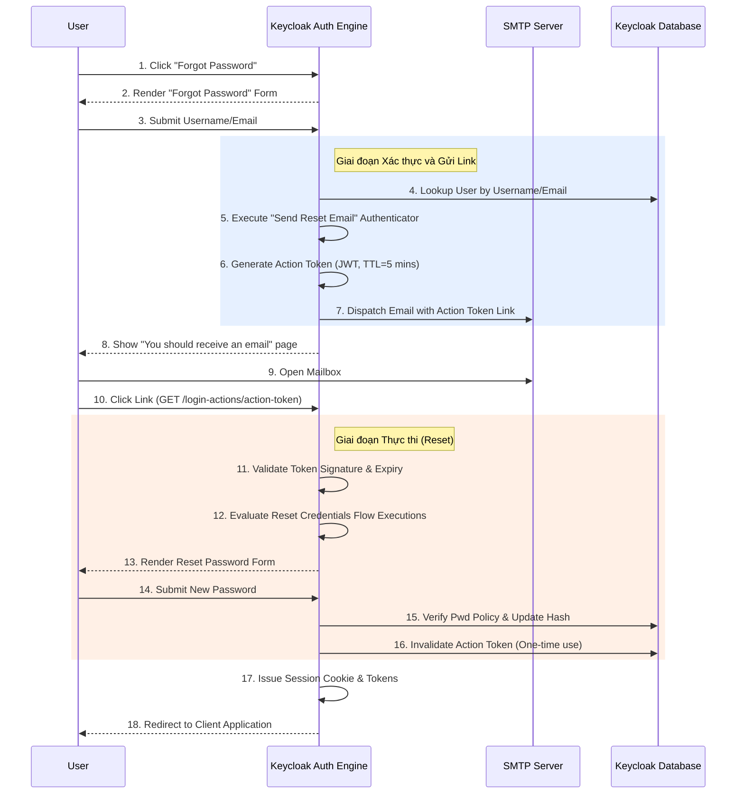

> [!NOTE]
> **Category:** Theory (Lý thuyết)
> **Goal:** Phân tích chi tiết quy trình khôi phục thông tin đăng nhập (Reset Credentials), cơ chế mã thông báo hành động (Action Token) qua email và cách phòng chống lạm dụng luồng này.

## 1. Lý thuyết chuyên sâu (Detailed Theory)

Một trong những tính năng Self-service không thể thiếu ở bất kỳ hệ thống Identity and Access Management (IAM) nào là khả năng hỗ trợ người dùng tự khôi phục thông tin đăng nhập khi quên mật khẩu hoặc mất thiết bị OTP. Trong Keycloak, quy trình này được định nghĩa bởi một luồng riêng biệt mang tên **Reset Credentials Flow**.

Luồng Reset Credentials không chỉ để đặt lại mật khẩu (Password), nó có thể cấu hình để hỗ trợ người dùng vô hiệu hóa OTP cũ và thiết lập ứng dụng OTP mới. Nó hoạt động dựa trên triết lý **Out-of-band Verification** (Xác minh ngoài băng thông), tức là để chứng minh quyền sở hữu tài khoản, hệ thống sẽ gửi một mã bí mật qua một kênh giao tiếp khác (thường là Email) thay vì trực tiếp trên trình duyệt hiện tại.

Mấu chốt của quy trình này nằm ở **Action Token** - một dạng JSON Web Token (JWT) mang thông tin ủy quyền có thời hạn ngắn, được ký mã hóa bằng khóa bảo mật (Keys) của Realm. Khi người dùng nhấp vào link từ email, Keycloak giải mã Token này để xác định user là ai và hành động cần thực thi (ví dụ: Update Password) là gì.

## 2. Luồng nội bộ & Cơ chế cấp thấp (Internal Workflow & Low-level Mechanisms)

Khi người dùng nhấn "Forgot Password", Keycloak điều hướng họ sang luồng Reset Credentials.

**Cơ chế cấp thấp:**
- `Choose User Execution`: Nhận đầu vào là username/email và tra cứu tài khoản trong DB.
- `Send Reset Email Execution`: Dựa vào Action Token SPI, Keycloak sinh một JWT mang định dạng `execute-actions` kèm với thuộc tính `userId`. Mã Token này được thiết lập là One-Time Use (dùng 1 lần). Trạng thái token đã sử dụng sẽ được lưu tạm vào kho cache Inifinispan (`actionTokens`) để ngăn chặn việc tái sử dụng.
- `Reset Password Execution`: Buộc user nhập mật khẩu mới. Nếu pass thành công, nó sẽ ghi đè bản ghi Credential hiện tại.

## 3. Thực hành tốt nhất & Bảo mật (Best Practices & Security)

> [!WARNING]
> **Tấn công Email Enumeration (Dò tìm tài khoản)**: Nếu giao diện trả về câu báo "Tài khoản không tồn tại" khi nhập sai email, kẻ tấn công có thể chạy script để thu thập danh sách email của người dùng (Harvesting). Hãy chắc chắn luồng này luôn trả về một thông báo ẩn danh (Generic Error) kiểu như: "Nếu địa chỉ email đúng, bạn sẽ nhận được một hướng dẫn khôi phục", bất kể email có tồn tại trong hệ thống hay không.

> [!IMPORTANT]
> **Action Token Lifespan**: Luôn thiết lập vòng đời (TTL) cho Token hành động cực kỳ ngắn. Thời gian mặc định của Keycloak cho `Execute Actions` là 5 phút. Đừng cấu hình kéo dài quá mức này để tránh rủi ro người dùng bị đánh cắp đường link (Link Leakage) thông qua bộ đệm proxy hoặc lịch sử chat nội bộ.

- **MFA Recovery**: Cấu hình thêm tính năng `Reset OTP` nếu người dùng thường xuyên phàn nàn mất điện thoại không lấy được mã. Hãy đổi nó thành `ALTERNATIVE` bên cạnh Reset Password để tùy thuộc họ muốn cấu hình lại cái gì.
- **Account Disablement Check**: Nếu một tài khoản bị vô hiệu hóa (`enabled = false`) bởi quản trị viên, luồng Reset Credentials phải lập tức chặn lại và không được phép gửi email đi, tránh việc user tìm cách lách luật để kích hoạt lại session.

## 4. Cấu hình minh họa thực tế (Configuration Examples)

Sửa đổi luồng Reset Credentials để cho phép reset cả Mật khẩu và OTP.

1. Vào Admin Console -> **Authentication** -> **Flows** -> Chọn `Reset Credentials`.
2. Tạo một **Generic Sub-Flow** (Tên: `Reset-Options-SubFlow`) và đặt mức Requirement là `REQUIRED` ngay dưới mục "Send Reset Email".
3. Thêm 2 Execution vào Sub-Flow này:
   - `Reset Password` -> Đặt thành `ALTERNATIVE`.
   - `Reset OTP` -> Đặt thành `ALTERNATIVE`.
4. Khi người dùng click vào link reset gửi qua email, Keycloak sẽ hỏi họ muốn đặt lại mật khẩu hay cấu hình lại bộ mã xác thực OTP thay thế (Cung cấp các lựa chọn khôi phục mở rộng).

Cấu hình Action Token Lifespan thông qua giao diện:
1. Mở mục **Realm Settings** -> Tab **Tokens**.
2. Cuộn xuống phần **Action token lifespan**.
3. Cài đặt lại từ 5 Minutes thành một mức độ tuỳ chỉnh mà đội Security của bạn cho phép.

## 5. Trường hợp ngoại lệ (Edge Cases)

- **Lỗi Single-Use Token Invalidation**: Vì Keycloak dùng cache phân tán Infinispan để đánh dấu token đã sử dụng, nếu cấu hình cluster Keycloak (Multi-node) bị phân tách mạng (Split-brain), bản ghi token đã dùng có thể không đồng bộ được sang node khác, cho phép kẻ xấu click link reset lần 2 vào node khác để đổi mật khẩu thêm lần nữa trong giới hạn 5 phút. Cần cấu hình Inifinispan đồng bộ chặt chẽ (Sync caching).
- **Mã hoá Link trong Email Client**: Một số hệ thống phần mềm bảo mật thư điện tử (như Microsoft Defender for Office 365, Proofpoint) sử dụng cơ chế "Safe Links". Cơ chế này tự động lấy đường link trong email ra và thực hiện gọi HTTP GET để rà quét mã độc. Vì link Reset Password là dùng 1 lần (One-Time), hệ thống chống virus có thể vô tình "click thay" người dùng và làm hỏng token trước khi người dùng thực sự đọc được thư (Gây lỗi: Token is invalid or expired). Khắc phục bằng cách yêu cầu IT Whitelist domain của Keycloak.

## 6. Câu hỏi Phỏng vấn (Interview Questions)

1. **Junior**: Luồng Reset Credentials chủ yếu được kích hoạt bằng hành động nào trên giao diện?
   - *Đáp án*: Thông qua đường link "Forgot Password" (Quên mật khẩu) trên màn hình đăng nhập.
2. **Junior**: Action Token được sử dụng trong email gửi đi là loại Token gì?
   - *Đáp án*: JWT (JSON Web Token), nó chứa thông tin người dùng được ký mã hóa bằng chìa khóa Realm của Keycloak và có thời hạn cực kỳ ngắn.
3. **Senior**: Tại sao hệ thống trả về cùng một thông báo "You should receive an email..." bất kể tôi nhập email đúng hay là một email hoàn toàn sai / không tồn tại trong hệ thống?
   - *Đáp án*: Cơ chế này nhằm ngăn chặn kỹ thuật "User Enumeration" (Dò tìm danh tính). Nếu hệ thống phân biệt trả lời, hacker có thể dùng từ điển email để test API và lọc ra hàng ngàn tài khoản hợp lệ đang tồn tại trong hệ thống.
4. **Senior**: Làm sao để xử lý tình trạng hệ thống chặn mã độc (Antivirus Mail Gateway) tự động click link trong thư báo quên mật khẩu và làm Token One-Time mất tác dụng?
   - *Đáp án*: Đây là một "Pain point" rất phổ biến. Có thể giải quyết bằng cách thay đổi thiết kế luồng, thay vì Link HTTP GET tự thi hành (auto-execute), Keycloak chỉ render một trang yêu cầu người dùng phải chủ động bấm thêm một nút Submit (POST request) để xác nhận bắt đầu Reset, hoặc thay thế bằng việc gửi mã PIN gồm 6 số thay vì Magic Link.
5. **Senior**: Luồng Reset Credentials có thể được ứng dụng trong một bài toán khác là "Admin Force Update" không?
   - *Đáp án*: Có, thông qua Admin API (Execute Actions Email API). Quản trị viên thay vì gọi quy trình forgot password ở Frontend, họ gọi API đẩy trực tiếp một yêu cầu Update Password đến email của user (ví dụ khi có sự cố vi phạm dữ liệu, ép mọi người đổi pass).

## 7. Tài liệu tham khảo (References)

- Keycloak Server Administration Guide: Reset Credentials
- OWASP: Forgot Password Cheat Sheet
- OpenID Connect Specification: Single Use Tokens
- JWT (JSON Web Token) Security Best Practices (RFC 8725)
