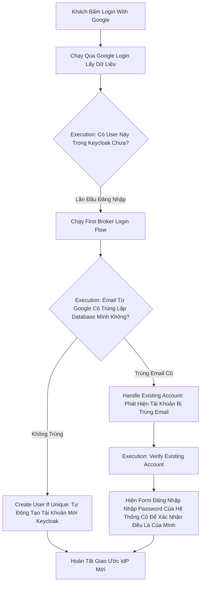

# Lesson 4: Giao Ước Liên Minh (First Broker Login)

> [!NOTE]
> **Category:** Theory (Lý thuyết)
> **Goal:** Khi một người dùng quyết định "Login with Google", họ chưa từng có tài khoản trong hệ thống của bạn trước đó. Keycloak sẽ xử lý thế nào để tự động biến họ thành khách hàng nội bộ của chúng ta? Đó là lúc luồng **First Broker Login** ra tay.

## 1. Lý thuyết chuyên sâu (Detailed Theory)

### 1.1. Identity Brokering Là Gì?
Identity Brokering (Môi Giới Danh Tính) Là Việc Keycloak Đứng Ở Giữa Làm Cò Mồi. Khách Hàng Sẽ Đăng Nhập Ở Một Nền Tảng Bên Thứ 3 (Google, Facebook, Github) Được Gọi Chung Là **Identity Provider (IdP)**. Sau Khi Đăng Nhập Xong Ở IdP, IdP Sẽ Bắn Trả Về Lại Cho Keycloak Một Chữ Ký Xác Nhận Người Này Đã Được Ủy Quyền.

### 1.2. First Broker Login Flow Là Gì?
Luồng Này Xảy Ra **DUY NHẤT MỘT LẦN** Trong Suốt Vòng Đời Của Khách Hàng: Đó Là Ngày Đầu Tiên Họ Bấm Nút Login Qua MXH.
- Vì Google/Facebook Chỉ Là Hệ Thống Ngoài. Keycloak Vẫn Phải Tạo Ra 1 Bản Ghi Dữ Liệu `User` Nằm Trong Database Của Riêng Mình Để Cấp Quyền (Roles, Groups) Về Sau.
- Nhiệm Vụ Của `First Broker Login` Là Tìm Cách Khớp (Link) Những Dữ Liệu Mà Google Bắn Trả Về Sang Một Identity Nằm Bên Trong Database Của Keycloak.

### 1.3. Mổ Xẻ Nội Tạng First Broker Login Flow
Khi Khách Đăng Nhập Lần Đầu Bằng Google, Các Bước Sau Sẽ Chạy:
1. **Review Profile (Alternative):** Bắt Khách Hàng Kiểm Tra Lại Thông Tin Cá Nhân Mà Google Cấp Trả (Như Tên, Email). Nếu Thiếu Dữ Liệu Nào Đó Từ Google, Nó Sẽ Hiện Form Bắt Khách Tự Điền Vào Trước Khi Đi Tiếp.
2. **Create User If Unique (Alternative):** Đây Là Trái Tim Của Luồng. Nó Rút Cái Email Từ Google Trả Về. Nếu Trong Database Của Keycloak Chưa Có Ai Sở Hữu Email Này -> Nó Mở 1 Bản Ghi User Mới Keng Và Gắn Với Khách Này Mãi Mãi.
3. **Handle Existing Account (Alternative):** Nếu Email Do Google Bắn Sang Bị Trùng Lặp Với 1 Email Đã Nằm Sẵn Trong Database (Khách Từng Tự Đăng Ký Bằng Tay Hoặc Qua MXH Khác). Nó Sẽ Phát Hiện Ra Và Kích Hoạt Bước Kiểm Tra Liên Kết (Link Account).
4. **Verify Existing Account By Re-authentication (Alternative):** Đòi Khách Hàng Đăng Nhập Lại Bằng Password Gốc Của Họ (Cái Nằm Trong Hệ Thống Mình) Để Chứng Minh Hai Cái Email Là Cùng 1 Người, Rồi Mới Nối 2 Tài Khoản Nhau.

---

## 2. Luồng nội bộ & Cơ chế cấp thấp (Internal Workflow & Low-level Mechanisms)

Hành Trình Login Google Lần Đầu Tiên:

---

## 3. Thực hành tốt nhất & Bảo mật (Best Practices & Security)

> [!IMPORTANT]
> **Tuyệt Đỉnh Tự Động Hóa (Tắt Màn Hình Review Profile Để Tránh Làm Phiền Khách)**
> **Tội Ác Trải Nghiệm:** Mặc Định, Sau Khi Login Google Xong, Keycloak Sẽ Nhảy Sang Màn Hình `Review Profile` Hiển Thị Lại Email Và Tên Của Khách Để Đòi Họ Bấm "Submit" 1 Lần Nữa. Điều Này Làm Hỏng Chải Nghiệm One-Click Mượt Mà.
> **Biện Pháp Sống Còn:** Chỉnh Trạng Thái `Review Profile` Thành `Disabled` Nếu Bạn Tin Tưởng 100% Thông Tin Từ Phía Google/Facebook, Hoặc Đổi Hành Vi Trong Identity Providers Setting Thành Chế Độ Nhập Không Cần Xác Nhận.

---

## 4. Cấu hình minh họa thực tế (Configuration Examples)

Lắp Ráp Hệ Thống Login Google Không Cần Bấm Nút Xác Nhận Profiling:
1. Vào Admin Console -> `Authentication` -> `Flows`.
2. Duplicate Flow Có Tên `first broker login` Thành `My-Broker-Auto-Create`.
3. Trong `My-Broker-Auto-Create`, Tìm Cục Có Tên Cấu Hình Mặc Định **`Review Profile`** (Thường Đặt Là Alternative).
4. Nhấn Chọn Trạng Thái Chuyển Thành **`DISABLED`**. 
5. Tùy Chọn: Nếu Muốn Liên Kết Luôn Tài Khoản Cũ Khi Trùng Email Mà KHÔNG BẮT Đăng Nhập Xác Nhận Lại Password, Đổi `Verify Existing Account` Thành `DISABLED` Luôn. (LƯU Ý CỰC KỲ NGUY HIỂM: Chỉ Áp Dụng Cho IdP Uy Tín Số 1 Thế Giới Đã Trải Qua Bước Verify Account Như Google. Nếu Áp Dụng Cho IdP Cỏ, Hacker Sẽ Dùng Tính Năng Này Để Bơm Email Đè Vào Tài Khoản Admin Để Ăn Cắp).
6. Vào `Identity Providers` -> Mở Chọn Nền Tảng Google.
7. Cuộn Xuống Dưới Cùng Ở Ô `First Login Flow`, Chọn Sang Flow `My-Broker-Auto-Create` Vừa Sửa.

---

## 5. Câu hỏi Phỏng vấn (Interview Questions)

**1. Sếp Yêu Cầu Cậu Rằng Khi Khách Hàng Dùng Cùng Một Địa Chỉ Email: `boss@gmail.com` Để Vừa Login Bằng Google, Vừa Lại Nhấn Đăng Nhập Tiếp Bằng Facebook, Thì Keycloak Phải Tự Động Gom Tất Cả Mọi Login Từ Cùng 1 Email Này Vào Chung 1 Tài Khoản User Duy Nhất Trong Hệ Thống. Mặc Định Tính Năng Tự Động Ghép Này Đang Đòi Xác Nhận Bằng Password Gốc. Cậu Làm Thế Nào Gộp Chúng Mà Mượt Bỏ Qua Luôn Khâu Hỏi Password Gốc Đó?**
- **Senior:** Đầu Tiên, Phải Có Một Custom Flow Kế Thừa Từ Luồng `First Broker Login`. Trong Luồng Đó, Ở Bước `Handle Existing Account`, Hệ Thống Sẽ Nhận Diện Có Trùng Lặp Email. Tuy Nhiên Khối Xác Nhận Quyền `Verify Existing Account` Nằm Đằng Sau Phải Bị Disable Đi Mất Quyền Ngăn Cản.
- Nhưng Thay Vì Tắt Không Để Làm Gì, Ta Có Khối Khác Tên `Automatically Set Existing User` Sẵn Dưới Engine Keycloak Nhưng Ẩn. Ta Sẽ Chèn Và Gọi Nó Là Alternative, Gắn Dưới Sub-flow Của Handle Existing Account. Hành Động Này Nói Rằng: "Nếu Thấy Có Account Trùng Email Bị Phát Hiện Ra, Cứ Gán Identity Provider Mới Này Vào Tài Khoản Cũ Trong Im Lặng (Auto-Link) Mà Chẳng Cần Phải Xác Thực Quyền Sự Cho Phép Nữa".
- **Lưu Ý Lớn Tới Cảnh Báo:** Auto-Link Trùng Mọi Email Mà Không Kiểm Duyệt Sẽ Khiến Hacker Tạo 1 IdP Lậu Trả Về Mọi Loại Email Admin Rồi Bắt Keycloak Auto Link Thành Công Để Hack Lấy Role. Luôn Kiểm Tra Môi Trường Phù Hợp Cho Phương Pháp Bypass Này.

---

## 6. Tài liệu tham khảo (References)
- **Keycloak Documentation:** Identity Brokering & User Federation.
