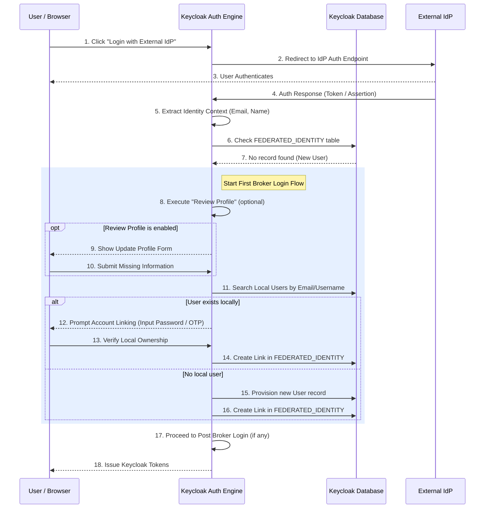

> [!NOTE]
> **Category:** Theory (Lý thuyết)
> **Goal:** Nắm vững bản chất, cơ chế hoạt động, và quy trình xử lý của luồng First Broker Login trong Keycloak khi liên kết tài khoản từ Identity Provider bên ngoài với tài khoản nội bộ.

## 1. Lý thuyết chuyên sâu (Detailed Theory)

Khi Keycloak hoạt động như một Identity Broker, nó cho phép người dùng xác thực thông qua các dịch vụ bên ngoài như Google, Facebook, hoặc một máy chủ SAML. Tuy nhiên, các ứng dụng Client được kết nối với Keycloak cần một danh tính đồng nhất để làm việc, và Keycloak cũng cần lưu trữ thông tin về người dùng (như Role, Group) trong cơ sở dữ liệu nội bộ của chính nó.

Do đó, khái niệm **First Broker Login Flow** ra đời. Đây là luồng xác thực đặc biệt chỉ chạy **một lần duy nhất** đối với mỗi người dùng mới khi họ sử dụng một Identity Provider (IdP) bên ngoài để đăng nhập vào Keycloak lần đầu tiên.

Mục tiêu chính của `First Broker Login` bao gồm:
1. **Provisioning**: Tạo một tài khoản người dùng tương ứng (Local User) trong cơ sở dữ liệu của Keycloak dựa trên các thông tin (Claims/Attributes) do IdP cung cấp.
2. **Account Linking**: Liên kết danh tính ngoại lai (Federated Identity) với tài khoản nội bộ vừa tạo, để các lần đăng nhập sau không cần chạy lại quy trình này.
3. **Conflict Resolution**: Giải quyết xung đột (ví dụ: phát hiện ra đã có một tài khoản nội bộ sử dụng cùng địa chỉ email mà IdP trả về).

Luồng này thường có sự tương tác của người dùng để quyết định xem họ muốn tạo tài khoản mới tinh (Create New Account) hay liên kết với tài khoản đã tồn tại (Link Existing Account).

## 2. Luồng nội bộ & Cơ chế cấp thấp (Internal Workflow & Low-level Mechanisms)

Quá trình `First Broker Login` được kích hoạt bởi engine của Keycloak khi nó tra cứu bảng `FEDERATED_IDENTITY` trong cơ sở dữ liệu và không tìm thấy bản ghi nào khớp với `broker_user_id` và `identity_provider` từ phiên đăng nhập.



**Cơ chế Account Linking:**
Khi IdP trả về một email (vd: `user@example.com`), Keycloak sẽ kiểm tra xem email này đã tồn tại trong local database hay chưa. Nếu có, Keycloak coi đây là dấu hiệu của việc người dùng này đã từng tạo tài khoản trực tiếp hoặc qua một IdP khác. Tại thời điểm này, execution `Verify Existing Account by Email` sẽ được kích hoạt, gửi một email chứa mã xác nhận (hoặc yêu cầu nhập mật khẩu của tài khoản cũ) để chứng minh quyền sở hữu, ngăn chặn tấn công Account Takeover thông qua Identity Brokering.

## 3. Thực hành tốt nhất & Bảo mật (Best Practices & Security)

> [!WARNING]
> **Account Takeover Risk**: Không bao giờ vô hiệu hóa hoàn toàn cơ chế xác minh liên kết tài khoản (Account Linking Verification) nếu IdP bên ngoài không đáng tin cậy. Kẻ tấn công có thể tạo một tài khoản trên IdP xấu với email của nạn nhân, sau đó sử dụng nó để đăng nhập vào hệ thống của bạn và chiếm quyền điều khiển tài khoản (nếu Keycloak tự động link mà không xác minh).

> [!IMPORTANT]
> **Trust Email từ IdP**: Nếu IdP bên ngoài là một hệ thống nội bộ đáng tin cậy (như Active Directory hoặc Google Workspace của công ty), bạn có thể bật cờ `Trust Email` trong cài đặt IdP. Điều này giúp Keycloak bỏ qua bước gửi email xác minh và thực hiện tự động liên kết (Auto-Link) một cách liền mạch.

- **Review Profile Execution**: Tùy thuộc vào IdP, dữ liệu trả về có thể thiếu họ tên hoặc số điện thoại. Sử dụng bước `Review Profile` để yêu cầu người dùng điền thêm thông tin trước khi tạo tài khoản chính thức.
- **Dọn dẹp Federated Identity cũ**: Khi xóa một tài khoản local, Keycloak sẽ tự động xóa các liên kết trong `FEDERATED_IDENTITY`. Tuy nhiên, cẩn thận khi unlink qua Admin API để không gây lỗi logic cho phiên đăng nhập hiện tại.

## 4. Cấu hình minh họa thực tế (Configuration Examples)

Theo mặc định, Keycloak cung cấp luồng `first broker login` (có sẵn dưới dạng built-in). Nếu bạn muốn tùy chỉnh cách liên kết tài khoản để hệ thống tự động liên kết dựa trên email mà không cần xác nhận (dành cho IdP an toàn hoàn toàn).

**Thay đổi cấu hình First Broker Login để Auto-link (Không khuyến cáo cho public IdP):**
1. Copy luồng mặc định: Vào **Authentication** -> **Flows** -> Chọn `First Broker Login` -> Nhấn **Duplicate**, đặt tên là `Auto-Link-First-Broker`.
2. Thay đổi cấu trúc luồng mới:
   - Xóa execution `Review Profile`.
   - Trong phần `Handle Existing Account`, thay đổi Requirement của `Verify Existing Account by Email` thành `DISABLED`.
   - Chuyển `Automatically set existing user` thành `REQUIRED`.
3. Gắn luồng này vào IdP đáng tin cậy: Trong cài đặt IdP, chọn `Auto-Link-First-Broker` ở mục **First Login Flow**.

Mã định dạng cấu hình qua Keycloak Admin CLI (kcadm.sh) để đặt Trust Email:
```bash
/opt/keycloak/bin/kcadm.sh update identity-provider/instances/my-trusted-saml \
  -r myrealm \
  -s trustEmail=true \
  -s firstBrokerLoginFlowAlias="first broker login"
```

## 5. Trường hợp ngoại lệ (Edge Cases)

- **Lỗi Duplicate Username/Email**: Nếu Identity Provider trả về một username hoặc email đã tồn tại, nhưng tiến trình Account Linking bị huỷ do người dùng không nhớ mật khẩu cũ, luồng xác thực sẽ kẹt ở trạng thái lỗi và người dùng không thể đăng nhập được bằng cách mới này. Quản trị viên cần hỗ trợ reset mật khẩu cũ hoặc unlink tài khoản.
- **Race Conditions khi tạo người dùng**: Trong các hệ thống chịu tải cao (High Concurrency), nếu hai yêu cầu First Broker Login với cùng một người dùng (cùng email) đến Keycloak vào cùng một thời điểm chính xác, có thể xảy ra lỗi vi phạm ràng buộc Unique (Unique Constraint Violation) trên bảng `USER_ENTITY`.
- **Identity Provider thay đổi ID người dùng**: Một số IdP hiếm khi thay đổi định danh (`subject` hoặc `nameID`), nhưng nếu có, Keycloak sẽ coi đây là người dùng hoàn toàn mới và yêu cầu First Broker Login lại, dẫn đến tình trạng một người có 2 tài khoản cục bộ bị phân mảnh (split brains) thay vì 1.

## 6. Câu hỏi Phỏng vấn (Interview Questions)

1. **Junior**: Luồng `First Broker Login` đóng vai trò gì trong Keycloak?
   - *Đáp án*: Xử lý việc một người dùng đăng nhập qua bên thứ 3 (IdP) lần đầu tiên, đảm nhiệm việc tạo tài khoản cục bộ tương ứng và liên kết danh tính ngoại lai với tài khoản đó.
2. **Junior**: Nếu người dùng đã từng đăng nhập bằng Facebook, và sau này đăng nhập bằng Google với cùng một email, điều gì sẽ xảy ra ở bước First Broker Login?
   - *Đáp án*: Keycloak sẽ phát hiện email này đã được sử dụng bởi tài khoản (có liên kết Facebook). Keycloak sẽ yêu cầu người dùng xác minh quyền sở hữu tài khoản cũ (bằng mật khẩu hoặc email) trước khi liên kết thêm danh tính Google vào cùng tài khoản đó.
3. **Senior**: Tại sao tính năng "Trust Email" lại nguy hiểm nếu được bật cho các Public IdP (như bất kỳ IdP OAuth2 nào trên Internet)?
   - *Đáp án*: Public IdPs có thể cho phép người dùng đăng ký tùy ý bất kỳ địa chỉ email nào mà không cần xác minh. Kẻ tấn công có thể đăng ký email của admin hoặc của nạn nhân trên IdP đó, nếu Keycloak tin tưởng hoàn toàn vào email ("Trust Email" = true), nó sẽ liên kết tài khoản giả mạo vào tài khoản thật nội bộ, gây ra lỗ hổng chiếm quyền tài khoản hoàn toàn.
4. **Senior**: Bản ghi liên kết tài khoản được lưu trữ ở đâu trong cơ sở dữ liệu Keycloak, và bao gồm các thông tin chính nào?
   - *Đáp án*: Trong bảng `FEDERATED_IDENTITY`. Chứa `IDENTITY_PROVIDER` (tên alias của IdP), `REALM_ID`, `USER_ID` (ID của tài khoản nội bộ) và `BROKER_USER_ID` (ID gốc từ bên phía IdP).
5. **Senior**: Nếu muốn loại bỏ màn hình "Review Profile" mặc định của Keycloak, tôi cần làm gì?
   - *Đáp án*: Bạn cần tạo một bản sao (Duplicate) của luồng First Broker Login mặc định, sau đó vô hiệu hóa (hoặc thay đổi thành Disabled/Deleted) execution "Review Profile", rồi gán luồng tuỳ chỉnh này cho IdP.

## 7. Tài liệu tham khảo (References)

- Keycloak Server Administration Guide: Default First Broker Login Flow
- OAuth 2.0 Threat Model and Security Considerations (RFC 6819)
- OWASP: Account Takeover via Identity Federation
- SAML 2.0 Profile - Identity Provider Discovery and Brokering
