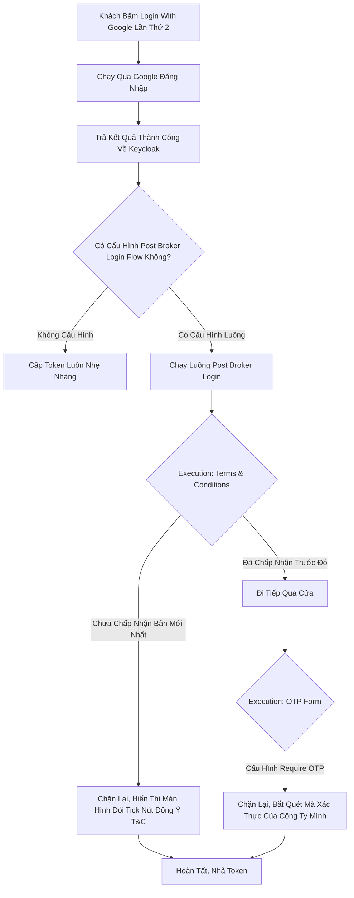

# Lesson 5: Hậu Giao Ước (Post Broker Login)

> [!NOTE]
> **Category:** Theory (Lý thuyết)
> **Goal:** Nếu First Broker Login chỉ chạy đúng 1 lần vào ngày đầu tiên khách login qua MXH. Vậy từ ngày thứ 2 trở đi, chuyện gì xảy ra? Khách hàng vẫn bấm "Login with Google", nhưng lúc này Keycloak không cần tạo mới tài khoản nữa. Thay vào đó, nó sẽ chạy một kịch bản kiểm tra an ninh có tên là **Post Broker Login**. Cùng tìm hiểu xem luồng này được dùng để làm gì.

## 1. Lý thuyết chuyên sâu (Detailed Theory)

### 1.1. Post Broker Login Flow Là Gì?
Post Broker Login (Luồng Sau Môi Giới) Được Kích Hoạt SAU KHI Một Khách Hàng Đăng Nhập Thành Công Bằng Identity Provider (Google, Facebook) Và Trở Về Lại Keycloak, Bắt Đầu Từ Lần Đăng Nhập Thứ 2 Trở Đi.
- Mục Đích Chính Của Nó Là: Kiểm Tra An Ninh Bổ Sung. Mặc Dù Google Đã Xác Nhận "Người Này Là Nguyễn Văn A", Nhưng Keycloak Vẫn Muốn Hỏi Thêm Vài Câu Nữa Trước Khi Nhả Token Cho Truy Cập Vào App Của Bạn.
- Mặc Định: Mọi Cấu Hình Cho Luồng Này Thường Bị Bỏ Trống, Vì Người Ta Thường Tin Tưởng Tuyệt Đối Vào Nền Tảng Bên Thứ 3. Khi Bỏ Trống, Máy Sẽ Bỏ Qua Luồng Này Và Cấp Token Luôn Cho Nhanh.

### 1.2. Khi Nào Nên Dùng Post Broker Login?
Bạn Không Cần Setup Luồng Này Cho Các Nhu Cầu Bình Thường, Trừ Khi Gặp 2 Trường Hợp Thực Tế Sau:
1. **Ép Đọc Điều Khoản Mới (Terms and Conditions):** Sếp Bạn Vừa Ra Mắt Chính Sách Quyền Riêng Tư Mới Của Công Ty. Bất Kể Khách Login Bằng Google, Microsoft Hay Bất Cứ Đâu, Ngay Khi Login Xong, Họ Bị Chặn Lại Bắt Tick Vào Ô "Tôi Đồng Ý Với Điều Khoản" Mới Cho Vào.
2. **Ép Buộc 2FA Nội Bộ:** Mặc Dù Khách Hàng Có Thể Không Bật OTP Bên Trong Tài Khoản Google Của Họ, Nhưng Khi Đăng Nhập Vào Hệ Thống Kế Toán Của Công Ty Bạn (Dùng Login Google), Công Ty Bạn Vẫn Bắt Buộc Họ Phải Mở App Authy Lên Để Nhập OTP Của Công Ty Cấp Trọng. 

---

## 2. Luồng nội bộ & Cơ chế cấp thấp (Internal Workflow & Low-level Mechanisms)

Hành Trình Login Google Từ Lần Thứ 2 Trở Đi:

---

## 3. Thực hành tốt nhất & Bảo mật (Best Practices & Security)

> [!IMPORTANT]
> **Tuyệt Đỉnh Tẩy Khách Mạng Bọc (Không Trùng Lặp Logic Với Required Actions)**
> **Tội Ác Thiết Kế:** Bạn Mới Học Keycloak, Thấy Hay Quá Nên Add Đủ Các Tính Năng Đòi T&C, Đòi Update Profile Vào Post Broker Login. Nhưng Bạn Lại Quên Mất Rằng Ở Tầng User Của Khách Hàng Đó Cũng Đang Bật Cờ "Required Actions: Update Profile".
> **Hậu Quả:** Khách Hàng Login Bằng Google Xong, Bị Post Broker Login Ép Đổi Profile Lần 1. Xong Nó Đi Qua Cửa, Gặp Tầng Required Actions Đè Ra Ép Đổi Profile Lần 2 Mới Cho Vào App! Khách Hàng Sẽ Cảm Thấy Khó Chịu Và Lập Tức Bỏ Dùng Hệ Thống.
> **Biện Pháp Sống Còn:** Flow Là Một Kịch Bản Cứng. Nếu Bạn Đã Dùng Required Actions Để Ép Đọc T&C Cho Một Vài Nhóm Khách Hàng Cụ Thể, Đừng Nhét Cục Execution T&C Vào Trong Post Broker Login Dùng Chung Nữa, Vì Post Broker Login Là Kịch Bản Bắt Ép Cho TẤT CẢ Những Người Vừa Đi Ra Từ Google/Facebook.

---

## 4. Cấu hình minh họa thực tế (Configuration Examples)

Lắp Ráp Hệ Thống Ép Buộc Update Profile Khi Đi Từ Google Trở Về:
1. Vào `Authentication` -> `Flows`. Bấm Nút **Create Flow** Mới Tinh Hoàn Toàn Chứ Không Duplicate, Vì Mặc Định Keycloak Đang Không Có Flow Này Nằm Sẵn.
2. Đặt Tên Flow Là `My-Post-Broker`. Loại Flow Chọn Là `Basic flow`.
3. Bấm **Add Execution**. Chọn Cục Thực Thi Mang Tên **`Update Profile`**.
4. Chọn Cục Này Trạng Thái Là **`Required`**.
5. Vào Menu `Identity Providers` -> Mở Chọn Cấu Hình Google Có Sẵn Của Bạn Lên.
6. Cuộn Xuống Phần Cấu Hình Luồng, Ở Mục **`Post Login Flow`**, Đổi Giá Trị Đang Bị Trống Sang Chọn Luồng `My-Post-Broker` Vừa Đẻ Ra Đó.
7. Xong! Kể Từ Nay Mọi Ai Bấm Nút "Login With Google" Lần Thứ 2, Đều Sẽ Bị Chặn Ở Cửa Cuối Cùng Đòi Review Update Lại Thông Tin Của Mình Trước Khi Chạm Tới App.

---

## 5. Câu hỏi Phỏng vấn (Interview Questions)

**1. Sếp Yêu Cầu Tính Năng Này: "Nếu Một Khách Hàng Mới Bấm Login Qua Facebook Lần Đầu Tiên, Công Ty Tặng Họ 100K Khuyến Mãi Bằng Cách Gắn 1 Cái Attribute `promo=100k` Vào Database Của Họ. Còn Mấy Thằng Đăng Nhập Lại Từ Lần Thứ 2 Thì Đừng Cho Gì Hết". Cậu Sẽ Chèn Đoạn Code SPI Logic Này Vào Post Broker Login Hay First Broker Login?**
- **Junior:** Dạ Post Broker nha anh ơi, vì chữ Post nghĩa là sau khi login mà. Khách về là em bắt luôn sự kiện cho tặng quà đứt mạng chạy chóp.
- **Senior:** Chèn Vào **First Broker Login** Mới Là Đúng Thiết Kế Của Keycloak!
First Broker Login Là Kịch Bản Thiết Kế Dành Riêng Cho Hành Động "LẦN ĐẦU TIÊN" Khách Liên Kết Với IdP. Trong Đó Có Cục "Create User If Unique" Đại Diện Cho Sự Chào Đời Của Bản Ghi Database Đó. Chèn SPI Bơm Code Khuyến Mãi Vào Kịch Bản First Broker Mới Đảm Bảo Mã Giảm Giá Chỉ Bắn Đúng 1 Lần Trong Đời Khách Hàng Lúc Tạo Mới!
Nếu Chèn Vào Post Broker Login, Mã Sẽ Bị Trigger Bắn Bùm Bùm Vào Profile Khách Mỗi Khi Họ Bấm Login Vào Các Ngày Hôm Sau, Gây Thất Thoát Khuyến Mãi Khủng Khiếp Trừ Khi Phải Tự Dùng Lệnh If Check Tốn Cost Của Ram Của Hệ Thống.

---

## 6. Tài liệu tham khảo (References)
- **Keycloak Documentation:** Default Identity Providers - Post Login Flow.
