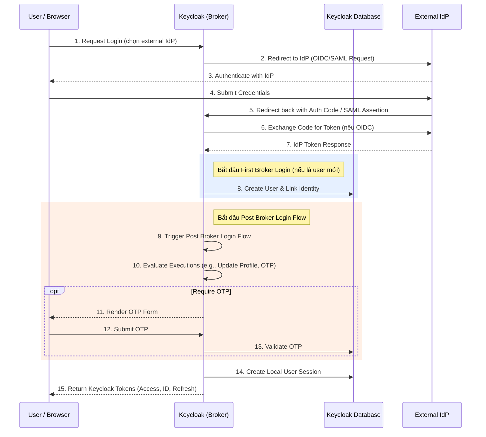

> [!NOTE]
> **Category:** Theory (Lý thuyết)
> **Goal:** Hiểu rõ mục đích, cơ chế hoạt động và cách cấu hình luồng Post Broker Login trong Keycloak để kiểm soát người dùng sau khi xác thực qua Identity Provider (IdP) bên ngoài.

## 1. Lý thuyết chuyên sâu (Detailed Theory)

Trong kiến trúc Identity and Access Management (IAM) hiện đại, việc tích hợp với các Identity Provider (IdP) bên ngoài (như Google, Facebook, Azure AD, SAML IdP) thông qua cơ chế Identity Brokering là cực kỳ phổ biến. Khi Keycloak đóng vai trò là một Identity Broker, nó uỷ quyền việc xác thực cho IdP bên ngoài. 

Tuy nhiên, việc chỉ dựa vào xác thực từ IdP thường là không đủ để đáp ứng các yêu cầu bảo mật và nghiệp vụ nội bộ của tổ chức. Hệ thống có thể yêu cầu người dùng phải đồng ý với Điều khoản dịch vụ (Terms of Service), cập nhật thông tin profile còn thiếu, hoặc bắt buộc thiết lập xác thực đa yếu tố (MFA/OTP) ngay cả khi IdP không yêu cầu.

Đây là lúc **Post Broker Login Flow** phát huy tác dụng. Luồng này được định nghĩa là một luồng xác thực tùy chọn (optional authentication flow) trong Keycloak, được kích hoạt **sau khi** người dùng đã xác thực thành công qua IdP bên ngoài (và sau khi `First Broker Login Flow` đã chạy nếu đây là lần đăng nhập đầu tiên), nhưng **trước khi** Keycloak phát hành các Access Token, ID Token và thiết lập User Session nội bộ.

Mục đích cốt lõi của `Post Broker Login`:
- Đảm bảo tuân thủ các chính sách bảo mật nội bộ (vd: ép buộc MFA) đối với mọi tài khoản đăng nhập qua Federation.
- Thu thập thêm thông tin từ người dùng mà IdP không cung cấp (enriching user data).
- Kiểm tra lại trạng thái của người dùng (vd: Role, Group) trước khi cấp phiên làm việc.

## 2. Luồng nội bộ & Cơ chế cấp thấp (Internal Workflow & Low-level Mechanisms)

Quá trình giao tiếp trong `Post Broker Login` liên quan đến việc xử lý callback từ IdP, đánh giá các Execution được cấu hình trong luồng, và cập nhật User Session.



**Cơ chế cấp thấp:**
- Sau khi Keycloak nhận được thông tin (Assertion hoặc UserInfo) từ IdP, hệ thống tạo ra một `BrokeredIdentityContext` lưu trữ trong bộ nhớ tạm.
- Nếu `Post Broker Login` flow được gắn (bind) với IdP tương ứng, Keycloak engine sẽ lấy flow này ra và chạy các `AuthenticationExecutionModel` theo thứ tự ưu tiên (priority).
- Các Execution thường ở dạng `REQUIRED` hoặc `CONDITIONAL`. Nếu có bất kỳ bước `REQUIRED` nào thất bại hoặc cần tương tác người dùng, luồng sẽ tạm dừng và trả về HTTP 401/403 kèm theo một Form HTML (ví dụ form nhập OTP).

## 3. Thực hành tốt nhất & Bảo mật (Best Practices & Security)

> [!IMPORTANT]
> **Zero Trust cho Federated Users**: Đừng bao giờ mặc định tin tưởng hoàn toàn vào mức độ bảo mật của external IdP. Nếu tổ chức của bạn yêu cầu MFA, hãy cấu hình ép buộc MFA trong Post Broker Login flow thay vì hy vọng IdP sẽ làm điều đó.

- **Tách biệt luồng cho từng IdP**: Không phải IdP nào cũng có mức độ tin cậy giống nhau. Azure AD nội bộ có thể được tin cậy cao, trong khi Facebook hay Google (dành cho người dùng bên ngoài) thì không. Hãy cân nhắc cấu hình Post Broker Flow khác nhau cho từng IdP.
- **Tối giản hóa trải nghiệm người dùng**: Chỉ nên đưa các Execution thực sự cần thiết vào `Post Broker Login` để tránh gây phiền hà cho người dùng mỗi khi đăng nhập. Với những thông tin chỉ cần hỏi một lần, hãy dùng `First Broker Login` flow thay vì `Post Broker Login`.

> [!WARNING]
> **Rủi ro cấu hình vòng lặp**: Cẩn thận khi thiết lập các Condition trong luồng này. Nếu Condition đánh giá sai và liên tục yêu cầu người dùng thực hiện một hành động không thể hoàn thành, họ sẽ bị kẹt trong vòng lặp vô hạn (Infinite Loop) ở bước trung gian.

## 4. Cấu hình minh họa thực tế (Configuration Examples)

Ví dụ dưới đây là cách thiết lập một luồng `Post Broker Login` tuỳ chỉnh để ép buộc người dùng sử dụng MFA.

**Bước 1: Tạo luồng mới**
1. Truy cập Keycloak Admin Console.
2. Vào **Authentication** -> **Flows** -> Click **Create flow**.
3. Name: `Post-Broker-MFA-Flow`, Flow Type: `Generic`.

**Bước 2: Cấu hình các Execution**
Thêm các Execution vào `Post-Broker-MFA-Flow`:
1. Thêm `Condition - user configured` (Type: `CONDITIONAL`) - Để kiểm tra xem user đã cấu hình OTP chưa.
2. Thêm `Browser - Conditional OTP` (Type: `REQUIRED`) - Yêu cầu nhập OTP nếu thoả mãn điều kiện.

**Bước 3: Gắn luồng vào Identity Provider**
1. Vào **Identity Providers**, chọn IdP đang sử dụng (ví dụ: Google).
2. Cuộn xuống phần **Post Login Flow**, chọn `Post-Broker-MFA-Flow` từ dropdown.
3. Lưu cấu hình.

Mã định dạng cấu hình qua Keycloak Admin CLI (kcadm.sh):
```bash
# Gắn luồng Post-Broker-MFA-Flow vào IdP tên là 'google'
/opt/keycloak/bin/kcadm.sh update identity-provider/instances/google \
  -r myrealm \
  -s postBrokerLoginFlowAlias="Post-Broker-MFA-Flow"
```

## 5. Trường hợp ngoại lệ (Edge Cases)

- **Người dùng chưa có thiết bị MFA**: Nếu luồng `Post Broker Login` có một bước `REQUIRED` là nhập OTP, nhưng bản thân tài khoản của người dùng chưa hề thiết lập OTP, Keycloak sẽ tự động chuyển hướng họ đến trang `Update Password` hoặc `OTP Setup` (phụ thuộc vào Required Actions). Điều này đôi khi gây bối rối nếu luồng không được cấu hình chặt chẽ bằng các Conditional execution.
- **Time Sync Issue**: Nếu thời gian giữa hệ thống Keycloak và thiết bị sinh mã OTP (ví dụ Google Authenticator của user) bị lệch, bước xác minh OTP trong Post Broker Login sẽ liên tục bị từ chối. Cần theo dõi Logs nội bộ (`WARN [org.keycloak.authentication.authenticators.browser.OTPFormAuthenticator]`).
- **Session Timeout trong bước trung gian**: Nếu người dùng treo trình duyệt ở màn hình Post Broker Login quá thời gian cấu hình (`Login timeout`), khi họ quay lại gửi form, Keycloak sẽ ném ra lỗi `Session expired` và buộc họ phải bắt đầu lại từ đầu với IdP.

## 6. Câu hỏi Phỏng vấn (Interview Questions)

1. **Junior**: Phân biệt sự khác nhau cơ bản giữa `First Broker Login` và `Post Broker Login` trong Keycloak?
   - *Đáp án*: `First Broker Login` chỉ chạy một lần duy nhất khi tài khoản từ IdP lần đầu tiên liên kết với hệ thống Keycloak để tạo tài khoản local. `Post Broker Login` chạy vào mọi lần đăng nhập thông qua IdP để xác minh thêm hoặc bổ sung thông tin.
2. **Junior**: Có bắt buộc phải cấu hình `Post Broker Login` cho mọi IdP không?
   - *Đáp án*: Không, đây là một luồng tuỳ chọn (optional). Nếu để trống, Keycloak sẽ bỏ qua và cấp token ngay sau khi IdP trả về xác thực thành công.
3. **Senior**: Tại sao bạn lại chọn thiết lập một bước xác thực đa yếu tố (MFA) ở `Post Broker Login` thay vì yêu cầu đối tác cấu hình ngay trên hệ thống IdP của họ?
   - *Đáp án*: Do tính chất Zero Trust hoặc việc tổ chức không có quyền can thiệp vào cấu hình của IdP bên ngoài (ví dụ Social Logins như Google/Facebook). Đặt MFA ở phía Keycloak giúp kiểm soát hoàn toàn chính sách bảo mật cho ứng dụng nội bộ bất kể IdP là gì.
4. **Senior**: Điều gì xảy ra đối với cấu trúc `UserSession` khi quá trình `Post Broker Login` bị huỷ giữa chừng (user đóng trình duyệt)?
   - *Đáp án*: Một `AuthenticationSession` tạm thời được tạo trong Keycloak để theo dõi tiến trình, nhưng `UserSession` chính thức (chứa SSO cookie) chưa hề được tạo hoặc kích hoạt, do đó người dùng hoàn toàn không có quyền truy cập vào bất kỳ client nào.
5. **Senior**: Làm thế nào để truyền một thông tin tùy chỉnh (Custom Claim) từ IdP qua các Execution trong luồng `Post Broker Login`?
   - *Đáp án*: Có thể sử dụng tính năng **Identity Provider Mappers** để ánh xạ thông tin từ SAML/OIDC claim vào User Attribute, sau đó cấu hình các Execution (bằng Script Authenticator hoặc Custom SPI) để đọc các attribute này trong quá trình chạy Post Broker Login.

## 7. Tài liệu tham khảo (References)

- Keycloak Official Documentation - Server Administration Guide: Identity Brokering
- OAuth 2.0 Security Best Current Practice (RFC 6819)
- OpenID Connect Core 1.0 - Section 3: Authentication
- OWASP: Identity Architecture and IAM Best Practices
