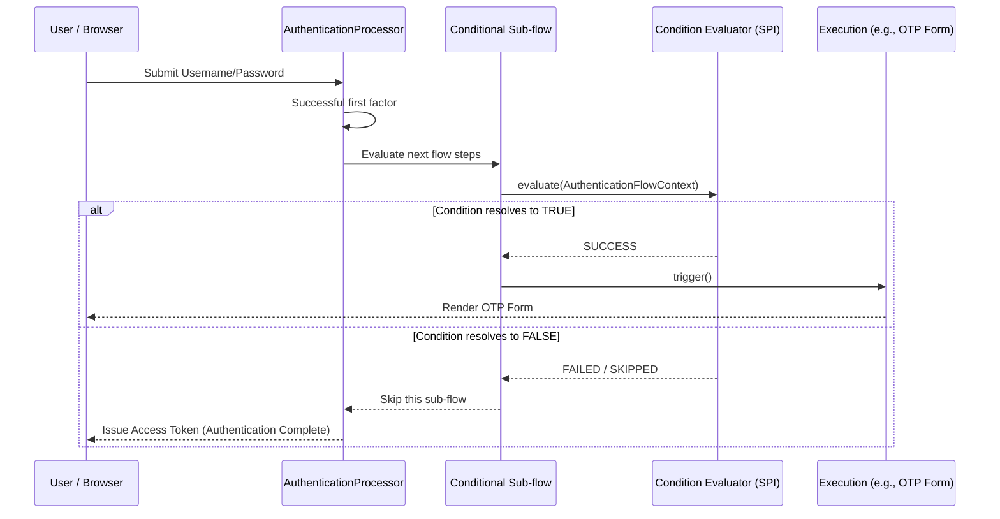

> [!NOTE]
> **Category:** Theory (Lý thuyết)
> **Goal:** Hiểu sâu về Conditional Flow trong Keycloak, cơ chế đánh giá điều kiện (Conditions) và cách tùy biến luồng xác thực linh hoạt trong hệ thống phân tán.

## 1. Lý thuyết chuyên sâu (Detailed Theory)

Trong Keycloak, **Authentication Flow** truyền thống thường là một chuỗi tuyến tính các bước xác thực (Executions). Tuy nhiên, trong các hệ thống doanh nghiệp (Enterprise), yêu cầu bảo mật thường không đồng nhất. Ví dụ: người dùng đăng nhập từ mạng nội bộ (Internal Network) chỉ cần xác thực mật khẩu (Password-based Authentication), nhưng nếu đăng nhập từ địa chỉ IP lạ, hệ thống yêu cầu thêm **MFA (Multi-Factor Authentication)**. 

Để giải quyết bài toán này, Keycloak cung cấp **Conditional Flow** (Luồng có điều kiện). 

**Bản chất của Conditional Flow:**
- Là một Sub-flow (luồng con) đặc biệt trong Keycloak.
- Sử dụng kiểu luồng là `Conditional`.
- Chứa các bước thực thi (Executions) mang tính chất đánh giá điều kiện, được gọi là **Conditions**.
- Nếu tất cả các Condition trong luồng trả về kết quả thành công (tùy thuộc vào cấu hình của Sub-flow là `REQUIRED` hay `ALTERNATIVE`), các Execution khác bên trong luồng con đó sẽ được thực thi.
- Nếu điều kiện không thỏa mãn, Keycloak sẽ bỏ qua luồng con này và đi đến luồng tiếp theo.

Các Condition mặc định phổ biến bao gồm:
- **Condition - User Configured**: Kiểm tra xem User đã cấu hình một Credential nhất định chưa (ví dụ: OTP).
- **Condition - User Role**: Kiểm tra xem User có sở hữu một Role cụ thể hay không.
- **Condition - Level of Authentication (LoA)**: Đánh giá cấp độ xác thực hiện tại.
- **Condition - Header/IP Address**: Đánh giá dựa trên thông tin HTTP Request Header hoặc IP.

## 2. Luồng nội bộ & Cơ chế cấp thấp (Internal Workflow & Low-level Mechanisms)

Khi một Browser Request đi vào Keycloak để xác thực, quá trình xử lý Conditional Flow diễn ra bên trong **AuthenticationProcessor**. 



**Phân tích cơ chế cấp thấp:**
1. **Context Initialization**: Keycloak khởi tạo đối tượng `AuthenticationFlowContext` chứa mọi thông tin về phiên (Session), User, và HTTP Request.
2. **Condition Evaluation**: Từng Condition trong Conditional Sub-flow kế thừa từ interface `ConditionalAuthenticator`. Phương thức `matchCondition(AuthenticationFlowContext context)` được gọi.
3. **Requirement Resolution**: 
   - Nếu Sub-flow được đặt là `REQUIRED`, tất cả các Condition bên trong phải `TRUE`.
   - Các Execution theo sau Condition (ví dụ: OTP Form) chỉ chạy nếu Condition Evaluator trả về quyết định tiếp tục.
4. **State Management**: Trạng thái xác thực được lưu trữ tạm thời trong **Authentication Session**.

## 3. Thực hành tốt nhất & Bảo mật (Best Practices & Security)

> [!IMPORTANT]
> **Performance Impact (Ảnh hưởng hiệu suất):** Tránh viết các Custom Conditions thực hiện truy vấn Database nặng hoặc gọi API ra ngoài (External HTTP Call) đồng bộ. Vì Condition được đánh giá trên Thread chính của Keycloak, việc block Thread sẽ gây nghẽn cổ chai (Bottleneck) cho toàn bộ quá trình Login.

> [!WARNING]
> **Security Risk (Rủi ro bảo mật):** Khi sử dụng `Condition - IP Address` hoặc Header (như `X-Forwarded-For`), phải cấu hình **Reverse Proxy (Load Balancer)** một cách chính xác để ngăn chặn tấn công **IP Spoofing**. Đảm bảo Keycloak chỉ tin tưởng Header từ Proxy nội bộ.

- **Luôn thiết kế Fallback:** Hãy chắc chắn rằng nếu Conditional Flow bị bỏ qua, hệ thống vẫn an toàn (chẳng hạn, cấu hình một Default Requirement hợp lý).
- **Sử dụng LoA (Level of Authentication):** Theo chuẩn OIDC nâng cao, thay vì hardcode MFA theo Role, hãy sử dụng Conditional Flow dựa trên `acr_values` (Authentication Context Class Reference) do Client gửi lên.

## 4. Cấu hình minh họa thực tế (Configuration Examples)

Ví dụ cấu hình một luồng **"Chỉ yêu cầu OTP nếu người dùng có Role 'admin'"**.

1. Vào **Authentication** -> Sao chép luồng `Browser` mặc định thành `Browser-Conditional-MFA`.
2. Thay đổi phần `Browser-Conditional-MFA forms` bằng cách thêm một Sub-flow mới.
3. Cấu hình Sub-flow mới:
   - Tên: `Admin-MFA-Subflow`
   - Flow Type: `Conditional`
   - Requirement: `REQUIRED`
4. Thêm Execution vào `Admin-MFA-Subflow`:
   - Thêm `Condition - user role` (Requirement: `REQUIRED`).
   - Cấu hình Alias Role cho Condition này là `admin`.
   - Thêm `OTP Form` (Requirement: `REQUIRED`).

Cấu trúc luồng (Flow Structure) sẽ trông giống thế này:
```text
- Browser-Conditional-MFA forms (ALTERNATIVE)
  |- Username Password Form (REQUIRED)
  |- Admin-MFA-Subflow (CONDITIONAL)
     |- Condition - user role (REQUIRED) -> Config: role="admin"
     |- OTP Form (REQUIRED)
```

## 5. Trường hợp ngoại lệ (Edge Cases)

- **Lỗi không tìm thấy Role (Role not found):** Nếu Role `admin` bị xóa khỏi hệ thống, Condition - User Role sẽ luôn trả về `False`. Kết quả là Admin sẽ đăng nhập mà không cần OTP. Giải pháp: Cần có cơ chế cảnh báo khi xóa Role quan trọng.
- **Nhiều Conditional Sub-flow xung đột:** Nếu cấu hình nhiều Conditional Sub-flow dưới dạng `ALTERNATIVE`, chỉ Sub-flow ĐẦU TIÊN có Condition thỏa mãn sẽ được thực thi. Do đó, **thứ tự** (Priority/Order) của các Sub-flow là cực kỳ quan trọng.
- **Điều kiện mâu thuẫn:** Xảy ra khi một Condition yêu cầu người dùng phải có Role X, nhưng Role X chỉ được cấp sau khi xác thực thành công. Điều này gây ra Deadlock logic.

## 6. Câu hỏi Phỏng vấn (Interview Questions)

**Câu 1 (Junior):** Conditional Flow trong Keycloak dùng để làm gì?
*Đáp án:* Để tạo ra các luồng xác thực linh hoạt, ví dụ chỉ bật MFA cho một số người dùng cụ thể, dựa trên điều kiện như Role, IP, hoặc cấu hình User, thay vì áp dụng bắt buộc cho toàn bộ mọi người.

**Câu 2 (Junior):** Interface Java nào được sử dụng để viết một Custom Condition trong Keycloak?
*Đáp án:* `ConditionalAuthenticator` và `ConditionalAuthenticatorFactory`.

**Câu 3 (Senior):** Sự khác biệt giữa việc đặt Condition là REQUIRED và ALTERNATIVE trong một Conditional Sub-flow?
*Đáp án:* Trong Conditional Sub-flow, Condition phải luôn được đặt là REQUIRED. Nếu đánh giá TRUE, nó mở khóa cho các Executions theo sau nó (cũng đặt là REQUIRED). Nếu đặt Condition là ALTERNATIVE, luồng logic sẽ bị phá vỡ vì Keycloak chỉ cần một trong các bước Alternative thành công, dẫn đến bypass điều kiện.

**Câu 4 (Senior):** Nếu hệ thống sử dụng Nginx làm Ingress Controller trước Keycloak, làm sao để Condition - IP Address hoạt động đúng?
*Đáp án:* Cần cấu hình `proxy=edge` (hoặc `reencrypt`) trong Keycloak. Nginx phải được cấu hình truyền header `X-Forwarded-For`. Nếu không có bước này, Condition - IP Address sẽ luôn nhận diện IP là IP của Nginx (ví dụ: 10.x.x.x) thay vì Public IP của người dùng.

**Câu 5 (Senior):** Khi tích hợp OIDC, làm sao để dựa vào yêu cầu từ Client (Relying Party) để kích hoạt Conditional Flow?
*Đáp án:* Sử dụng **Condition - Level of Authentication (LoA)** kết hợp với tham số `claims` hoặc `acr_values` trong Authorization Request (OIDC). Khi Client yêu cầu một mức LoA cao, Condition này sẽ trigger OTP Flow.

## 7. Tài liệu tham khảo (References)

- [Keycloak Authentication Flows Documentation](https://www.keycloak.org/docs/latest/server_admin/#_authentication_flows)
- [Keycloak Step-up Authentication & LoA](https://www.keycloak.org/docs/latest/server_admin/#_step-up-authentication)
- OIDC Core Specification (Section 3.1.2.1 - acr_values): [OpenID Connect](https://openid.net/specs/openid-connect-core-1_0.html)
