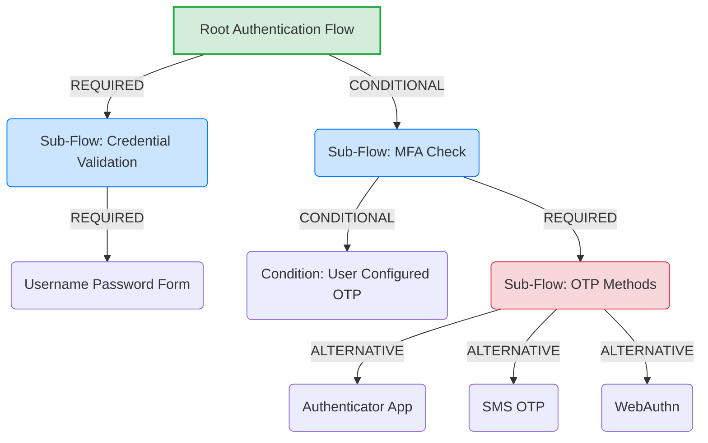

> [!NOTE]
> **Category:** Theory (Lý thuyết)
> **Goal:** Hiểu rõ khái niệm Sub-Flow (luồng phụ), các loại Sub-Flow và cách chúng định tuyến (routing) logic của một quá trình xác thực đa bước phức tạp trong Keycloak.

## 1. Lý thuyết chuyên sâu (Detailed Theory)

Hệ thống xác thực của Keycloak không phải là một danh sách phẳng (flat list) các bước xử lý liên tiếp. Để mô hình hóa được các yêu cầu phức tạp ngoài đời thực, Keycloak áp dụng cấu trúc cây (Tree-based Structure) cho các luồng. Trong đó, Root Flow (Luồng gốc) là luồng cao nhất, và bên trong nó có thể chứa các **Sub-Flows (Luồng phụ)** lồng nhau.

Một **Sub-Flow** đóng vai trò như một nhóm logic (logical container) chứa nhiều Authenticator Executions bên trong hoặc thậm chí chứa các Sub-Flows con khác. Nó giúp định nghĩa các quy tắc rẽ nhánh (branching rules) như:
- Nếu người dùng cung cấp đúng User/Password, thì bắt đầu kiểm tra luồng cấp 2 (MFA).
- Cho phép người dùng chọn *một trong nhiều* cách xác minh: Gửi OTP qua SMS, dùng Google Authenticator, hoặc WebAuthn (Security Key).

Có 2 loại Sub-Flow cơ bản trong Keycloak:
1. **Generic Sub-Flow**: Loại phổ biến nhất. Các Execution bên trong được chạy tuần tự. Mỗi Execution có thể render giao diện (Form) riêng, hoàn thành xong mới qua Form tiếp theo.
2. **Form Sub-Flow**: Được thiết kế để nhóm nhiều Execution thành phần lại, tạo ra *một màn hình HTML Form duy nhất* gom tất cả trường dữ liệu (ví dụ: gộp trường nhập Username và Password vào chung 1 form). Form Sub-Flow cực kỳ hữu ích để tối ưu UX, tránh việc màn hình reload quá nhiều lần.

## 2. Luồng nội bộ & Cơ chế cấp thấp (Internal Workflow & Low-level Mechanisms)

Quá trình đánh giá luồng trong Keycloak dựa trên thuộc tính **Requirement** của mỗi Sub-Flow hoặc Execution (`REQUIRED`, `ALTERNATIVE`, `CONDITIONAL`, `DISABLED`). Thuật toán chạy ngầm là một bộ phân giải cây đệ quy (Recursive Tree Resolver).



**Cơ chế đánh giá các toán tử Requirement:**
- **REQUIRED**: Phải hoàn thành thành công. Nếu thất bại, toàn bộ luồng gốc lập tức thất bại.
- **ALTERNATIVE**: Ít nhất MỘT execution hoặc sub-flow mang nhãn ALTERNATIVE trong cùng một cấp (sibling) phải thành công. Các ALTERNATIVE còn lại sẽ bị bỏ qua (Skip). Keycloak sẽ ưu tiên thử cái đầu tiên, nếu có tuỳ chọn "Try Another Way", người dùng có thể chọn cái ALTERNATIVE thứ hai.
- **DISABLED**: Hoàn toàn bị vô hiệu hoá, engine coi như nó không tồn tại trên cây phân giải.
- **CONDITIONAL**: Chỉ chạy nếu có một `Condition Execution` đánh giá là `True`. Nó kết hợp linh hoạt cho các tình huống như "Chỉ yêu cầu OTP nếu User IP không thuộc dải mạng công ty".

## 3. Thực hành tốt nhất & Bảo mật (Best Practices & Security)

> [!IMPORTANT]
> **Nhóm các ALTERNATIVE đúng cách**: Tuyệt đối không đặt một execution `REQUIRED` xen kẽ vào giữa danh sách các `ALTERNATIVE` cùng cấp bậc. Điều này phá vỡ thuật toán đánh giá nhánh của Keycloak và dẫn đến những lỗi logic khó lường (Unreachable Code Path). Các `ALTERNATIVE` nên được đặt liền kề nhau và nên được bọc (wrap) bên trong một Generic Sub-Flow mang cờ `REQUIRED`.

- **Mức độ sâu của cây**: Hạn chế lồng quá 3 tầng Sub-Flow. Cây luồng quá sâu khiến UI Admin Console trở nên khó nhìn, khó debug khi có sự cố, và tăng độ phức tạp khi migrate luồng qua các môi trường (Dev -> Prod).
- **Fallback Cơ chế (Cơ chế dự phòng)**: Luôn xây dựng Sub-Flow MFA dưới dạng Alternative có ít nhất 2 cơ chế (ví dụ OTP App và Recovery Codes). Nếu Sub-Flow MFA chỉ có duy nhất một `REQUIRED` Execution (OTP App) và user bị mất điện thoại, họ sẽ bị khóa vĩnh viễn khỏi hệ thống (Lockout).

## 4. Cấu hình minh họa thực tế (Configuration Examples)

Tạo một luồng yêu cầu Nhập Username/Password (Bắt buộc), sau đó cho phép người dùng chọn giữa OTP hoặc WebAuthn.

**Cấu hình trên Admin Console:**
1. Tạo luồng (Flow) mới tên: `My-Advanced-Browser-Flow`.
2. Thêm Execution: `Username Password Form` -> Chuyển thành `REQUIRED`.
3. Thêm một **Generic Sub-Flow**, đặt tên `MFA-Sub-Flow` -> Chuyển thành `REQUIRED`.
4. Trong `MFA-Sub-Flow`, thêm các execution con:
   - `OTP Form` -> Chuyển thành `ALTERNATIVE`.
   - `WebAuthn Authenticator` -> Chuyển thành `ALTERNATIVE`.

*Khi luồng chạy, sau khi điền đúng mật khẩu, Keycloak sẽ đánh giá MFA-Sub-Flow (vì nó REQUIRED). Trong Sub-Flow này, nó nhận thấy có 2 lựa chọn ALTERNATIVE. Nó sẽ hiển thị OTP Form trước, đồng thời cung cấp link "Try Another Way" để user có thể chuyển sang dùng WebAuthn.*

Mã định dạng cấu hình qua Keycloak Admin CLI để cấu hình Requirement (VD: sửa MFA-Sub-Flow):
```bash
# Đổi mức requirement của 1 execution
/opt/keycloak/bin/kcadm.sh update authentication/executions/<execution-id> \
  -r myrealm \
  -s requirement=ALTERNATIVE
```

## 5. Trường hợp ngoại lệ (Edge Cases)

- **Lỗi hiển thị "Try Another Way"**: Nút "Try Another Way" (Thử cách khác) chỉ xuất hiện khi Keycloak phát hiện có từ 2 Authenticator mang nhãn `ALTERNATIVE` ở cùng một cấp độ (cùng nằm chung một Sub-Flow) và trạng thái của user cho phép sử dụng cả 2 (user đã thiết lập cấu hình OTP và đã đăng ký WebAuthn). Nếu 1 trong 2 chưa được cấu hình, nhánh Alternative đó sẽ ẩn, và nút "Try Another Way" sẽ biến mất.
- **Form Sub-Flow Conflict**: Form Sub-Flow yêu cầu các Authenticator bên trong phải hỗ trợ render chung form. Nếu bạn chèn một Authenticator phức tạp (ví dụ yêu cầu redirect ra IdP ngoài) vào Form Sub-Flow, nó sẽ ném lỗi 500 hoặc hiển thị giao diện vỡ nát vì xung đột Response Stream.
- **Authentication Bypass Vulnerability**: Xảy ra khi quản trị viên đặt toàn bộ các bước kiểm tra (Password, OTP) thành `ALTERNATIVE` ở cấp cao nhất Root Flow. Hậu quả là kẻ tấn công chỉ cần bypass một cơ chế yếu nhất, và hệ thống sẽ cấp quyền đăng nhập thành công vì chỉ cần 1 `ALTERNATIVE` đỗ là Root Flow đỗ.

## 6. Câu hỏi Phỏng vấn (Interview Questions)

1. **Junior**: Nêu điểm khác nhau giữa Generic Sub-Flow và Form Sub-Flow?
   - *Đáp án*: Generic Sub-Flow là vùng chứa logic chung, chạy các step theo chuỗi và mỗi step render giao diện của riêng nó. Form Sub-Flow chỉ chuyên dụng để nhóm nhiều trường dữ liệu của các Authenticators khác nhau vào chung một màn hình (Form) duy nhất để gửi đi trong 1 lần Submit.
2. **Junior**: Trong Keycloak, toán tử Requirement `ALTERNATIVE` hoạt động như thế nào?
   - *Đáp án*: `ALTERNATIVE` đánh dấu các bước là tùy chọn dự phòng cho nhau. Trong một danh sách các nhánh Alternative đồng cấp, chỉ cần MỘT nhánh chạy thành công thì toàn bộ nhóm Alternative đó được coi là thành công.
3. **Senior**: Tôi có một Authentication Flow. Tôi muốn rằng mọi User đăng nhập thì phải kiểm tra Password (Bắt buộc). Nhưng đối với MFA, tôi muốn chỉ những User có Role "Admin" mới bị yêu cầu nhập OTP. Tôi nên sử dụng cấu trúc Sub-Flow như thế nào?
   - *Đáp án*: Tạo luồng Root Flow chứa Password Execution (REQUIRED). Tiếp theo, tạo một Generic Sub-Flow mang requirement là `CONDITIONAL`. Trong Sub-Flow này: Bước 1 là execution `Condition - User Role` (kiểm tra role Admin), Bước 2 là execution `OTP Form` (REQUIRED).
4. **Senior**: Tại sao Keycloak khuyến cáo luôn phải bọc (wrap) các nhánh `ALTERNATIVE` vào trong một Sub-Flow mang cờ `REQUIRED` thay vì đặt trực tiếp ngang hàng với bước kiểm tra mật khẩu?
   - *Đáp án*: Nếu để ngang hàng, ví dụ: [Password=REQUIRED, OTP=ALTERNATIVE, WebAuthn=ALTERNATIVE]. Keycloak đánh giá từ trên xuống, xong Password là pass. Tuy nhiên với cụm Alternative phía sau, nếu nó fail thì luồng vẫn pass, nếu nó đỗ thì luồng pass. Điều này phá vỡ logic kiểm soát chặt chẽ và gây khó hiểu. Nếu bọc cụm Alternative trong Sub-Flow (REQUIRED), thì bắt buộc phải qua nhóm MFA, và trong MFA chỉ cần chọn 1.
5. **Senior**: Thuật toán đánh giá luồng xử lý thế nào nếu toàn bộ luồng trong một Sub-Flow `REQUIRED` bị bỏ qua (Skip) do người dùng chưa cấu hình bất kỳ tính năng `ALTERNATIVE` nào bên trong nó?
   - *Đáp án*: Tùy thuộc vào thiết lập `Required Actions`. Nếu Authenticator có đăng ký action tương ứng (vd: Update OTP), Keycloak sẽ dừng luồng, kích hoạt thẻ tạm (Challenge) yêu cầu người dùng phải setup tính năng đó trước khi có thể đi tiếp.

## 7. Tài liệu tham khảo (References)

- Keycloak Server Administration Guide: Authentication Flows and Sub-flows
- User Interface Customization for Form Sub-flows
- IAM Design Patterns: Multi-Factor Authentication Architecture
