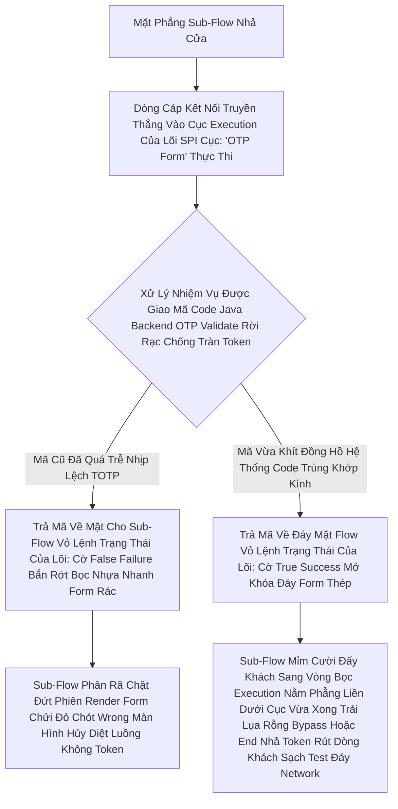

# Lesson 8: Điểm Nổ (Execution)

> [!NOTE]
> **Category:** Theory (Lý thuyết)
> **Goal:** Nếu Flow (Luồng) là sa bàn chiến thuật, Sub-flow là các sư đoàn, thì **Execution (Thực thi)** chính là từng anh lính cầm súng nổ súng trên chiến trường. Mỗi Execution là một mảnh logic code nhỏ, được giao một nhiệm vụ duy nhất (ví dụ: vẽ form password, gửi email, kiểm tra IP). Cùng tìm hiểu xem kho vũ khí Execution của Keycloak có những gì.

## 1. Lý thuyết chuyên sâu (Detailed Theory)

### 1.1. Execution Là Gì?
Execution Là Đơn Vị Cấu Thành Nhỏ Nhất Trong Bộ Động Cơ Authentication Flow Của Keycloak.
- Thực Chất, Mỗi Execution Thường Tương Ứng Với Một Class Java Trực Tiếp Code Theo Chuẩn Của **SPI (Service Provider Interfaces)** Nằm Đằng Sau Lõi Máy Chủ.
- Nhiệm Vụ Của Nó Rất Cụ Thể: Ví Dụ Cái Thì Chặn Bắt Password Và Đem Băm Nó Ra Muối, Cái Thì Chuyên Phát Hiện Phân Tích Xem Mã 6 Số OTP Được Nhập Vào Từ Bàn Phím Có Khớp Thời Gian TOTP Hash Với Đồng Hồ Của Server Không.

### 1.2. Các Execution Nổi Bật Được Cung Cấp Sẵn Dưới Kho Báu Mặc Định
Bên Trong Admin Console Keycloak, Bạn Được Hãng Cung Cấp Tặng Rất Nhiều Đạn Dược Dùng Chung:
1. **Username Password Form:** Hiển Thị Và Xác Thực Thông Tin Điền Vào Cặp Username + Pass Trực Diện. 
2. **WebAuthn Passwordless Authenticator:** Giao Thức Màn Hình Chạm Khóa Vân Tay Mở Tương Lai FIDO Không Cần Mật Khẩu (Bypass Password Form Cực Kỳ Sướng).
3. **Cookie:** Bí Thuật Để Bypass Session SSO Ngầm Mà Không Vẽ Đòi Form Mới Đăng Nhập Lại Từ Form Tương Tác 1, Nó Cho Qua Tự Động Rất Kính Rút Trắng Bọt Nhanh Khách Trải Nghiệm Mượt.
4. **Deny Access:** Một Khối Tàn Độc Chuyên Để Kết Hợp Dùng Vào Conditional Flow. Nếu Bạn Phát Hiện Thấy Bọn Hacker Truy Cập Vào Từ Địa Chỉ Nước Ngoài Bằng Cảnh Sát "Condition-IP-Geo" Nhả Cờ True Báo Nguy Hiểm Độc Hại. Cái Khối "Deny Access" Chứa Cục Đất Sét Nổ Tung Tự Động Sẽ Ngắt Rò Điện Chặn HTTP Reject Văng Mặt Lỗi 403 Forbidden Từ Chối Phục Vụ Ngay Lập Tức Bóp Cổ Luồng Dòng OIDC Cắt Truy Cập Triệt Để!

---

## 2. Luồng nội bộ & Cơ chế cấp thấp (Internal Workflow & Low-level Mechanisms)

Hành Trình OIDC Bắn Dòng Cục Json Qua Một Đoạn Execution Java Tự Cấu Tạo Của Keycloak Lõi Hashing OTP Cắt Rò Rỉ:

---

## 3. Thực hành tốt nhất & Bảo mật (Best Practices & Security)

> [!IMPORTANT]
> **Tuyệt Đỉnh Tẩy Khách Mạng Bọc (Luôn Xếp Execution Theo Logic Nhận Diện Từ Mềm Đến Cứng Nhất Mạch Nhựa Kéo Lưới Bảo Mật Tránh Lộ Trải Nghiệm UI Rác Không Cần)**
> **Tội Ác Thiết Kế Nhét Cục Bừa Bãi Dễ Ăn Gậy Logic Bot Nhựa Đánh Sập Lệnh Database Bề Mặt Khách OIDC:** Dev Có Xu Hướng Vứt Mọi Khối Nhặt Được Vô Theo Sở Thích Mắt Nhìn, VD Bỏ Khối "OTP Form" Nhảy Nằm Chồm Hổm Trên Thượng Tầng Nhất Trước Luôn Cả Cái Khối Chứa Form "Username Password".
> **Hậu Quả:** Khách Vừa Load Trang Form Lệnh Chưa Kịp Nhìn Rõ Vỏ Login Đã Thấy Web Yêu Cầu Nhập Mỗi Mã Số 6 OTP Trong Mù Lòa! Vấn Đề Là Máy Keycloak Chưa Có Username Pass Mạch Đáy Value Form Render Sao Đào Ở Đâu Ra Cái Seed Đáy Secret Của OTP Để Đi So Mã Căn Cứ Code UUID Của User Tương Thích Lúc Giải Mã Rỗng Database Bức Cắt? Lỗi 500 Văng Ngược! Hoặc Chạy Thua Bot Bơm Lệnh Rác Đè Chặn Kéo Trút OOM Token Đáy Network Do Nó Không Dò Tên Hợp Lệ Của Dân Dùng DB Tương Lai Đáy Cụt Form Cũ Trước Đỉnh Code.
> **Biện Pháp Sống Còn Nhét Vào Trục Trọng Lực Ống Json Đáy Luồng:** Các Khối Execution Luôn Setup Đi Vào Database Với Chặn Filter Top-Down Lọc Bot Chống Khách Giả: 
> Cấp 1 (Chuyên Khai Thác Danh Tính ID Cookie Form, Mật Khẩu Dân Chạm).
> Cấp 2 (Check MFA Điều Kiện Rẽ Khối Quét Xác Thực Ngoại Tuyến: Email Link/ OTP Form Nhựa).
> Cấp Cứu Mạch Nhựa Cuối Chót Chặn Lõi API Thép OIDC Cuối Nhất (Cấp Này Rất Sạch Test Mạng Lỗ Trống Của Máy Bơm Nhả Token Access Tự Trị Nhanh Rút Trải Lụa Tĩnh Cho App Gọi Mở Cửa Phun Dữ Liệu Báo API Khách Dùng Chóp!).

---

## 4. Cấu hình minh họa thực tế (Configuration Examples)

Lắp Ráp Hệ Thống Execution Tàn Bạo Chống Trẻ Trâu Login Fake Dùng "Deny Access":
1. Bạn Duplicate 1 Flow Mới Hoàn Toàn Tên `My-Security-Firewall-Browser`. 
2. Chèn 1 Sub-flow Ngay Dưới Dòng Form Bắt Username Password Bằng Nút Bấm Quen Thuộc Chỉnh Sang Hệ Cờ Lệnh: `Conditional`.
3. Bỏ Vô Trọng Ruột Sub-Flow Đó Cái Khối Kiểm Duyệt: Thêm Cục **`Condition - User Role`** Kẹp Gắn Lệnh Type Là `Required`. (Chỉnh Set Bắt Cứng Role Trạng Thái Lệnh `banned_user`).
4. Thêm Trực Tiếp Cục Dòng Nổ Execution Bom Tên Gắn **`Deny Access`** Bọc Chặn Đỉnh Vô Trọng Lõi Nhánh Đáy Subflow Đang Có Sẵn Của Nó Gắn Type Lệnh `Required`. 
5. Lúc Này Khách Kéo Bị Dev Cấu Hình Gắn Chạy Role Banned-User (Nhóm Đã Bị Cấm Bay Sân Chơi). Bất Kể Hắn Đăng Nhập Mật Khẩu Đúng Bao Nhiêu Lần Quét Lệnh Thép Database Keycloak Chạy Thấy Pass Đúng Mạch Json Nó Sẽ Đi Tiếp Chạm Ngay Bom Mạch Oanh Giao Tĩnh Khống API Lỗ Đục Rò Sub-Flow. Vừa Chạm Subflow Phân Dòng Dò Chui Vào Phát Hiện Điều Kiện Khớp Cờ Căn Cứ Mạng Cắt Thép Database Gắn Với Khối Thực Thi "Deny Access". 
6. Bùmmm! Một Quả Lỗi "You do not have access Rút Lệnh Đỏ Chót Cấm Cửa Mù Lòa Cho Khách Hàng Tương Thích" Bắn Trả Về Khung Nhanh Sóng Giao Lệnh Đồng Bộ Rìa Lệnh OIDC Bọc Rút Lụa Token Đáy Không Nhả Cáp Token Rác Của App, Bóp Ngạt Lệnh API Giao Dịch Chống Sập Trái Trải Nghiệm Mạch Lưới Lệch Băng Tần! 

---

## 5. Câu hỏi Phỏng vấn (Interview Questions)

**1. Sếp Giao Yêu Cầu Code Mới Bắt Chặn Giao Dịch Đáng Ngờ Dành Cho App Banking OIDC Rỗng Của Oanh Khách Login Keycloak. Nếu Sếp Cần Cậu Thiết Kế 1 Execution Mới Hoàn Toàn Chạy Bằng Lệnh Code Java Custom Nằm Lòi Ra Tại Console Bảng Admin Tự Trị Thay Vì Phải Khổ Sở Gắn Chặn Lưới Bot Ngoài Nginx. Cậu Triển Khai Thế Nào?**
- **Senior:** Rất Dễ Dàng Mà An Toàn Nhờ Engine SPI OIDC Mở Mạng Lỗ Trống Của Lãnh Chúa! Em Code Một Cái Maven Project Rời Nằm Tại Local Ngôn Ngữ Cứng Java Thép. Em Kế Thừa Một Lớp Framework Mở Nhựa Cấp Nhanh Có Tên Java Class Dùng Nhanh Rút Là `Authenticator` Và Một Class Mồi Trộn Form Đáy `AuthenticatorFactory` Thừa Kế Từ Căn Cứ Lõi Source Keycloak.
Trong Class Java Đó Đáy Method Mạch Sóng Code Có Tên Tương Thích Default: `authenticate(AuthenticationFlowContext context)`, Em Sẽ Viết Đoạn If Else Bắt Lệnh Gọi API Gọi Nhanh Dịch Vụ Core Bank Ở Nhánh Rìa Rất Sạch Bơm Đáy Lên Check Quả Mạch Token Đáy Risk Kéo Có Dịch Tễ Lạ Bọc. Nếu Bank Báo Trả IP Này Có Scam Hacker Rút Gắn Code Rút Thép Nằm Phẳng. Em Ném Response Fail Dưới Lệnh `context.failure(AuthenticationFlowError.INVALID_CREDENTIALS)` Sạch Chóp Code Dữ Mạch!
Build File Ra Jar Đáy Tĩnh Oanh Khách Gắn Lệnh Và Nhét Bỏ Thẳng Nó Vô Trong Folder Trọng `/providers/` Của Docker Keycloak Khi Chạy Lên Kéo Cáp Reload Máy Chủ Thép. 
Là Em Đã Có Một Cục Đáy Execution Thần Thánh Có Tên Mang Lệnh Mạch Giao Khung API "Custom Banking Firewall Bức Cắt Khung" Sẵn Sàng Được Chọn Nhặt Lên Nhét Bọc Oanh Cáp Mạch Form Bằng Dropdown Select Giao Diện Nhanh Lệnh Khống Console Đáy Mượt Mà Test Rỗng Chóp Của Admin Vingroup!

---

## 6. Tài liệu tham khảo (References)
- **Keycloak Documentation:** Server Developer Guide - Authenticator SPI.
