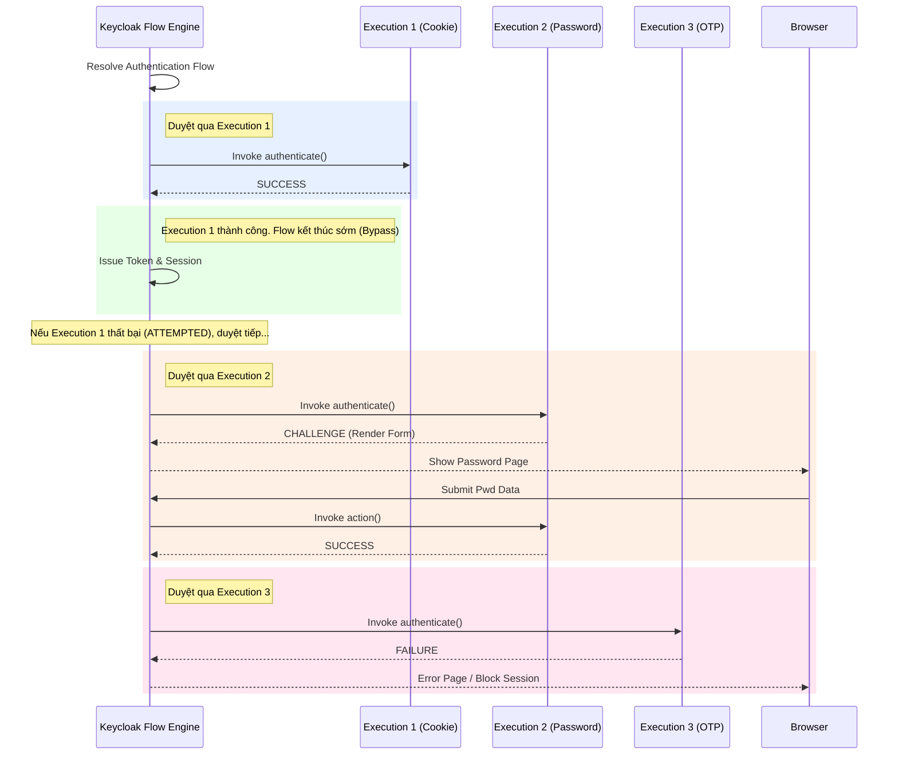

> [!NOTE]
> **Category:** Theory (Lý thuyết)
> **Goal:** Định nghĩa và giải phẫu thành phần Authentication Execution, giải thích vai trò của nó như là các viên gạch xây dựng (building blocks) tạo nên cấu trúc đồ thị của mọi luồng xác thực trong Keycloak.

## 1. Lý thuyết chuyên sâu (Detailed Theory)

Trong mô hình kiến trúc của Keycloak Authentication, một Luồng (Flow) không có sẵn logic riêng biệt. Luồng chỉ là một danh sách hoặc một vùng chứa (container). Logic thực thi thực sự nằm ở **Authentication Executions (Các bước thực thi)**. 

Có thể coi một **Execution** như một hàm chức năng độc lập (Function) thực thi một hành động xác định (Authenticator, Form Action, hoặc Condition). Khi Keycloak đánh giá (evaluate) một Authentication Flow, thực chất nó đang duyệt qua danh sách các Execution này từ trên xuống dưới.

Mỗi Execution đại diện cho một liên kết (binding) giữa Luồng (Flow) và một **Authenticator Factory**. 
Ví dụ: 
- Bạn có một mã nguồn Java tên là `UsernamePasswordFormAuthenticator`.
- Khi bạn đưa module này vào Browser Flow, bản ghi (record) cấu hình gắn kết module đó với vị trí số 1 của luồng được gọi là một **Execution**.

Một Execution mang trong mình ba thuộc tính cấu hình trọng yếu:
1. **Requirement (Toán tử mức độ)**: Quyết định tính bắt buộc hay tùy chọn (`REQUIRED`, `ALTERNATIVE`, `DISABLED`, `CONDITIONAL`).
2. **Priority/Order (Thứ tự ưu tiên)**: Chỉ định vị trí thực hiện trong danh sách luồng.
3. **Configuration (Cấu hình riêng)**: Một số Execution cho phép gắn thêm các biến tham số tùy chỉnh phụ thuộc (ví dụ thiết lập độ khó của reCAPTCHA, tên của Cookie cần kiểm tra).

## 2. Luồng nội bộ & Cơ chế cấp thấp (Internal Workflow & Low-level Mechanisms)

Khi Auth Engine chạy, nó duy trì một trạng thái trạng thái chuyển tiếp (State Machine). Nó giao tiếp với từng Execution bằng cách gọi hàm `authenticate(context)`.



**Các Trạng thái trả về cấp thấp của Execution (AuthOutcome):**
- `SUCCESS`: Execution hoàn thành nhiệm vụ xuất sắc. Engine chuyển sang Execution kế tiếp.
- `CHALLENGE`: Execution cần dữ liệu đầu vào. Engine đình chỉ luồng, trả về HTTP Response (HTML, JSON) cho người dùng.
- `ATTEMPTED`: Execution không thể thành công (vd: Cookie không tồn tại) nhưng không gây lỗi. Engine bỏ qua và đi tiếp. Thường dùng cho các Execution `ALTERNATIVE`.
- `FAILURE`: Execution gặp lỗi nghiêm trọng (vd: Nhập sai mật khẩu quá số lần). Engine ngắt luồng ngay lập tức.

## 3. Thực hành tốt nhất & Bảo mật (Best Practices & Security)

> [!CAUTION]
> **Biến đổi trạng thái chia sẻ (Shared State Mutation)**: Các Execution trong cùng một luồng giao tiếp với nhau bằng cách sử dụng `AuthenticationSessionModel` (thông qua `context.getAuthenticationSession().setAuthNote()`). Nếu viết Custom Execution, cẩn thận không ghi đè (overwrite) các key quan trọng của các Built-in Execution của Keycloak.

> [!IMPORTANT]
> **Thứ tự Execution ảnh hưởng lớn đến bảo mật**: Nếu bạn đặt Execution `Conditional OTP` trước `Username Password`, luồng sẽ đánh giá lỗi vì OTP yêu cầu phải biết User là ai để kiểm tra điều kiện MFA, nhưng do Username chưa được nhập nên thông tin User chưa tồn tại trong Session Context.

- **Quản lý biến cấu hình (Configuration Modularity)**: Mỗi Execution Instance có thể có bộ config (AuthenticatorConfigModel) độc lập. Nếu bạn có 2 luồng đều dùng `OTP Form`, bạn có thể cấu hình Execution bên này yêu cầu 6 số, bên kia yêu cầu 8 số. Cấu hình này lưu trong CSDL gắn liền với ID của Execution.
- **Dọn dẹp Execution cũ**: Khi cấu trúc luồng của tổ chức thay đổi, các Execution bị đánh dấu `DISABLED` vẫn tồn tại trong cơ sở dữ liệu. Về lâu dài, chúng tạo ra rác và làm chậm quá trình query cấu trúc luồng. Hãy xóa chúng bằng UI nếu không bao giờ cần lại.

## 4. Cấu hình minh họa thực tế (Configuration Examples)

Ví dụ việc thay đổi thứ tự và thiết lập một Execution cấu hình cụ thể thông qua Keycloak API.

**Cấu hình bằng giao diện Admin Console:**
1. Di chuyển Execution: Trong cấu trúc luồng, sử dụng biểu tượng Mũi tên Lên/Xuống hoặc kéo thả để đổi Priority của Execution.
2. Thêm tham số: Nhấn biểu tượng Bánh răng cạnh `Cookie Authenticator` (trong một luồng copy). Bạn có thể thay đổi thuộc tính `Cookie name` từ mặc định (`KEYCLOAK_IDENTITY`) sang một tên khác, tạo ra một Execution Instance độc nhất.

**Cấu hình bằng kcadm.sh (CLI):**
Lấy ID của các executions trong một luồng cụ thể:
```bash
/opt/keycloak/bin/kcadm.sh get authentication/flows/my-browser-flow/executions -r myrealm
```
Output JSON trả về bản chất cấu trúc của các Executions (gồm `id`, `authenticator`, `requirement`, `priority`).

## 5. Trường hợp ngoại lệ (Edge Cases)

- **Execution nằm ngoài Context**: Một Authenticator thiết kế cho "Identity Brokering" (vd: `Create User If Unique`) dựa vào dữ liệu của external IdP (Federated Identity context). Nếu quản trị viên cấu hình sai, gắn trực tiếp Execution này vào "Browser Flow", nó sẽ văng lỗi `NullPointerException` vì `BrokeredIdentityContext` không tồn tại trong Browser Flow.
- **Race Condition trên Cache Session**: Nếu có hai thao tác Submit Form gửi về liên tục từ trình duyệt cho cùng một Execution (người dùng double click nút Login), Execution có thể ghi nhận 2 lần gọi hàm `action()`. Keycloak ngăn chặn bằng cơ chế kiểm tra tính nhất quán dựa trên mã `execution_id` đính kèm trong các hidden fields HTML.
- **Update Bug từ Bản sao lưu cũ**: Khi Import luồng (Flow) từ môi trường Staging sang Prod, các Execution IDs bị thay đổi hoàn toàn do Keycloak sinh lại UUID. Nếu Custom Code của bạn hardcode (gắn cứng) ID của Execution để cấu hình gì đó, mã nguồn sẽ hỏng hoàn toàn. Chỉ thao tác dựa trên tên `Alias` hoặc `Authenticator ID`.

## 6. Câu hỏi Phỏng vấn (Interview Questions)

1. **Junior**: Authentication Execution trong Keycloak đóng vai trò gì?
   - *Đáp án*: Execution là các bước thực thi độc lập (như kiểm tra mật khẩu, lấy OTP, tạo user mới) được lắp ráp vào bên trong một Authentication Flow để tạo ra một luồng xử lý hoàn chỉnh theo thứ tự.
2. **Junior**: Các trạng thái Requirement phổ biến nhất của một Execution là gì?
   - *Đáp án*: Có 4 trạng thái: REQUIRED (Bắt buộc), ALTERNATIVE (Tùy chọn nhánh), CONDITIONAL (Luồng điều kiện) và DISABLED (Vô hiệu hóa).
3. **Senior**: Tại sao Keycloak lại tách rời khái niệm `Authenticator Factory` (code SPI) và `Execution` (cấu hình DB) thay vì gộp chung làm một?
   - *Đáp án*: Tách rời giúp hỗ trợ tính Tái sử dụng (Reusability) cực lớn. Bạn có thể sử dụng cùng một mã `Cookie Authenticator Factory` để tạo ra hàng chục `Cookie Executions` ở các luồng khác nhau. Mỗi Execution lại có một bộ tham số Config lưu trong DB độc lập với nhau (ví dụ tên cookie khác nhau, thời gian chờ khác nhau).
4. **Senior**: Khi phương thức `authenticate()` của Execution gọi lệnh `context.challenge(form)`, điều gì xảy ra ở cấp độ Engine?
   - *Đáp án*: Engine hiểu trạng thái AuthOutcome là CHALLENGE. Nó đình chỉ toàn bộ tiến trình duyệt cây Flow State, ngắt HTTP flow bằng cách đóng gói cái "form" đó thành một HTTP Response và gửi lại cho Browser. Nó lưu trạng thái của luồng vào Authentication Session kèm theo Execution ID hiện tại để chờ user submit lại.
5. **Senior**: Execution loại `Condition` hoạt động như thế nào so với `Authenticator` thông thường?
   - *Đáp án*: Execution Condition (Condition Authenticator) chuyên trả về kết quả True/False thông qua các phương thức `success()` hoặc `attempted()`. Nó không bao giờ trả về `challenge()`. Logic của nó dùng để điều khiển các execution `CONDITIONAL` đi theo sau cùng cấp độ.

## 7. Tài liệu tham khảo (References)

- Keycloak Server Administration Guide: Authentication Flows and Executions
- Keycloak Server Developer Guide: Writing Custom Authenticators
- State Machine Patterns for Identity Management
