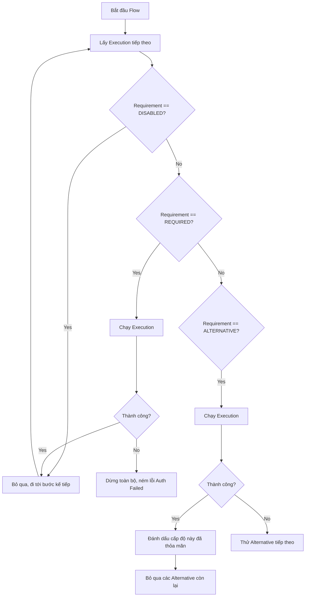

> [!NOTE]
> **Category:** Theory (Lý thuyết)
> **Goal:** Hiểu sâu về các cấu hình Requirement (REQUIRED, ALTERNATIVE, DISABLED, CONDITIONAL) trong Authentication Flows và cách Keycloak ra quyết định dựa trên chúng.

## 1. Lý thuyết chuyên sâu (Detailed Theory)

Trong hệ thống Identity and Access Management (IAM), một luồng xác thực (Authentication Flow) hiếm khi chỉ là một bước đơn lẻ. Nó là sự kết hợp của nhiều phương thức (Mật khẩu, OTP, WebAuthn, Identity Broker). Để phối hợp các phương thức này, Keycloak cung cấp một cơ chế gọi là **Requirement**.

**Requirement** xác định mức độ bắt buộc của một Execution (bước thực thi) hoặc một Sub-flow (luồng con) trong tổng thể quá trình xác thực. 

Các trạng thái Requirement bao gồm:
- **REQUIRED (Bắt buộc):** Bước này BẮT BUỘC phải thành công. Nếu người dùng thất bại ở bước này, toàn bộ luồng xác thực sẽ thất bại.
- **ALTERNATIVE (Thay thế):** Chỉ cần MỘT trong số các bước Alternative trong cùng một cấp (level) thành công là đủ. Nó giống như toán tử `OR` logic. Ví dụ: Đăng nhập bằng Mật khẩu HOẶC Đăng nhập bằng Google.
- **DISABLED (Vô hiệu hóa):** Bước này bị tắt hoàn toàn và bị bỏ qua trong quá trình thực thi, hữu ích để debug hoặc tạm dừng một phương thức xác thực mà không cần xóa nó khỏi hệ thống.
- **CONDITIONAL (Có điều kiện):** Dành riêng cho Sub-flow. Nó cho phép Sub-flow này chỉ chạy khi một tập hợp các điều kiện (Conditions) nhất định được thỏa mãn (ví dụ: User thuộc mạng IP cụ thể).

**Tại sao Requirement lại quan trọng?** 
Trong môi trường Enterprise, bạn cần đáp ứng các chính sách khắt khe. Việc kết hợp REQUIRED và ALTERNATIVE cho phép tạo ra cấu trúc cây (Tree-based logic) phức tạp: ví dụ `(Username/Password OR WebAuthn) AND (OTP)`. Điều này cung cấp tính linh hoạt tối đa mà không cần phải viết code tùy chỉnh (Custom Code).

## 2. Luồng nội bộ & Cơ chế cấp thấp (Internal Workflow & Low-level Mechanisms)

Khi xử lý một Flow, thành phần **DefaultAuthenticationFlow** của Keycloak lặp qua danh sách các Executions. Quá trình ra quyết định diễn ra như sau:



**Cơ chế cấp thấp (State Machine):**
1. **Processor Execution:** Lớp `AuthenticationProcessor` lưu trữ trạng thái của từng bước. Nếu một bước ALTERNATIVE thành công, nó gửi cờ `SUCCESS` lên cấp cha.
2. **Alternative Backtracking:** Nếu có 3 bước ALTERNATIVE (Mật khẩu, OTP, Social Login), Keycloak hiển thị lựa chọn đầu tiên làm mặc định. Người dùng có thể bấm "Try another way" để Keycloak lùi lại trạng thái (backtrack) và cung cấp các lựa chọn ALTERNATIVE khác.
3. **Session Status:** Thông tin Requirement được serialize (chuyển đổi) và lưu vào `Authentication Session` (trên Infinispan Cache). Do đó, kể cả khi quá trình xác thực bị phân tán (qua nhiều nút Keycloak), luồng logic vẫn được đảm bảo.

## 3. Thực hành tốt nhất & Bảo mật (Best Practices & Security)

> [!WARNING]
> **Lỗ hổng Bypass xác thực:** Việc cấu hình sai Requirement có thể dẫn đến việc kẻ tấn công đi vòng qua bước bảo mật. Nếu bạn đặt cả `Username/Password Form` và `OTP Form` cùng cấp là `ALTERNATIVE`, người dùng chỉ cần nhập mật khẩu HOẶC OTP. Nếu họ nhập mật khẩu đúng, họ không cần OTP nữa!

> [!IMPORTANT]
> **Quy tắc Gom nhóm (Grouping):** Các bước có liên quan nên được đặt vào chung một Sub-flow. Đừng đặt mọi thứ ở luồng gốc (Root Flow). Sử dụng Sub-flow (được cấu hình là REQUIRED) để nhóm các lựa chọn ALTERNATIVE (như WebAuthn và OTP) lại với nhau.

## 4. Cấu hình minh họa thực tế (Configuration Examples)

**Bài toán:** Yêu cầu người dùng đăng nhập bằng Mật khẩu (bắt buộc), sau đó phải xác thực bước 2 bằng OTP **hoặc** WebAuthn.

Cấu trúc luồng (Flow Tree) đúng chuẩn sẽ như sau:

```text
- Browser (Mặc định)
  |- Cookie (ALTERNATIVE)
  |- Kerberos (DISABLED)
  |- Identity Provider Redirector (ALTERNATIVE)
  |- Browser Forms (ALTERNATIVE) -> Nhóm chính nếu không dùng Cookie/IdP
     |- Username Password Form (REQUIRED) -> Bước 1 bắt buộc
     |- MFA Sub-flow (REQUIRED) -> Nhóm bước 2, Sub-flow này bắt buộc phải qua
        |- WebAuthn Passwordless Authenticator (ALTERNATIVE)
        |- OTP Form (ALTERNATIVE)
```

**Phân tích cấu hình:**
1. Nếu bước "Browser Forms" được kích hoạt (vì Cookie và IdP thất bại/không có), nó sẽ chạy các Execution bên trong.
2. "Username Password Form" là REQUIRED, nên Keycloak bắt buộc kiểm tra mật khẩu.
3. Khi mật khẩu đúng, luồng nhảy xuống "MFA Sub-flow" (đang là REQUIRED).
4. Bên trong MFA Sub-flow có WebAuthn và OTP, cả hai là ALTERNATIVE. Hệ thống sẽ ưu tiên hiển thị cái đầu tiên (WebAuthn). Nếu người dùng chọn "Try another way", họ có thể dùng OTP. Chỉ cần MỘT trong hai thành công, MFA Sub-flow được tính là thỏa mãn (SUCCESS).

## 5. Trường hợp ngoại lệ (Edge Cases)

- **Tất cả các Alternative đều thất bại:** Nếu luồng có 3 ALTERNATIVE và người dùng thất bại (hoặc không thiết lập) cả 3, toàn bộ cấp cha sẽ nhận kết quả `FAILED` và luồng xác thực bị hủy.
- **Bắt buộc MFA nhưng người dùng chưa cấu hình:** Nếu MFA Sub-flow chứa OTP Form (REQUIRED), nhưng User chưa từng cài OTP. Keycloak sẽ tự động chuyển sang chế độ **Required Actions** (Yêu cầu thiết lập OTP) sau khi mật khẩu đúng, để đảm bảo luồng không bị tắc nghẽn vô lý.

## 6. Câu hỏi Phỏng vấn (Interview Questions)

**Câu 1 (Junior):** Phân biệt giữa REQUIRED và ALTERNATIVE trong Keycloak Authentication Flow?
*Đáp án:* REQUIRED bắt buộc người dùng phải hoàn thành thành công bước đó (toán tử AND). ALTERNATIVE chỉ yêu cầu người dùng hoàn thành một trong số các bước được gán ALTERNATIVE cùng cấp độ (toán tử OR).

**Câu 2 (Junior):** Tại sao lại cần requirement DISABLED? Tại sao không xóa luôn bước đó đi?
*Đáp án:* DISABLED giúp tạm thời vô hiệu hóa một phương thức xác thực để debug hoặc bảo trì mà không làm mất đi cấu hình chi tiết bên trong của phương thức đó.

**Câu 3 (Senior):** Làm thế nào để thiết kế một luồng xác thực yêu cầu cả Mật khẩu và một trong hai phương thức MFA (OTP hoặc SMS)?
*Đáp án:* Tạo một Sub-flow cha với requirement là REQUIRED. Bên trong Sub-flow đó, thêm `Username/Password Form` với requirement REQUIRED. Sau đó, thêm một Sub-flow con thứ hai bên trong với requirement REQUIRED. Bên trong Sub-flow con thứ hai, đặt `OTP Form` và `SMS Form` với requirement là ALTERNATIVE. (Keycloak sử dụng cấu trúc cây lồng nhau để xử lý logic này).

**Câu 4 (Senior):** Điều gì xảy ra ở mức độ code nếu một Alternative Execution trả về trạng thái `ATTEMPTED` (Thử nghiệm) thay vì `SUCCESS`?
*Đáp án:* `ATTEMPTED` là một trạng thái trung gian trong SPI. Khi một Alternative trả về `ATTEMPTED` (ví dụ, xác thực Kerberos không thành công nhưng không ném lỗi nghiêm trọng), Keycloak sẽ không coi bước này là thành công hoàn toàn nhưng cũng không hủy phiên. Nó sẽ lùi lại và thử Execution ALTERNATIVE tiếp theo trong danh sách.

**Câu 5 (Senior):** Trong Conditional Sub-flow, các bước bên trong nó nên đặt Requirement là gì?
*Đáp án:* Các điều kiện (Condition) luôn phải được đặt là REQUIRED. Các Execution thực thi (như OTP) cũng phải là REQUIRED. Nếu đặt ALTERNATIVE bên trong một Conditional Sub-flow, logic của điều kiện sẽ bị phá vỡ vì hệ thống có thể đi vòng qua bước điều kiện.

## 7. Tài liệu tham khảo (References)

- [Keycloak Official Documentation - Flow Requirements](https://www.keycloak.org/docs/latest/server_admin/#_authentication_flows)
- [Keycloak Architecture - Authentication SPI](https://www.keycloak.org/docs/latest/server_development/#_auth_spi)
