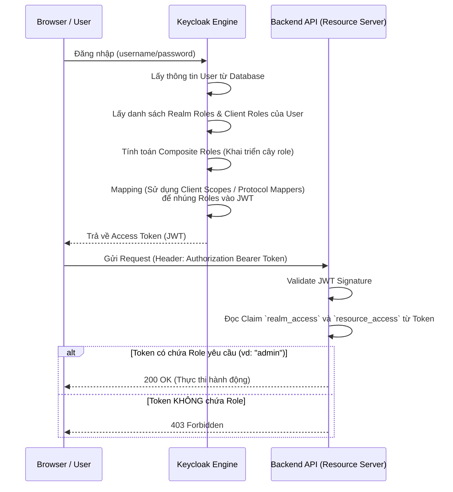

> [!NOTE]
> **Category:** Theory
> **Goal:** Hiểu sâu về mô hình Role-Based Access Control (RBAC), cách Keycloak phân loại Roles, và luồng hoạt động của RBAC trong việc cấp quyền cho các ứng dụng.

## 1. Lý thuyết chuyên sâu (Detailed Theory)

**Role-Based Access Control (RBAC)** hay "Kiểm soát truy cập dựa trên vai trò" là một mô hình ủy quyền (Authorization) phổ biến nhất trong các hệ thống phần mềm. Thay vì gán trực tiếp từng quyền (permission) cho từng người dùng (ví dụ: "User A được phép xóa bài viết"), hệ thống RBAC sẽ định nghĩa các **Vai trò (Roles)** (ví dụ: "Admin", "Manager", "User"). Người dùng sẽ được gán vào các vai trò này, và các ứng dụng sẽ kiểm tra xem người dùng có giữ vai trò thích hợp hay không để cho phép thực hiện hành động.

**Trong Keycloak, RBAC được chia thành hai cấp độ chuyên biệt:**
1. **Realm Roles:** Đây là các vai trò mang tính toàn cục trong một Realm. Nếu một người dùng được gán Realm Role, vai trò đó sẽ có ý nghĩa và có thể được chia sẻ, nhận diện bởi TẤT CẢ các Client (ứng dụng) nằm trong Realm đó. 
   - *Ví dụ:* `global-admin`, `premium-user`.
2. **Client Roles:** Đây là các vai trò thuộc sở hữu riêng của một Client cụ thể. Nó giúp giới hạn phạm vi của quyền lực. Một `admin` của hệ thống Báo cáo (Reporting App) không có nghĩa là `admin` của hệ thống Kế toán (Accounting App).
   - *Ví dụ:* Client `reporting-app` có role `view-report`. Client `accounting-app` có role `approve-invoice`.

**Composite Roles (Vai trò phức hợp):** Keycloak cho phép một Role (Realm hoặc Client) bao gồm nhiều Role khác bên trong nó. Khi gán Composite Role cho User, User đó tự động thừa hưởng mọi Role con bên trong. Điều này giúp dễ dàng quản lý phân cấp (Hierarchical RBAC).

## 2. Luồng nội bộ & Cơ chế cấp thấp (Internal Workflow & Low-level Mechanisms)

Khi một User đăng nhập bằng giao thức OpenID Connect (OIDC), cơ chế kiểm tra RBAC sẽ được nhúng trực tiếp vào token và sau đó được Backend (Client) xác thực.



**Cơ chế cấp thấp (JWT Payload Payload Structure):**
Bên trong JWT, Keycloak lưu trữ Role ở các trường (claims) được định nghĩa sẵn bởi OIDC Protocol Mappers.
```json
{
  "realm_access": {
    "roles": [ "offline_access", "uma_authorization", "global-admin" ]
  },
  "resource_access": {
    "accounting-app": {
      "roles": [ "approve-invoice" ]
    }
  }
}
```
Các Adapter của Keycloak (như Spring Security Keycloak Adapter) sẽ tự động giải mã cấu trúc JSON phức tạp này và chuyển đổi (map) chúng thành các `GrantedAuthority` chuẩn của Framework (thường thêm tiền tố `ROLE_`).

## 3. Thực hành tốt nhất & Bảo mật (Best Practices & Security)

- **Tránh phình to Token (Token Bloat):** Nếu bạn có hàng ngàn Role, không nên nhét tất cả vào JWT vì kích thước Token sẽ quá lớn, vượt quá giới hạn HTTP Header. Thay vào đó, sử dụng tính năng **Client Scopes** để chỉ nhúng các Role liên quan đến Client cụ thể đang thực hiện đăng nhập.
- **Ưu tiên Client Roles hơn Realm Roles:** Để tuân thủ nguyên tắc quyền tối thiểu, hãy luôn sử dụng Client Roles thay vì Realm Roles, trừ khi một Role thực sự cần được nhận diện trên mọi nền tảng trong Realm.
- **Sử dụng Group Mapping:** Thay vì gán Role lẻ tẻ cho từng User, hãy tạo các **Groups** (ví dụ: `IT Department`), gán Roles cho Group, sau đó thêm User vào Group. Quản lý ở quy mô lớn sẽ dễ dàng hơn rất nhiều.

> [!WARNING]
> RBAC là một mô hình Tĩnh. Keycloak cấp Token mang các Role, nhưng nếu Admin xóa Role của User trong Admin Console, Token đang sống (chưa hết hạn) ở phía client VẪN HỢP LỆ và có chứa Role đó cho đến khi token đó hết hạn. Luôn set thời gian sống của Access Token (Lifespan) ngắn gọn.

## 4. Cấu hình minh họa thực tế (Configuration Examples)

Ví dụ cấu hình Spring Security kiểm tra Role từ Keycloak JWT bằng annotation:

```java
import org.springframework.security.access.prepost.PreAuthorize;
import org.springframework.web.bind.annotation.GetMapping;
import org.springframework.web.bind.annotation.RestController;

@RestController
public class InvoiceController {

    // Spring Security yêu cầu Role phải bắt đầu bằng ROLE_ theo mặc định
    // Bạn cần viết JwtAuthenticationConverter để map "approve-invoice" thành "ROLE_approve-invoice"
    @PreAuthorize("hasRole('approve-invoice')")
    @GetMapping("/api/invoices/approve")
    public String approveInvoice() {
        return "Hóa đơn đã được duyệt thành công!";
    }
    
    // Nếu sử dụng Realm role
    @PreAuthorize("hasRole('global-admin')")
    @GetMapping("/api/admin/dashboard")
    public String adminDashboard() {
        return "Bảng điều khiển hệ thống";
    }
}
```

Một cấu hình `JwtAuthenticationConverter` phổ biến trong Spring Security 6 để parse Realm Roles từ chuỗi JSON của Keycloak:
```java
@Bean
public JwtAuthenticationConverter jwtAuthenticationConverter() {
    JwtGrantedAuthoritiesConverter grantedAuthoritiesConverter = new JwtGrantedAuthoritiesConverter();
    // Thay đổi từ claim mặc định của Spring sang claim cấu trúc của Keycloak
    grantedAuthoritiesConverter.setAuthoritiesClaimName("realm_access");
    // Code tuỳ chỉnh lấy array "roles" trong "realm_access" và thêm "ROLE_" prefix
    ...
}
```

## 5. Trường hợp ngoại lệ (Edge Cases)

- **Tên Role có khoảng trắng hoặc ký tự đặc biệt:** Một số framework phía Backend không thể parse được các Role có chứa khoảng trắng (ví dụ `Super Admin`). **Khắc phục:** Luôn sử dụng kebab-case hoặc snake_case khi đặt tên role (`super-admin`).
- **User có quá nhiều Roles nhưng Token không có:** Do cấu hình **Role Mapper** trong Client Scope của Client đang bị tắt chức năng "Add to access token". **Khắc phục:** Vào Client Scopes, chọn `roles` mapper và đảm bảo công tắc "Add to access token" là ON.
- **Lỗ hổng leo thang đặc quyền (Privilege Escalation):** Khi có một ứng dụng Frontend (Single Page Application) sử dụng lại Token cho một ứng dụng Backend khác, và Backend kiểm tra nhầm Client Role của ứng dụng kia do không kiểm tra kỹ trường `resource_access`.

## 6. Câu hỏi Phỏng vấn (Interview Questions)

1. **(Junior)** Trình bày sự khác biệt cơ bản giữa Realm Role và Client Role trong Keycloak.
   - *Đáp án:* Realm Role có phạm vi toàn cục trong Realm, mọi client đều thấy. Client Role thuộc về một client duy nhất, có phạm vi hẹp hơn để phân quyền riêng cho một ứng dụng.
2. **(Junior)** Làm sao để một người dùng tự động có được nhiều Roles cùng lúc mà không phải gán thủ công từng Role một?
   - *Đáp án:* Gán thông qua Groups (User thuộc Group, Group chứa nhiều Role) hoặc dùng tính năng Composite Roles (Role A chứa các Role con B, C).
3. **(Senior)** Trong mô hình RBAC với OIDC, nếu Admin tước đi quyền (Role) của User trên Keycloak, người dùng đó có ngay lập tức bị từ chối truy cập ở phía Resource Server (Backend API) không? Tại sao?
   - *Đáp án:* Không. RBAC với JWT là phi trạng thái (stateless). Token đã cấp vẫn chứa Role cũ và vẫn được Backend tin tưởng cho đến khi token hết hạn, trừ phi Backend gọi về endpoint Introspection của Keycloak cho mỗi request.
4. **(Senior)** Nếu chuỗi JWT Access Token quá lớn vượt quá mức cho phép của HTTP Header do chứa hàng ngàn Roles, giải pháp xử lý trong Keycloak là gì?
   - *Đáp án:* Sử dụng Scope-based RBAC. Cấu hình Client Scopes để Keycloak chỉ đính kèm những Role thực sự cần thiết vào token, hoặc Backend chỉ giữ ID trong token và tự gọi Database để lấy Role thay vì nhúng vào token.
5. **(Senior)** Tại sao Spring Security mặc định không đọc được các Client Roles từ Access Token của Keycloak?
   - *Đáp án:* Vì cấu trúc JWT của Keycloak đặt Client Roles bên trong claim `resource_access.{client_id}.roles`, không theo chuẩn mảng `scope` hoặc `scp` mặc định mà Spring Security sử dụng. Cần phải code `Converter` tùy chỉnh để parse.

## 7. Tài liệu tham khảo (References)

- Keycloak Server Administration Guide: [Roles](https://www.keycloak.org/docs/latest/server_admin/#_roles)
- OWASP: [Access Control Vulnerabilities](https://owasp.org/www-project-top-ten/2017/A5_2017-Broken_Access_Control)
