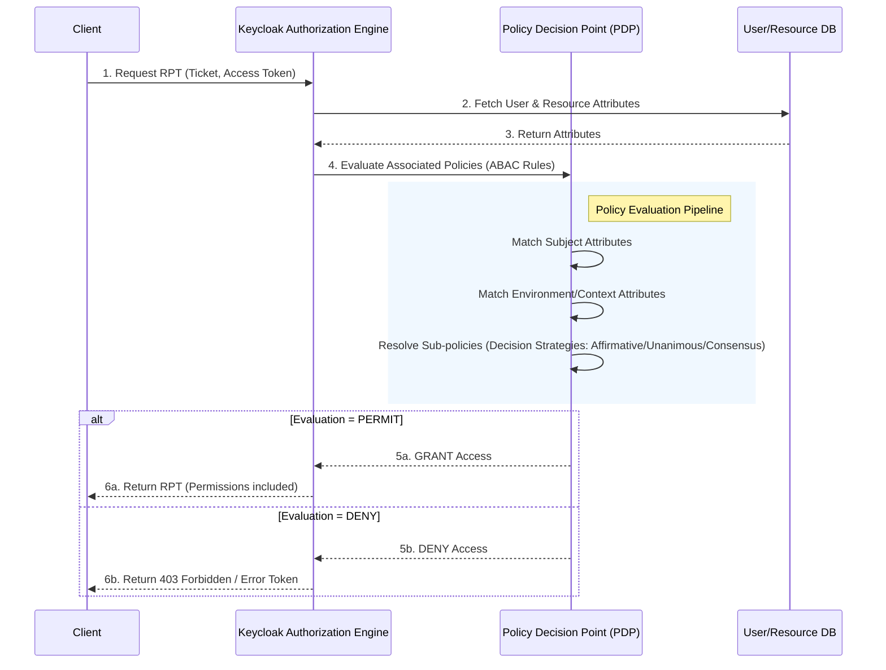

> [!NOTE]
> **Category:** Theory (Lý thuyết)
> **Goal:** Hiểu sâu về Attribute-Based Access Control (ABAC) trong Keycloak, kiến trúc đánh giá chính sách dựa trên thuộc tính và cách thiết kế các Policy phức tạp áp dụng cho môi trường Enterprise.

## 1. Lý thuyết chuyên sâu (Detailed Theory)

**Attribute-Based Access Control (ABAC)** là một mô hình kiểm soát truy cập phân quyền dựa trên việc đánh giá các thuộc tính (attributes) thay vì chỉ dựa trên vai trò (roles) như Role-Based Access Control (RBAC). 

Mô hình ABAC mang lại độ linh hoạt cực kỳ cao bằng cách cho phép quản trị viên định nghĩa các Access Policy dựa trên sự kết hợp của nhiều loại thuộc tính khác nhau:
- **Subject Attributes**: Thuộc tính của người dùng hoặc hệ thống yêu cầu quyền truy cập (ví dụ: `department`, `clearance_level`, `age`).
- **Resource Attributes**: Thuộc tính của tài nguyên đang được truy cập (ví dụ: `classification`, `creation_date`, `owner`).
- **Action Attributes**: Thuộc tính của hành động được yêu cầu (ví dụ: `read`, `write`, `approve`).
- **Environment Attributes**: Các thuộc tính ngữ cảnh từ môi trường truy cập tại thời điểm yêu cầu (ví dụ: `IP_address`, `time_of_day`, `location`).

**Tại sao ABAC quan trọng trong Keycloak?**
RBAC có thể dẫn đến hiện tượng "Role Explosion" (bùng nổ vai trò) khi có quá nhiều biến thể quyền hạn theo từng trường hợp cụ thể. ABAC giải quyết vấn đề này bằng cách giảm thiểu số lượng Role, chuyển các điều kiện truy cập vào Policy đánh giá động tại thời điểm chạy (runtime).

Trong Keycloak, ABAC thường được triển khai thông qua **Attribute-based Policies** (các chính sách dựa trên thuộc tính), chẳng hạn như User Policy dựa trên các `User Attributes`, hoặc các JavaScript Policy/Drools Policy mạnh mẽ để đánh giá linh hoạt cả Subject và Environment.

## 2. Luồng nội bộ & Cơ chế cấp thấp (Internal Workflow & Low-level Mechanisms)

Quá trình đánh giá ABAC diễn ra bên trong **Authorization Services** của Keycloak. Khi một Client (Resource Server) yêu cầu một RPT (Requesting Party Token) để cấp quyền truy cập, Keycloak Authorization Engine sẽ thực hiện quy trình sau:



**Cơ chế cấp thấp (Low-level Mechanisms):**
- Trong quá trình đánh giá (Evaluation), Keycloak tạo ra một `EvaluationContext` chứa tất cả các thông tin định danh `Identity`, quyền `Permissions` được yêu cầu, và tập hợp `Attributes`.
- `Identity` interface cung cấp phương thức `getAttributes()` để trích xuất thông tin người dùng được ánh xạ từ `Access Token` hoặc database của Keycloak.
- Các thuộc tính môi trường như IP Address được trích xuất từ HTTP Request Context của Keycloak.

## 3. Thực hành tốt nhất & Bảo mật (Best Practices & Security)

> [!WARNING]
> Việc sử dụng quá nhiều Policy phức tạp (như JavaScript Policies hoặc Regular Expressions) cho hàng ngàn Requests mỗi giây có thể gây ra hiện tượng thắt cổ chai hiệu suất (Performance Bottleneck). Cần thận trọng trong việc đánh giá hiệu suất.

> [!IMPORTANT]
> **Security Standard:** Không bao giờ tin tưởng hoàn toàn vào các Environment Attributes được gửi từ phía Client (ví dụ qua HTTP Headers) vì chúng có thể bị giả mạo (Spoofed). Chỉ lấy các thuộc tính tin cậy như IP từ API Gateway hoặc Reverse Proxy (thông qua `X-Forwarded-For` đã được cấu hình an toàn).

**Thực hành tốt nhất:**
1. **Kết hợp RBAC và ABAC**: Sử dụng RBAC như lớp kiểm tra thô đầu tiên (Coarse-grained), và sử dụng ABAC như lớp kiểm tra tinh chỉnh chi tiết (Fine-grained).
2. **Caching**: Sử dụng cơ chế cache thích hợp cho Resource và Policy để tránh việc phải liên tục truy vấn vào database của Keycloak trong các bước Evaluation.
3. **Tránh logic tính toán nặng**: Trong các JavaScript Policies, không nên thực hiện các vòng lặp phức tạp hoặc gọi tới các API bên ngoài.

## 4. Cấu hình minh họa thực tế (Configuration Examples)

Sử dụng JavaScript Policy trong Keycloak để tạo một ABAC Policy kiểm tra xem `department` của User có trùng khớp với `department_owner` của Resource hay không.

```javascript
// ABAC Policy using JavaScript in Keycloak
var context = $evaluation.getContext();
var identity = context.getIdentity();
var permission = $evaluation.getPermission();
var resource = permission.getResource();

// Trích xuất User Attribute
var userAttributes = identity.getAttributes();
var userDepartment = userAttributes.getValue("department");

// Trích xuất Resource Attribute
var resourceAttributes = resource.getAttributes();
var resourceOwnerDept = resourceAttributes["department_owner"];

// Logic Đánh giá
if (userDepartment !== null && resourceOwnerDept !== null && userDepartment[0] === resourceOwnerDept[0]) {
    $evaluation.grant();
} else {
    $evaluation.deny();
}
```

*Lưu ý:* Để sử dụng JavaScript Policy trong các bản Keycloak mới nhất (từ v20+), bạn có thể cần phải kích hoạt tính năng `scripts` (`--features=scripts`) và upload script qua file `.jar`.

## 5. Trường hợp ngoại lệ (Edge Cases)

1. **Thiếu Thuộc tính (Missing Attributes)**:
   - *Nguyên nhân*: User chưa khai báo thuộc tính, hoặc quá trình đồng bộ (Federation) từ LDAP/Active Directory thiếu thuộc tính yêu cầu.
   - *Khắc phục*: Trong Policy, luôn kiểm tra null (null-check) và dự phòng (fallback value) hoặc mặc định trả về `DENY` để đảm bảo mô hình Fail-Safe.

2. **Dữ liệu thuộc tính nhiều giá trị (Multi-valued Attributes)**:
   - *Sự cố*: Một thuộc tính có thể là một mảng (ví dụ: User thuộc nhiều `department` khác nhau), nhưng logic xử lý chỉ so sánh với giá trị đơn.
   - *Khắc phục*: Xử lý thuộc tính dưới dạng mảng (Array/List) và dùng các phép kiểm tra giao (Intersection) hoặc tồn tại (Contains) trong mã Policy.

## 6. Câu hỏi Phỏng vấn (Interview Questions)

1. **Junior:** Sự khác biệt cốt lõi giữa mô hình phân quyền RBAC và ABAC là gì? Tại sao chỉ dùng RBAC đôi khi là không đủ?
   - *Đáp án:* RBAC dựa vào vai trò, dễ quản lý nhưng cứng nhắc. ABAC dựa vào thuộc tính linh hoạt (user, resource, context). RBAC không đủ khi cần các quy tắc chi tiết như "chỉ cho phép user đọc tài liệu do chính user đó tạo ra vào giờ hành chính".
2. **Junior:** Hãy liệt kê các loại Attributes chính trong mô hình ABAC.
   - *Đáp án:* Subject Attributes, Resource Attributes, Action Attributes, Environment Attributes.
3. **Senior:** Việc triển khai ABAC trong Keycloak bằng JavaScript Policy có những nhược điểm gì liên quan đến thiết kế hệ thống?
   - *Đáp án:* Khó khăn trong việc testing (unit test) các scripts, khó quản lý version (version control) trực tiếp qua UI, và có thể dẫn đến suy giảm hiệu năng (CPU overhead) nếu script phức tạp hoặc gọi tới external system.
4. **Senior:** Làm thế nào để giải quyết vấn đề hiệu suất khi Keycloak phải evaluate ABAC rules cho số lượng request RPT rất lớn?
   - *Đáp án:* (1) Push decision xuống API Gateway sử dụng OPA (Open Policy Agent) thay vì Keycloak cho một số rule. (2) Cấu hình cache `policyCache` trên Keycloak. (3) Dùng Claims/Token-based thay vì luôn gọi tới Token Endpoint để lấy RPT.
5. **Senior:** Giải thích chiến lược 'Unanimous' so với 'Affirmative' khi gộp (aggregate) nhiều ABAC Policy lại với nhau.
   - *Đáp án:* 'Affirmative': Chỉ cần ít nhất một Policy trả về GRANT thì kết quả cuối cùng là PERMIT. 'Unanimous': TẤT CẢ các Policy phải trả về GRANT, nếu có 1 Policy trả về DENY thì kết quả cuối cùng là DENY.

## 7. Tài liệu tham khảo (References)

- [Keycloak Authorization Services Guide - Policy Types](https://www.keycloak.org/docs/latest/authorization_services/#_policy_types)
- [NIST SP 800-162: Guide to Attribute Based Access Control (ABAC) Definition and Considerations](https://csrc.nist.gov/publications/detail/sp/800-162/final)
- [OWASP Access Control Cheat Sheet](https://cheatsheetseries.owasp.org/cheatsheets/Access_Control_Cheat_Sheet.html)
