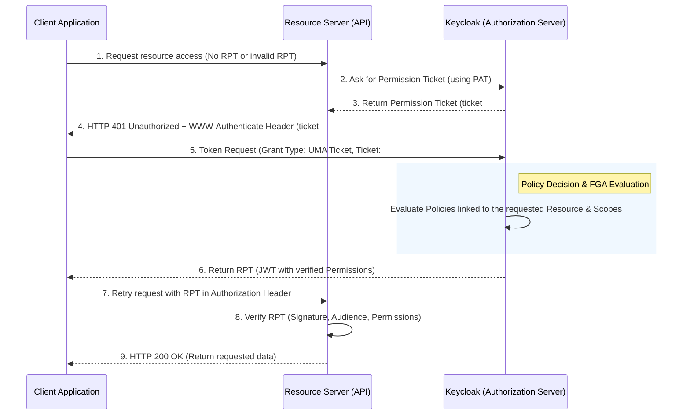

> [!NOTE]
> **Category:** Theory (Lý thuyết)
> **Goal:** Nắm bắt kiến trúc phân quyền hạt mịn (Fine-Grained Authorization - FGA) trong Keycloak và sự vận hành của giao thức User-Managed Access (UMA) 2.0.

## 1. Lý thuyết chuyên sâu (Detailed Theory)

**Fine-Grained Authorization (FGA)** là khả năng kiểm soát truy cập ở mức độ chi tiết (hạt mịn), thường ở mức dữ liệu cá nhân (row-level data), từng tài nguyên cụ thể (từng file, từng bài viết) thay vì chỉ ở mức API endpoint hay ứng dụng như Coarse-Grained Authorization.

Trong Keycloak, FGA được triển khai mạnh mẽ nhất thông qua **Authorization Services** dựa trên tiêu chuẩn **User-Managed Access (UMA) 2.0**. UMA mở rộng giao thức OAuth 2.0, cho phép một **Resource Owner** (chủ sở hữu tài nguyên) có thể cấp, thu hồi quyền truy cập đối với tài nguyên của họ cho các ứng dụng hoặc người dùng khác, được quản lý tập trung qua một **Authorization Server** (Keycloak).

Các khái niệm cốt lõi trong kiến trúc UMA của Keycloak:
- **Resource Server (RS)**: Nơi lưu trữ tài nguyên thực tế (Ví dụ: Ứng dụng chia sẻ file, API).
- **Resource**: Một đối tượng được bảo vệ (Ví dụ: Bức ảnh `photo1.jpg`, tài khoản ngân hàng).
- **Scope**: Các hành động có thể thực hiện trên Resource (Ví dụ: `read`, `write`, `delete`).
- **Permission Ticket**: Một thẻ (ticket) tạm thời do Authorization Server cấp khi Client cố gắng truy cập tài nguyên bị bảo vệ mà chưa có quyền.
- **RPT (Requesting Party Token)**: Một Access Token (dạng JWT) chứa các quyền (Permissions) được cấp phát cụ thể sau khi đã đánh giá thành công các Policies.

## 2. Luồng nội bộ & Cơ chế cấp thấp (Internal Workflow & Low-level Mechanisms)

Luồng trao đổi thông tin UMA 2.0 (UMA Grant Type) trong Keycloak xử lý FGA vô cùng tinh vi:



**Cơ chế cấp thấp (Low-level Mechanisms):**
- Bước 2: Resource Server sử dụng **PAT (Protection API Token)** - một mã thông báo đặc biệt cho phép RS gọi tới Keycloak Protection API để tạo Permission Ticket.
- Bước 4: Header trả về cho Client có định dạng `WWW-Authenticate: UMA realm="...", as_uri="...", ticket="123..."`.
- Bước 8: Resource Server kiểm tra RPT thông qua Local Token Validation (cấu hình public key của Keycloak) hoặc gọi tới điểm cuối phân tích mã thông báo (Token Introspection Endpoint) của Keycloak.

## 3. Thực hành tốt nhất & Bảo mật (Best Practices & Security)

> [!WARNING]
> Không cấp phát PAT (Protection API Token) dài hạn cho các Resource Server. Nếu PAT bị lộ, kẻ tấn công có thể thay đổi siêu dữ liệu của các tài nguyên được bảo vệ hoặc tạo Permission Tickets trái phép.

> [!IMPORTANT]
> **Zero Trust Architecture:** Mặc dù hệ thống mạng nội bộ có vẻ an toàn, RS PHẢI LUÔN kiểm tra chữ ký (Signature Validation) và trường `aud` (Audience) của RPT trước khi tin tưởng các quyền truy cập được đính kèm.

**Thực hành tốt nhất:**
1. **Lazy Loading Permissions**: Không nên đưa mọi quyền (permissions) vào cấu hình mặc định của Access Token (sẽ làm phình to kích thước JWT). Chỉ yêu cầu RPT với các quyền cụ thể khi cần thiết (incremental authorization).
2. **Resource Modeling**: Nhóm các tài nguyên có cùng Access Policies thành các Typed Resources để giảm tải việc cấu hình hàng triệu tài nguyên đơn lẻ trên Keycloak.

## 4. Cấu hình minh họa thực tế (Configuration Examples)

Ví dụ cấu hình `application.properties` cho Spring Boot Resource Server kết hợp với Spring Security Keycloak Adapter (hoặc Keycloak Authorization Spring Boot Starter) để áp dụng UMA:

```properties
# Thông tin Keycloak Authorization Server
keycloak.auth-server-url=http://localhost:8080/
keycloak.realm=my-realm
keycloak.resource=my-client-rs
keycloak.credentials.secret=my-client-secret

# Bật tính năng Policy Enforcer để hoạt động như một UMA Resource Server
keycloak.policy-enforcer-config.enforcement-mode=ENFORCING
# Định nghĩa đường dẫn bảo vệ dựa trên UMA Discovery
keycloak.policy-enforcer-config.paths[0].path=/api/protected-resource/*
```

Trong Java, cấu hình Policy Enforcer sẽ tự động can thiệp vào các request bị chặn, giao tiếp với Keycloak để lấy Permission Ticket và trả về 401 UMA Challenge cho Client mà bạn không cần phải tự viết lại luồng này.

## 5. Trường hợp ngoại lệ (Edge Cases)

1. **Permission Ticket Expiration (Ticket hết hạn)**:
   - *Sự cố*: Client nhận được Ticket từ RS, nhưng mất quá nhiều thời gian để yêu cầu Keycloak cấp RPT, dẫn đến thông báo lỗi `invalid_ticket`.
   - *Khắc phục*: Client cần xử lý mã lỗi này một cách rõ ràng (Graceful handling) bằng cách gọi lại Request ban đầu (Bước 1) tới RS để nhận một Ticket hoàn toàn mới.

2. **Xóa Resource trên Resource Server nhưng Keycloak không biết**:
   - *Sự cố*: Tài nguyên (ví dụ file) đã bị xóa ở Backend, nhưng định danh tài nguyên đó vẫn tồn tại trên Keycloak, làm lãng phí DB và gây nhiễu Policy Evaluation.
   - *Khắc phục*: RS phải gọi Keycloak Protection API (`DELETE /auth/realms/{realm}/authz/protection/resource_set/{resource_id}`) đồng thời khi xóa dữ liệu thực tế.

## 6. Câu hỏi Phỏng vấn (Interview Questions)

1. **Junior:** Phân biệt RPT (Requesting Party Token) và Access Token thông thường.
   - *Đáp án:* Cả hai đều là JWT. Tuy nhiên, Access Token thông thường chứa thông tin định danh và Roles. RPT được cấp đặc biệt trong luồng FGA/UMA, nó chứa một danh sách cụ thể các `permissions` (resource_id và scopes) mà Policy Engine đã phê duyệt cho phiên làm việc đó.
2. **Junior:** Trong UMA, thành phần nào chịu trách nhiệm đưa ra quyết định cấp quyền (Policy Decision Point - PDP)?
   - *Đáp án:* Keycloak đóng vai trò là PDP, nơi lưu trữ và đánh giá các chính sách (Policies). Resource Server chỉ đóng vai trò Policy Enforcement Point (PEP) thực thi quyết định của PDP.
3. **Senior:** Permission Ticket trong giao thức UMA giải quyết vấn đề kỹ thuật nào?
   - *Đáp án:* Nó xử lý luồng "Asynchronous/Stateless Permission Request". Thay vì RS phải đóng gói mọi ngữ cảnh gửi thẳng cho Keycloak, RS chỉ định nghĩa yêu cầu (Resource + Scopes) tạo thành Ticket. Client dùng Ticket tự liên hệ với Keycloak, cho phép Keycloak tương tác trực tiếp với Client (ví dụ: yêu cầu Client nhập thêm OTP/MFA hoặc chờ Resource Owner phê duyệt) mà không làm tắc nghẽn RS.
4. **Senior:** Làm thế nào để giải quyết vấn đề về hiệu suất (Latency) khi Resource Server áp dụng Policy Enforcement Mode = ENFORCING cho mỗi Request?
   - *Đáp án:* Dùng Local Policy Decision Point (nếu có hỗ trợ), cấu hình JWT Validator Cache trên RS, hoặc xác thực RPT locally thay vì gọi Introspection API liên tục.
5. **Senior:** PAT (Protection API Token) được lấy thông qua Grant Type nào và nó được gắn với đối tượng nào trong Keycloak?
   - *Đáp án:* PAT được cấp qua `Client Credentials Grant`. Nó gắn với `Service Account` của Client Application (Resource Server) trên Keycloak.

## 7. Tài liệu tham khảo (References)

- [User-Managed Access (UMA) 2.0 Grant for OAuth 2.0 Authorization](https://docs.kantarainitiative.org/uma/wg/rec-oauth-uma-grant-2.0.html)
- [Keycloak Authorization Services Guide - UMA](https://www.keycloak.org/docs/latest/authorization_services/#_service_uma_authorization_process)
- [OAuth 2.0 Threat Model and Security Considerations (RFC 6819)](https://datatracker.ietf.org/doc/html/rfc6819)
