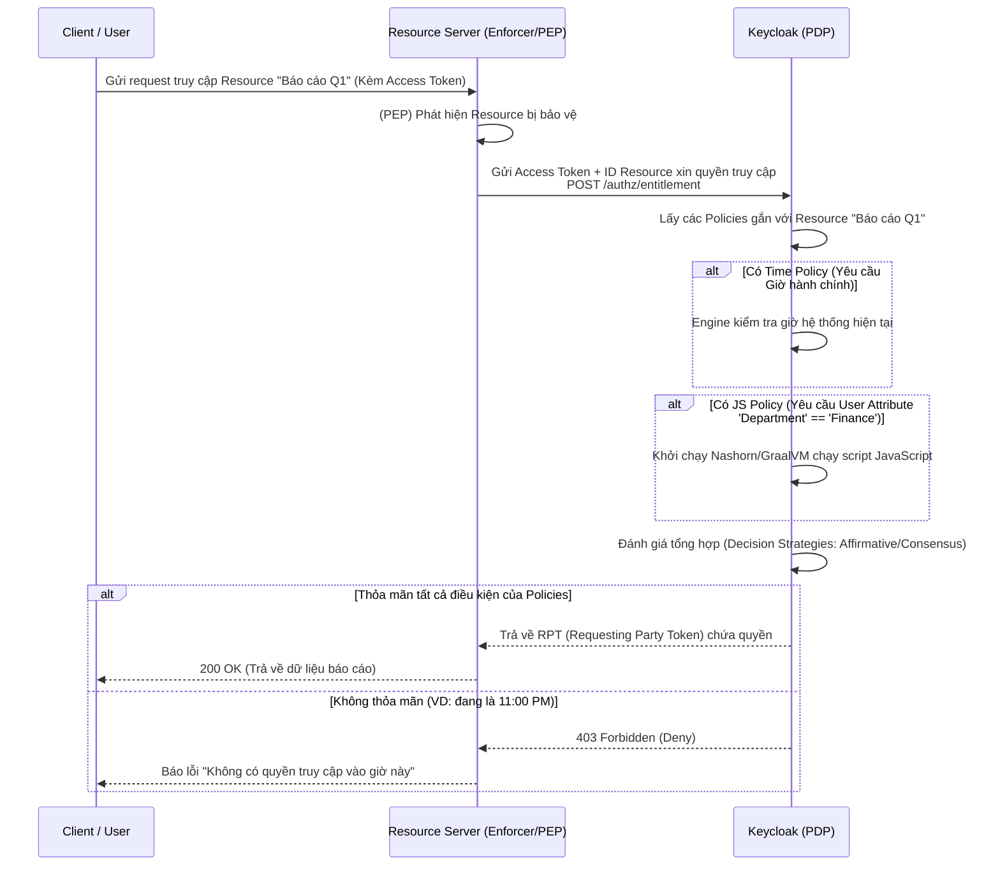

> [!NOTE]
> **Category:** Theory
> **Goal:** Hiểu khái niệm Policy-Based Access Control (PBAC/ABAC) là gì, tại sao nó vượt trội hơn RBAC trong các bài toán phức tạp và cách Keycloak Authorization Services áp dụng các loại Policy.

## 1. Lý thuyết chuyên sâu (Detailed Theory)

Trong mô hình **RBAC (Role-Based Access Control)** truyền thống, việc cấp quyền hoàn toàn phụ thuộc vào "Người dùng là ai" (Role: Admin, User, Manager). Tuy nhiên, trong môi trường doanh nghiệp hiện đại, bạn có những yêu cầu cấp quyền cực kỳ tinh vi: 
- "Người dùng chỉ được phép rút tiền nếu số dư tài khoản > 0 và họ đăng nhập từ một địa chỉ IP nội bộ."
- "Giám đốc chỉ được xem báo cáo tài chính trong giờ hành chính từ 8:00 AM đến 5:00 PM."

RBAC không thể giải quyết được các yêu cầu này (hoặc phải tạo ra hàng ngàn Role phức tạp như `admin_at_8am_with_ip`). Để giải quyết, chúng ta sử dụng **Policy-Based Access Control (PBAC)** hoặc **Attribute-Based Access Control (ABAC)**. 

Trong Keycloak, PBAC cho phép bạn định nghĩa các **Chính sách (Policies)** - đây là các điều kiện động (Dynamic rules). Một Policy không trực tiếp cấp quyền, mà nó định nghĩa "Điều kiện nào phải thỏa mãn để Quyền (Permission) được cấp".

**Các loại Policy phổ biến trong Keycloak:**
- **Role Policy:** Yêu cầu User phải có Role cụ thể (để tương thích ngược với RBAC).
- **User Policy:** Cấp quyền cho một User đích danh (ví dụ `alice`).
- **Time Policy:** Chỉ cấp quyền trong một khoảng thời gian nhất định (Giờ hành chính, Tháng cụ thể).
- **Client Policy:** Yêu cầu Request phải xuất phát từ một Client cụ thể.
- **JavaScript Policy (JS Policy):** Sức mạnh lớn nhất. Bạn có thể viết code JavaScript chạy trên Engine của Keycloak để phân tích bất cứ thông tin gì: Thuộc tính người dùng (User Attributes), Thông tin Môi trường (IP, Browser), Thông tin Request.

## 2. Luồng nội bộ & Cơ chế cấp thấp (Internal Workflow & Low-level Mechanisms)

Khác với RBAC mà Resource Server (Backend API) tự đọc Token để kiểm tra Role, với PBAC theo chuẩn User-Managed Access (UMA), toàn bộ logic kiểm tra quyền đều nằm tại Keycloak Server. Keycloak trở thành một **Policy Decision Point (PDP)**.



**Cơ chế cấp thấp:**
- Keycloak Evaluation Engine thực thi các Policies dựa trên luồng đánh giá cây (Tree Evaluation). Các Policies có thể được lồng nhau (Aggregated Policy).
- JavaScript Policies được thực thi bằng engine **Nashorn** (trong các phiên bản cũ) hoặc bộ chứa bảo mật nhỏ trên **GraalVM** (Keycloak bản mới) để ngăn chặn mã độc chạy trên máy chủ (Sandbox).

## 3. Thực hành tốt nhất & Bảo mật (Best Practices & Security)

- **Hiệu năng hệ thống (Performance):** PBAC xử lý rất nặng. Việc đánh giá hàng trăm JS Policies lồng nhau sẽ tiêu tốn CPU. Hãy chỉ dùng PBAC ở những tài nguyên (Resources) cực kỳ quan trọng đòi hỏi bảo mật động; đối với các tài nguyên cơ bản, hãy dùng RBAC thuần để Backend tự xử lý bằng cách đọc Token.
- **Bảo mật JavaScript Policy:** Keycloak hiện tại mặc định VÔ HIỆU HÓA tính năng JS Policy vì lý do bảo mật (Remote Code Execution risks). Nếu bật, chỉ có quản trị viên cao cấp nhất mới được viết JS script. Không bao giờ gán quyền tạo JS Policy cho người dùng thường.
- **Tái sử dụng (Reusability):** Tạo các Policy nhỏ mang tính cấu thành (ví dụ Policy `is-manager`, Policy `is-working-hours`) và kết hợp chúng bằng **Aggregated Policy**, tránh việc viết lại cùng một luật JS nhiều lần.

> [!WARNING]
> Nếu bạn thay đổi thiết lập đồng hồ hệ thống (System Time) của máy chủ Keycloak bị lệch, Time Policy sẽ đánh giá sai lệch toàn bộ, gây gián đoạn hệ thống. LUÔN sử dụng NTP (Network Time Protocol) để đồng bộ giờ máy chủ.

## 4. Cấu hình minh họa thực tế (Configuration Examples)

Ví dụ mã nguồn của một **JavaScript Policy** trên Keycloak Admin Console dùng để kiểm tra xem một User có địa chỉ IP từ mạng nội bộ `192.168.x.x` hay không và thuộc phòng ban `Finance`.

```javascript
// Biến có sẵn do Keycloak Engine cung cấp: $evaluation

var context = $evaluation.getContext();
var identity = context.getIdentity();
var attributes = identity.getAttributes();

// Kiểm tra phòng ban (Custom User Attribute)
var department = attributes.getValue('department');
var isFinance = department != null && department.asString(0) === 'Finance';

// Lấy IP của Client Request (Cần Keycloak cấu hình Reverse Proxy Trust)
var clientIp = context.getAttributes().getValue('remote.address').asString(0);
var isInternalIP = clientIp.startsWith('192.168.');

if (isFinance && isInternalIP) {
    $evaluation.grant();  // Cấp quyền
} else {
    $evaluation.deny();   // Từ chối
}
```

Để sử dụng mã trên, Admin sẽ:
1. Bật tính năng (Feature Profile) `scripts` khi khởi động Keycloak (`bin/kc.sh start --features=scripts`).
2. Vào Client có bật Authorization, tab Policies, tạo JavaScript Policy và dán đoạn script này.
3. Liên kết Policy này với một Permission trên Resource cụ thể.

## 5. Trường hợp ngoại lệ (Edge Cases)

- **Nashorn Engine bị loại bỏ:** Từ Java 15+, Nashorn JS engine bị xóa khỏi JDK. Nếu Keycloak chạy trên JDK 17, JS Policy có thể bị lỗi không chạy được nếu không bật các cấu hình thay thế (hoặc đóng gói thư viện Rhino/GraalVM).
- **Thiếu Trust Proxy Config:** Policy kiểm tra IP hoạt động sai, luôn trả về IP của bộ cân bằng tải (Load Balancer) thay vì IP người dùng thật. **Khắc phục:** Cấu hình Keycloak để đọc đúng Header `X-Forwarded-For` bằng cách bật cờ proxy (ví dụ: `proxy=edge`).
- **Vòng lặp vô hạn (Infinite Loop) trong JS Policy:** Lập trình viên viết nhầm vòng `while(true)` trong JS Policy. Điều này làm chết CPU của Keycloak. Keycloak có bộ Timeout cho Script, nhưng vẫn là một nguy cơ tốn tài nguyên.

## 6. Câu hỏi Phỏng vấn (Interview Questions)

1. **(Junior)** PBAC/ABAC giải quyết vấn đề gì mà RBAC không làm được?
   - *Đáp án:* Cấp quyền linh hoạt và động dựa trên bối cảnh (thời gian, IP, thuộc tính) thay vì chỉ phụ thuộc vào vai trò tĩnh.
2. **(Junior)** Ai là người thực hiện kiểm tra quyền lợi (đưa ra quyết định cấp quyền) trong mô hình PBAC của Keycloak? Resource Server (Backend API) hay Keycloak Server?
   - *Đáp án:* Keycloak Server đóng vai trò là Policy Decision Point (PDP) để đánh giá và đưa ra quyết định.
3. **(Senior)** Lấy ví dụ khi một JavaScript Policy kiểm tra thuộc tính người dùng, nó lấy dữ liệu "Attributes" từ đâu? Có phải query Database không?
   - *Đáp án:* Các thuộc tính này được nạp vào bộ nhớ (hoặc cache) trong quá trình xác thực và được engine bơm vào biến `$evaluation.getContext().getIdentity()`.
4. **(Senior)** Nếu tôi cần triển khai quy tắc "Chỉ được xem tài liệu nếu người dùng là tác giả của tài liệu đó" (Owner-based policy) bằng Keycloak Authorization, tôi làm thế nào?
   - *Đáp án:* Khi Resource Server tạo Resource trên Keycloak qua API (ví dụ tạo tài liệu), nó gán thuộc tính `owner` của tài liệu là ID của User. Trong Keycloak, tạo Resource-based Policy kiểm tra xem `$identity.getId()` có bằng với `resource.getOwner()` hay không.
5. **(Senior)** Rủi ro bảo mật lớn nhất khi bật tính năng JavaScript Policies trên môi trường Production là gì?
   - *Đáp án:* Remote Code Execution. Kẻ tấn công nếu có quyền tạo/sửa Policy có thể viết JS gọi ra ngoài các command hệ thống qua Java Reflection nếu bộ Sandbox của Keycloak không khóa chặt.

## 7. Tài liệu tham khảo (References)

- NIST Special Publication 800-162: [Guide to ABAC](https://csrc.nist.gov/publications/detail/sp/800-162/final)
- Keycloak Authorization Services Guide: [Policies](https://www.keycloak.org/docs/latest/authorization_services/#_policy)
