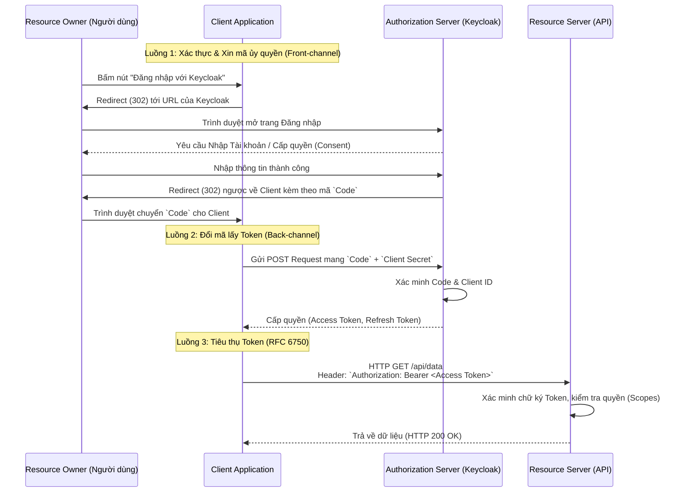

> [!NOTE]
> **Category:** Theory (Lý thuyết)
> **Goal:** Tìm hiểu cái nhìn tổng quát về Khung Ủy quyền (Authorization Framework) theo chuẩn OAuth 2.0 (RFC 6749) và cách sử dụng Mã thông báo theo chuẩn Bearer (RFC 6750). Xây dựng kiến thức nền tảng vững chắc để tiếp cận các khái niệm nâng cao của Keycloak.

## 1. Lý thuyết chuyên sâu (Detailed Theory)

Trước khi chuẩn OAuth 2.0 ra đời, nếu một người dùng muốn cấp quyền cho Ứng dụng B (ví dụ ứng dụng in ảnh) lấy ảnh từ Ứng dụng A (ví dụ Google Photos), người dùng buộc phải giao tên đăng nhập và mật khẩu (Username/Password) của Google cho Ứng dụng in ảnh. Điều này cực kỳ nguy hiểm, vì Ứng dụng B có toàn quyền kiểm soát tài khoản Google của người dùng.

**Giải pháp của RFC 6749 (OAuth 2.0 Authorization Framework):**
OAuth 2.0 giới thiệu mô hình "Ủy quyền" (Authorization). Thay vì chia sẻ thông tin đăng nhập, Hệ thống lưu trữ (Google) sẽ cấp một "chìa khóa tạm thời" (Access Token) có giới hạn phạm vi truy cập (chỉ được đọc ảnh) và giới hạn thời gian cho Ứng dụng in ảnh.

### 4 Vai trò (Roles) cốt lõi trong mô hình OAuth 2.0:
1. **Resource Owner (Chủ sở hữu Tài nguyên):** Chính là Người dùng (End User). Người có quyền phê duyệt cấp quyền đối với dữ liệu của mình.
2. **Client (Ứng dụng Khách):** Hệ thống muốn truy cập dữ liệu (Ví dụ: Web app, Mobile app, SPA). Client là thực thể gửi yêu cầu lấy Token.
3. **Authorization Server (Máy chủ Ủy quyền):** Đây chính là **Keycloak**. Nơi đóng vai trò giao tiếp với người dùng để xác thực (Login), yêu cầu sự đồng thuận (Consent), và cuối cùng là cấp phát Token.
4. **Resource Server (Máy chủ Tài nguyên):** Nơi lưu trữ dữ liệu (các API Backend). Nó sẽ nhận Access Token, kiểm tra tính hợp lệ và trả về dữ liệu.

**RFC 6750 (The OAuth 2.0 Authorization Framework: Bearer Token Usage):**
Tài liệu này chuẩn hóa cách sử dụng Access Token do RFC 6749 sinh ra. "Bearer Token" có nghĩa là "Mã thông báo mang tính chất vô danh". Bất kỳ ai cầm được token (Bearer) đều được coi là có quyền hợp lệ, không cần phải chứng minh danh tính thật sự. Vì vậy, các token này bắt buộc phải được truyền tải qua đường truyền mã hóa (TLS/HTTPS).

---

## 2. Luồng nội bộ & Cơ chế cấp thấp (Internal Workflow & Low-level Mechanisms)

Sơ đồ sau minh họa luồng quy trình phổ biến nhất của OAuth 2.0: **Authorization Code Grant**.

---

## 3. Thực hành tốt nhất & Bảo mật (Best Practices & Security)

> [!WARNING]
> **Anti-pattern: Dùng OAuth 2.0 cho việc Authentication (Xác thực danh tính)**
> OAuth 2.0 bản chất là giao thức **Ủy quyền (Authorization)**, không phải giao thức Xác thực. Việc Client lấy Access Token và cố tình dùng nó để "định danh" người dùng (bằng cách gọi API lấy thông tin Profile) là một thiết kế rủi ro (đã từng tạo ra lỗ hổng đánh cắp phiên đăng nhập rất lớn trong quá khứ). Để Xác thực (Identity), bạn BẮT BUỘC phải dùng lớp vỏ bọc nâng cấp của nó là **OpenID Connect (OIDC)** (cấp thêm một `ID Token`).

> [!IMPORTANT]
> **Phân chia Client Công khai và Client Bảo mật**
> OAuth 2.0 chia Client làm hai loại:
> - **Confidential Client (Client Bảo mật):** Backend Web Server chạy Spring/NodeJS. Chúng có khả năng giữ bí mật `client_secret`.
> - **Public Client (Client Công khai):** Ứng dụng Mobile App, SPA React/Angular. Mã nguồn chạy trên thiết bị của người dùng, không thể giữ bí mật. Tuyệt đối không giao `client_secret` cho các Public Client.

---

## 4. Cấu hình minh họa thực tế (Configuration Examples)

Trong Keycloak, để thiết lập một môi trường làm việc theo OAuth 2.0, bạn phải thao tác qua các thành phần tương ứng:

1. **Khởi tạo Client (Đại diện cho Ứng dụng Khách):**
   - Vào Admin Console -> `Clients` -> `Create client`.
   - `Client type`: Chọn **OpenID Connect** (Mặc dù là OIDC, nhưng nó kế thừa 100% OAuth2).
   - `Client ID`: Nhập tên nhận diện (Ví dụ: `my-web-app`).
   - Chọn loại truy cập bảo mật (`Client Authentication = ON`) nếu là Backend, hoặc tắt nếu là SPA.
   
2. **Cấu hình Redirect URI (Bắt buộc):**
   - `Valid redirect URIs`: Nơi Keycloak trả mã Authorization Code về cho ứng dụng của bạn. Nếu sai 1 ký tự, hệ thống sẽ từ chối giao dịch để chống giả mạo.

3. **Cấu hình người dùng (Resource Owner):**
   - Tạo người dùng ở mục `Users`, thiết lập mật khẩu trong tab `Credentials`. Đây chính là chủ thể sẽ thực hiện việc cấp quyền.

---

## 5. Trường hợp ngoại lệ (Edge Cases)

### Lỗi hiển thị "Invalid parameter: redirect_uri"
- **Sự cố:** Khi người dùng bấm vào nút "Đăng nhập", trình duyệt hiện trang báo lỗi màu đỏ của Keycloak với thông báo "Invalid parameter: redirect_uri".
- **Nguyên nhân cốt lõi:** Đường dẫn hiện tại trên thanh địa chỉ có chứa một parameter là `redirect_uri=...`. Giá trị này do Client gửi lên, nhưng nó không khớp 100% với danh sách `Valid redirect URIs` bạn đã cấu hình tĩnh trên Admin Console của Keycloak. 
- **Cách xử lý:** Bật Network tab (F12) trên trình duyệt, xem giá trị thực tế của `redirect_uri` được Client đẩy đi. Copy toàn bộ giá trị đó và thêm chính xác vào cấu hình của Keycloak (Lưu ý dấu xuyệt `/` ở cuối chuỗi cũng gây lỗi nếu không khớp).

---

## 6. Câu hỏi Phỏng vấn (Interview Questions)

1. **OAuth 2.0 giải quyết bài toán gì so với cơ chế xác thực truyền thống (HTTP Basic Auth)?**
   - *Junior:* Không cần gửi mật khẩu của mình cho app bên thứ 3.
   - *Senior:* Phân tách vai trò kiểm soát (Delegated Access). Bằng cách sử dụng Token thay cho Credentials gốc, bạn có thể dễ dàng quản trị phạm vi quyền (Scopes), quy định thời gian hết hạn (TTL), và có thể thu hồi (Revoke) sự cấp phép của một ứng dụng cụ thể mà không cần phải đổi lại mật khẩu gốc làm ảnh hưởng tới mọi ứng dụng khác.

2. **Khác biệt giữa OAuth 2.0 và OpenID Connect là gì?**
   - *Senior:* OAuth 2.0 trả lời câu hỏi "Ứng dụng này ĐƯỢC PHÉP LÀM GÌ?" (Delegation/Authorization). Nó sinh ra Access Token. OpenID Connect trả lời câu hỏi "Người dùng này LÀ AI?" (Authentication/Identity). OIDC chạy trên nền OAuth 2.0 và sinh ra thêm một đối tượng chuẩn hóa là `ID Token` (JWT chứa thông tin cá nhân của người dùng) và chuẩn hóa endpoint `/userinfo`.

3. **Tại sao OAuth 2.0 lại định nghĩa quá trình tách làm hai bước: (1) Trả mã Code và (2) Đổi Code lấy Token? Sao không trả Token ngay ở bước 1?**
   - *Senior:* Nếu trả Token ngay ở bước 1 (như Implicit Grant), Token sẽ lộ diện trực tiếp trên Trình duyệt (Front-channel) của người dùng, dễ bị theo dõi và đánh cắp bằng mã độc. Bằng cách trả mã Authorization Code, và bắt buộc hệ thống Backend (Back-channel) dùng `client_secret` bí mật gửi kèm Code qua đường truyền bảo mật Server-to-Server để lấy Token, giao thức đảm bảo Token không bao giờ lộ ra ngoài môi trường không tin cậy.

4. **"Bearer Token" (Mã thông báo vô danh) mang lại rủi ro gì? Làm thế nào để khắc phục?**
   - *Senior:* Rủi ro: Ai nhặt được Token thì có thể dùng nó (Token theft). Khắc phục: Yêu cầu bắt buộc HTTPS, giảm thời gian sống của token, dùng OAuth 2.0 DPoP (Demonstrating Proof-of-Possession) hoặc mTLS để ràng buộc Token với địa chỉ IP hoặc chứng chỉ vật lý (Client-bound token) để nếu token bị trộm mang qua máy khác cũng không dùng được.

5. **Giải thích vai trò của Authorization Server và Resource Server trong một kiến trúc Microservices?**
   - *Senior:* Trong Microservices, Authorization Server (Keycloak) là điểm tập trung (Single Source of Truth) quản lý danh tính, cấp phát Token và ký điện tử (Sign). Resource Servers (các API microservices như Order Service, Payment Service) sẽ phân tán phi tập trung. Thay vì mỗi dịch vụ gọi lên Keycloak để hỏi token, chúng tự lấy Public Key từ Keycloak về và tự thân kiểm tra chữ ký (Stateless JWT Validation).

---

## 7. Tài liệu tham khảo (References)

- [RFC 6749 - The OAuth 2.0 Authorization Framework](https://datatracker.ietf.org/doc/html/rfc6749)
- [RFC 6750 - Bearer Token Usage](https://datatracker.ietf.org/doc/html/rfc6750)
- [OAuth 2.0 Simplified by Aaron Parecki](https://aaronparecki.com/oauth-2-simplified/)
