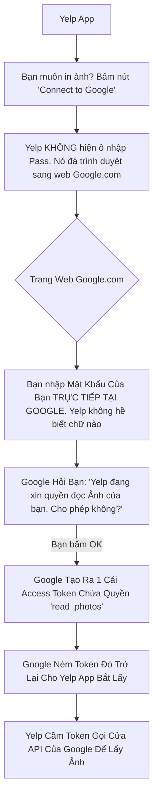

# Lesson 1: Sự Mệnh Của OAuth2 (RFC Overview)

> [!NOTE]
> **Category:** Theory (Lý thuyết)
> **Goal:** Tại sao thế giới không dùng Username/Password để gọi API nữa mà lại đẻ ra cái giao thức OAuth2 rắc rối này? Bài học này kể cho bạn nghe "nỗi đau" của các kỹ sư mạng những năm 2000 và cách OAuth2 ra đời như một vị cứu tinh.

## 1. Lý thuyết chuyên sâu (Detailed Theory)

### 1.1. Vấn Đề Thời Tiền Sử (The Password Anti-Pattern)
Vào những năm 2007, một trang web in ảnh có tên là `Yelp` muốn in ảnh của bạn được lưu trên `Google Photos`. 
- **Cách làm cũ:** Yelp yêu cầu bạn nhập **Tài khoản và Mật khẩu Google** của bạn vào ô textbox trên trang web của Yelp!
- **Hậu quả kinh hoàng:**
  1. Yelp có toàn quyền với tài khoản Google của bạn (Nó có thể đọc email, xóa file Google Drive, đổi pass).
  2. Nếu Yelp bị hacker tấn công, mật khẩu Google của bạn bị lộ.
  3. Bạn không thể "cấm" Yelp in ảnh nữa trừ khi bạn... đổi mật khẩu Google của chính mình.

### 1.2. Giải Pháp: OAuth 2.0 (Open Authorization)
OAuth2 ra đời (Chuẩn RFC 6749) để giải quyết triệt để bài toán trên bằng một triết lý đơn giản: **Ủy Quyền Bằng Chìa Khóa Phụ (Delegated Access)**.
- Thay vì bạn đưa Chìa Khóa Nhà (Password) cho ông thợ sửa ống nước (Yelp).
- Bạn dùng Chìa Khóa Nhà mở cửa, gọi ông thợ vào. Sau đó bạn đưa cho ông ấy một cái **Thẻ Khách (Access Token)**. Cái thẻ này chỉ mở được cửa phòng tắm (Scope), và sẽ tự động hết hạn sau 2 tiếng. Ông thợ cầm thẻ đó đi làm việc.
- Nếu ông thợ làm rơi thẻ, bạn chỉ cần báo Hủy Thẻ (Revoke Token). Chìa Khóa Nhà của bạn vẫn an toàn.

### 1.3. Bản Chất Của OAuth2: KHÔNG PHẢI LÀ GIAO THỨC ĐĂNG NHẬP!
**Cực kỳ quan trọng:** OAuth 2.0 ban đầu được sinh ra là giao thức **AUTHORIZATION (Ủy quyền API)**, không phải là giao thức Authentication (Xác thực người dùng Login).
- OAuth2 sinh ra Token để API Server biết "Thằng cầm Token này được phép làm gì".
- OAuth2 không quan tâm "Thằng cầm Token này thực chất là ai". (Đó là lý do người ta phải đẻ thêm OpenID Connect OIDC đắp lên trên OAuth2 để giải quyết bài toán Login).

---

## 2. Luồng nội bộ & Cơ chế cấp thấp (Internal Workflow & Low-level Mechanisms)

Hành Trình Gỡ Mật Khẩu Khỏi Bàn Tay App Bên Thứ 3:

---

## 3. Thực hành tốt nhất & Bảo mật (Best Practices & Security)

> [!IMPORTANT]
> **Tuyệt Đỉnh Tẩy Khách Mạng Bọc (Ngưng Đưa Mật Khẩu Vào API Call Trực Tiếp)**
> **Tội Ác Thiết Kế:** Bạn viết Frontend bằng ReactJS. Mỗi lần gọi API lấy danh sách User, bạn đính kèm Base64(Username:Password) lên HTTP Header (`Authorization: Basic ...`) dội thẳng vào Backend (Mô hình Basic Auth).
> **Hậu Quả:** Nếu mã nguồn ReactJS bị soi, hoặc máy khách bị cài extension độc hại bắt gói tin HTTP, mật khẩu gốc của người dùng sẽ bị lộ. Kẻ cắp cầm Pass đi login ở mọi nơi.
> **Biện Pháp Sống Còn Lớp Bảo Vệ:** Mọi ứng dụng hiện đại bắt buộc phải dùng OAuth2. Trình duyệt phải đá về trang Keycloak (Hoặc Identity Server) để nhập Pass. Token trả về ReactJS là Access Token có tuổi thọ (VD 5 phút). Kẻ cắp bắt được Token thì 5 phút sau Token cũng biến thành giấy vụn rác mạng! Mật khẩu vĩnh viễn nằm an toàn trong bụng Keycloak.

---

## 4. Câu hỏi Phỏng vấn (Interview Questions)

**1. Sếp Mới Vào Công Ty Đọc Code Và Mắng Cậu: "Tại Sao Chú Em Dùng OAuth2 Để Làm Chức Năng Login (Đăng Nhập) Cho Hệ Thống? Anh Nhớ Không Lầm OAuth2 Chỉ Là Giao Thức Phân Quyền (Authorization) Mà Thôi?". Cậu Giải Thích Thế Nào Về Vấn Đề Này?**
- **Senior:** Dạ thưa sếp, Sếp nói hoàn toàn đúng Lịch sử của Chuẩn RFC 6749! OAuth2 thuần túy (Chỉ nhả Access Token) đúng là sinh ra chỉ để cấp quyền cho API.
  - Tuy nhiên, trong dự án này, em KHÔNG DÙNG OAuth2 thuần túy. Em đang dùng **OpenID Connect (OIDC)**. OIDC chính là một "Bản Patch" (Tiện ích mở rộng) nằm đè lên trên lưng giao thức OAuth2. 
  - Nó tận dụng luồng đá trang an toàn của OAuth2, nhưng lúc nhả Token, thay vì chỉ nhả 1 Access Token, nó nhả thêm 1 cái **ID Token** chứa danh tính, tên tuổi email của người dùng. Nhờ cái ID Token này mà cái App ReactJS của mình mới vẽ được cái Màn Hình Profile "Hello Nguyễn Văn A" tức là giải quyết được bài toán Authentication (Xác Thực)! 
  - (Note: Keycloak hỗ trợ chuẩn OIDC này).

---

## 5. Tài liệu tham khảo (References)
- **RFC 6749:** The OAuth 2.0 Authorization Framework.
- **Keycloak Documentation:** Server Administration Guide - OAuth 2.0.
