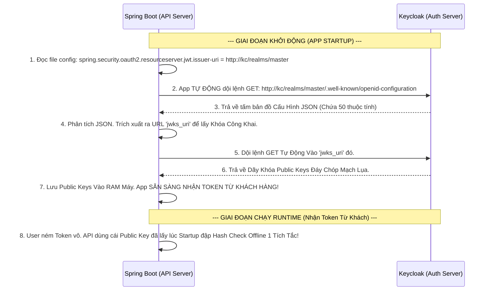

# Lesson 10: Tấm Bản Đồ Định Vị (Discovery)

> [!NOTE]
> **Category:** Theory (Lý thuyết)
> **Goal:** Khi bạn tích hợp một App Spring Boot hoặc NextJS vào Keycloak. Các thư viện này làm sao biết được URL nào để login? URL nào để lấy Token? URL nào để Introspect? Nhập bằng tay từng URL một thì quá mất thời gian và dễ gõ sai. Để giải quyết, OIDC cung cấp một cỗ máy tự động nhận diện: **Discovery Endpoint**.

## 1. Lý thuyết chuyên sâu (Detailed Theory)

### 1.1. Discovery Endpoint Là Gì?
Discovery (Khám phá) được định nghĩa trong tài liệu chuẩn RFC 8414 (OAuth 2.0 Authorization Server Metadata).
- Nó là một đường link API duy nhất (Thường kết thúc bằng `.well-known/openid-configuration`).
- Nhiệm vụ của nó là trả về một tấm bản đồ **JSON khổng lồ**.
- Trong tấm bản đồ JSON đó chứa TOÀN BỘ thông tin quan trọng nhất của Authorization Server (Keycloak): Link đăng nhập, Link lấy Token, Link cấp phát khóa công khai (JWKS), Các thuật toán băm đang hỗ trợ (RS256, HS256), Các Scope đang có sẵn.

### 1.2. Sức Mạnh Của Khái Niệm Auto-Configuration
Nhờ có Discovery Endpoint, việc cấu hình App Backend trở nên nhàn hạ chưa từng có!
- **Cách Cổ Đại Khổ Sở:** Dev phải vào file `.env` gõ tay 10 cái URL: `AUTH_URL=...`, `TOKEN_URL=...`, `REVOKE_URL=...`. Hễ Keycloak đổi Domain là Dev phải đi sửa 10 dòng code chết ngắc.
- **Cách Hiện Đại Chuẩn OIDC:** Dev chỉ cần nhập đúng **1 Dòng Duy Nhất** là đường dẫn Gốc Của Issuer. Lúc Server App (Spring Boot) vừa khởi động (Start-up), nó sẽ tự động chạy cái link Gốc kia nối thêm chữ `.well-known/openid-configuration`, tải file JSON về, tự động đọc và cài đặt ngầm tất cả 10 cái URL vào RAM! Chạy lụa mượt mà không bao giờ sai chính tả!

---

## 2. Luồng nội bộ & Cơ chế cấp thấp (Internal Workflow & Low-level Mechanisms)

Hành Trình OIDC Auto-Wiring Bằng Discovery Bản Đồ Mạch Đáy:

---

## 3. Thực hành tốt nhất & Bảo mật (Best Practices & Security)

> [!IMPORTANT]
> **Tuyệt Đỉnh Tẩy Khách Trải Nghiệm Mạng (Lỗi Sập Mạng Cục Bộ Khi Đổi URL Issuer Khác Môi Trường)**
> **Tội Ác Thiết Kế Docker (Lỗi Kinh Điển 401 Issuer Mismatch):** Bạn setup file cấu hình Spring Boot ở Local: `issuer-uri = http://localhost:8080/realms/master`.
> Khách hàng (Trình duyệt) đăng nhập thành công từ Keycloak, lấy Token mang dòng chữ Chữ Ký Issuer là `http://localhost:8080...`.
> Nhưng khi bạn Deploy (Đẩy mã) lên Server Production. Spring Boot ở Prod tải cái Discovery từ IP Máy chủ `http://192.168.1.10:8080/realms/master`.
> Khi Trình duyệt ném cái Token của Local vào Prod, Spring Boot chửi: "Thằng đẻ ra mày là localhost, mà tao đang làm việc với thằng bố 192.168. Mày là đồ giả mạo! Lỗi 401 UnAuthorized CÚT Khung Dịch Lụa!".
> **Biện Pháp Sống Còn Lớp Trọng Tâm:** Phải cực kỳ cẩn thận với khái niệm **Frontend URL** trong Keycloak. 
> Keycloak có chức năng ép cố định cái dòng chữ "Issuer" trong Token và trong file Discovery. Bạn phải Cấu Hình biến Môi Trường `KC_HOSTNAME=sso.congty.com` ở Production để cái file `.well-known` nó in ra các URL đồng nhất 1 Domain duy nhất, tránh lỗi sập mạch giữa Docker Back-channel và Trình duyệt Front-Channel!

---

## 4. Cấu hình minh họa thực tế (Configuration Examples)

Lắp Ráp Cấu Hình Xem Trực Tiếp Tấm Bản Đồ Phép Thuật OIDC Discovery Trên Keycloak:
1. Bạn mở Trình Duyệt Bất Kỳ Kéo Cáp Truy Cập Link Này (Không cần Đăng Nhập Mật Khẩu, nó là API Công Khai):
   `http://localhost:8080/realms/master/.well-known/openid-configuration`
2. Trình duyệt Xổ Ra Một Đống Code JSON Đen Ngòm. Cài Extension Format JSON để nhìn rõ hơn.
3. Trong đó Chứa Những Tham Số Kinh Điển Chuẩn Hóa Toàn Cầu:
   - **`issuer`**: "http://localhost:8080/realms/master" (Kẻ sinh ra Token).
   - **`authorization_endpoint`**: Nơi trình duyệt nhảy tới để gõ Username/Pass.
   - **`token_endpoint`**: Nơi Backend chui ngầm vào đổi Auth Code lấy Token.
   - **`jwks_uri`**: Kho chứa ổ khóa Public Key để Verify Chữ Ký JSON Web Signature (JWS).
   - **`introspection_endpoint`**: Nơi Cảnh Sát Soi Chiếu làm việc (Bài 9).
   - **`revocation_endpoint`**: Nơi Đao Phủ Tử Hình làm việc (Bài 8).
4. Bạn Copy File URL Discovery Của Realm Đưa Cho Thằng Dev Fontend/Backend Là Nó Mừng Rớt Nước Mắt, Khỏi Cần Đọc Tài Liệu OIDC Manual Khổ Sở.

---

## 5. Câu hỏi Phỏng vấn (Interview Questions)

**1. Trong Tấm Bản Đồ JSON Discovery, Cậu Thấy Khóa Tham Số 'jwks_uri'. Đây Chứa Đường Link Trỏ Tới Cục JSON Web Key Set (JWKS). Ý Nghĩa Của Cái JWKS Này Là Gì Đối Với Việc Bảo Vệ Mạch JWT Ở Đáy Resource Server (Spring Boot)?**
- **Senior:** Dạ thưa sếp, JWKS Là Cột Sống Cốt Lõi Của Kiến Trúc Mã Hóa OIDC Trọng Tâm Bọc Thép (Asymmetric Cryptography).
  - Vì JWT Access Token thường được ký bằng thuật toán Không Đối Xứng (RSA - RS256). Keycloak giữ **Private Key (Khóa Riêng Kín)** để tạo ra Chữ Ký.
  - Còn App Spring Boot (Resource Server) Cần **Public Key (Khóa Công Khai Mở)** để Giải Mã và Xác Minh xem Token đó có bị sửa đổi dọc đường không.
  - Cái `jwks_uri` chính là cái Kệ Trưng Bày Chứa Khóa Công Khai đó. Lúc Spring Boot Boot lên, nó sẽ bốc Khóa Công Khai trên kệ này thả vào RAM Máy. Nếu sếp Đổi Cặp Khóa Mới Trên Keycloak (Key Rotation), File JSON JWKS sẽ tự đổi Dãy Khóa. Spring Boot chỉ cần dội Refresh tải lại File JSON đó là ăn khớp Nhịp Nhàng Chống Rò Rỉ Đứt Gãy Phiên Lụa Không Gián Đoạn!

---

## 6. Tài liệu tham khảo (References)
- **RFC 8414:** OAuth 2.0 Authorization Server Metadata.
- **Keycloak Documentation:** Server Administration Guide - OIDC Endpoints.
