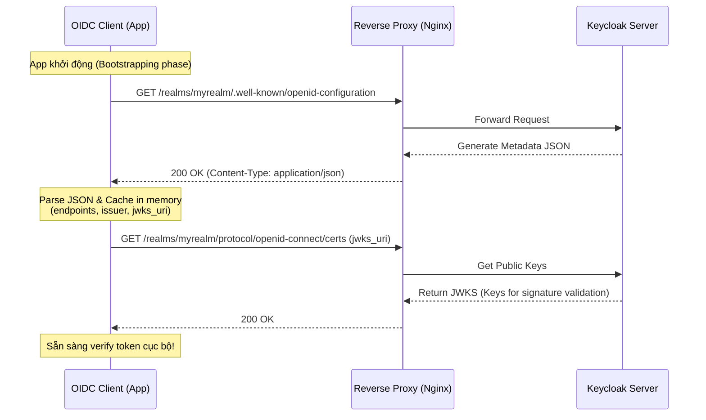

> [!NOTE]
> **Category:** Theory (Lý thuyết)
> **Goal:** Cung cấp cái nhìn toàn diện về cơ chế Discovery trong OAuth 2.0 và OpenID Connect (OIDC). Phân tích cách thiết kế endpoint `.well-known/openid-configuration` giúp tự động hóa quá trình cấu hình cho các hệ thống phần mềm (Clients).

## 1. Lý thuyết chuyên sâu (Detailed Theory)

Trong các hệ thống phân tán và kiến trúc Microservices, việc kết nối giữa một Ứng dụng khách (Client) và Máy chủ Ủy quyền (Authorization Server - như Keycloak) đòi hỏi rất nhiều tham số tĩnh: URL để đăng nhập, URL để đổi token, thuật toán ký số, và đường dẫn tới khóa công khai (Public Key). 

**Vấn đề:** Nếu bạn **hardcode** (ghi cứng) toàn bộ các đường dẫn này vào mã nguồn của Client, mỗi lần Keycloak thay đổi tên miền hoặc cập nhật phiên bản thay đổi kiến trúc đường dẫn, bạn sẽ phải triển khai (deploy) lại toàn bộ hàng trăm Client.

**Giải pháp - OAuth 2.0 Discovery (RFC 8414) & OIDC Discovery:**
Discovery là cơ chế cung cấp Siêu dữ liệu (Metadata) dưới dạng một tệp JSON, được công khai tại một đường dẫn quy chuẩn toàn cầu: `/.well-known/openid-configuration`. 
Chỉ cần Client biết được URL gốc (Issuer URL) của Keycloak, nó sẽ nối thêm `.well-known/...` vào đuôi và gửi request HTTP GET lúc khởi động ứng dụng. File JSON nhận về đóng vai trò như một "cuốn sổ danh bạ", chứa mọi thứ Client cần:
- `authorization_endpoint`: Nơi điều hướng User đi đăng nhập.
- `token_endpoint`: Nơi Client gọi API để lấy Access Token.
- `jwks_uri`: Nơi lấy tập khóa công khai (JSON Web Key Set) để xác thực chữ ký (Signature) của JWT.
- Các scopes, claims, và thuật toán mã hóa (Cipher Suite) mà server hỗ trợ.

---

## 2. Luồng nội bộ & Cơ chế cấp thấp (Internal Workflow & Low-level Mechanisms)

Quá trình "Khám phá" (Discovery) diễn ra hoàn toàn tự động (thường được thực hiện bởi các thư viện OIDC Client như Spring Security, oidc-client-js).



**Cơ chế bảo vệ (Defense Mechanism):** Quá trình này giúp Client linh hoạt phản ứng với **Key Rotation** (Xoay vòng khóa bảo mật). Khi Keycloak thay đổi khóa ký (Signing Key), thư viện của Client khi giải mã token bị lỗi (Signature Invalid) sẽ chủ động kích hoạt lại bước lấy JWKS để cập nhật khóa mới mà không cần can thiệp thủ công.

---

## 3. Thực hành tốt nhất & Bảo mật (Best Practices & Security)

> [!IMPORTANT]
> **Xác thực Issuer (Issuer Validation)**
> Client BẮT BUỘC phải kiểm tra trường `issuer` trong file JSON trả về. Giá trị này phải khớp 100% với Issuer URL mà Client được cấu hình ban đầu. Nếu không, Client có thể bị tấn công Mix-up Attack (Server giả mạo cung cấp metadata sai lệch để đánh cắp Token).

> [!WARNING]
> **Yêu cầu bắt buộc HTTPS**
> Endpoint Discovery mang tính chất công khai (Public, không cần xác thực). Do đó, nó BẮT BUỘC phải được phục vụ qua `HTTPS`. Nếu sử dụng HTTP, kẻ tấn công Man-in-the-Middle (MitM) có thể chặn request và sửa đổi giá trị `token_endpoint` hoặc `jwks_uri` trỏ về server độc hại của chúng.

> [!TIP]
> **Chiến lược Caching (Caching Strategy)**
> Client nên lưu cache (bộ nhớ đệm) file metadata này và bộ JWKS ít nhất 15-60 phút để giảm tải (Load) cho Keycloak. Nếu hàng ngàn microservices đồng loạt gọi API lấy key mỗi giây, Keycloak sẽ bị quá tải (DDoS nội bộ).

---

## 4. Cấu hình minh họa thực tế (Configuration Examples)

### Ví dụ JSON Metadata từ Keycloak
Khi gọi tới `https://auth.example.com/realms/demo/.well-known/openid-configuration`, bạn sẽ nhận được:
```json
{
  "issuer": "https://auth.example.com/realms/demo",
  "authorization_endpoint": "https://auth.example.com/realms/demo/protocol/openid-connect/auth",
  "token_endpoint": "https://auth.example.com/realms/demo/protocol/openid-connect/token",
  "jwks_uri": "https://auth.example.com/realms/demo/protocol/openid-connect/certs",
  "response_types_supported": ["code", "none", "id_token", "token"],
  "subject_types_supported": ["public", "pairwise"],
  "id_token_signing_alg_values_supported": ["RS256", "ES256"]
}
```

### Ứng dụng vào Spring Boot (Resource Server)
Spring Boot tích hợp cực kỳ chặt chẽ với cơ chế này. Bạn **không cần** phải chỉ định public key hay token endpoint. Chỉ cần cung cấp duy nhất 1 tham số:
```yaml
spring:
  security:
    oauth2:
      resourceserver:
        jwt:
          issuer-uri: https://auth.example.com/realms/demo
```
Khi khởi chạy, Spring Security tự nối thêm chuỗi `.well-known/openid-configuration` vào `issuer-uri` để tải toàn bộ các thông tin cần thiết về và tự động cấu hình bộ Validator cho Access Token.

---

## 5. Trường hợp ngoại lệ (Edge Cases)

### Keycloak đứng sau Reverse Proxy cấu hình sai Header
- **Sự cố:** Keycloak trả về file JSON nhưng các đường dẫn trong JSON là `http://...` thay vì `https://...` (hoặc cổng mạng bị sai, ví dụ `:8080`). Hậu quả là Client gọi tới đường dẫn sai và bị lỗi `Connection Refused`.
- **Nguyên nhân:** Keycloak sinh URL dựa trên HTTP Request nó nhận được. Nếu Nginx chặn HTTPS ở ngoài và đẩy HTTP thuần vào Keycloak mà không truyền header báo hiệu, Keycloak sẽ tưởng hệ thống đang chạy HTTP thuần.
- **Cách khắc phục:** 
  1. Nginx phải cấu hình truyền proxy headers: `X-Forwarded-Proto: https` và `X-Forwarded-For`.
  2. Khởi động Keycloak với tham số `--proxy=edge` (hoặc cấu hình HTTP Reverse Proxy tương ứng) để Keycloak biết cách phân tích các header này.

---

## 6. Câu hỏi Phỏng vấn (Interview Questions)

1. **Endpoint `/.well-known/openid-configuration` phục vụ mục đích gì?**
   - *Junior:* Chứa các URL để cấu hình Client (như đăng nhập, lấy token, logout) để code không phải hardcode đường dẫn.
   - *Senior:* Đây là chuẩn Discovery Protocol (RFC 8414). Nó không chỉ trả về endpoints mà còn trả về Metadata quảng bá năng lực của server: các luồng grant_type hỗ trợ, thuật toán ký (RS256, ES256), scope cho phép. Điều này kích hoạt cơ chế Auto-configuration (Cấu hình tự động) trên các SDK của Client.

2. **Nếu Keycloak thực hiện Key Rotation (Tạo bộ Public/Private key mới), làm thế nào Client (Resource Server) biết để cập nhật?**
   - *Senior:* Khi Keycloak xoay key, nó cập nhật endpoint `jwks_uri`. Client nhận được một request với token mang `kid` (Key ID) mới. Client tìm trong cache cục bộ không thấy `kid` này -> Client tự động trigger (kích hoạt) gọi lại API `jwks_uri` để lấy tập khóa mới, sau đó kiểm chứng lại chữ ký.

3. **Tại sao việc xác minh (verify) trường `issuer` lại quan trọng khi cấu hình OIDC?**
   - *Junior:* Để đảm bảo ứng dụng trỏ đúng vào server mình muốn.
   - *Senior:* Chống lại Mix-up Attack và giả mạo Identity Provider. Nếu ứng dụng có cơ chế Dynamic Discovery và bị tiêm nhiễm Issuer URL lạ, nó sẽ trỏ tới server của Hacker. Việc xác nhận `issuer` khớp cứng với cấu hình môi trường bảo vệ tính toàn vẹn của quá trình cấp phép.

4. **Tại sao Spring Boot đôi khi bị lỗi khởi động (Startup failure) nếu cấu hình `issuer-uri`?**
   - *Junior:* Vì sai đường dẫn hoặc Keycloak bị sập.
   - *Senior:* Spring Boot mặc định sẽ "chặn" (block) quá trình khởi động để gọi API Discovery. Nếu mạng bị lỗi, VPN chưa bật, hoặc cấu hình sai proxy, thư viện sẽ ném lỗi `IllegalArgumentException: Unable to resolve Configuration with the provided Issuer`.

5. **Phân biệt OAuth 2.0 Authorization Server Metadata (RFC 8414) và OIDC Discovery.**
   - *Senior:* OIDC Discovery ra đời trước, tập trung vào tính năng xác thực (Identity/Authentication) và định nghĩa `/.well-known/openid-configuration`. RFC 8414 ra đời sau để mở rộng khái niệm này cho OAuth 2.0 thuần (Ủy quyền/Authorization), dùng đường dẫn `/.well-known/oauth-authorization-server`. Keycloak hỗ trợ cả hai, nhưng thông dụng nhất vẫn là chuẩn OIDC.

---

## 7. Tài liệu tham khảo (References)

- [OpenID Connect Discovery 1.0](https://openid.net/specs/openid-connect-discovery-1_0.html)
- [RFC 8414 - OAuth 2.0 Authorization Server Metadata](https://datatracker.ietf.org/doc/html/rfc8414)
- [Keycloak Server Administration Guide - OIDC Discovery](https://www.keycloak.org/docs/latest/server_admin/)
