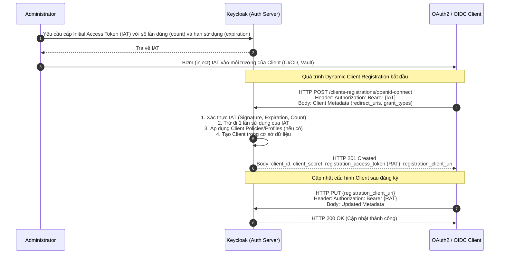

> [!NOTE]
> **Category:** Theory (Lý thuyết)
> **Goal:** Hiểu rõ cơ chế đăng ký Client động (Dynamic Client Registration) theo tiêu chuẩn OAuth 2.0 (RFC 7591) và cách thức Keycloak triển khai để tự động hóa việc quản lý Client trong các hệ thống phân tán quy mô lớn.

## 1. Lý thuyết chuyên sâu (Detailed Theory)

Dynamic Client Registration (DCR) là một cơ chuẩn hóa (được định nghĩa trong RFC 7591) cho phép các ứng dụng (Client) tự động đăng ký bản thân với Authorization Server (Keycloak) mà không cần sự can thiệp thủ công của quản trị viên (Admin) thông qua giao diện người dùng (UI).

Trong các hệ thống phân tán hiện đại, đặc biệt là kiến trúc Microservices hoặc mô hình Multi-tenant SaaS, số lượng ứng dụng con (Client) có thể lên tới hàng ngàn và liên tục thay đổi (scale up/down). Việc Admin phải thao tác thủ công để tạo Client ID, cấu hình Redirect URIs và lấy Client Secret cho từng ứng dụng là không khả thi, dễ gây nút thắt cổ chai (bottleneck) và sai sót.

DCR giải quyết bài toán trên bằng cách cung cấp một **Registration Endpoint** chuẩn hóa. Các ứng dụng có thể gọi API (HTTP POST) với một tải trọng JSON (JSON payload) chứa các siêu dữ liệu (metadata) của mình (ví dụ: `client_name`, `redirect_uris`, `grant_types`). Authorization Server sẽ tự động cấp phát `client_id`, tạo `client_secret` (nếu cần) và phản hồi lại cho ứng dụng.

Keycloak hỗ trợ nhiều phương thức xác thực cho DCR:
- **Anonymous Access**: Bất kỳ ai cũng có thể gọi endpoint để tạo Client. Phương pháp này cực kỳ nguy hiểm và thường bị vô hiệu hóa trong môi trường Production.
- **Initial Access Token (IAT)**: Một mã thông báo (token) đặc biệt do Admin tạo trước, có thời hạn và số lần sử dụng giới hạn, được Client dùng làm Bearer token khi gọi Registration Endpoint.
- **Bearer Token**: Sử dụng Access Token thông thường có chứa các quyền quản trị (Admin role) phù hợp.

Ngoài ra, sau khi đăng ký thành công, Keycloak trả về một **Registration Access Token (RAT)**. Token này dùng để Client tự động cập nhật, đọc (Read) hoặc xóa (Delete) cấu hình của chính mình sau này (theo RFC 7592).

## 2. Luồng nội bộ & Cơ chế cấp thấp (Internal Workflow & Low-level Mechanisms)

Dưới đây là luồng hoạt động cấp thấp của quá trình đăng ký ứng dụng tự động bằng phương pháp **Initial Access Token (IAT)**.



**Giải thích chi tiết các bước cấp thấp:**
1. **Xác thực yêu cầu:** Khi Keycloak nhận được HTTP POST tại endpoint đăng ký, nó sẽ kiểm tra Header `Authorization`. IAT thực chất là một JWT (JSON Web Token) được ký điện tử bởi Realm của Keycloak. Keycloak sẽ verify chữ ký, kiểm tra claim `exp` (hạn dùng) và đối chiếu với cơ sở dữ liệu xem token này còn lượt sử dụng không.
2. **Kiểm duyệt (Validation):** Keycloak duyệt qua JSON payload (Client metadata). Ở giai đoạn này, các **Client Registration Policies** (ví dụ: chỉ cho phép `https` trong redirect URI, cấm sử dụng `password` grant) sẽ được thực thi. Nếu vi phạm, luồng bị hủy bỏ ngay lập tức (HTTP 400).
3. **Sinh định danh:** Keycloak tạo một UUID (Universally Unique Identifier) ngẫu nhiên làm UUID nội bộ, đồng thời sinh `client_id` (nếu Client không yêu cầu ID cụ thể). Tùy thuộc vào loại Client (Confidential hay Public), một `client_secret` có thể được sinh ra bằng máy phát số ngẫu nhiên an toàn tiền điện tử (Cryptographically Secure Pseudo-Random Number Generator - CSPRNG).
4. **Cấp RAT (Registration Access Token):** Keycloak tự động cấp một JWT đặc biệt (RAT) trói buộc với `client_id` vừa tạo. Token này có tính toàn vẹn (integrity) cao và cho phép ứng dụng tự quản lý vòng đời (lifecycle) của nó trên Keycloak mà không cần can thiệp từ Admin.

## 3. Thực hành tốt nhất & Bảo mật (Best Practices & Security)

> [!CAUTION]
> Tuyệt đối KHÔNG BẬT "Anonymous Access" cho Dynamic Client Registration trên môi trường Production. Kẻ tấn công có thể spam hàng triệu Client giả mạo làm cạn kiệt tài nguyên cơ sở dữ liệu (Denial of Service - DoS) và làm chậm hệ thống.

> [!IMPORTANT]
> - **Sử dụng Initial Access Token (IAT):** Luôn giới hạn thời gian sống (TTL - Time to Live) của IAT ở mức tối thiểu cần thiết để CI/CD pipeline chạy xong, và thiết lập `count` (số lượt sử dụng) chính xác bằng số lượng Client cần tạo.
> - **Áp dụng Client Policies:** Bạn PHẢI thiết lập "OIDC Client Registration Policies". Ví dụ: Ép buộc tất cả Client tự động tạo phải có "Consent Required" bật lên, giới hạn cấu hình "Trusted Hosts" (chỉ cho phép Redirect URIs trỏ về domain của công ty như `*.mycompany.com`), và bắt buộc giao thức HTTPS.
> - **Bảo vệ Registration Access Token (RAT):** Ứng dụng phải lưu trữ RAT an toàn tương đương với cách nó lưu trữ `client_secret`. Nếu RAT bị lộ, kẻ tấn công có thể thay đổi `redirect_uris` để đánh cắp Authorization Codes của người dùng.

## 4. Cấu hình minh họa thực tế (Configuration Examples)

Ví dụ dưới đây minh họa việc sử dụng `curl` để gọi Registration Endpoint của Keycloak nhằm tạo một OIDC Client tự động, sử dụng Initial Access Token (IAT).

```bash
# Biến môi trường
KEYCLOAK_URL="https://sso.example.com"
REALM="my-realm"
INITIAL_ACCESS_TOKEN="eyJhbGciOiJSUz..." # Token lấy từ Keycloak Admin Console

# Payload (Client Metadata)
CLIENT_METADATA='{
  "client_name": "My Auto-Scaling Microservice",
  "redirect_uris": [
    "https://service-a.example.com/login/oauth2/code/keycloak"
  ],
  "grant_types": [
    "authorization_code",
    "refresh_token"
  ],
  "response_types": [
    "code"
  ],
  "token_endpoint_auth_method": "client_secret_basic"
}'

# Gửi HTTP POST request tới Registration Endpoint
curl -X POST "$KEYCLOAK_URL/realms/$REALM/clients-registrations/openid-connect" \
     -H "Authorization: Bearer $INITIAL_ACCESS_TOKEN" \
     -H "Content-Type: application/json" \
     -d "$CLIENT_METADATA"
```

**Mẫu kết quả trả về (HTTP 201 Created):**
```json
{
  "client_id": "8f3e2b1a-4c5d-6e7f-8a9b-0c1d2e3f4a5b",
  "client_secret": "aBcD1eFg...XyZ",
  "client_id_issued_at": 1672531200,
  "client_secret_expires_at": 0,
  "registration_access_token": "eyJhbGciOiJSUz...",
  "registration_client_uri": "https://sso.example.com/realms/my-realm/clients-registrations/openid-connect/8f3e2b1a-4c5d-6e7f-8a9b-0c1d2e3f4a5b",
  "client_name": "My Auto-Scaling Microservice",
  "redirect_uris": ["https://service-a.example.com/login/oauth2/code/keycloak"]
}
```

## 5. Trường hợp ngoại lệ (Edge Cases)

- **IAT hết hạn hoặc hết lượt sử dụng (Expired/Exhausted IAT):** Khi CI/CD cố gắng dùng một IAT đã vượt qua `count` giới hạn hoặc quá thời gian, Keycloak sẽ trả về HTTP `401 Unauthorized`. *Khắc phục:* Hệ thống automation (như Terraform, Ansible) phải gọi Admin API để lấy một IAT mới trước quá trình triển khai (deploy).
- **Vi phạm Client Policies:** Nếu Payload có chứa cấu hình bị cấm (ví dụ: `grant_types` chứa `password` trong khi Policy chỉ cho phép `authorization_code`), Keycloak sẽ phản hồi HTTP `400 Bad Request` kèm theo lỗi chi tiết. *Khắc phục:* Kiểm tra và điều chỉnh metadata trước khi gửi để tuân thủ chính sách bảo mật của Realm.
- **Quên Registration Access Token (RAT):** Nếu ứng dụng khởi động lại và mất RAT trong bộ nhớ (memory), nó sẽ không thể cập nhật cấu hình trên Keycloak thông qua Registration Endpoint nữa. *Khắc phục:* Admin phải cung cấp một RAT mới thông qua Admin Console hoặc Admin API, hoặc ứng dụng phải được thiết kế để yêu cầu cấp phát Client mới hoàn toàn (nhưng việc này sinh ra "rác" trong database).

## 6. Câu hỏi Phỏng vấn (Interview Questions)

1. **(Junior)** Dynamic Client Registration (DCR) giải quyết bài toán gì so với việc tạo Client trên giao diện Admin?
   - *Đáp án:* DCR cho phép tự động hóa việc đăng ký Client. Cực kỳ hữu ích trong môi trường microservices, nơi các services liên tục scale up/down hoặc khi hệ thống cấp phát phần mềm tự động (SaaS) cần tạo môi trường độc lập cho khách hàng mới mà không cần thao tác tay của con người.
2. **(Junior)** Initial Access Token (IAT) trong Keycloak dùng để làm gì?
   - *Đáp án:* IAT là mã thông báo dùng một hoặc nhiều lần để chứng minh ủy quyền với Registration Endpoint. Thay vì mở DCR cho tất cả mọi người, IAT đảm bảo chỉ những tiến trình (như CI/CD pipelines) được ủy quyền mới có thể tạo Client mới.
3. **(Senior)** Registration Access Token (RAT) khác gì so với Initial Access Token (IAT)?
   - *Đáp án:* IAT được cấp trước, dùng để *tạo mới* (Create) Client. Trong khi RAT được cấp lại trong phản hồi tạo mới thành công, trói buộc chặt chẽ với Client vừa tạo và dùng để *quản lý (đọc, cập nhật, xóa)* (Read, Update, Delete) duy nhất cấu hình của Client đó sau này.
4. **(Senior)** Làm thế nào để đảm bảo rằng các Client được đăng ký thông qua DCR không vi phạm tiêu chuẩn bảo mật của công ty (ví dụ: cấm Implicit Flow, yêu cầu HTTPS)?
   - *Đáp án:* Sử dụng tính năng "OIDC Client Registration Policies" trong Keycloak. Quản trị viên có thể cấu hình các rào chắn (guardrails) và bộ lọc (filters) tại Registration Endpoint. Bất kỳ request tạo Client nào vi phạm Policy sẽ bị từ chối với mã lỗi HTTP 400.
5. **(Senior)** Hậu quả của việc kích hoạt "Anonymous Client Registration" là gì và bạn sẽ bảo vệ Keycloak như thế nào nếu bắt buộc phải dùng nó?
   - *Đáp án:* Kích hoạt Anonymous DCR mở ra lỗ hổng DoS (Denial of Service) và làm cạn kiệt tài nguyên cơ sở dữ liệu khi hacker viết script tạo hàng ngàn Client. Nếu bắt buộc sử dụng (ví dụ cho mô hình mobile apps mở), ta phải kết hợp với WAF (Web Application Firewall) để Rate Limiting theo IP, thiết lập Client Policies cực kỳ nghiêm ngặt, và thiết lập cơ chế dọn dẹp định kỳ (Garbage Collection) cho các Client không phát sinh giao dịch.

## 7. Tài liệu tham khảo (References)
- [RFC 7591: OAuth 2.0 Dynamic Client Registration Protocol](https://datatracker.ietf.org/doc/html/rfc7591)
- [RFC 7592: OAuth 2.0 Dynamic Client Registration Management Protocol](https://datatracker.ietf.org/doc/html/rfc7592)
- [Keycloak Documentation: Client Registration](https://www.keycloak.org/docs/latest/securing_apps/#_client_registration)
