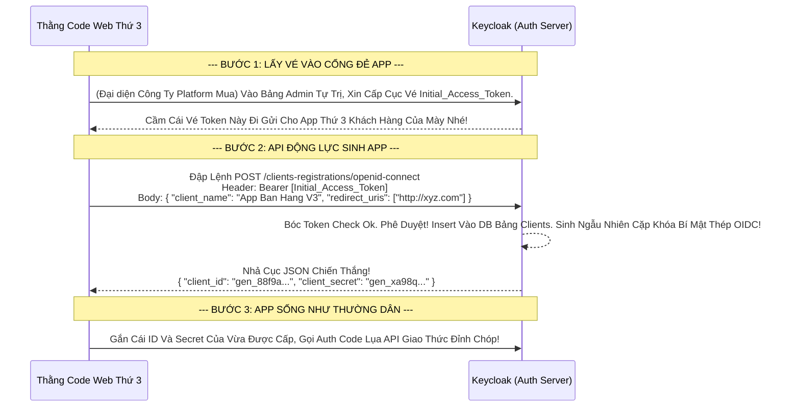

# Lesson 11: Mầm Sống Tự Động (Dynamic Client Registration)

> [!NOTE]
> **Category:** Theory (Lý thuyết)
> **Goal:** Lâu nay, để tạo một Ứng Dụng (Client) trên Keycloak, bạn phải Mở màn hình Admin Console, dùng chuột Bấm Nút Create, nhập tên Client ID lằng nhằng. Thế nếu sếp mở công ty dạng Platform như Shopify, mỗi ngày có 100 ông Khách Hàng tự viết App cắm vào hệ thống thì chả lẽ bạn đi Click chuột 100 lần? Chuẩn **Dynamic Client Registration (DCR)** ra đời để cấp năng lực tự sinh sản đẻ ra Client mà không cần dính dáng con người!

## 1. Lý thuyết chuyên sâu (Detailed Theory)

### 1.1. Dynamic Client Registration (DCR) Là Gì?
Được quy định trong RFC 7591. Nó là một luồng (Endpoint) đặc biệt trên Keycloak cho phép một Ứng Dụng Bên Ngoài Gửi Lệnh POST API Dội Vào Keycloak, Mang Theo 1 Cục JSON Chứa Tên App, Hình Ảnh App, Link CallBack.
- Khi Keycloak Bắt Được Khối Lệnh Đó, Nó Sẽ TỰ ĐỘNG Sinh Ra 1 Cái **Client** mới trong cấu trúc Database Realm Của Nó.
- Sau Khi Sinh Xong, Nó Lập Tức Nhả Ngược Về Chữ Chóp Lụa Bao Gồm 1 Cái `Client_ID` Và 1 Cái `Client_Secret` Mới Tinh Hoàn Toàn Trắng Bóc Cho Cái App Vừa Gõ Cửa Kia Bắt Lấy Mà Khởi Động OIDC Oanh Cáp!

### 1.2. Tính Năng Quyền Năng Nhưng Cũng Là Lưỡi Dao Tử Thần
Vì nó cho phép "Người ngoài tự đẻ thêm Cửa Nhập App" vào trong bụng Keycloak, nên DCR tiềm ẩn nguy cơ bảo mật rác lưới máy chủ Khủng Khiếp nếu mở hớ hênh.
Keycloak cung cấp 2 chế độ mở cổng DCR Mạch Trọng:
1. **Unauthenticated Request (Đăng Ký Vô Danh - Đừng Bao Giờ Mở Cờ Này):** Bất cứ ai trên mạng Internet đập lệnh vào đều đẻ ra 1 Client. Hacker chạy vòng lặp While sinh ra 1 Tỷ Client rác trong 1 giờ làm tràn RAM Đáy DB Sập OOM Khung Lãnh Chúa!
2. **Authenticated Request (Đăng Ký Phải Có Token Admin Hoặc Initial Access Token):** Khách Hàng (App) muốn gọi API Tự Đăng Ký, Bắt Buộc Phải Lấy 1 cái Token Sinh Sẵn Có Hạn Dùng Khống Chế Gọi Mạch Rỗng (Initial Access Token). Cực Kỳ An Toàn, Tạo App Lõi Đáy Oanh Chóp Kéo Lụa!

---

## 2. Luồng nội bộ & Cơ chế cấp thấp (Internal Workflow & Low-level Mechanisms)

Hành Trình OIDC Hạt Giống Nảy Mầm Sinh Sản Ứng Dụng Client Động Cơ Đáy Mạng:



---

## 3. Thực hành tốt nhất & Bảo mật (Best Practices & Security)

> [!IMPORTANT]
> **Tuyệt Đỉnh Tẩy Khách Mạng Bọc (Chống DDOS Tràn App Bằng Cột Chặn Initial Access Token Kính Lụa)**
> **Tội Ác Thiết Kế:** Bạn muốn làm chức năng Mạng Xã Hội, cho phép lập trình viên tự tạo App trên Platform Của Bạn. Bạn mở cổng DCR Vô Danh Trượt API.
> **Hậu Quả:** Một Đội Botnet Phát Hiện Ra. Nó nã liên thanh 5000 App Mới vào bảng Clients của Keycloak. Keycloak sinh Object, sinh Secret Hash băm nát CPU Gục Bàn. Realm của bạn chứa 5000 cái Client rác làm màn hình Admin Console mở lên bị đơ trắng bóc sụp đổ hệ thống (Memory Bound Issue).
> **Biện Pháp Sống Còn Lớp Trọng:** Vào Menu **Realm Settings** -> Tab **Client Registration**. 
> - Xóa sổ toàn bộ Cờ Nhựa Của Unauthenticated Access.
> - Bấm Nút **`Initial Access Tokens`** -> Ấn Create Đẻ ra một Cục Token Vàng Dành Riêng Cho Đăng Ký. 
> - Bạn Chỉnh Thiết Lập Siết Răng Kín Của Cục Token Này Là: **`Expiration: 1 Ngày`** VÀ **`Count (Số Lượt Đẻ): Đúng 1 Lần`**. 
> Bằng Cách Này, Quăng Cái Thẻ Cho Dev Khách. Nó Nhấn Đẻ Được Đúng 1 Cái Client Là Thẻ Rác Bị Hủy Lực Tĩnh Oanh Khung Dịch Lụa API Cắt Đứt Nối Tương Lai Mạch Bơm Sống Rác Khủng! Tuyệt Mật Hoàn Hảo!

---

## 4. Cấu hình minh họa thực tế (Configuration Examples)

Lắp Ráp Cấu Hình Cho Client Sinh Sản Bằng Lệnh DCR cURL Lõi Mạch Đáy:
1. Bạn Bật Tính Năng Tĩnh `Initial Access Tokens` ở Tab Settings của Client Registration như trên.
2. Bạn Bốc Cái Chuỗi Dài Loằng Ngoằng JWT Initial Token Đó Vào Biến `$IAT_TOKEN`.
3. Khách Hàng (App) Sẽ Dội Cấu Trúc JSON Định Dạng OIDC Chuẩn Vào Lệnh cURL Nhanh:
```bash
curl -X POST "http://localhost:8080/realms/master/clients-registrations/openid-connect" \
     -H "Authorization: Bearer $IAT_TOKEN" \
     -H "Content-Type: application/json" \
     -d '{
           "client_name": "Siêu App Mới Đẻ",
           "redirect_uris": [ "https://app.moi.com/callback" ],
           "token_endpoint_auth_method": "client_secret_basic"
         }'
```
4. Đọc Kỹ Cái Cục Trả Về (Response). Chóp Mạch Lõi Sẽ In Ra Màn Hình Khớp Lệnh `client_id` (Tên Định Danh Khách OIDC) Và Cái Mạch Quan Trọng Khóa Rương `client_secret` Không Thể Xin Cấp Lại Lần 2 Kéo Lụa!

---

## 5. Câu hỏi Phỏng vấn (Interview Questions)

**1. Trong Giao Thức RFC 7591 DCR Này, Tại Sao Các Thuộc Tính Của JSON Bơm POST Vào Gọi DCR (VD: 'client_name', 'redirect_uris') Lại Dùng Ký Tự Gạch Dưới Snake_Case Mà Không Phải Chuẩn CamelCase Của Java Keycloak Cũ Mạch Đáy Lụa Oanh Bọc?**
- **Senior:** Dạ thưa sếp, Vì Luồng Registration Client Là Khối Lệnh Chịu Chi Phối Trực Tiếp Từ Tài Liệu OIDC Core Và RFC Mạch Oanh Giao Dịch Chuẩn Hóa!
  - Keycloak Thiết Kế Đáy Mạng Rất Thông Minh Tôn Trọng Tuyệt Đối Dữ Liệu Ngoại Lai.
  - Chuẩn Liên minh Bảo Mật OAuth/OIDC Thế Giới Sử dụng Quy Ước Đặt Tên JSON (Payload Keys) Hoàn Toàn Bằng Snake_Case. Do Đó Endpoint `/clients-registrations/openid-connect` Của Máy Chủ Bắt Buộc Phải Nuốt Bộ Lệnh JSON Thuần Snake_Case Mới Hiểu Khớp Mạch Dữ Cốt Rỗng API Lụa! 
  - (Nếu Cậu Đạp Nhầm CamelCase Kiểu Java Dội Xuống Bụng Bọc Cấu Trúc Bức Khung Keycloak Sẽ Báo `400 Bad Request Missing Invalid Field` Tự Biến Mất Cắt Trắng Đứt Rỗng Lệnh Chóp Rút).

---

## 6. Tài liệu tham khảo (References)
- **RFC 7591:** OAuth 2.0 Dynamic Client Registration Protocol.
- **Keycloak Documentation:** Client Registration.
