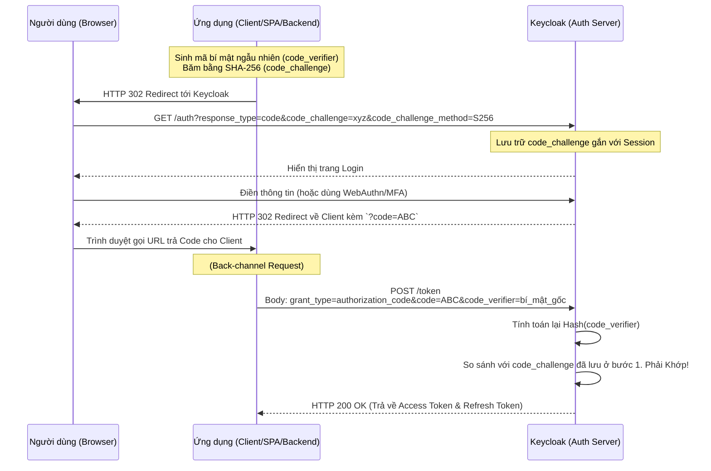

> [!NOTE]
> **Category:** Theory (Lý thuyết)
> **Goal:** Nghiên cứu tài liệu Thực hành Tốt nhất và Bảo mật Hiện tại (Security Best Current Practice - BCP) của IETF dành cho OAuth 2.0. Hiểu tại sao các chuẩn gốc (RFC 6749) bị loại bỏ một phần và cách cấu hình Keycloak để tuân thủ các quy chuẩn khắt khe nhất của thế giới Enterprise.

## 1. Lý thuyết chuyên sâu (Detailed Theory)

Giao thức OAuth 2.0 (RFC 6749) được phát hành vào năm 2012. Kể từ đó, vô số các kiểu tấn công mới trên trình duyệt (Browser) và thiết bị di động (Mobile) đã được phát hiện. Những thiết kế từng được coi là an toàn vào năm 2012 nay đã trở thành lỗ hổng chí mạng.

Để vá các lỗ hổng này, IETF đã phát hành tài liệu **OAuth 2.0 Security Best Current Practice (BCP)** (Bản nháp liên tục được cập nhật thành chuẩn mới). BCP không tạo ra giao thức mới mà **loại bỏ** các tính năng kém an toàn của bản gốc và **bắt buộc** áp dụng các biện pháp bổ sung.

### Những thay đổi cốt lõi của BCP so với RFC 6749 gốc:
1. **Khai tử Implicit Grant:** Luồng ngầm định trả Access Token trực tiếp trên URL từng dùng cho các ứng dụng Single Page Application (SPA). Nay bị cấm hoàn toàn vì rủi ro lộ lọt token qua lịch sử trình duyệt và XSS.
2. **Khai tử Resource Owner Password Credentials Grant (ROPGC):** Tuyệt đối cấm Client xin trực tiếp Username/Password của người dùng. Mọi giao dịch phải qua trình duyệt (Browser redirect) của Authorization Server.
3. **PKCE là Bắt buộc (Mandatory PKCE):** Trước đây PKCE (Proof Key for Code Exchange) chỉ dành cho Mobile App (Public Client). BCP hiện tại yêu cầu **MỌI** Client (kể cả Web App có Backend/Confidential Client) đều phải sử dụng PKCE để chống tấn công Authorization Code Injection.
4. **Exact Redirect URI Matching:** Khớp chính xác hoàn toàn đường dẫn trả về. Không cho phép sử dụng Wildcard (`*`) ở thư mục con hay query parameters trong cấu hình Redirect URI.

---

## 2. Luồng nội bộ & Cơ chế cấp thấp (Internal Workflow & Low-level Mechanisms)

Sơ đồ dưới đây minh họa luồng **Authorization Code + PKCE**, tiêu chuẩn Bắt buộc duy nhất hiện tại cho các ứng dụng tương tác với người dùng.

**Mục tiêu của luồng:** Ngay cả khi Hacker chặn bắt (Intercept) được `code=ABC` và bí mật của hệ thống `Client Secret` bị lộ, Hacker vẫn không thể lấy được Token vì Hacker không sở hữu `code_verifier` (nó được lưu động trong bộ nhớ đệm của App tại thời điểm đó).

---

## 3. Thực hành tốt nhất & Bảo mật (Best Practices & Security)

> [!CAUTION]
> **Hủy bỏ hoàn toàn Mật khẩu qua API**
> Tuyệt đối không dùng API `grant_type=password` trong Keycloak. Dù bạn là ứng dụng nội bộ (First-party application), việc ứng dụng chạm vào mật khẩu của người dùng phá vỡ hoàn toàn kiến trúc Single Sign-On (SSO) và ngăn cản việc triển khai Xác thực đa yếu tố (MFA - OTP, FIDO2).

> [!TIP]
> **Bảo mật kênh truyền mạnh mẽ với mTLS (Mutual TLS)**
> BCP khuyến nghị ở cấp độ Enterprise (như Ngân hàng/Tài chính), Client gửi request lấy Token không nên dùng chuỗi `client_secret` (vì nó tĩnh và dễ lộ). Thay vào đó, sử dụng **mTLS (Chứng chỉ số 2 chiều)** hoặc **Private Key JWT (Client Assertion)** để xác thực Client với Keycloak.

> [!WARNING]
> **Giới hạn phạm vi (Scope) và Thời gian sống (TTL)**
> Access Token phải có thời gian sống càng ngắn càng tốt (ví dụ: 5 phút). Quyền hạn trong Token (Scopes) phải được cấp tối thiểu (Principle of Least Privilege). Đừng cấp một Token với quyền Admin cho một ứng dụng chỉ cần quyền đọc Profile.

---

## 4. Cấu hình minh họa thực tế (Configuration Examples)

Để áp dụng BCP vào một ứng dụng Frontend/Backend trong Keycloak:

1. **Realm Settings -> Security Defenses:** 
   - Đảm bảo `Content-Security-Policy (CSP)` và `Strict-Transport-Security (HSTS)` được cấu hình đầy đủ.
2. **Cấu hình Client (Clients -> your-client -> Settings):**
   - **Valid Redirect URIs:** Cấu hình **chính xác tuyệt đối**. Ví dụ: `https://app.example.com/callback` (Không dùng `https://app.example.com/*`).
   - **Capability config:** 
     - `Client authentication`: **ON** (Nếu có backend bảo mật), **OFF** (Nếu là SPA/Mobile).
     - `Standard flow`: **ON** (Authorization code).
     - `Implicit flow`: **OFF** (Tuyệt đối không bật).
     - `Direct access grants`: **OFF** (Tắt Password Grant).
   - **Advanced Settings:**
     - `Proof Key for Code Exchange Code Challenge Method`: Chọn **S256** (Tuyệt đối không dùng `plain` hoặc để trống). Điều này bắt buộc ứng dụng phải gửi `code_challenge`.

---

## 5. Trường hợp ngoại lệ (Edge Cases)

### Hệ thống SPA cũ không thể bảo mật Token (Lỗ hổng Local Storage)
- **Sự cố:** Các ứng dụng React/Angular cũ thường nhận Token và lưu vào `localStorage` của trình duyệt. Theo BCP hiện đại, mọi dữ liệu ở `localStorage` đều có thể bị đánh cắp bởi mã độc XSS (Cross-Site Scripting).
- **Cách khắc phục:** Áp dụng kiến trúc **BFF (Backend for Frontend)**. SPA chỉ giao tiếp với Backend qua Cookie được đánh dấu `HttpOnly, Secure, SameSite=Strict`. Backend (chạy NodeJS, Spring Boot) sẽ đóng vai trò là OAuth2 Client (giữ Token trong RAM hoặc Redis) và proxy request lên Resource Server (gắn Token vào Header). SPA không bao giờ nhìn thấy Access Token.

---

## 6. Câu hỏi Phỏng vấn (Interview Questions)

1. **Tại sao OAuth 2.0 BCP lại "khai tử" Implicit Grant? Nó từng là tiêu chuẩn cho SPA cơ mà?**
   - *Junior:* Vì nó trả token thẳng trên thanh URL, ai nhìn vào lịch sử duyệt web cũng thấy, rất dễ bị lộ.
   - *Senior:* Luồng ngầm định dựa trên URI Fragment (`#token=...`), khiến trình duyệt vô tình lưu vết trên nhiều lớp (History, Referrer header) và rất nhạy cảm với tấn công XSS. Hơn nữa, nó không có cơ chế xác thực server (Server Authentication), làm tăng nguy cơ Token Injection. BCP thay thế nó bằng Authorization Code + PKCE.

2. **PKCE ban đầu được thiết kế cho Mobile App, tại sao BCP yêu cầu Backend Server (Confidential Client) cũng phải dùng?**
   - *Senior:* Dù Backend có giữ được `client_secret` bí mật, hacker vẫn có thể thực hiện **Authorization Code Injection Attack**. Hacker tự login vào tài khoản của hacker trên máy của hắn, lấy `code` hợp lệ, chặn đường truyền và tiêm `code` đó vào request của nạn nhân. PKCE khóa chặt `code` với phiên giao dịch trên trình duyệt của nạn nhân thông qua `verifier`. Do Hacker sinh `code` ở máy hắn (verifier của hacker) nhưng tiêm vào máy nạn nhân (verifier của nạn nhân), Keycloak sẽ phát hiện lỗi băm (hash mismatch) và từ chối.

3. **Client Assertion (Private Key JWT) bảo mật hơn Client Secret ở điểm nào?**
   - *Senior:* `client_secret` là một chuỗi văn bản tĩnh gửi qua mạng, dễ bị lộ trên Log, hoặc nhân viên cũ mang đi. Private Key JWT sử dụng kỹ thuật mã hóa phi đối xứng. Client giữ Private Key an toàn trong Hardware Security Module (HSM) hoặc Vault, dùng nó để Ký (Sign) một JWT ngắn hạn (ví dụ 60s) và gửi lên Keycloak. Keycloak xác thực bằng Public Key. Không có bí mật tĩnh nào được truyền qua mạng.

4. **Wildcard trong Redirect URI gây ra hậu quả gì?**
   - *Junior:* Hacker có thể chuyển hướng token về trang web của họ.
   - *Senior:* Open Redirect Attack. Nếu Keycloak cho phép `https://example.com/*`, hacker có thể lừa Keycloak chuyển hướng về `https://example.com/forum/post/123` (nơi hacker kiểm soát nội dung). Hơn nữa, hacker có thể nối thêm query parameter hoặc dùng đường dẫn Path Traversal để đánh cắp Token/Code ngay trên miền của ứng dụng hợp lệ.

5. **Giải pháp nào tối ưu nhất theo BCP để lưu trữ Token trong trình duyệt?**
   - *Senior:* Câu trả lời của BCP là: **Không lưu Token trong trình duyệt**. Token không nên tồn tại ở môi trường Front-end (React/Vue). Sử dụng mô hình BFF (Backend-for-Frontend) làm trung gian (Token Handler) và chỉ phát hành `HttpOnly, Secure Cookie` cho trình duyệt để quản lý phiên bản (Session).

---

## 7. Tài liệu tham khảo (References)

- [OAuth 2.0 Security Best Current Practice (BCP) - IETF Draft/Standard](https://datatracker.ietf.org/doc/html/draft-ietf-oauth-security-topics)
- [RFC 7636 - Proof Key for Code Exchange by OAuth Public Clients](https://datatracker.ietf.org/doc/html/rfc7636)
- [OWASP OAuth 2.0 Threat Model](https://cheatsheetseries.owasp.org/cheatsheets/OAuth2_Threat_Model_and_Security_Considerations.html)
