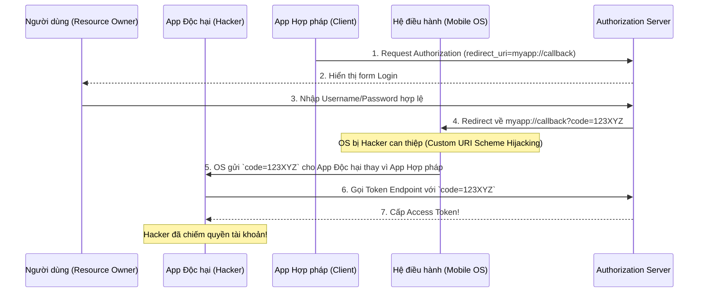

> [!NOTE]
> **Category:** Theory (Lý thuyết)
> **Goal:** Phân tích mô hình các mối đe dọa an ninh (Threat Model) đối với OAuth 2.0 dựa trên tiêu chuẩn RFC 6819. Hiểu sâu các hình thức tấn công vào quy trình ủy quyền và cách áp dụng các biện pháp phòng vệ thực tiễn trong cấu hình Keycloak.

## 1. Lý thuyết chuyên sâu (Detailed Theory)

Giao thức OAuth 2.0 ban đầu được thiết kế linh hoạt nhưng lại không chứa sẵn nhiều lớp bảo mật mặc định ngoài việc phụ thuộc vào TLS/SSL. **RFC 6819 (OAuth 2.0 Threat Model and Security Considerations)** ra đời để liệt kê và phân tích các vectơ tấn công (attack vectors) có thể xảy ra trong luồng ủy quyền.

### Các ranh giới niềm tin (Trust Boundaries)
Mô hình rủi ro xoay quanh việc truyền dữ liệu nhạy cảm (Authorization Code, Access Token, Refresh Token) đi qua các khu vực không tin cậy. Các khu vực này bao gồm:
1. **Trình duyệt của người dùng (User-Agent):** Dễ bị mã độc (Malware), XSS (Cross-Site Scripting), hoặc các tiện ích mở rộng (Extensions) đánh cắp dữ liệu.
2. **Mạng truyền dẫn (Network):** Dễ bị nghe lén (Eavesdropping), tấn công Man-in-the-Middle (MitM) trên mạng Wi-Fi công cộng.
3. **Ứng dụng của bên thứ ba (Client Application):** Mã nguồn có thể chứa lỗ hổng rò rỉ bí mật (Client Secret Leak), hoặc bản thân Client là một ứng dụng độc hại giả mạo (Phishing Client).

### Các loại tấn công phổ biến theo RFC 6819:
- **Token Theft (Đánh cắp Token):** Lấy được Access Token từ cơ sở dữ liệu của Client bị lỗi hoặc do Token bị ghi vào Log files.
- **Authorization Code Interception:** Đánh cắp mã ủy quyền (Code) trên đường truyền hoặc thông qua các lỗ hổng của hệ điều hành Mobile (Custom URL Scheme hijacking).
- **Cross-Site Request Forgery (CSRF):** Ép người dùng gửi một request ủy quyền ngoài ý muốn để gắn tài khoản của kẻ tấn công vào ứng dụng của nạn nhân.
- **Phishing & Clickjacking:** Dụ dỗ người dùng nhập mật khẩu vào một trang đăng nhập giả mạo, hoặc nhúng trang đăng nhập thật vào một `iframe` ẩn.

---

## 2. Luồng nội bộ & Cơ chế cấp thấp (Internal Workflow & Low-level Mechanisms)

Dưới đây là sơ đồ mô tả cơ chế tấn công **Authorization Code Interception** trên ứng dụng di động (Mobile App) và cách nó vượt qua bảo mật nếu không có PKCE.

**Bản chất:** Vì Mobile App không thể giữ bí mật (không có Client Secret), bất kỳ ai lấy được `Code` đều có thể đổi lấy `Token`. 
**Giải pháp:** Sử dụng PKCE (Proof Key for Code Exchange). Khi dùng PKCE, App hợp pháp sinh ra một `code_verifier` ngẫu nhiên. Khi Hacker lấy được Code, hắn không có `code_verifier` nên Keycloak sẽ từ chối đổi Token.

---

## 3. Thực hành tốt nhất & Bảo mật (Best Practices & Security)

> [!IMPORTANT]
> **Bắt buộc sử dụng PKCE cho MỌI loại Client**
> Mặc dù ban đầu PKCE chỉ dành cho Public Clients (Mobile, SPA), hiện tại các tiêu chuẩn bảo mật tối tân (BCP) yêu cầu áp dụng PKCE cho cả Confidential Clients. Điều này chặn đứng hoàn toàn việc tấn công tiêm mã (Code Injection) do đánh cắp Code từ server logs.

> [!CAUTION]
> **Không sử dụng Luồng ngầm định (Implicit Grant)**
> Implicit Grant trả thẳng Access Token về URL (URI Fragment `#access_token=...`), khiến Token hiển thị ngay trên History của trình duyệt và dễ bị các mã độc JavaScript (XSS) đọc được. Tuyệt đối vô hiệu hóa luồng này và chuyển sang `Authorization Code + PKCE`.

> [!WARNING]
> **Phòng chống CSRF bằng `state` parameter**
> Luôn luôn sinh ra một mã `state` ngẫu nhiên và mã hóa nó kèm theo session cục bộ trước khi chuyển hướng người dùng đến Keycloak. Khi Keycloak trả về, Client phải xác minh `state` khớp để đảm bảo luồng ủy quyền này do chính người dùng chủ động khởi xướng.

---

## 4. Cấu hình minh họa thực tế (Configuration Examples)

Để giảm thiểu rủi ro theo Threat Model, dưới đây là cách cấu hình Keycloak Client cho ứng dụng Front-end an toàn nhất:

1. **Vô hiệu hóa Implicit Flow:**
   - Trong Admin Console -> `Clients` -> Chọn client của bạn.
   - Tại phần `Capability config`, **Tắt (OFF)** nút gạt `Implicit flow`.
   - Đảm bảo `Standard flow` (Authorization Code) đang BẬT.

2. **Bắt buộc áp dụng PKCE (Phòng chống Code Interception):**
   - Chuyển sang tab `Advanced`.
   - Tìm mục `Advanced Settings` -> `Proof Key for Code Exchange Code Challenge Method`.
   - Đổi giá trị thành `S256` (Tuyệt đối không dùng `plain` hoặc để trống).

3. **Ngăn chặn Clickjacking (X-Frame-Options):**
   - Keycloak mặc định bảo vệ trang đăng nhập bằng cách chặn nhúng trang (embedding).
   - Kiểm tra tab `Realm Settings` -> `Security Defenses` -> `X-Frame-Options` phải được đặt là `SAMEORIGIN` hoặc `DENY`.

---

## 5. Trường hợp ngoại lệ (Edge Cases)

### Lộ lọt Client Secret trên Public Repository (GitHub)
- **Sự cố:** Lập trình viên vô tình commit mã nguồn có chứa `client_secret` của một Confidential Client lên GitHub. Bot quét mã độc lấy được Secret và sử dụng nó để gọi API của Keycloak giả mạo Client.
- **Cách xử lý:** 
  1. Ngay lập tức đăng nhập Keycloak -> `Clients` -> `Credentials`.
  2. Bấm nút **Regenerate Secret** để hủy Secret cũ.
  3. Cấu hình lại ứng dụng.
  4. Xem xét chuyển sang sử dụng mô hình xác thực mạnh hơn bằng Khóa công khai (Signed JWT / Client Assertion) thay vì dùng chuỗi Secret tĩnh.

---

## 6. Câu hỏi Phỏng vấn (Interview Questions)

1. **Phân biệt rủi ro bảo mật giữa Access Token và Authorization Code.**
   - *Junior:* Access Token giống như chìa khóa nhà, có thể mở cửa ngay lập tức. Authorization Code chỉ là giấy hẹn, phải đổi lấy chìa khóa.
   - *Senior:* Access Token mang tính Bearer (ai cầm cũng dùng được), rủi ro cao nếu lộ qua mạng. Authorization Code an toàn hơn vì nó dùng một lần (One-time use) và yêu cầu phải có Client Secret hoặc PKCE Verifier mới đổi được Token. Do đó Code có thể truyền qua Front-channel (Trình duyệt), còn Token phải lấy qua Back-channel (Server-to-Server).

2. **Tham số `state` bảo vệ ứng dụng khỏi cuộc tấn công nào?**
   - *Junior:* Chống lại CSRF (Cross-Site Request Forgery).
   - *Senior:* Nó chống Login CSRF. Nếu không có `state`, hacker có thể đăng nhập tài khoản của hacker trên máy của hắn, lấy cái link redirect trả về mã Code, lừa nạn nhân click vào link đó. Nạn nhân sẽ bị tự động login vào tài khoản của hacker. Khi nạn nhân nhập thông tin thẻ tín dụng, hacker sẽ thấy được dữ liệu đó trong tài khoản của hắn.

3. **Làm sao để Hacker có thể đánh cắp được Code trên Mobile? OS có phân quyền mà?**
   - *Senior:* Trên các hệ điều hành cũ hoặc cấu hình lỏng lẻo, nhiều ứng dụng có thể cùng đăng ký lắng nghe một Custom URL Scheme (ví dụ `myapp://`). Nếu hacker cài một app độc hại và đăng ký chung scheme đó, hệ điều hành có thể bật nhầm app độc hại thay vì app hợp pháp, dẫn đến `Authorization Code Interception`. Tính năng App Links (Android) và Universal Links (iOS) ra đời để vá lỗ hổng này.

4. **Tại sao PKCE lại giải quyết được vấn đề mất Code?**
   - *Senior:* PKCE chia bí mật làm hai nửa theo thời gian thực. Lúc khởi tạo request, client sinh `verifier` (giữ bí mật) và gửi bản băm (hash) `challenge` lên server. Khi đổi Token, hacker có `Code` nhưng không có `verifier` (vì verifier nằm ở local memory của app hợp pháp). Mã băm không khớp, server từ chối cấp Token.

5. **Theo RFC 6819, Phishing (Tấn công lừa đảo) nhắm vào OAuth diễn ra như thế nào?**
   - *Senior:* Hacker dựng một trang web giống hệt trang đăng nhập của Keycloak nhưng khác tên miền (ví dụ: `auth-exampe.com` thay vì `auth-example.com`). Khi người dùng tin tưởng nhập Username/Password, hacker sẽ đánh cắp chúng, sau đó nó đóng vai trò là một client, dùng chính thông tin đó gọi luồng `Resource Owner Password Credentials Grant` (Direct Access Grants) để lấy Token từ Keycloak thật. Đây là lý do kiến trúc bảo mật hiện đại cấm tiệt Direct Access Grants.

---

## 7. Tài liệu tham khảo (References)

- [RFC 6819 - OAuth 2.0 Threat Model and Security Considerations](https://datatracker.ietf.org/doc/html/rfc6819)
- [OAuth 2.0 Security Best Current Practice](https://datatracker.ietf.org/doc/html/draft-ietf-oauth-security-topics)
- [OWASP Authentication Cheat Sheet](https://cheatsheetseries.owasp.org/cheatsheets/Authentication_Cheat_Sheet.html)
