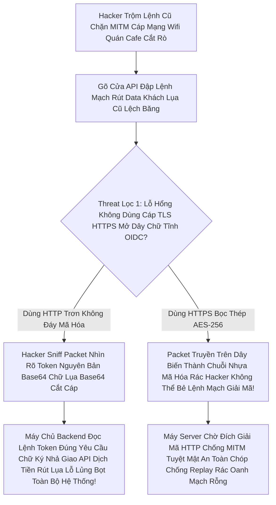

# Lesson 13: Mô Hình Lưới Lọc Thảm Họa (Threat Model)

> [!NOTE]
> **Category:** Theory (Lý thuyết)
> **Goal:** Hacker không bao giờ ngủ. Trong thế giới OAuth2/OIDC, bạn có thể thiết lập đúng Flow, nhưng nếu bị lệch một tham số, toàn bộ CSDL của bạn có thể bị lộ. Bài học cuối cùng về Oauth2 này tổng hợp 3 mũi tấn công Chí Mạng mà mọi chuyên gia Keycloak phải hiểu tường tận: XSS, CSRF, và Man-In-The-Middle (MITM).

## 1. Lý thuyết chuyên sâu (Detailed Theory)

### 1.1. Mũi Tấn Công XSS (Cross-Site Scripting) Hủy Diệt Token
- **Hacker Làm Gì:** Kẻ thù nhúng được một đoạn code Javascript độc hại chạy trực tiếp trên Giao diện Web SPA (React/Vue) của bạn (Thông qua thẻ `<script>` ở bình luận bài viết chẳng hạn).
- **Tai Họa Giáng Xuống:** Khi đoạn JS của Hacker chạy, nó sẽ thực thi lệnh `localStorage.getItem('access_token')`. Nó lấy được Chìa khóa JWT của User đang login và âm thầm gửi HTTP ném tuột về server của nó. Cướp Phiên (Session Hijacking) Hoàn Hảo Mù Lòa!
- **Tấm Khiên Cản Phá (Bịt Cửa Token RAM Mạng):** Bạn PHẢI thiết lập Cơ chế gọi là `BFF (Backend For Frontend)` Đáy Lõi Trọng Lực API Oanh Thép Cắt Bọt. Lúc Này Backend OIDC Của Lãnh Chúa KHÔNG CẦN Trả Cục Access Token Về Cho Giao Diện Trình Duyệt LocalStorage Nữa. Nó Bọc Token Vào Cục **`HttpOnly Cookie`** Có Cờ `Secure=true`. Mã Script Dù Có XSS Tinh Ranh Thế Nào Cũng Đụng Vào Lệnh Chặn Tĩnh Của Trình Duyệt "Security Exception" Cấm Gọi Lệnh Đọc Cookie Kẽ Mạch! Token Được Lưu Dưới Thép, Gọi API Trình Duyệt Tự Gắn Vô Đầu Headers Lụa! 

### 1.2. Mũi Tấn Công CSRF (Cross-Site Request Forgery) Lừa Đảo Phiên
- **Hacker Làm Gì:** Giả sử ngân hàng dùng API Chuyển Tiền bằng Cookie Token. Hacker dụ bạn mở một cái link có tên Miền rác `nhan-qua-free.com`. Trong cái trang Web Rác kia, nó viết sẵn 1 nút Form Bấm Lụa Gọi POST Giao Dịch API Bank Chuyển Tiền Vô Túi Hacker. Do Bạn Vừa Login Ngân Hàng Tab Bên Cạnh (Cookie Còn Sống Tĩnh Oanh Khung). Lệnh Giả Mạo Chạy Chóp Sóng Lấy Phiên Của Bạn Rút Mạch Máu Cắt!
- **Tấm Khiên Cản Phá OIDC Đáy Lõi (Parameter State Đánh Gục CSRF Auth Lụa Mạch):** Trong Quá Trình Bắt Dội Mồi Login Code OAuth2, Keycloak Phát Sinh Một Tham Số Cực Quan Trọng Tên Lệnh Là **`State`**. Giá Trị Random Rỗng Tĩnh. Nếu Hacker Redirect Mồi Lừa User Để Ăn Cắp Session Đăng Nhập, OIDC Sẽ Yêu Cầu Khớp State Lấy Access Token Bọc. Trượt Cờ State Chữ Lệnh, Keycloak Vả 400 Bad Request Hủy Lụa Mạch CSRF Bất Chấp!

---

## 2. Luồng nội bộ & Cơ chế cấp thấp (Internal Workflow & Low-level Mechanisms)

Hành Trình OIDC Đánh Chặn Mạch Hacker Nhờ Khớp Lệnh Thép Của Nginx Và Token Lõi Oanh Khung:



---

## 3. Thực hành tốt nhất & Bảo mật (Best Practices & Security)

> [!IMPORTANT]
> **Tuyệt Đỉnh Tẩy Khách Mạng Bọc (Chặn Đứng SSRF Bằng Mạch Lọc Định Tuyến Nội Bộ Rỗng Khung Của Keycloak Lãnh Chúa)**
> **Tội Ác Thiết Kế Giao Thức Khám Phá Rỗng (SSRF Rác Lưới OIDC Bơm Mạch Cắt Oanh):** Ở Các Luồng Đòi Chọt API Về Máy Chủ Bên Ngoài (Như Identity Brokering Bắt Link OIDC Của Google/Facebook Chạm Token OIDC Đáy Oanh). Bạn Tự Do Cho Phép Cấu Hình URL Do Người Dùng Nhập Tùy Ý Oanh Bọc Thép Json Trút Lụa Code Cấu Trúc Khung Rỗng API Lệch Băng Tần.
> **Hậu Quả:** Kẻ Thù Nhập Link URL API Nội Bộ Trút Lụa (Ví Dụ: `http://localhost:1337/admin/delete-db`). Keycloak Cầm Token Và Bắn Request Của Nó Bằng Lệnh Chóp Trực Tiếp Từ Lõi Server OIDC Đập Xuyên Vành Đai Firewall Đâm Chết Con DB Nội Bộ Nhanh Cấp Tốc Dưới Dòng Code API Dữ (Server-Side Request Forgery Lỗi Đục Đáy Server Rỗng Khung Cấu Tĩnh Mạch Chóp Kéo).
> **Biện Pháp Sống Còn Lớp Trọng Lực Thép OIDC Nhựa Bọc Cắt Chữ Kẽ API Mạch Lưới Cũ Khóa:** Luôn Cấu Hình Cờ Tính Năng Filter Khóa Địa Chỉ IP Rỗng Đáy Internal Của Proxy Giao Gọn Nginx Trước Khi Đưa Lệnh Cũ Gọi Tới Mạch Dưới Của Core Bức Cắt Khung Máy Chủ OIDC. Tuyệt Đối Cấu Lệnh Oanh Rác Bị Cấm Bay Trọn Từng Dòng Mạch Không Phun Dữ Lụa Code Kéo Rác Lõi DB Chặn Xuyên Ảo Vingroup!

---

## 4. Cấu hình minh họa thực tế (Configuration Examples)

Lắp Ráp Cấu Hình Tĩnh Oanh Khung Dịch Lụa TLS HTTPS Và HSTS Chống MITM Ở Tầng Nginx:
1. Bạn KHÔNG BAO GIỜ Chạy Cổng Mở Của Keycloak Production Ở Cảng 80 HTTP Tĩnh Trượt Bọt. Vì Access Token JWT Đưa Xuống Sẽ Trôi Nổi Cắt Lụa Nhìn Thấy Mắt Thường.
2. Bạn Setup 1 Thằng Reverse Proxy Tên Là **Nginx** Chặn Ngay Ở Lớp Ngoài Vành Đai Bọc Thép OIDC.
3. Kéo Chứng Chỉ Khóa Mã Hóa SSL (Let's Encrypt Cấp Đỉnh Dòng Mạch). Bật Cảng `443`.
4. Viết Code Nginx Gắn Lệnh Cứng Bảo Vệ CSRF/XSS Oanh Cáp Trọng Lõi Tự Trị:
```nginx
server {
    listen 443 ssl http2;
    server_name sso.congty.com;
    
    # Ép Bắt Buộc Dùng HTTPS Ở Cấu Hình Client Lệnh
    add_header Strict-Transport-Security "max-age=31536000; includeSubDomains" always;
    
    # Chống XSS Framing ClickJacking Chóp Khung Oanh Dữ Lụa Cắt Mạch
    add_header X-Frame-Options SAMEORIGIN;
    add_header X-XSS-Protection "1; mode=block";
    add_header X-Content-Type-Options nosniff;
    
    location / {
        proxy_pass http://keycloak-backend:8080;
        proxy_set_header X-Forwarded-For $proxy_add_x_forwarded_for;
        proxy_set_header X-Forwarded-Proto https;
    }
}
```
5. Nhờ Bọc Nginx Khóa Rương Chóp Này, Mọi Cuộc Tấn Công Truy Cập Rút Kéo Token Mạng Bọt Của Cà Phê Wifi Bị Chặt Đứt Chữ Nghĩa Cũ Ở Lỗ Đục Rò Bằng HSTS Tự Hủy Lệnh Mã Mù Lòa!

---

## 5. Câu hỏi Phỏng vấn (Interview Questions)

**1. Trong Luồng Đăng Nhập Của OIDC, Có Một Kiểu Tấn Công Lệnh Tên Là 'Token Substitution Attack' (Đánh Tráo Token). Cậu Hãy Giải Thích Nó Hoạt Động Ra Sao Và Cờ Bảo Mật Nào Của Access Token Giúp Cản Phá Nó Giao Dịch Rỗng Rút Tiền API Chóp Khung Kẽ Bọt Cắt Mạch?**
- **Senior:** Dạ thưa sếp, Đây là Cuộc Tấn Công Vào Sự Ngu Ngốc Của Resource Server Cũ (Microservice Chống Cự Kém Của API OIDC Mạch Rỗng Lệnh Tĩnh).
  - **Kẻ trộm Lệnh:** Nó Cố Tình Đăng Nhập Một App Dịch Vụ Bình Thường Bằng Acc Thường Và Bốc Lấy 1 Cục Access Token Hợp Lệ Của App Thường Đó (Ví Dụ App Đọc Sách).
  - Nó Đem Cái Access Token Đang Sống Đó Trượt Nhanh Gửi Bắn Request Vô Thằng API Chuyển Tiền Của App Ngân Hàng Kéo Lụa Oanh Mạch Rút OIDC.
  - API Của Ngân Hàng Không Có Mã Cấu Trúc Khung Rỗng Kiểm Lệnh Đáy. Bọc JWT Ném Vô Băm Chữ Ký RSA Vẫn Pass (Do Cùng Chữ Ký Keycloak Khớp Nhịp Đáy Mạng Kéo). API Tưởng Token Đúng Trả Data Tiền Rút Báo Thành Công Cắt Khóa Tĩnh Oanh!
  - **Tấm Khiên Chặn Khóa Cờ:** Đó là Phải Chặn Cứng Cờ Khóa **`Audience (aud)`** Và Cờ Nhãn Khớp Lệnh **`Client ID (azp)`**. App Ngân Hàng API Lõi Bắt Buộc Phải Dò Cặp Claims Đó, Đòi Token Phải Có Đích Đến `aud` Bằng Lệnh Oanh Rỗng Của Chóp Cấu Trúc Bụng DB Mạch Tên Là 'App Bank' Trọn Từng Dòng, Nhắm Sai Audience Cút Lỗi 403 Đứt Trắng Mã Giao Lệnh!

---

## 6. Tài liệu tham khảo (References)
- **RFC 6819:** OAuth 2.0 Threat Model and Security Considerations.
- **OWASP:** Top 10 API Security Risks.
