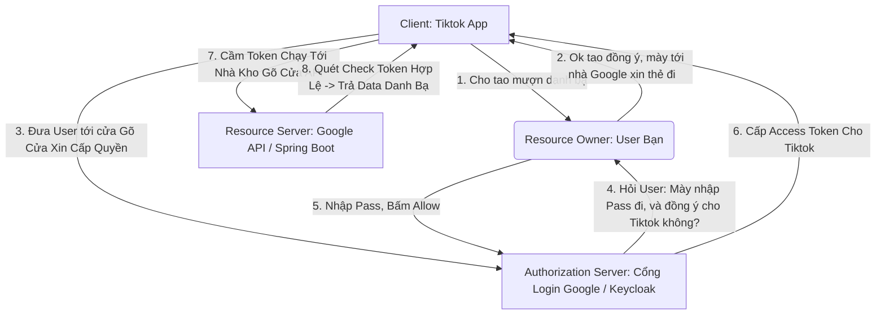

# Lesson 2: Bốn Diễn Viên Trong Vở Kịch (OAuth Actors)

> [!NOTE]
> **Category:** Theory (Lý thuyết)
> **Goal:** Trong tài liệu RFC 6749, quy trình OAuth2 là một vở kịch với 4 nhân vật (Actors) lúc nào cũng giao tiếp với nhau. Hiểu rõ tên gọi và vai trò của 4 nhân vật này là bước đầu tiên để bạn không bao giờ bị rối trí khi đọc các tài liệu tiếng Anh bảo mật nâng cao.

## 1. Lý thuyết chuyên sâu (Detailed Theory)

### 1.1. Cấu Trúc Bốn Vai Trò Của OAuth2
Hãy tưởng tượng kịch bản: Bạn (Nguyễn Văn A) tải app **Tiktok** về điện thoại. Tiktok muốn tìm xem bạn bè của bạn có ai chơi Tiktok không bằng cách xin quyền truy cập vào danh bạ **Google Contacts**. Bốn nhân vật ở đây là:

1. **Resource Owner (Chủ sở hữu tài nguyên):**
   - **Chính là Bạn (Người Dùng).**
   - Bạn là người sở hữu "Cục dữ liệu Danh bạ". Bạn là người có thẩm quyền cao nhất để phán quyết: "Có cho thằng Tiktok sờ vào danh bạ của tao hay không?".

2. **Client (Khách hàng / Ứng dụng bên thứ 3):**
   - **Chính là Ứng dụng Tiktok.**
   - Đừng nhầm Client là User! Client là Phần Mềm (Website, App Mobile, SmartTV) đang muốn ĐI XIN QUYỀN TRUY CẬP để phục vụ một tính năng nào đó. Thằng này là thằng háo hức chờ lấy Token nhất.

3. **Authorization Server (Máy chủ Ủy quyền):**
   - **Chính là Google (Cụ thể là màn hình Đăng Nhập & Xin quyền của Google).** (Trong các hệ thống tự dựng, đây chính là **Keycloak**).
   - Nhiệm vụ: Là quan tòa. Nó hiển thị form bắt Resource Owner nhập pass. Sau đó nó hỏi "Có đồng ý cho Tiktok lấy danh bạ không?". Nếu đồng ý, Máy Chủ Ủy Quyền sẽ In ra Cấp cái Token.

4. **Resource Server (Máy chủ Tài nguyên):**
   - **Chính là Máy chủ chứa Data Danh bạ của Google (API Server).** (Trong hệ thống của bạn, đây là các API Spring Boot, NodeJS).
   - Nhiệm vụ: Giữ nhà. Ai đưa Token hợp lệ đến thì nhả dữ liệu (Danh bạ) ra. Nó hoàn toàn không quan tâm cái Token đó được tạo ra như thế nào, nó chỉ kiểm tra chữ ký Token có hợp lệ từ ông Authorization Server cấp hay không thôi.

---

## 2. Luồng nội bộ & Cơ chế cấp thấp (Internal Workflow & Low-level Mechanisms)

Hành Trình Giao Tiếp Giữa 4 Diễn Viên Trong Thế Giới Thực:

---

## 3. Thực hành tốt nhất & Bảo mật (Best Practices & Security)

> [!IMPORTANT]
> **Tuyệt Đỉnh An Toàn Cấp Kiến Trúc (Tách Biệt Authorization Server Và Resource Server Ra Hai Cụm Riêng Biệt)**
> **Tội Ác Thiết Kế Hệ Thống Monolith Cổ Đại:** Lập trình viên thiết kế một con App NodeJS khổng lồ. Vừa code tính năng tạo User, nhận request Login (So sánh Password), vừa kiêm luôn việc cấp phát Token tự chế. Xong cũng ở trong cục code NodeJS đó, nhét luôn logic quản lý API đơn hàng, giỏ hàng! Gom 2 vai trò Authorization Server và Resource Server làm một.
> **Hậu Quả:** Bất cứ lúc nào đoạn code API Giỏ Hàng bị lỗi văng Exception làm sập RAM NodeJS, cái hệ thống Login cũng chết ngắc theo! Hệ thống khó Scale (mở rộng), không thể chia sẻ cho các App di động hoặc đối tác bên ngoài gọi API vì dính chặt Logic xác thực vào bụng App cục bộ.
> **Biện Pháp Sống Còn Lớp Trọng:** BẮT BUỘC TÁCH RỜI! 
> - **Authorization Server:** Chạy độc lập 1 con **Keycloak**. Nắm giữ toàn bộ Database User, chuyên tâm nhiệm vụ nhả Token.
> - **Resource Server:** Là hàng chục con Microservices API (NodeJS, Java, Go). Bọn này chỉ mang nhiệm vụ nhẹ nhàng: Bắt HTTP Header lấy JWT Token ra verify chữ ký. Nếu hợp lệ, trả Data. Xong! 
> Bằng cách này, Hệ thống vô địch ở khả năng chịu tải (Scale) và chia sẻ bảo mật (Zero-Trust).

---

## 4. Cấu hình minh họa thực tế (Configuration Examples)

Mapping Các Vai Trò Này Với Giao Diện Keycloak Console:
1. Khi bạn thao tác tạo một User có tên "nguyenvana" trên Keycloak. Bạn đang tạo Data cho vai trò **Resource Owner**.
2. Khi bạn click Menu **Clients** và bấm Create một ứng dụng tên `react-dashboard`. Bạn đang đăng ký danh tính cho vai trò **Client**.
3. Bản thân toàn bộ giao diện Admin Console và máy chủ Port 8080 mà Keycloak đang chạy chính là hạt nhân của **Authorization Server**.
4. Keycloak KHÔNG PHẢI là **Resource Server** (Trừ API quản trị nội bộ của nó). Resource Server là phần mềm bạn tự code (Spring Boot / Express) chạy ở Port 3000. Để biến app NodeJS thành Resource Server, bạn cài thư viện `keycloak-connect` hoặc `passport-jwt` để nó biết cách Verify Token do Keycloak đẻ ra.

---

## 5. Câu hỏi Phỏng vấn (Interview Questions)

**1. Một Hệ Thống Chạy Ngầm (Cronjob) Ban Đêm Của Công Ty Cần Giao Tiếp Với API Kế Toán (Resource Server) Để Kéo Data Chạy Báo Cáo. Hỏi Lúc Này Ai Là Resource Owner Trong 4 Actor Của OAuth2? Hệ Thống Có Cần Trình Duyệt Để Đăng Nhập Không?**
- **Senior:** Dạ thưa sếp, Trong trường hợp kết nối Máy-Giao-Tiếp-Với-Máy (Machine to Machine - M2M), **Resource Owner đã bị hợp nhất (Merge) luôn vào vai trò của Client**.
  - Phần mềm Cronjob đó vừa đóng vai trò là Client đi xin dữ liệu, lại vừa đóng vai trò là Chủ sở hữu của chính Dữ liệu nó xin (Vì nó không gọi thay mặt cho một con người cụ thể nào cả).
  - Lúc này, Hệ thống KHÔNG THỂ VÀ KHÔNG CẦN dùng Trình duyệt để hiện nút bấm (Vì đâu có con người ngồi canh 2h sáng để bấm Allow). 
  - OAuth2 cung cấp một luồng riêng biệt tên là **Client Credentials Flow** cho Actor khuyết tật này. Nó chỉ ném Client_ID và Client_Secret lên Authorization Server (Keycloak) là giật ngay Access Token về đập API luôn tốc độ cao mạch lụa!

---

## 6. Tài liệu tham khảo (References)
- **RFC 6749:** Section 1.1 Roles.
- **Keycloak Documentation:** Securing Applications and Services Guide.
